# Alfresco Application Development Framework, version 2.0.0 Release Note

These release notes provide information for the **2.0.0 release** of the Alfresco Application Development Framework.

This is the first **General Available** release of the Application Development Framework, which contains the Angular components to build a Web Application on top of the Alfresco Services.
The release can be found on GitHub at [this link.](https://github.com/Alfresco/alfresco-ng2-components/releases/tag/1.7.0)

## Contents

-   [New name packages](#new-name-packages)
-   [Goals for this release](#goals-for-this-release)
-   [Notable new features](#notable-new-features)
    -   [1. Viewer Enhancements](#1-viewer-enhancements)
    -   [2. Pagination Component and DocumentList integration](#2-pagination-component-and-documentlist-integration)
    -   [3. Create Folder and Edit Folder dialogs](#3-create-folder-and-edit-folder-dialogs)
    -   [4. Editable file metadata](#4-editable-file-metadata)
    -   [5. File versioning](#5-file-versioning)
    -   [6. Search Component refactoring](#6-search-component-refactoring)
    -   [7. Max file size constraints properties in Upload Button](#7-max-file-size-constraints-properties-in-upload-button)
    -   [8. Register Alfresco file type icons within the mat-icon](#8-register-alfresco-file-type-icons-within-the-mat-icon)
    -   [9. LogService configuration](#9-logservice-configuration)
    -   [10. Favorite node directive](#10-favorite-node-directive)
    -   [11. Delete multiple nodes directive](#11-delete-multiple-nodes-directive)
    -   [12. Task Attachment List customizable template](#12-task-attachment-list-customizable-template)
    -   [13. CS and PS setting host component](#13-cs-and-ps-setting-host-component)
    -   [14. Complete process service type definition in the alfresco-js-api](#14-complete-process-service-type-definition-in-the-alfresco-js-api)
    -   [15. Redirect to original path upon successful login](#15-redirect-to-original-path-upon-successful-login)
    -   [16. Task List override the columns](#16-task-list-override-the-columns)
    -   [17. Internationalization support](#17-internationalization-support)
    -   [18. Document List enhancements](#18-document-list-enhancements)
-   [Breaking changes](#breaking-changes)
    -   [New name packages](#new-name-packages)
    -   [Clean all the events that start with "on"](#clean-all-the-events-that-start-with-on)
    -   [Remove old prefix TAG name support](#remove-old-prefix-tag-name-support)
    -   [Rename 'extension-viewer' component to 'adf-viewer-extension'](#rename-extension-viewer-component-to-adf-viewer-extension)
    -   [Deprecated Upload button and Drag area properties have been removed](#deprecated-upload-button-and-drag-area-properties-have-been-removed)
    -   [Internal pagination has been removed from the DocumentList](#internal-pagination-has-been-removed-from-the-documentlist)
    -   [Internal search documentlist has been removed from the search component](#internal-search-documentlist-has-been-removed-from-the-search-component)
-   [CI changes](#ci-changes)
    -   [Bundle size checker](#bundle-size-checker)
    -   [Security checker Snyk](#security-checker-snyk)
    -   [Application generators (Yeoman)](#application-generators-yeoman)
-   [References](#references)
-   [Issues addressed](#issues-addressed)
    -   [New Feature](#new-feature)
    -   [Documentation](#documentation)
    -   [Epic](#epic)
    -   [Story](#story)
    -   [Task](#task)
    -   [Bug](#bug)

## New name packages

From ADF 2.0 we split everything into four main packages:

    "@alfresco/adf-content-services" : "2.0.0"
    "@alfresco/adf-process-services" : "2.0.0"
    "@alfresco/adf-core" : "2.0.0"
    "@alfresco/adf-insights" : "2.0.1"

Please note the only major version valid for the package @alfresco/adf-insights is 2.0.1

## Goals for this release

While this release had a high focus on stabilization and bug fixes, we have also introduced new and enhanced features. These include a completely revamped [Viewer component,](../core/components/viewer.component.md) a new metadata component and file versioning. Also, ADF is now localized into 11 different languages. In total we have closed around 242 issues in JIRA.

Since we follow [SEMVER](https://semver.org), we can only introduce breaking changes in major releases. We learned a lot and we needed to restructure and rename components to make things easier moving forward. You can see all the details about the breaking changes below.
We have continued to expand and rewrite our documentation. We now have a new component catalog
running that we hope you'll enjoy.

The Yeoman generators have been updated. We now ship three small [Angular CLI](https://cli.angular.io)
based applications to help get you started.

Please report issues with this release in the [issue tracker](https://github.com/Alfresco/alfresco-ng2-components/issues). Enterprise customers can now submit issues in the support portal. You can collaborate on this release or share feedback by using the discussion tools on [gitter](https://gitter.im/Alfresco/alfresco-ng2-components).

The entire team has been working hard to make this release a reality and we're excited to share all the details!

## Notable new features

Below the most relevant features of this release:

-   Viewer Enhancements
-   [`Pagination`](../../lib/content-services/document-list/models/document-library.model.ts) Component and DocumentList integration
-   Create Folder and Edit Folder dialogues
-   Editable file metadata
-   File versioning
-   [Search Component](../content-services/components/search.component.md) refatoring
-   Max file size constraints properties in Upload Button
-   Register Alfresco file type icons within the mat-icon
-   [`LogService`](../core/services/log.service.md) configuration
-   Favorite node Directive
-   Delete multiple nodes directive
-   Task Attachment list customizable template
-   CS and PS setting host component
-   Complete [process service](../process-services/services/process.service.md) type definition in the alfresco-js-api
-   Redirect to original path upon successful login
-   Task List override the default columns
-   Internationalization support

### 1. Viewer Enhancements

The [Viewer component](../core/components/viewer.component.md) has been enhanced with the following features:

-   Automatic PDF renditions for APS content
-   Automatic PDF renditions for ACS content
-   Sidebar component (Left or Right) that can host custom components
-   Sidebar component can be injected with transclusion and with template injection also.
-   Info Drawer integration example
-   Greatly improved Viewer toolbar
-   Custom "Open with" menu that you can fill with your own content
-   Custom "traffic light" menu that you can fill with your own content
-   Ability to download the file previewed
-   Ability to hide/show any button on the toolbar
-   Ability to hide, show or even replace entire [toolbar component](../core/components/toolbar.component.md)

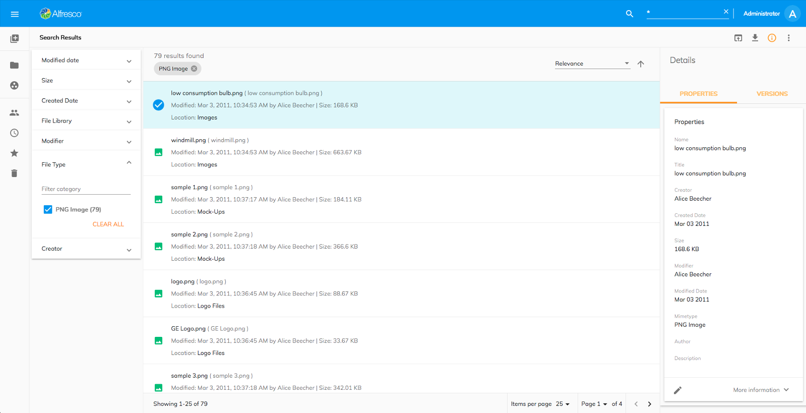

It is now very simple to use the [Viewer component](../core/components/viewer.component.md) in an "Inline" mode on a separate page when using the Angular Router.
This allows you to have separate URLs for previewing content and later revisiting a file by navigating to a corresponding link.

In addition, the "Overlay" mode has been stabilised. It now handles subsequent reopenings correctly.

You can find more details in the corresponding documentation: [Viewer Component](../core/components/viewer.component.md).

### 2. Pagination Component and DocumentList integration

With the 2.0 release, [`Pagination`](../../lib/content-services/document-list/models/document-library.model.ts) is implemented as a separate component that you can use with different other components.
ADF provides a lightweight integration with the DocumentList component out of the box:

    <adf-document-list #documentList ...>
    </adf-document-list>

    <adf-pagination [target]="documentList" ...>
    </adf-pagination>

For more details on custom pagination features see the following article: [Pagination Component](../core/components/pagination.component.md)

### 3. Create Folder and Edit Folder dialogs

You can now use "Create Folder" and "Edit Folder" dialogs with your ACS-enabled applications.

In order to greatly simplify your development experience, two extra Angular directives were introduced: "adf-create-folder" and "adf-edit-folder". These allow you to invoke dialogs from any clickable element, including other Angular components:

    <adf-toolbar>
        <button mat-icon-button
                [adf-create-folder]="documentList.currentFolderId">
                <mat-icon>create_new_folder</mat-icon>
        </button>
    </adf-toolbar>

    <adf-document-list #documentList ...>
     ...
    </adf-document-list>

For more details please refer to:

-   [Folder Create directive](../content-services/directives/folder-create.directive.md)
-   [Folder Edit directive](../content-services/directives/folder-edit.directive.md)

### 4. Editable file metadata

Basic content metadata can now be displayed and edited with the new ContentMetadata component. At the moment, only the basic properties are supported, such as title, description, author, etc. As an example it can be injected into the revamped viewer in the sidebar layout.

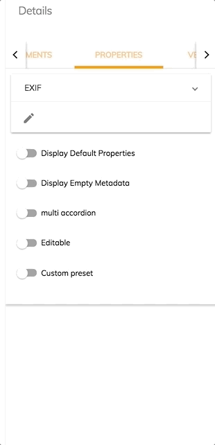

    <adf-content-metadata-card [node]="aMinimalNodeEntryEntity"></adf-content-metadata-card>

### 5. File versioning

You can now see and restore previous versions of a file node. This component can also be used in a dialog or in a sidebar layout. Being the first prototype, there are some restrictions applied on this component - check the documentation for details.

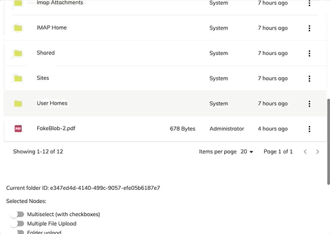

    <adf-version-manager [node]="aMinimalNodeEntryEntity"></adf-version-manager>

### 6. Search Component refactoring

We have completely separated the documentlist component from the [search component](../content-services/components/search.component.md). We also support customizing the search result with any template you like and optionally creating your own custom search autocomplete.

The adf-search-control provides you with a standard input search with an pre-styled autocomplete table :

    <adf-search-control [highlight]="true"
    ...>
    </adf-search-control>

For example :

The adf-search component offers a simple way to customize your search results:

    <adf-search [searchTerm]="searchedWord">
      <ng-template let-data>
       <ul>
          <li *ngFor="let item of data?.list?.entries; let idx = index">
             ...
          </li>
       </ul>
      </ng-template>
    </adf-search>

With this, you have access to the search results objects, so you can modify them as you like :

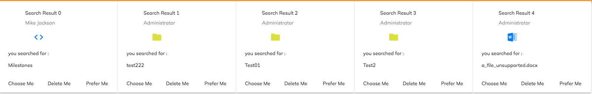

You can also associate to your own input/textarea with the search results via the searchAutocomplete directive :

    <input [searchAutocomplete]="auto" .. />

    <adf-search #auto="searchAutocomplete" .../>

This allows you to fetch the search result typed from the input/textarea element associated with the adf-search component:

For more details please refer to:

-   [Search Control Component](../content-services/components/search-control.component.md)
-   [Search Component](../content-services/components/search.component.md)

### 7. Max file size constraints properties in Upload Button

The [upload button component](../content-services/components/upload-button.component.md) now provides a new parameter to disallow uploading files larger than a certain size (in bytes):

    <adf-upload-button [maxFilesSize]="20"></adf-upload-button>

For more details please refer to [Upload button documentation](../content-services/components/upload-button.component.md)

### 8. Register Alfresco file type icons within the mat-icon

All the ADF MIME type icons are now registered into the [`MatIconRegistry`](https://material.angular.io/components/icon/api). This improvement allows you to use all the icons through the mat-icon tag:

    <mat-icon svgIcon="video/mp4"></mat-icon>

    constructor(public thumbnailService: ThumbnailService) {
    }

To see the list of all supported MIME types please refer to [Thumbnail service documentation](../core/services/thumbnail.service.md).

### 9. LogService configuration

The new logservice provides logging functionality for your ADF application. You can configure **_logLevel_** in **app.config.json**.
By default the level is TRACE. If you want to silence all log output in ADF you can set it to SILENT:

    {
        "logLevel": " SILENT"
    }

The [log service](../core/services/log.service.md) provides 6 level of logs: TRACE, DEBUG, INFO, WARN, ERROR, SILENT. For more information please refer to [log service documentation.](../core/services/log.service.md)

### 10. Favorite node directive

The [`NodeFavoriteDirective`](../core/directives/node-favorite.directive.md) instance can be bound to a button to retrieve and manage a favorites node list:

    <button mat-icon-button
            #favorite="adfFavorite"
            [adf-node-favorite]="nodeSelection">
        <mat-icon>
            {{ favorite.hasFavorites() ? 'star' :'star_border' }}
        </mat-icon>
    </button>

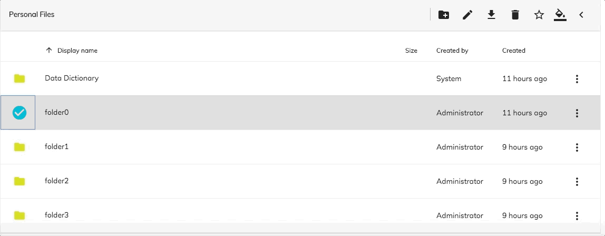

### 11. Delete multiple nodes directive

Deletes multiple files and folders.

    <button mat-icon-button
            (delete)="onDelete()"
            [adf-delete]="nodeSelection">
        <mat-icon>delete</mat-icon>
    </button>

### 12. Task Attachment List customizable template

If there are no attachments for the selected task the [Task Attachment List component](../process-services/components/task-attachment-list.component.md) shows a basic empty template.

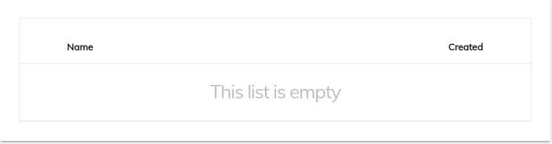

If you want to customize and render a custom template, you can inject the **adf-empty-list** tag

    <adf-task-attachment-list
        [taskId]="YOUR_TASK_ID">
        <adf-empty-list>
            
This is the header of my empty list

            
This is the body

            
>This is the footer

        </adf-empty-list>
    </adf-task-attachment-list>

Note that the [Task Attachment List component](../process-services/components/task-attachment-list.component.md) doesn't provide the Drag & Drop feature out-of-the-box. To add it, you must use an **adf-upload-drag-area** as the parent of this component. You can also specify a custom template:

    <adf-upload-drag-area
        [parentId]="YOUR_TASK_ID">
        <adf-task-attachment-list
            [taskId]="YOUR_TASK_ID">
            <adf-empty-list>
                
This List is empty

                
Drag and drop to upload

                

                    

            </adf-empty-list>
        </adf-task-attachment-list>
    </adf-upload-drag-area>

This is the result:

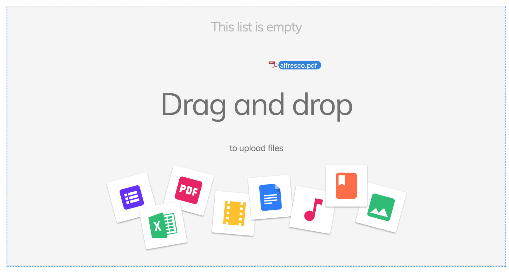

### 13. CS and PS setting host component

This component is a form that allows you to validate and set the URL of your CS and PS, saving it in the user's local storage

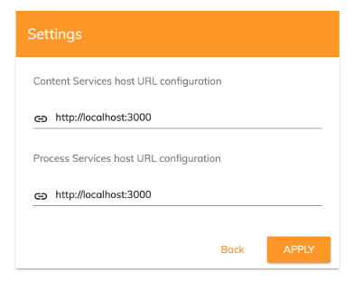

For more information please refer to [host component documentation.](../core/components/host-settings.component.md)

### 14. Complete process service type definition in the alfresco-js-api

We have added all the [process service](../process-services/services/process.service.md) related models, class methods and type in the type definition file of the alfresco-js-api to help you with the autocomplete of your IDE.

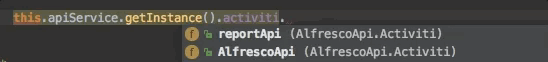

### 15. Redirect to original path upon successful login

The [Login component](../core/components/login.component.md) now redirects users back to the originally requested URLs.

For example, if you have a route "/my-files" protected by the **[`AuthGuardEcm`](lib/core/src/lib/services/auth-guard-ecm.service.ts)** (for ACS-related content) or **[`AuthGuardBpm`](lib/core/src/lib/services/auth-guard-bpm.service.ts)** (for APS-related content), users may be redirected to a "/login" route if they are not authenticated. Upon successful login, the user is then redirected back to the "/my-files" page.

### 16. Task List override the columns

With the current ADF release, you can override the Task List columns from the **app.config.json** file.

    "adf-task-list": {
            "presets": {
                "default": [
                    {
                        "key": "name",
                        "type": "text",
                        "title": "ADF_TASK_LIST.PROPERTIES.NAME",
                        "sortable": true
                    },
                    {
                        "key": "created",
                        "type": "date",
                        "title": "ADF_TASK_LIST.PROPERTIES.CREATED",
                        "sortable": true
                    },
                    {
                        "key": "priority",
                        "type": "text",
                        "title": "ADF_TASK_LIST.PROPERTIES.PRIORITY",
                        "sortable": true
                    },
                    {
                        "key": "assignee",
                        "type": "text",
                        "title": "ADF_TASK_LIST.PROPERTIES.ASSIGNEE",
                        "sortable": true
                    }
                ]
            }
    }

This is the result:

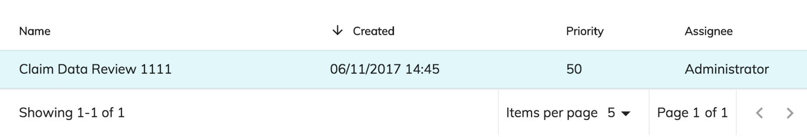

### 17. Internationalization support

From the version 2.0.0, all the components in ADF are natively translated into 11 languages.

-   US English
-   German
-   Spanish
-   French
-   Italian
-   Japanese
-   Dutch
-   Chinese
-   Russian
-   Norwegian
-   Brazilian Portuguese

### 18. Document List enhancements

It is now possible to display the Sites (from ACS) that the currently logged-in user is a member of. You can do this by assigning the "**-mysites-**" alias to the "**currentFolderId**" property. The Document List automatically displays the required content.  If you want to display all available Sites use the "**-sites-**" alias, which is still supported.

Also, the Document List now provides a customizable screen for permission errors. The users will see your custom content if they are trying to access any restricted content. The default permission screen is shown in the picture below:

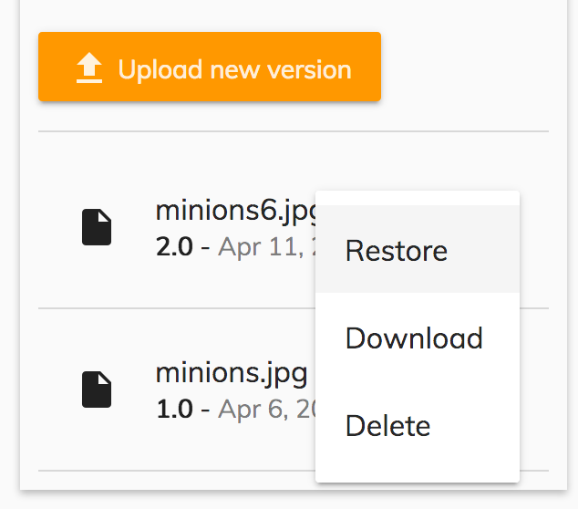

## Breaking changes

-   New names for packages
-   Clean all the events that start with "on"
-   Clean old prefix TAG name support
-   Rename 'extension-viewer' component to 'adf-viewer-extension'
-   Upload button and Drag area deprecated properties has been removed
-   DocumentList has been separated from the [search component](../content-services/components/search.component.md)
-   'md' prefix is not supported anymore
-   Internal pagination has been removed from the  DocumentList
-   Internal search documentlist has been separated from the [search component](../content-services/components/search.component.md)

### New name packages

From ADF 2.0 we split everything into four main packages:

    @alfresco/adf-content-services
    @alfresco/adf-process-services
    @alfresco/adf-core
    @alfresco/adf-insights

The Alfresco Javascript API remains the same and will be deployed as previously.
The structure of the Github repository has been rearranged to reflect these changes.
The impact for developers using ADF is that the dependencies need to be adjusted (and simplified) in package.json, and all import statements in typescript files need to be changed.

### Clean all the events that start with "on"

If you want to know more about why this modification was necessary, please see this [link](https://angular.io/guide/styleguide#dont-prefix-output-properties). Full details about the events that have been renamed are given below:

adf-analytics-generator, adf-analytics-report-list, adf-diagram, adf-login, adf-process-instance-filters, adf-process-instance-list, adf-filters:

| Old event name | New event name |
| -------------- | -------------- |
| onSuccess | success |
| onError | error |

adf-form, adf-task-details:

| Old event name | New event name |
| -------------- | -------------- |
| onError | error |

adf-tasklist, adf-webscript-get, adf-upload-button:

| Old event name | New event name |
| -------------- | -------------- |
| onSuccess | success |

file-draggable Directive:

| Old event name | New event name |
| -------------- | -------------- |
| onFilesDropped | filesDropped |
| onFilesEntityDropped | filesEntityDropped |
| onFolderEntityDropped | folderEntityDropped |

adf-analytics:

| Old event name | New event name |
| -------------- | -------------- |
| onError | error |
| onSuccess | success |
| onFormValueChanged | formValueChanged |
| onEdit | edit |

### Remove old prefix TAG name support

In the previous release, there was a mixed usage of TAG prefixes for all the components ("alfresco-", "activiti","adf-") We found this approach was quite cumbersome in 1.7.0 and so we renamed all of them using only the TAG **adf-** prefix. However, we still had backward compatibility for the old tags. **The compatibility with "alfresco-" and "activiti-" prefix is now discontinued from 2.0.0**

### Rename 'extension-viewer' component to 'adf-viewer-extension'

The **extension-viewer** tag (used to extend the viewer behavior to open extensions not supported by the standard viewer) has been renamed to **adf-viewer-extension**.

### Deprecated Upload button and Drag area properties have been removed

**adf-upload-drag-area :**

| Properties | Description |
| ---------- | ----------- |
| enabled | Deprecated in 1.6.0 in favor of disabled input property |
| showNotificationBar | Deprecated in 1.6.0 you can use [`UploadService`](../core/services/upload.service.md) events and [`NotificationService`](../core/services/notification.service.md) api instead. |
| currentFolderPath | Deprecated in 1.6.0, this property is not used for couple of releases already. Use rootFolderId instead. |
| rootFolderId | Deprecated in 1.6.0, this property is not used for couple of releases already. Use parentId instead |

**adf-upload-button :**

| Properties | Description |
| ---------- | ----------- |
| showNotificationBar | Deprecated in 1.6.0 you can use [`UploadService`](../core/services/upload.service.md) events and [`NotificationService`](../core/services/notification.service.md) api instead. |
| currentFolderPath | Deprecated in 1.6.0, this property is not used for couple of releases already. Use rootFolderId instead. |
| disableWithNoPermission | Deprecated in 1.8.0, use the button with combination of adf-node-permission directive |

### Internal pagination has been removed from the DocumentList

The [search component](../content-services/components/search.component.md) has received a big refactor in this release in order to use the new search API. This gives better configurability as described above. The decoupling of the internal documentlist from the search allows you to customize the search result as you wish.
Learn how to show the search result in a document list [here](https://github.com/Alfresco/alfresco-ng2-components/tree/master/demo-shell/src/app/components/search).

### Internal search documentlist has been removed from the search component

Because is now possible to select between two different pagination strategies (**classic pagination** and** infinite scrolling**) we moved these options into separate components:

    <adf-document-list
        .....>
    </adf-document-list>
    <adf-pagination
        *ngIf="!infiniteScrolling"
        .....>
    </adf-pagination>
    <adf-infinite-pagination
        *ngIf="infiniteScrolling"
        .....>
    </adf-infinite-pagination>

This modification will even allow you to write your own pagination if you need to or use our pagination system to paginate your own list.

## CI changes

In our constant commitment to improving the quality of ADF we have also introduced two new automatic checks over all the PRs:

### Bundle size checker

[Bundle size check](https://github.com/siddharthkp/bundlesize) is an open source tool that helps us to check that the final result of our build never exceeds the wanted bundle size:

### Security checker Snyk

[Snyk](https://snyk.io) is an open source tool that helps us to find and  fix known vulnerabilities in our dependencies

### Application generators (Yeoman)

This release features brand new application generators powered by Yeoman. All out-of-the-box generators are based on the [Angular CLI](https://cli.angular.io). Upon generation, you get a valid [Angular CLI](https://cli.angular.io) project, configured with ADF libraries and styles, ready to be used.

    npm install -g generator-alfresco-adf-app

In addition, the application generator provides support for "blueprints". The 2.0 release includes the following blueprints:

-   Content Services Application
-   Process Services Application
-   Content and Process Services Application

Every project blueprint asks the minimum necessary set of questions with reasonable defaults.
It is now possible to install all project dependencies as part of the generation steps.

We watch the quality of the templates and ensure all unit tests and end-to-end tests are functioning correctly.
The tests run for all modifications to either the generator the underlying blueprints.

## References

Below you can find a brief list of references to help you start to use the new release.

[Official GitHub Project - alfresco-ng2-components](https://github.com/Alfresco/alfresco-ng2-components)

[Getting started guides with Alfresco Application Development Framework](https://community.alfresco.com/community/application-development-framework/pages/get-started)

Component catalog

[Gitter chat supporting Alfresco ADF](https://gitter.im/Alfresco/alfresco-ng2-components)

[ADF examples](https://github.com/Alfresco/adf-examples)

[List of all components](https://github.com/Alfresco/alfresco-ng2-components/tree/master/ng2-components)

[Alfresco-JS-API](https://github.com/Alfresco/alfresco-js-api)

[ADF App Generator ](https://github.com/Alfresco/generator-ng2-alfresco-app)

Please refer to the [official documentation](http://docs.alfresco.com/) for further details and suggestions.

## Issues addressed

Release Notes - Apps Development Framework - Version 2.0. 

### New Feature

-   \[[ADF-788](https://issues.alfresco.com/jira/browse/ADF-788)] - [Upload] Support for max file size constraints in Upload components
-   \[[ADF-1004](https://issues.alfresco.com/jira/browse/ADF-1004)] - [Alfresco JS API]Complete [process service](../process-services/services/process.service.md) definition file in the alfresco-js-api
-   \[[ADF-1065](https://issues.alfresco.com/jira/browse/ADF-1065)] - [Login] Make Login events strongly typed
-   \[[ADF-1084](https://issues.alfresco.com/jira/browse/ADF-1084)] - [Service] Register Alfresco file type icons within the mat-icon
-   \[[ADF-1596](https://issues.alfresco.com/jira/browse/ADF-1596)] - [Destination Picker] Search input ignores input up to 4 characters
-   \[[ADF-1633](https://issues.alfresco.com/jira/browse/ADF-1633)] - [Login] redirect to original path upon successful login
-   \[[ADF-1694](https://issues.alfresco.com/jira/browse/ADF-1694)] - Date-picker i18n support
-   \[[ADF-1723](https://issues.alfresco.com/jira/browse/ADF-1723)] - [Service][logservice](../core/log.service.md) configuration
-   \[[ADF-1729](https://issues.alfresco.com/jira/browse/ADF-1729)] - [Directive] Mark [`Node`](https://github.com/Alfresco/alfresco-js-api/blob/develop/src/api/content-rest-api/docs/Node.md) as Favorite Directive
-   \[[ADF-1745](https://issues.alfresco.com/jira/browse/ADF-1745)] - [Directive] Delete multiple nodes directive
-   \[[ADF-1749](https://issues.alfresco.com/jira/browse/ADF-1749)] - [Task List][process list] - Customizable template using the app.config.json
-   \[[ADF-1750](https://issues.alfresco.com/jira/browse/ADF-1750)] - [Viewer] Content projection for "Open With" and "More actions"
-   \[[ADF-1751](https://issues.alfresco.com/jira/browse/ADF-1751)] - [Document Versioning] File versioning Component
-   \[[ADF-1774](https://issues.alfresco.com/jira/browse/ADF-1774)] - Extend "Create Folder" and add "Edit Folder" dialogs to ADF
-   \[[ADF-1795](https://issues.alfresco.com/jira/browse/ADF-1795)] - [Viewer] Toolbar Configuration template customisation
-   \[[ADF-1796](https://issues.alfresco.com/jira/browse/ADF-1796)] - [Viewer] Info Drawer Configuration template customisation
-   \[[ADF-1834](https://issues.alfresco.com/jira/browse/ADF-1834)] - [Settings] host CS and PS component
-   \[[ADF-1840](https://issues.alfresco.com/jira/browse/ADF-1840)] - [Document List] Create a generic permission denied page
-   \[[ADF-1841](https://issues.alfresco.com/jira/browse/ADF-1841)] - [Metadata] Default metadata Nodes property editing
-   \[[ADF-1906](https://issues.alfresco.com/jira/browse/ADF-1906)] - [Accordion Menu] Tooltip configuration
-   \[[ADF-1918](https://issues.alfresco.com/jira/browse/ADF-1918)] - [Search] Use the new Search [api service](../../lib/testing/src/lib/core/actions/api.service.ts) for the [search component](../content-services/components/search.component.md)

### Documentation

-   \[[ADF-1578](https://issues.alfresco.com/jira/browse/ADF-1578)] - Description of search result page for (nodeDbClick) event is wrong
-   \[[ADF-1586](https://issues.alfresco.com/jira/browse/ADF-1586)] - Add docs for undocumented components, services, etc
-   \[[ADF-1734](https://issues.alfresco.com/jira/browse/ADF-1734)] - Article on how to use Forms with ACS
-   \[[ADF-1820](https://issues.alfresco.com/jira/browse/ADF-1820)] - Update documentation to reflect mat- prefixes for angular/material
-   \[[ADF-1857](https://issues.alfresco.com/jira/browse/ADF-1857)] - Document List - error event
-   \[[ADF-1867](https://issues.alfresco.com/jira/browse/ADF-1867)] - Typography Documentation

### Epic

-   \[[ADF-1235](https://issues.alfresco.com/jira/browse/ADF-1235)] - We have to get rid of MDL to use only material2
-   \[[ADF-1475](https://issues.alfresco.com/jira/browse/ADF-1475)] - Upgrade to Angular 5
-   \[[ADF-1779](https://issues.alfresco.com/jira/browse/ADF-1779)] - [Search component](../content-services/components/search.component.md) refactoring
-   \[[ADF-1793](https://issues.alfresco.com/jira/browse/ADF-1793)] - [Viewer] Extensibility

### Story

-   \[[ADF-1417](https://issues.alfresco.com/jira/browse/ADF-1417)] - File Viewer - Info Drawer

### Task

-   \[[ADF-829](https://issues.alfresco.com/jira/browse/ADF-829)] - [Viewer component](../core/components/viewer.component.md) doesn't support internationalisation
-   \[[ADF-1333](https://issues.alfresco.com/jira/browse/ADF-1333)] - Debouncing search in the object picker component
-   \[[ADF-1614](https://issues.alfresco.com/jira/browse/ADF-1614)] - /deep/ combinator is no longer supported
-   \[[ADF-1620](https://issues.alfresco.com/jira/browse/ADF-1620)] - [Login component](../core/components/login.component.md) streamline
-   \[[ADF-1645](https://issues.alfresco.com/jira/browse/ADF-1645)] - Consistently use the same type for Process App ID
-   \[[ADF-1659](https://issues.alfresco.com/jira/browse/ADF-1659)] - [Search component] The [search component](../content-services/components/search.component.md) should not have an embedded document list
-   \[[ADF-1672](https://issues.alfresco.com/jira/browse/ADF-1672)] - Start Process - Improve the look and feel
-   \[[ADF-1679](https://issues.alfresco.com/jira/browse/ADF-1679)] - Error messages into form field validator are not being translated
-   \[[ADF-1681](https://issues.alfresco.com/jira/browse/ADF-1681)] - User profile component - As default should show the initials
-   \[[ADF-1684](https://issues.alfresco.com/jira/browse/ADF-1684)] - Sanitise the component and Demo shell from embedded strings
-   \[[ADF-1695](https://issues.alfresco.com/jira/browse/ADF-1695)] - Comment component - The translation should not be a concatenation of strings
-   \[[ADF-1698](https://issues.alfresco.com/jira/browse/ADF-1698)] - Task Info Drawer - The keys must be localized
-   \[[ADF-1699](https://issues.alfresco.com/jira/browse/ADF-1699)] - Process Info Drawer - The keys must be localized
-   \[[ADF-1708](https://issues.alfresco.com/jira/browse/ADF-1708)] - Context Menu - Material Design
-   \[[ADF-1719](https://issues.alfresco.com/jira/browse/ADF-1719)] - adf-tslint-rules move in separate repo
-   \[[ADF-1724](https://issues.alfresco.com/jira/browse/ADF-1724)] - Remove all the console log
-   \[[ADF-1731](https://issues.alfresco.com/jira/browse/ADF-1731)] - Update Material 2.0.0-beta.12
-   \[[ADF-1735](https://issues.alfresco.com/jira/browse/ADF-1735)] - tasklist.component has wrong name should be task-list.component
-   \[[ADF-1742](https://issues.alfresco.com/jira/browse/ADF-1742)] - Add test cases to cover [viewer component](../core/components/viewer.component.md)
-   \[[ADF-1746](https://issues.alfresco.com/jira/browse/ADF-1746)] - Pipe for node tooltip formatting
-   \[[ADF-1748](https://issues.alfresco.com/jira/browse/ADF-1748)] - Remove MDL dependency
-   \[[ADF-1775](https://issues.alfresco.com/jira/browse/ADF-1775)] - No input and No Output rename rule
-   \[[ADF-1778](https://issues.alfresco.com/jira/browse/ADF-1778)] - Provide support for optional port numbers in application config
-   \[[ADF-1792](https://issues.alfresco.com/jira/browse/ADF-1792)] - Investigate upgrade to Angular 5
-   \[[ADF-1798](https://issues.alfresco.com/jira/browse/ADF-1798)] - Agree and plan reorganisation of Github repository
-   \[[ADF-1801](https://issues.alfresco.com/jira/browse/ADF-1801)] - clean all the events that start with "on"
-   \[[ADF-1804](https://issues.alfresco.com/jira/browse/ADF-1804)] - [Viewer] Provide events for the standard toolbar buttons
-   \[[ADF-1805](https://issues.alfresco.com/jira/browse/ADF-1805)] - Remove internal pagination from Document List
-   \[[ADF-1806](https://issues.alfresco.com/jira/browse/ADF-1806)] - Clean old prefix TAG name support
-   \[[ADF-1807](https://issues.alfresco.com/jira/browse/ADF-1807)] - Task Component - Should provide a couple of translation keys
-   \[[ADF-1808](https://issues.alfresco.com/jira/browse/ADF-1808)] - Process Component - Should provide these translation keys
-   \[[ADF-1819](https://issues.alfresco.com/jira/browse/ADF-1819)] - Start Task - The keys are not translated
-   \[[ADF-1822](https://issues.alfresco.com/jira/browse/ADF-1822)] - Process Header - The component should show the business key
-   \[[ADF-1833](https://issues.alfresco.com/jira/browse/ADF-1833)] - Update superagent to 3.7. 
-   \[[ADF-1836](https://issues.alfresco.com/jira/browse/ADF-1836)] - Remove src and config from npm packages
-   \[[ADF-1837](https://issues.alfresco.com/jira/browse/ADF-1837)] - Rename "adf-viewer-info-drawer" to "adf-viewer-sidebar"
-   \[[ADF-1843](https://issues.alfresco.com/jira/browse/ADF-1843)] - Ability to replace default viewers with custom implementation
-   \[[ADF-1846](https://issues.alfresco.com/jira/browse/ADF-1846)] - Material design typography, the proper way
-   \[[ADF-1853](https://issues.alfresco.com/jira/browse/ADF-1853)] - [Viewer] Support custom position of the sidebar (left, right)
-   \[[ADF-1854](https://issues.alfresco.com/jira/browse/ADF-1854)] - Demo Shell - use https to pull specific alfresco-js-api branch
-   \[[ADF-1855](https://issues.alfresco.com/jira/browse/ADF-1855)] - Add a data-automation-id tag for the info button on the viewer toolbar.
-   \[[ADF-1863](https://issues.alfresco.com/jira/browse/ADF-1863)] - Document List - custom source calls error handling
-   \[[ADF-1868](https://issues.alfresco.com/jira/browse/ADF-1868)] - Upgrade to Angular 5. 
-   \[[ADF-1869](https://issues.alfresco.com/jira/browse/ADF-1869)] - Upgrade to Angular CLI 1.5. 
-   \[[ADF-1870](https://issues.alfresco.com/jira/browse/ADF-1870)] - Upgrade Codelizer to 4.0. 
-   \[[ADF-1895](https://issues.alfresco.com/jira/browse/ADF-1895)] - Update Material 5.0.0-rc0
-   \[[ADF-1949](https://issues.alfresco.com/jira/browse/ADF-1949)] - Allow customization of the dropdown menu on document picker

### Bug

-   \[[ADF-1019](https://issues.alfresco.com/jira/browse/ADF-1019)] - Folder is displayed in Search result Page after it was deleted
-   \[[ADF-1576](https://issues.alfresco.com/jira/browse/ADF-1576)] - People widget is not displayed when it has visibility conditions related to date widget.
-   \[[ADF-1589](https://issues.alfresco.com/jira/browse/ADF-1589)] - [Login component] The login card is not centred in IE11
-   \[[ADF-1599](https://issues.alfresco.com/jira/browse/ADF-1599)] - [Destination Picker] Updates to match the designed component
-   \[[ADF-1600](https://issues.alfresco.com/jira/browse/ADF-1600)] - [Destination picker] Incorrect entry appears in the Site List
-   \[[ADF-1601](https://issues.alfresco.com/jira/browse/ADF-1601)] - [Destination picker] File / folder name capitalization is incorrectly changed in the title of the dialog
-   \[[ADF-1605](https://issues.alfresco.com/jira/browse/ADF-1605)] - [Destination picker] Folder cannot be selected if user has Contributor permissions on it
-   \[[ADF-1630](https://issues.alfresco.com/jira/browse/ADF-1630)] - Folder name should be abbreviated in the breadcrumb when path is too long
-   \[[ADF-1648](https://issues.alfresco.com/jira/browse/ADF-1648)] - [Tag component] The [tag component](../../demo-shell/src/app/components/tag/tag.component.ts) demo page is displayed wrongly in mobile devices
-   \[[ADF-1649](https://issues.alfresco.com/jira/browse/ADF-1649)] - [Document List] IE11 select icon is not aligned
-   \[[ADF-1650](https://issues.alfresco.com/jira/browse/ADF-1650)] - [Tag component] IE11 Delete tag button is not displayed completely
-   \[[ADF-1655](https://issues.alfresco.com/jira/browse/ADF-1655)] - Searchbar is not responsive (enough)
-   \[[ADF-1656](https://issues.alfresco.com/jira/browse/ADF-1656)] - All files are downloaded with 'download' name the action is made from Search Results page
-   \[[ADF-1657](https://issues.alfresco.com/jira/browse/ADF-1657)] - The Search Results page is not automatically refreshing after deleting a folder
-   \[[ADF-1660](https://issues.alfresco.com/jira/browse/ADF-1660)] - The arrow for sorting in Search Results page is not properly displayed
-   \[[ADF-1661](https://issues.alfresco.com/jira/browse/ADF-1661)] - The pagination should not be displayed when no results are found on Search Results page
-   \[[ADF-1678](https://issues.alfresco.com/jira/browse/ADF-1678)] - Many validation errors for "index.d.ts" of alfresco-js-api
-   \[[ADF-1680](https://issues.alfresco.com/jira/browse/ADF-1680)] - People widget is memorising the last selected choice even after removing it.
-   \[[ADF-1682](https://issues.alfresco.com/jira/browse/ADF-1682)] - DocumentList pagination - default value should take the first supported page size
-   \[[ADF-1686](https://issues.alfresco.com/jira/browse/ADF-1686)] - Task List is not resizing if multiple columns are to be displayed
-   \[[ADF-1688](https://issues.alfresco.com/jira/browse/ADF-1688)] - Task can not be completed if something was typed and deleted in a people widget
-   \[[ADF-1693](https://issues.alfresco.com/jira/browse/ADF-1693)] - [Dailog Upload] wrong positioning
-   \[[ADF-1696](https://issues.alfresco.com/jira/browse/ADF-1696)] - File viewer is not rendered on the entire page
-   \[[ADF-1697](https://issues.alfresco.com/jira/browse/ADF-1697)] - Demo shell - Task infodrawer wrong tabs name
-   \[[ADF-1702](https://issues.alfresco.com/jira/browse/ADF-1702)] - The bottom part of the [Login component](../core/components/login.component.md) text is cut off
-   \[[ADF-1704](https://issues.alfresco.com/jira/browse/ADF-1704)] - Invalid characters breaks file upload widget
-   \[[ADF-1707](https://issues.alfresco.com/jira/browse/ADF-1707)] - [App component](../../demo-shell/src/app/app.component.ts) - The app name is not translated
-   \[[ADF-1709](https://issues.alfresco.com/jira/browse/ADF-1709)] - The error message of date widget is not displayed anymore when clicking on another widget
-   \[[ADF-1710](https://issues.alfresco.com/jira/browse/ADF-1710)] - An error is logged into the console when using data widget
-   \[[ADF-1711](https://issues.alfresco.com/jira/browse/ADF-1711)] - The adf-task-attachment-list component displays drag-and-drop area that is not working
-   \[[ADF-1712](https://issues.alfresco.com/jira/browse/ADF-1712)] - The adf-task-header component displays a Requeue button for none pooled tasks
-   \[[ADF-1716](https://issues.alfresco.com/jira/browse/ADF-1716)] - Process List - processDefinitionKey is not part of the [`ProcessInstanceQueryRepresentation`](https://github.com/Alfresco/alfresco-js-api/blob/develop/src/api/activiti-rest-api/docs/ProcessInstanceQueryRepresentation.md)
-   \[[ADF-1718](https://issues.alfresco.com/jira/browse/ADF-1718)] - [`Pagination`](../../lib/content-services/document-list/models/document-library.model.ts) should not be displayed on Search Results page when there are no results
-   \[[ADF-1720](https://issues.alfresco.com/jira/browse/ADF-1720)] - Date-time picker is not working properly with other Date Display Format than default
-   \[[ADF-1722](https://issues.alfresco.com/jira/browse/ADF-1722)] - [object Object] appears in People control when selecting the same name
-   \[[ADF-1725](https://issues.alfresco.com/jira/browse/ADF-1725)] - [Process service](../process-services/services/process.service.md) page doesn't look cool in small breakpoint. Need responsiveness.
-   \[[ADF-1726](https://issues.alfresco.com/jira/browse/ADF-1726)] - Process and Task service attachments are not responsive.
-   \[[ADF-1732](https://issues.alfresco.com/jira/browse/ADF-1732)] - [Search component](../content-services/components/search.component.md) is not working properly on Demo Shell in a specific case
-   \[[ADF-1737](https://issues.alfresco.com/jira/browse/ADF-1737)] - getFileContent response returns empty object when it's a PDF file
-   \[[ADF-1738](https://issues.alfresco.com/jira/browse/ADF-1738)] - Search suggestion dialog's design is not as expected
-   \[[ADF-1740](https://issues.alfresco.com/jira/browse/ADF-1740)] - 'Start Process' button is enabled if required field 'name' is empty.
-   \[[ADF-1741](https://issues.alfresco.com/jira/browse/ADF-1741)] - Search autocomplete has wrong highlight position for items
-   \[[ADF-1747](https://issues.alfresco.com/jira/browse/ADF-1747)] - Task service - findAllTaskByState return a wrong list
-   \[[ADF-1757](https://issues.alfresco.com/jira/browse/ADF-1757)] - 'Label' appears on the top of form widgets
-   \[[ADF-1758](https://issues.alfresco.com/jira/browse/ADF-1758)] - Task Attachment - The columns are not localized
-   \[[ADF-1759](https://issues.alfresco.com/jira/browse/ADF-1759)] - Process Attachment - The columns are not localized
-   \[[ADF-1760](https://issues.alfresco.com/jira/browse/ADF-1760)] - Process Info Drawer - The keys must be localized
-   \[[ADF-1761](https://issues.alfresco.com/jira/browse/ADF-1761)] - The Search Result Page is not refreshed after deleting a folder
-   \[[ADF-1762](https://issues.alfresco.com/jira/browse/ADF-1762)] - Document List - Sorting by Size is incorrect
-   \[[ADF-1763](https://issues.alfresco.com/jira/browse/ADF-1763)] - Translation is missing from 'Disable upload button when user has no permission' button.
-   \[[ADF-1765](https://issues.alfresco.com/jira/browse/ADF-1765)] - Info Drawer - Review the specification
-   \[[ADF-1768](https://issues.alfresco.com/jira/browse/ADF-1768)] - Process List - The columns must be localisable
-   \[[ADF-1771](https://issues.alfresco.com/jira/browse/ADF-1771)] - Upload widget clears out filename on cancel but uploads file
-   \[[ADF-1772](https://issues.alfresco.com/jira/browse/ADF-1772)] - task app tooltip is not localised and key is displayed
-   \[[ADF-1777](https://issues.alfresco.com/jira/browse/ADF-1777)] - [Angular CLI] Production build compilation issue with Search
-   \[[ADF-1780](https://issues.alfresco.com/jira/browse/ADF-1780)] - [mobile] Cannot access any component other than the [login component](../core/components/login.component.md)
-   \[[ADF-1781](https://issues.alfresco.com/jira/browse/ADF-1781)] - Task List - The default columns are not localised
-   \[[ADF-1782](https://issues.alfresco.com/jira/browse/ADF-1782)] - Language menu - The selector name is wrong
-   \[[ADF-1783](https://issues.alfresco.com/jira/browse/ADF-1783)] - [Mobile] User info cards are not fully displayed
-   \[[ADF-1784](https://issues.alfresco.com/jira/browse/ADF-1784)] - [Mobile] Empty folder image should not display drag and drop image
-   \[[ADF-1794](https://issues.alfresco.com/jira/browse/ADF-1794)] - Document List - Sites - users can see sites they are not members of
-   \[[ADF-1800](https://issues.alfresco.com/jira/browse/ADF-1800)] - [diagrams.service](../../lib/insights/diagram/services/diagrams.service.ts).ts is not using the alfresco-js-api
-   \[[ADF-1802](https://issues.alfresco.com/jira/browse/ADF-1802)] - [`NodeNameTooltipPipe`](../core/pipes/node-name-tooltip.pipe.md) is not exported by the ng2-alfresco-core
-   \[[ADF-1815](https://issues.alfresco.com/jira/browse/ADF-1815)] - Sorting content by name is not working properly
-   \[[ADF-1818](https://issues.alfresco.com/jira/browse/ADF-1818)] - Add Missing Create person API in JS-API
-   \[[ADF-1824](https://issues.alfresco.com/jira/browse/ADF-1824)] - Moment js security issue
-   \[[ADF-1825](https://issues.alfresco.com/jira/browse/ADF-1825)] - [`Form`](../../lib/process-services/src/lib/task-list/models/form.model.ts) field in start task no aligned
-   \[[ADF-1827](https://issues.alfresco.com/jira/browse/ADF-1827)] - 'Object Object' displayed on search results page
-   \[[ADF-1829](https://issues.alfresco.com/jira/browse/ADF-1829)] - [`PeopleApi`](https://github.com/Alfresco/alfresco-js-api/blob/develop/src/api/content-rest-api/api/people.api.ts) - getSiteMembership wrong returned type
-   \[[ADF-1830](https://issues.alfresco.com/jira/browse/ADF-1830)] - Cannot access processes or reports
-   \[[ADF-1832](https://issues.alfresco.com/jira/browse/ADF-1832)] - [Document List] IE 11 erro on click
-   \[[ADF-1835](https://issues.alfresco.com/jira/browse/ADF-1835)] - The pagination on search results page is not working properly
-   \[[ADF-1838](https://issues.alfresco.com/jira/browse/ADF-1838)] - A new task can not be started because the Start Task is not properly displayed
-   \[[ADF-1839](https://issues.alfresco.com/jira/browse/ADF-1839)] - Login does not switch user preferences
-   \[[ADF-1856](https://issues.alfresco.com/jira/browse/ADF-1856)] - Document List - location fails for a user that has granular permissions
-   \[[ADF-1859](https://issues.alfresco.com/jira/browse/ADF-1859)] - The [document list component](../content-services/components/document-list.component.md) no longer exports [`ShareDataRow`](../../lib/content-services/document-list/data/share-data-row.model.ts)
-   \[[ADF-1860](https://issues.alfresco.com/jira/browse/ADF-1860)] - [`NodesApi`](https://github.com/Alfresco/alfresco-js-api/blob/develop/src/api/content-rest-api/api/nodes.api.ts).getNodeChildren has wrong return type
-   \[[ADF-1861](https://issues.alfresco.com/jira/browse/ADF-1861)] - Line breaks not displayed in "Display Text" widget in forms
-   \[[ADF-1862](https://issues.alfresco.com/jira/browse/ADF-1862)] - Adf toolbar should get the background color from the theme
-   \[[ADF-1865](https://issues.alfresco.com/jira/browse/ADF-1865)] - [Document List] "Empty View" does not wrap long text
-   \[[ADF-1866](https://issues.alfresco.com/jira/browse/ADF-1866)] - Accordion Component - Doesn't allow to close the menu
-   \[[ADF-1871](https://issues.alfresco.com/jira/browse/ADF-1871)] - Tasklist IE 11 crash
-   \[[ADF-1872](https://issues.alfresco.com/jira/browse/ADF-1872)] - TaskList Component - Doesn't show the currentTaskId highlited
-   \[[ADF-1875](https://issues.alfresco.com/jira/browse/ADF-1875)] - [`ProcessList`](../../lib/process-services/src/lib/mock/process/process.model.mock.ts) Component - Doesn't show the currentProcessId highlighted
-   \[[ADF-1877](https://issues.alfresco.com/jira/browse/ADF-1877)] - Layout demo shell not localized
-   \[[ADF-1878](https://issues.alfresco.com/jira/browse/ADF-1878)] - [Translation service](../core/services/translation.service.md) not using fallback language for unsupported locale
-   \[[ADF-1879](https://issues.alfresco.com/jira/browse/ADF-1879)] - ADF Process Services is not working properly
-   \[[ADF-1885](https://issues.alfresco.com/jira/browse/ADF-1885)] - Once accessed process services components appear throughout app
-   \[[ADF-1890](https://issues.alfresco.com/jira/browse/ADF-1890)] - Viewer - Content projection for sidebar only works if sidebarPosition is left
-   \[[ADF-1891](https://issues.alfresco.com/jira/browse/ADF-1891)] - [`ActivitiContentService`](lib/process-services/src/lib/form/services/activiti-alfresco.service.ts) is not exported
-   \[[ADF-1898](https://issues.alfresco.com/jira/browse/ADF-1898)] - [`ProcessService`](../process-services/services/process.service.md).createOrUpdateProcessInstanceVariables has incorrect method signature
-   \[[ADF-1900](https://issues.alfresco.com/jira/browse/ADF-1900)] - [`ProcessService`](../process-services/services/process.service.md).getProcessInstanceVariables has incorrect method signature
-   \[[ADF-1901](https://issues.alfresco.com/jira/browse/ADF-1901)] - [`ProcessService`](../process-services/services/process.service.md).createDefaultFilters has incorrect method signature
-   \[[ADF-1902](https://issues.alfresco.com/jira/browse/ADF-1902)] - Buttons of the Create / Edit folder dialog do not match design
-   \[[ADF-1907](https://issues.alfresco.com/jira/browse/ADF-1907)] - [`UploadService`](../core/services/upload.service.md) is not exported from [`UploadModule`](../../lib/content-services/upload/upload.module.ts)
-   \[[ADF-1908](https://issues.alfresco.com/jira/browse/ADF-1908)] - Not able to select a form on Start Task
-   \[[ADF-1909](https://issues.alfresco.com/jira/browse/ADF-1909)] - [`TaskListModel`](../../lib/process-services/src/lib/task-list/models/task-list.model.ts) is not exported from ActivitiTaskListModule
-   \[[ADF-1911](https://issues.alfresco.com/jira/browse/ADF-1911)] - Content can be uploaded on Search Result Page when no results are found
-   \[[ADF-1912](https://issues.alfresco.com/jira/browse/ADF-1912)] - Not able to re-login with a valid user after login out.
-   \[[ADF-1914](https://issues.alfresco.com/jira/browse/ADF-1914)] - Custom toolbar is displayed on Search Results page when no results are found
-   \[[ADF-1915](https://issues.alfresco.com/jira/browse/ADF-1915)] - Login dialog spinner has incorrect size
-   \[[ADF-1916](https://issues.alfresco.com/jira/browse/ADF-1916)] - Not able to add a file to the Attachment List.
-   \[[ADF-1920](https://issues.alfresco.com/jira/browse/ADF-1920)] - Diagram is not displayed after clicking 'Show Diagram' option.
-   \[[ADF-1921](https://issues.alfresco.com/jira/browse/ADF-1921)] - Dynamic Table widget is being duplicated after editing.
-   \[[ADF-1922](https://issues.alfresco.com/jira/browse/ADF-1922)] - [`Form`](../../lib/process-services/src/lib/task-list/models/form.model.ts) page is not displayed.
-   \[[ADF-1924](https://issues.alfresco.com/jira/browse/ADF-1924)] - Some issues related to search bar
-   \[[ADF-1945](https://issues.alfresco.com/jira/browse/ADF-1945)] - Profile image has Initials displayed behind it
-   \[[ADF-1948](https://issues.alfresco.com/jira/browse/ADF-1948)] - Not able to involve people into a task.
-   \[[ADF-1950](https://issues.alfresco.com/jira/browse/ADF-1950)] - Not able to open an attached file within a Task.
-   \[[ADF-1951](https://issues.alfresco.com/jira/browse/ADF-1951)] - Date widget doesn't display the correct date.
-   \[[ADF-1956](https://issues.alfresco.com/jira/browse/ADF-1956)] - Date widget with advanced properties does not display value.
-   \[[ADF-1962](https://issues.alfresco.com/jira/browse/ADF-1962)] - getContentThumbnailUrl returns file data instead or URL
-   \[[ADF-1963](https://issues.alfresco.com/jira/browse/ADF-1963)] - [`ContentApi`](https://github.com/Alfresco/alfresco-js-api/blob/develop/src/api/content-rest-api/api/content.api.ts) is missing the preview rendition API
-   \[[ADF-1964](https://issues.alfresco.com/jira/browse/ADF-1964)] - [Demo Shell] Max size filter is not switched off.
-   \[[ADF-1965](https://issues.alfresco.com/jira/browse/ADF-1965)] - 'Upload file' button is enabled if user does not have permission to upload a file/folder
-   \[[ADF-1966](https://issues.alfresco.com/jira/browse/ADF-1966)] - Wrong sort on Document List
-   \[[ADF-1967](https://issues.alfresco.com/jira/browse/ADF-1967)] - Translation is not working
-   \[[ADF-1968](https://issues.alfresco.com/jira/browse/ADF-1968)] - [IE11] The login page is not loading
-   \[[ADF-1969](https://issues.alfresco.com/jira/browse/ADF-1969)] - Content actions dropdown menu is not aligned
-   \[[ADF-1971](https://issues.alfresco.com/jira/browse/ADF-1971)] - [Mobile]Sign in button is not properly displayed
-   \[[ADF-1972](https://issues.alfresco.com/jira/browse/ADF-1972)] - Process Services page is not displayed properly.
-   \[[ADF-1973](https://issues.alfresco.com/jira/browse/ADF-1973)] - No Permission template - missing style
-   \[[ADF-1975](https://issues.alfresco.com/jira/browse/ADF-1975)] - Broken layout of the forms
-   \[[ADF-1976](https://issues.alfresco.com/jira/browse/ADF-1976)] - 'Label' is displayed on each form widget.
-   \[[ADF-1978](https://issues.alfresco.com/jira/browse/ADF-1978)] - [Mobile][content service](../core/content.service.md) datatable is not properly displayed on Safari browser
-   \[[ADF-1979](https://issues.alfresco.com/jira/browse/ADF-1979)] - Task details continuously loading in APS - app
-   \[[ADF-1980](https://issues.alfresco.com/jira/browse/ADF-1980)] - Search bar has "underline" border visible when component is collapsed
-   \[[ADF-1981](https://issues.alfresco.com/jira/browse/ADF-1981)] - Continous loading of task details if task list is empty
-   \[[ADF-1982](https://issues.alfresco.com/jira/browse/ADF-1982)] - [Destination Picker] Destination Picker doesn't match the designed component
-   \[[ADF-1989](https://issues.alfresco.com/jira/browse/ADF-1989)] - Content is not properly sorted
-   \[[ADF-1990](https://issues.alfresco.com/jira/browse/ADF-1990)] - Able to add comments on a completed task
-   \[[ADF-1993](https://issues.alfresco.com/jira/browse/ADF-1993)] - [`AuthGuardEcm`](lib/core/src/lib/services/auth-guard-ecm.service.ts) - canActivateChild missing
-   \[[ADF-1994](https://issues.alfresco.com/jira/browse/ADF-1994)] - Document cannot be uploaded in a process
-   \[[ADF-1995](https://issues.alfresco.com/jira/browse/ADF-1995)] - [Mobile] Menu button is not displayed - portrait orientation
-   \[[ADF-1996](https://issues.alfresco.com/jira/browse/ADF-1996)] - Task document path is not displayed properly
-   \[[ADF-2001](https://issues.alfresco.com/jira/browse/ADF-2001)] - Info Drawer size increases when involving a person to a task.
-   \[[ADF-2002](https://issues.alfresco.com/jira/browse/ADF-2002)] - Not able to navigate on search-bar results using up and down arrows
-   \[[ADF-2003](https://issues.alfresco.com/jira/browse/ADF-2003)] - Process Definition Heat Map does not display process diagram
-   \[[ADF-2004](https://issues.alfresco.com/jira/browse/ADF-2004)] - The search dialog is still displayed after clicking on another browser tab
-   \[[ADF-2005](https://issues.alfresco.com/jira/browse/ADF-2005)] - Cannot view document in tasklist attachment list
-   \[[ADF-2006](https://issues.alfresco.com/jira/browse/ADF-2006)] - File name not displayed correctly in document list
-   \[[ADF-2007](https://issues.alfresco.com/jira/browse/ADF-2007)] - Info Drawer - currentTab event should return a key not the label
-   \[[ADF-2009](https://issues.alfresco.com/jira/browse/ADF-2009)] - [Social component]When a new node ID is inserted the call to GET likes of the new file is not made
-   \[[ADF-2010](https://issues.alfresco.com/jira/browse/ADF-2010)] - Move/copy, when searching for folder multiple results are returned
-   \[[ADF-2012](https://issues.alfresco.com/jira/browse/ADF-2012)] - Info Drawer is displayed under task details window.
-   \[[ADF-2014](https://issues.alfresco.com/jira/browse/ADF-2014)] - Document List file cannot be deleted
-   \[[ADF-2016](https://issues.alfresco.com/jira/browse/ADF-2016)] - Paginator integration with other components
-   \[[ADF-2017](https://issues.alfresco.com/jira/browse/ADF-2017)] - Continous loading of process details if process list is empty
-   \[[ADF-2019](https://issues.alfresco.com/jira/browse/ADF-2019)] - [Demo Shell] When clicking refresh for button on [`Form`](../../lib/process-services/src/lib/task-list/models/form.model.ts) component the whole page reloads
-   \[[ADF-2020](https://issues.alfresco.com/jira/browse/ADF-2020)] - The upload button is not disabled when the 'enable upload' checkbox is not checked
-   \[[ADF-2022](https://issues.alfresco.com/jira/browse/ADF-2022)] - Excluded files can be uploaded
-   \[[ADF-2023](https://issues.alfresco.com/jira/browse/ADF-2023)] - Files can be drag and drop when allowDropFiles property is set to false
-   \[[ADF-2024](https://issues.alfresco.com/jira/browse/ADF-2024)] - Docx files cannot be open in Document List
-   \[[ADF-2027](https://issues.alfresco.com/jira/browse/ADF-2027)] - Process Component - Replace the due date label with end date
-   \[[ADF-2029](https://issues.alfresco.com/jira/browse/ADF-2029)] - Delete icon is not working on Document List
-   \[[ADF-2030](https://issues.alfresco.com/jira/browse/ADF-2030)] - Not able to download a file on search page.
-   \[[ADF-2032](https://issues.alfresco.com/jira/browse/ADF-2032)] - Using Viewer in overlay mode only works once
-   \[[ADF-2033](https://issues.alfresco.com/jira/browse/ADF-2033)] - Overlay height issues in overlay mode
-   \[[ADF-2035](https://issues.alfresco.com/jira/browse/ADF-2035)] - [Demo Shell] Drag and drop is not working on Processes - attachment List
-   \[[ADF-2036](https://issues.alfresco.com/jira/browse/ADF-2036)] - [Demo Shell] Search dialog is not properly displayed
-   \[[ADF-2039](https://issues.alfresco.com/jira/browse/ADF-2039)] - The empty folder content is not loading
-   \[[ADF-2040](https://issues.alfresco.com/jira/browse/ADF-2040)] - Date picker is not working when changing language.
-   \[[ADF-2045](https://issues.alfresco.com/jira/browse/ADF-2045)] - [Demo-Shell][pagination](../../lib/content-services/document-list/models/document-library.model.ts) is not working properly on Search Results Page

Please refer to [the Alfresco issue tracker](https://issues.alfresco.com/jira/projects/ADF/issues/ADF-581?filter=allopenissues) for other known issues in this release. If you have more questions, please reply here or contact us using [gitter](https://gitter.im/Alfresco/alfresco-ng2-components).
