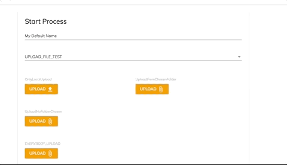
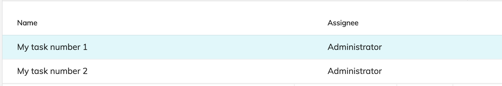
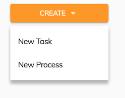
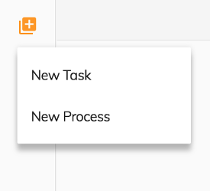
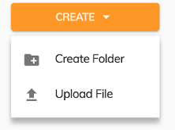
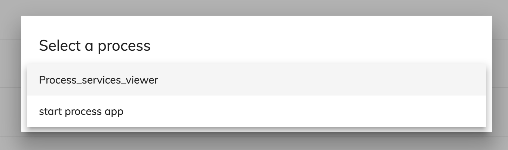
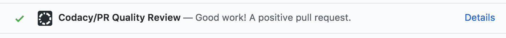

# Alfresco Application Development Framework, version 2.1.0 Release Note

These release notes provide information for the **2.1.0 release** of the Alfresco Application Development Framework.

This is the first **General Available** release of the Application Development Framework, which contains the Angular components to build a Web Application on top of the Alfresco Services.
The release can be found on GitHub at [this link.](https://github.com/Alfresco/alfresco-ng2-components/releases/tag/1.7.0)

## Contents

-   [New name packages](#new-name-packages)
-   [Goals for this release](#goals-for-this-release)
-   [Notable new features](#notable-new-features)
    -   [1. Viewer Enhancements](#1-viewer-enhancements)
    -   [2. Upload file from CS widget](#2-upload-file-from-cs-widget)
    -   [3. Attach Folder from CS widget](#3-attach-folder-from-cs-widget)
    -   [4. Content metadata component enhancements](#4-content-metadata-component-enhancements)
    -   [5. Start process from a file](#5-start-process-from-a-file)
    -   [6. Start form process prefilling values](#6-start-form-process-prefilling-values)
    -   [7. Task List - Support custom HTML template and static columns](#7-task-list---support-custom-html-template-and-static-columns)
    -   [8. Sidebar action menu](#8-sidebar-action-menu)
    -   [9. Infinite pagination component enhancement](#9-infinite-pagination-component-enhancement)
    -   [10. App drop-down dialog selector](#10-app-drop-down-dialog-selector)
    -   [11. JS-API Governance](#11-js-api-governance)
    -   [12. Documentation](#12-documentation)
-   [CI changes](#ci-changes)
-   [References](#references)
-   [Issues addressed](#issues-addressed)
    -   [Documentation](#documentation)
    -   [Feature](#feature)
    -   [Story](#story)
    -   [Bug](#bug)
    -   [New Feature](#new-feature)
    -   [Task](#task)

## New name packages

    "@alfresco/adf-content-services" : "2.1.0"
    "@alfresco/adf-process-services" : "2.1.0"
    "@alfresco/adf-core" : "2.1.0"
    "@alfresco/adf-insights" : "2.1.0"

Two new dependencies have been added:

    "@mat-datetimepicker/core": "^1.0.1",
    "@mat-datetimepicker/moment": "^1.0.1",

We will keep these packages until material data picker supports setting the time.

## Goals for this release

Continuing on our journey for ADF, this release had a big focus on enhancing the Alfresco Digital Business Platform story. We have added new features to enable deeper Process and Content integration between ACS and APS, meaning you can now browse and attach content from ACS in your APS Forms. We've also added more configuration around the Process Start [Form,](../../lib/process-services/task-list/models/form.model.ts) allowing you to pre-populate fields. This enables use cases to start processes directly from a document.

The [Content Metadata component](../content-services/components/content-metadata-card.component.md) also got a lot of new features: It now has full support for custom metadata and aspects. It's dynamic and has complex configuration to enable exactly which aspects and properties you want to show in your app. These are just a few highlights for this release. See the full details below.

This release builds on the one from last month and contains bug fixes and new features as listed below.
Please report issues with this release in the [issue tracker](https://github.com/Alfresco/alfresco-ng2-components/issues). You can collaborate on this release or share feedback by using the discussion tools on [Gitter](https://gitter.im/Alfresco/alfresco-ng2-components).

## Notable new features

Below are the most important new features of this release:

-   Viewer Enhancements
-   Upload file from CS widget
-   Attach Folder from CS Widget
-   [Content metadata component](../content-services/components/content-metadata-card.component.md) enhancements
-   Start process from a file
-   Start form process pre-filling value
-   Task List - Support custom HTML template and static columns
-   Sidebar action menu
-   [Infinite pagination component](../core/components/infinite-pagination.component.md) enhancement
-   App drop-down dialog selector
-   JS-API Governance
-   Documentation enhancements

### 1. Viewer Enhancements

In this release, the [Viewer component](../core/components/viewer.component.md) got improved styles and document processing enhancements:

-   better handling of PDF documents
-   improved fallback to PDF rendition of certain documents
-   automatic fallback to Thumbnail when PDF rendition is not available (for example when viewing Apple Keynote/Pages/Numbers files)
-   support for viewing Shared links with a new "sharedLinkId" property that allows the Viewer to display shared content (does not require authentication)

### 2. Upload file from CS widget

In this release we have re-enabled and improved the upload file widget of our [form component](../core/components/form.component.md).
We have added the option to choose the file to upload from a configured ECM repository of APS.

This allows you to start the navigation of ECM folders starting from a configured folder or just from the root. It also has an option to restrict the selection to files.
Sometimes you might want to allow the user to choose from all the sources. The new upload widget will show all the options in the menu when clicked.
It is also possible to make it work like a normal local file uploader by configuring it to allow only local files.

### 3. Attach Folder from CS widget

We have added the attach folder widget which is really useful in processes where you need to create your content in the ECM platform via APS .
As you can see this widget works like the attach file widget in terms of navigation through the folders and restricting the selection to folders.

### 4. Content metadata component enhancements

The purpose of the [content metadata component](../content-services/components/content-metadata-card.component.md) is to display the metadata belonging to a given node. Until now, the component was capable of displaying and making the basic properties editable, but with the latest enhancements, all of the system wide and custom aspects related to a particular node can be displayed and edited.

The component can be configured from the application configuration. This way, you can easily restrict the displayed metadata to a list of aspects or even further, to just a subset or properties belonging to an aspect.

For more information about the component see its [documentation](https://community.alfresco.com/docs/DOC-7301-introduction-to-the-new-content-metadata-component) or [this article](../content-services/components/content-metadata-card.component.md).

### 5. Start process from a file

After the repository is created in APS, you can see it in the Alfresco Repositories list. If the ID is set to 1 then all default values are fine. However, if it is set to something else, for example
_1002_ and the name is _alfresco_, you must set the property alfrescoRepositoryName in your app.config.json file to _alfresco-1002_:

    {
        name: 'Alfresco ADF Application'
    },
    ecmHost: '[http://](http://){hostname}{:port}/ecm',
    bpmHost: '[http://](http://){hostname}{:port}/bpm',
    logLevel: 'silent',
    alfrescoRepositoryName : 'alfresco-1002'

You then need to pass the node via the input values object along with the other properties:

    let node: MinimalNodeEntryEntity = this.nodesApiService.getNode(NODE_ID);

    const formValues: FormValues  = {
        'file' : node
        'field_one': 'example text'
    };

Note that in the object above, the key file is the name of the attach file field in the start form of the process. The value of the file property must be a `MinimalNodeEntryEntity`:

    <adf-start-process
        [values]="formValues"
        [appId]="YOUR_APP_ID" >
    </adf-start-process>

For more information about this functionality see the documentation section linked below:

-   [Attaching a File to the start form of the process](../process-services/components/start-process.component.md#attaching-a-file-to-the-start-form-of-the-process)

### 6. Start form process prefilling values

Here is an example of how to pass in form field values to initialize the start form that has been defined for the process:

    const formValues: FormValues  = {
        'test_1': 'value_1',
        'test_2': 'value_2',
        'test_3': 'value_1',
        'test_4': 'dropdown_id',
        'test_5': 'dropdown_label',
        'dropdown': {'id': 'dropdown_id', 'name': 'dropdown_label'}
    };

    <adf-start-process
        [values]="formValues"
        [appId]="YOUR_APP_ID" >
    </adf-start-process>

With these settings, the start form will appear with the values above already filled in.
For more information about this functionality see the following link:

-   [Custom data form example](../process-services/components/start-process.component.md#custom-data-example)

### 7. Task List - Support custom HTML template and static columns

With the previous ADF version, there was no way to combine a custom HTML template and static columns (configured in the **app.config.**json file, for example). With ADF 2.1.0 you can have both of them at the same time.

For instance, we can display the Assignee (custom HTML template) and Task Name (Static column)

The HTML contains a custom HTML template column

    <adf-tasklist>
        <data-columns>
            <data-column key="assignee" title="ASSIGNEE">
                <ng-template let-entry="$implicit">
                    
{{getFullName(entry.row.obj.assignee)}}

                </ng-template>
            </data-column>
        <data-columns>
    </adf-tasklist>

app.config.json (contains a static column)

    "adf-task-list": {
        "presets": {
            "default": [
                {
                    "key": "name",
                    "type": "text",
                    "title": "NAME",
                    "sortable": true
                }
            ]
        }
    }

This is the result:

### 8. Sidebar action menu

This component displays a sidebar-action menu information panel. It is basically just a layout with CSS styling.
There are three regions where you can add your own content, as shown in the example:

-   sidebar-menu-title-icon
-   sidebar-menu-options
-   sidebar-menu-expand-icon

    <adf-sidebar-action-menu title="Create">
        <mat-icon sidebar-menu-title-icon>arrow_drop_down</mat-icon>
        

            <button mat-menu-item>
                New Task
            </button>
            <button mat-menu-item>
                New Process
            </button>
        

    </adf-sidebar-action-menu>

This is the result:

You can also use the same component for mobile content

    <adf-sidebar-action-menu [expanded]="false">
        <mat-icon sidebar-menu-expand-icon matTooltip="Create">queue</mat-icon>
        

            <button mat-menu-item (click)="onCreateClick('tasks')">
                New Task
            </button>
            <button mat-menu-item (click)="onCreateClick('processes')">
                New Process
            </button>
        

    </adf-sidebar-action-menu>

This is the result:

You can use the same component also to create a [Content Service](../core/services/content.service.md) menu as shown below:

For more information about this functionality see the following link:

-   [Sidebar component](../core/components/sidebar-action-menu.component.md)

### 9. Infinite pagination component enhancement

We have added the [target] property in the [infinite pagination component](../core/components/infinite-pagination.component.md) to bring it in line with the [pagination component](../core/components/pagination.component.md). With this, the link between the infinite pagination and its target is simpler:

    <adf-infinite-pagination
        [target]="documentList"
        [loading="documentList.infiniteLoading">
    </adf-infinite-pagination>

For more information about the infinite pagination see the following links:

-   [Infinite pagination component](../core/components/infinite-pagination.component.md)
-   [Paginated component interface](lib/core/src/lib/pagination/paginated-component.interface.ts)

### 10. App drop-down dialog selector

### 

### 11. JS-API Governance

In order to enable the creation of new ADF component based on Alfresco Governance Services, we have updated the alfresco-js-api with all the governance core and classification API.
For more information about this functionality see the following links:

-   [Governance Core](https://github.com/Alfresco/alfresco-js-api/blob/master/src/alfresco-gs-core-rest-api)
-   [Governance Classification](https://github.com/Alfresco/alfresco-js-api/tree/master/src/alfresco-gs-classification-rest-api)

### 12. Documentation

The Properties tables in the documentation are now updated with the type and the default value of any property.

## CI changes

In our constant commitment to improving the quality of ADF we have also introduced one new automatic check over all the PRs:

Codacy is a tool that checks the code style, security, duplication and complexity of any pull request. If you want more information on Codacy please visit their [website](https://community.alfresco.com/docs/DOC-7292/codacy.com)

Application generators (Yeoman)
Below are the most noteworthy changes in the generator:

-   Support for silent mode ton enable generators to be used in shell scripts and automated scenarios
-   All blueprints now also contain a basic Dockerfile to build docker images
-   All blueprints are updated to the latest angular cli 1.6.5 dependencies

## References

Below you can find a brief list of references to help you start to use the new release.

[Official GitHub Project - alfresco-ng2-components](https://github.com/Alfresco/alfresco-ng2-components)

[Getting started guides with Alfresco Application Development Framework](https://community.alfresco.com/community/application-development-framework/pages/get-started)

Component catalog

[Gitter chat supporting Alfresco ADF](https://gitter.im/Alfresco/alfresco-ng2-components)

[ADF examples](https://github.com/Alfresco/adf-examples)

[List of all components](https://github.com/Alfresco/alfresco-ng2-components/tree/master/ng2-components)

[Alfresco-JS-API](https://github.com/Alfresco/alfresco-js-api)

[ADF App Generator ](https://github.com/Alfresco/generator-ng2-alfresco-app)

Please refer to the [official documentation](http://docs.alfresco.com/) for further details and suggestions.

## Issues addressed

Release Notes - Apps Development Framework - Version 2.1. 

### Documentation

-   \[[ADF-1734](https://issues.alfresco.com/jira/browse/ADF-1734)] - Article on how to use Forms with ACS
-   \[[ADF-2058](https://issues.alfresco.com/jira/browse/ADF-2058)] - Search example new functionality article
-   \[[ADF-2060](https://issues.alfresco.com/jira/browse/ADF-2060)] - sidebarTemplate missing documentation
-   \[[ADF-2122](https://issues.alfresco.com/jira/browse/ADF-2122)] - Incorrect product naming reference on [`Form`](../../lib/process-services/src/lib/task-list/models/form.model.ts) Extensibility and Customisation page
-   \[[ADF-2125](https://issues.alfresco.com/jira/browse/ADF-2125)] - App generator has wrong documentation
-   \[[ADF-2160](https://issues.alfresco.com/jira/browse/ADF-2160)] - combined handler missing in [Content Action component](../content-services/components/content-action.component.md) documentation
-   \[[ADF-2162](https://issues.alfresco.com/jira/browse/ADF-2162)] - [Notification service](../core/services/notification.service.md) missing screenshot

### Feature

-   \[[ADF-1431](https://issues.alfresco.com/jira/browse/ADF-1431)] - [Destination Picker] Display path of the folder in search results
-   \[[ADF-1880](https://issues.alfresco.com/jira/browse/ADF-1880)] - More configuration options for adf-start-process component
-   \[[ADF-1986](https://issues.alfresco.com/jira/browse/ADF-1986)] - ACS Metadata editing (phase 2)
-   \[[ADF-2049](https://issues.alfresco.com/jira/browse/ADF-2049)] - Separate CSS class when [`Pagination`](../../lib/content-services/document-list/models/document-library.model.ts) is empty
-   \[[ADF-2052](https://issues.alfresco.com/jira/browse/ADF-2052)] - Enable IE11 support for generated projects
-   \[[ADF-2097](https://issues.alfresco.com/jira/browse/ADF-2097)] - Sidebar Action Menu - New component
-   \[[ADF-2102](https://issues.alfresco.com/jira/browse/ADF-2102)] - Task List - Provide a way to support custom html template and static columns at same time
-   \[[ADF-2103](https://issues.alfresco.com/jira/browse/ADF-2103)] - Info Drawer - Provide a way to change the default active tab
-   \[[ADF-2145](https://issues.alfresco.com/jira/browse/ADF-2145)] - Add the app routes files in the generator 2
-   \[[ADF-2148](https://issues.alfresco.com/jira/browse/ADF-2148)] - Upgrade to latest version the Angular libraries
-   \[[ADF-2158](https://issues.alfresco.com/jira/browse/ADF-2158)] - Viewer looks for other renditions when PDFs are not available

### Story

-   \[[ADF-2136](https://issues.alfresco.com/jira/browse/ADF-2136)] - Configuration to display files from different API sources

### Bug

-   \[[ADF-1752](https://issues.alfresco.com/jira/browse/ADF-1752)] - allowInfoDrawer property does not disable the feature when showInfoDrawer is set to true
-   \[[ADF-1882](https://issues.alfresco.com/jira/browse/ADF-1882)] - Preview uploaded content in APS fails in form
-   \[[ADF-1888](https://issues.alfresco.com/jira/browse/ADF-1888)] - [`ExternalContent`](lib/core/src/lib/form/components/widgets/core/external-content.ts) is not exported in ActivitiFormModule
-   \[[ADF-1889](https://issues.alfresco.com/jira/browse/ADF-1889)] - Viewer does not render PDF renditions unless urlFile ends with .pdf
-   \[[ADF-1926](https://issues.alfresco.com/jira/browse/ADF-1926)] - [`Form`](../../lib/process-services/src/lib/task-list/models/form.model.ts) is not exported from ActivitiTaskListModule
-   \[[ADF-1959](https://issues.alfresco.com/jira/browse/ADF-1959)] - Apps with description appear with larger size on the Processes Services page
-   \[[ADF-1999](https://issues.alfresco.com/jira/browse/ADF-1999)] - Size values are not translated
-   \[[ADF-2025](https://issues.alfresco.com/jira/browse/ADF-2025)] - Task List - The pagination should be fetched from the UserPreference
-   \[[ADF-2051](https://issues.alfresco.com/jira/browse/ADF-2051)] - Involve people name is not displayed properly.
-   \[[ADF-2053](https://issues.alfresco.com/jira/browse/ADF-2053)] - [Demo Shell]The Search Result Page is not refreshed after deleting a folder or a file
-   \[[ADF-2061](https://issues.alfresco.com/jira/browse/ADF-2061)] - Destination picker search is broken
-   \[[ADF-2067](https://issues.alfresco.com/jira/browse/ADF-2067)] - Not able to see the 'My tasks' filter when clicking on a newly created app.
-   \[[ADF-2069](https://issues.alfresco.com/jira/browse/ADF-2069)] - Error is displayed on console when adding a description to a task.
-   \[[ADF-2070](https://issues.alfresco.com/jira/browse/ADF-2070)] - 'Load more' on destination picker doesn't display correct content of folders in a site.
-   \[[ADF-2071](https://issues.alfresco.com/jira/browse/ADF-2071)] - 'Load more' on destination picker doesn't display correct content of folders.
-   \[[ADF-2072](https://issues.alfresco.com/jira/browse/ADF-2072)] - 'Load more' on destination picker doesn't display correct content of folders when login in as a simple user
-   \[[ADF-2073](https://issues.alfresco.com/jira/browse/ADF-2073)] - Destination picker dropdown stops working when search field is not empty
-   \[[ADF-2100](https://issues.alfresco.com/jira/browse/ADF-2100)] - Yeoman generated app can only preview one time
-   \[[ADF-2113](https://issues.alfresco.com/jira/browse/ADF-2113)] - Custom Stencil - Adf is not defined
-   \[[ADF-2115](https://issues.alfresco.com/jira/browse/ADF-2115)] - 'No process details found' message when clicking two times on the same process filter
-   \[[ADF-2116](https://issues.alfresco.com/jira/browse/ADF-2116)] - Viewer shrinks custom extension layout
-   \[[ADF-2119](https://issues.alfresco.com/jira/browse/ADF-2119)] - Document List - The pagination should be fetched from the UserPreference
-   \[[ADF-2120](https://issues.alfresco.com/jira/browse/ADF-2120)] - Search Results Page - The pagination should be fetched from the UserPreference
-   \[[ADF-2133](https://issues.alfresco.com/jira/browse/ADF-2133)] - DataTable layout is broken
-   \[[ADF-2150](https://issues.alfresco.com/jira/browse/ADF-2150)] - QueryBody adf-search loop
-   \[[ADF-2157](https://issues.alfresco.com/jira/browse/ADF-2157)] - Infinite scrolling doesn't work with document list
-   \[[ADF-2170](https://issues.alfresco.com/jira/browse/ADF-2170)] - An empty file is not uploaded when Max size filter is set to 
-   \[[ADF-2173](https://issues.alfresco.com/jira/browse/ADF-2173)] - Translation is missing in task/process details
-   \[[ADF-2174](https://issues.alfresco.com/jira/browse/ADF-2174)] - Menus background color is not properly displayed in black themes
-   \[[ADF-2178](https://issues.alfresco.com/jira/browse/ADF-2178)] - Calendar on task details 'Due Date' is not translated
-   \[[ADF-2179](https://issues.alfresco.com/jira/browse/ADF-2179)] - Start Task/Process - On the mobile device the width should be 90% not 66%
-   \[[ADF-2183](https://issues.alfresco.com/jira/browse/ADF-2183)] - Translation is missing on delete warning messages when user has no permission.
-   \[[ADF-2184](https://issues.alfresco.com/jira/browse/ADF-2184)] - User with permissions is not able to drag and drop a folder.
-   \[[ADF-2185](https://issues.alfresco.com/jira/browse/ADF-2185)] - Metadata - An error message is displayed when saving a property with empty value
-   \[[ADF-2186](https://issues.alfresco.com/jira/browse/ADF-2186)] - Metadata - The value is not saved when editing a property
-   \[[ADF-2190](https://issues.alfresco.com/jira/browse/ADF-2190)] - Setting a processDefinitionId is not displaying the process list of all apps that contain more than one process.
-   \[[ADF-2191](https://issues.alfresco.com/jira/browse/ADF-2191)] - Cannot start a process from Task App
-   \[[ADF-2196](https://issues.alfresco.com/jira/browse/ADF-2196)] - Warning message doesn't appear when copying/moving a file/folder without permissions
-   \[[ADF-2200](https://issues.alfresco.com/jira/browse/ADF-2200)] - User can't login anymore if it was redirected to login page after accessing a service on which it wasn't logged in
-   \[[ADF-2205](https://issues.alfresco.com/jira/browse/ADF-2205)] - Translation is missing on 'parent name' when a task has no process parent
-   \[[ADF-2208](https://issues.alfresco.com/jira/browse/ADF-2208)] - The width of the 'New Task' option is smaller then Create Task drop down
-   \[[ADF-2209](https://issues.alfresco.com/jira/browse/ADF-2209)] - The 'Complete' button of a task that has a form is not properly field with colour when hover
-   \[[ADF-2210](https://issues.alfresco.com/jira/browse/ADF-2210)] - Dynamic Table title is not aligned properly
-   \[[ADF-2213](https://issues.alfresco.com/jira/browse/ADF-2213)] - Amount Widget is not aligned
-   \[[ADF-2221](https://issues.alfresco.com/jira/browse/ADF-2221)] - Search fails on Content [`Node`](https://github.com/Alfresco/alfresco-js-api/blob/develop/src/api/content-rest-api/docs/Node.md) Selector
-   \[[ADF-2222](https://issues.alfresco.com/jira/browse/ADF-2222)] - The user profile window is not visible when only Content Services is enabled

### New Feature

-   \[[ADF-325](https://issues.alfresco.com/jira/browse/ADF-325)] - Support for attach folder widget - 1698 Github
-   \[[ADF-1795](https://issues.alfresco.com/jira/browse/ADF-1795)] - [Viewer] Toolbar Configuration template customisation
-   \[[ADF-1796](https://issues.alfresco.com/jira/browse/ADF-1796)] - [Viewer] Info Drawer Configuration template customisation
-   \[[ADF-1826](https://issues.alfresco.com/jira/browse/ADF-1826)] - Task Header - The priority property should be editable
-   \[[ADF-2054](https://issues.alfresco.com/jira/browse/ADF-2054)] - Attach File in Forms doesn't work when content is selected from ACS
-   \[[ADF-2091](https://issues.alfresco.com/jira/browse/ADF-2091)] - Generate JS-API for RM
-   \[[ADF-2164](https://issues.alfresco.com/jira/browse/ADF-2164)] - Add docker configuration in the App Generator

### Task

-   \[[ADF-1593](https://issues.alfresco.com/jira/browse/ADF-1593)] - Create a test case for ADF colour change options.
-   \[[ADF-1607](https://issues.alfresco.com/jira/browse/ADF-1607)] - Create a test case on TestRail for the ADF settings.
-   \[[ADF-1705](https://issues.alfresco.com/jira/browse/ADF-1705)] - Add test cases to cover pagination - new design
-   \[[ADF-1775](https://issues.alfresco.com/jira/browse/ADF-1775)] - No input and No Output rename rule
-   \[[ADF-1799](https://issues.alfresco.com/jira/browse/ADF-1799)] - [Test Automation] Review [user info component](../core/components/user-info.component.md) automated suite
-   \[[ADF-1858](https://issues.alfresco.com/jira/browse/ADF-1858)] - [Test Automation] create [viewer component](../core/components/viewer.component.md) automated suite.
-   \[[ADF-1892](https://issues.alfresco.com/jira/browse/ADF-1892)] - [Test Automation] implement [document list component](../content-services/components/document-list.component.md) - main suite.
-   \[[ADF-1947](https://issues.alfresco.com/jira/browse/ADF-1947)] - Viewer with custom implementation.
-   \[[ADF-1952](https://issues.alfresco.com/jira/browse/ADF-1952)] - Split the current test suites to test cases in Test Rail
-   \[[ADF-1983](https://issues.alfresco.com/jira/browse/ADF-1983)] - Creation of a test case to cover ACS metadata editing
-   \[[ADF-2056](https://issues.alfresco.com/jira/browse/ADF-2056)] - Update dependencies
-   \[[ADF-2074](https://issues.alfresco.com/jira/browse/ADF-2074)] - [Test Automation] implement uploader component - main suite.
-   \[[ADF-2084](https://issues.alfresco.com/jira/browse/ADF-2084)] - [Test Automation] create test for datatable
-   \[[ADF-2090](https://issues.alfresco.com/jira/browse/ADF-2090)] - [Test Automation] Review [search component](../content-services/components/search.component.md) tests
-   \[[ADF-2094](https://issues.alfresco.com/jira/browse/ADF-2094)] - Task [`Form`](../../lib/process-services/src/lib/task-list/models/form.model.ts) - Doesn't follow the specification
-   \[[ADF-2095](https://issues.alfresco.com/jira/browse/ADF-2095)] - Start Task - The start button should have the primary colour
-   \[[ADF-2096](https://issues.alfresco.com/jira/browse/ADF-2096)] - Info Drawer - Should use the Flex Css
-   \[[ADF-2104](https://issues.alfresco.com/jira/browse/ADF-2104)] - Update Flex Layout to v2.0.0-beta.12
-   \[[ADF-2172](https://issues.alfresco.com/jira/browse/ADF-2172)] - Adding of data-automation-id tag for 'Create' process/task button.
-   \[[ADF-2188](https://issues.alfresco.com/jira/browse/ADF-2188)] - Provide a workaround to change the processName without changing the code.

Please refer to [the Alfresco issue tracker](https://issues.alfresco.com/jira/projects/ADF/issues/ADF-581?filter=allopenissues) for other known issues in this release. If you have more questions, please reply here or contact us using [gitter](https://gitter.im/Alfresco/alfresco-ng2-components).
