# Alfresco Application Development Framework, version 2.2.0 Release Note

These release notes provide information for the **2.2.0 release** of the Alfresco Application Development Framework.
This a **General Available** release of the Application Development Framework, which contains the Angular components to build a Web Application on top of the Alfresco Platform.
The release can be found on GitHub at [this link.](https://github.com/Alfresco/alfresco-ng2-components/releases/tag/1.7.0)

## Contents

-   [New package versions](#new-package-versions)
-   [Goals for this release](#goals-for-this-release)
-   [Notable new features](#notable-new-features)
    -   [Data table/Document list gallery view](#data-tabledocument-list-gallery-view)
    -   [Metadata Component enhancements: layout oriented configurations](#metadata-component-enhancements-layout-oriented-configurations)
    -   [Schema app.config.json validator](#schema-appconfigjson-validator)
    -   [Customize form outcomes styles](#customize-form-outcomes-styles)
    -   [Viewer enhancements](#viewer-enhancements)
    -   [Destination Picker enhancements](#destination-picker-enhancements)
    -   [Login Enhancements](#login-enhancements)
    -   [Process Pagination - There is no way to paginate the result](#process-pagination---there-is-no-way-to-paginate-the-result)
    -   [App list - The component shows No Apps found until all the apps are loaded](#app-list---the-component-shows-no-apps-found-until-all-the-apps-are-loaded)
    -   [Task Header - Make it customizable from the config file](#task-header---make-it-customizable-from-the-config-file)
    -   [Process List - Provide a way to support custom html template and static columns at same time](#process-list---provide-a-way-to-support-custom-html-template-and-static-columns-at-same-time)
    -   [Date Time Widget](#date-time-widget)
    -   [Form Upload Widget Actions menu](#form-upload-widget-actions-menu)
    -   [Search custom empty template](#search-custom-empty-template)
    -   [CI changes](#ci-changes)
-   [Localisation](#localisation)
-   [References](#references)
-   [Issues addressed](#issues-addressed)
    -   [Documentation](#documentation)
    -   [Feature](#feature)
    -   [Story](#story)
    -   [Bug](#bug)
    -   [New Feature](#new-feature)
    -   [Task](#task)

## New package versions

    "@alfresco/adf-content-services" : "2.2.0"
    "@alfresco/adf-process-services" : "2.2.0"
    "@alfresco/adf-core" : "2.2.0"
    "@alfresco/adf-insights" : "2.2.0"
    "alfresco-js-api": "2.2.0"

Update dependencies:

    "@ngx-translate/core": "9.1.1"

## Goals for this release

In this release we have focused on enhancing existing components, such as the Viewer which now supports thumbnails, previewing images and enhanced configuration. The Data Table and Document List have added initial support for a card and gallery view and forms now have a date time widget. See all the new features below.

We continue to keep a balance between improving existing components, adding new ones, and also improving the underlying architecture to prepare for future components such as faceted search.

Please report issues with this release in the [issue tracker](https://github.com/Alfresco/alfresco-ng2-components/issues/new). You can collaborate on this release or share feedback by using the discussion tools on [Gitter](http://gitter.im/Alfresco/alfresco-ng2-components).

## Notable new features

Below are the most important new features of this release:

-   Data table/Document list gallery view
-   Metadata Component enhancements: layout oriented configurations
-   Schema app.config.json
-   Customize form outcomes styles
-   Viewer enhancements
-   Destination Picker enhancements
-   Login Enhancements
-   Process [`Pagination`](../../lib/content-services/document-list/models/document-library.model.ts) - There is no way to paginate the result
-   App list - The component shows No Apps found until all the apps are loaded
-   Task Header - Make it customizable from the config file
-   Process List - Provide a way to support custom html template and static columns at same time
-   Date Time Widget
-   [`Form`](../../lib/process-services/src/lib/task-list/models/form.model.ts) Upload Widget Actions menu
-   Search custom empty template

### Data table/Document list gallery view

The data table and the document list are now able to render in different formats. If you want to enable the gallery view mode you need to assign the string 'gallery' to the display input parameter [cardview]&#x3A;

    <adf-document-list ...[display]="'gallery'"> </adf-document-list>
    <adf-datatable ... [display]="'gallery'"> </adf-datatable>

### Metadata Component enhancements: layout oriented configurations

Besides the aspect oriented configuration, it is now possible to configure the groups and properties in a more detailed way. With this type of configuration any property of any aspect / type can be "cherry picked" and grouped into an accordion drawer, while defining a translatable title in the preset configuration.

This improvement was a proposed solution to a community-raised issue regarding the usage of the component.
For more info about the original issue, see the link below:

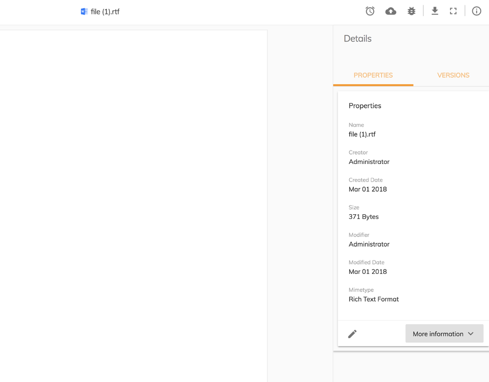

 [adf-content-metadata-card configuration driven by node-type instead of aspect-type. · Issue #2893 · Alfresco/alfresco-ng... ](https://github.com/Alfresco/alfresco-ng2-components/issues/2893)

### Schema app.config.json validator

To help developers configure the application in a more error-proof way, the app.config.json file now has a schema validator. This schema is part of the core package and will be inside the Yeoman-generated application from now on, by default. Every time a component gets an update which involves using the app.config, the schema will be updated to the new interface to validate the configuration file.

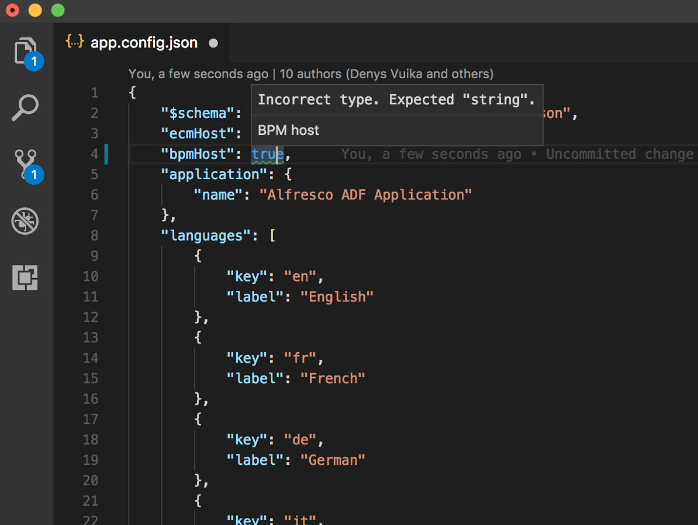

### Customize form outcomes styles

If you want to customize the outcomes style of your form you can do so using plain CSS selectors. Any outcome has an Id that is composed in the following way:

      adf-form-YOUR_OUTCAME_NAME

Using the CSS you can target any outcome ID and change the style as in this example:

    #adf-form-complete {background-color: blue !important;  color: white; }
    #adf-form-save     {background-color: green !important; color: white; }
    #adf-form-customoutcome {background-color: yellow !important; color: white; }

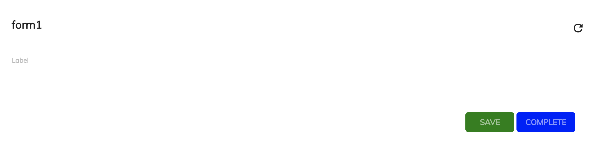

### Viewer enhancements

In this release, the [Viewer component](../core/components/viewer.component.md) has received the following set of improvements and enhancements:

-   Thumbnails for PDF view, with the option to provide your own Thumbnails template if needed
-   Image view now features a floating action toolbar with extra actions: zoom in/out, rotate, reset to default size
-   Image view now supports panning of the images. Hardware-accelerated styles were used to enable panning of zoomed in or large images with the highest performance and efficiency
-   The viewer has greatly improved maintenance of the Renditions (see possible conversion options here: [File types that support preview and thumbnail generation | Alfresco Documentation](https://docs.alfresco.com/5.2/references/valid-transformations-preview.html) )
-   Support for "carousel" modes and document navigation options (extra buttons you can enable and provide handlers for). This feature will be fully demonstrated in the upcoming "Alfresco Content Application" release.
-   It is now possible to provide custom menu buttons for the Viewer toolbar. See more details in the docs: [alfresco-ng2-components/viewer.component.md at development · Alfresco/alfresco-ng2-components · GitHub ](../core/components/viewer.component.md#custom-toolbar-buttons)

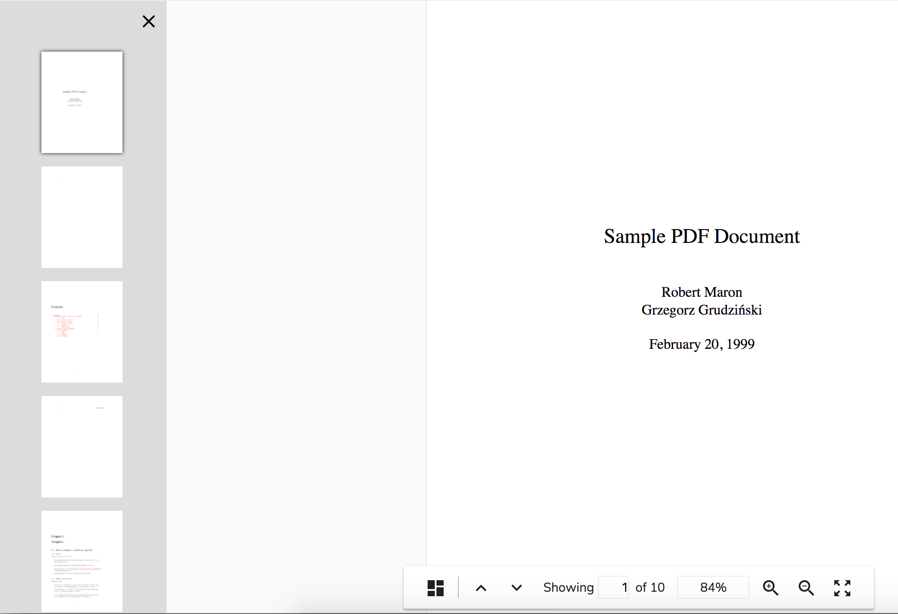

### Destination Picker enhancements

For the current release, the Destination Picker UI has been greatly improved.

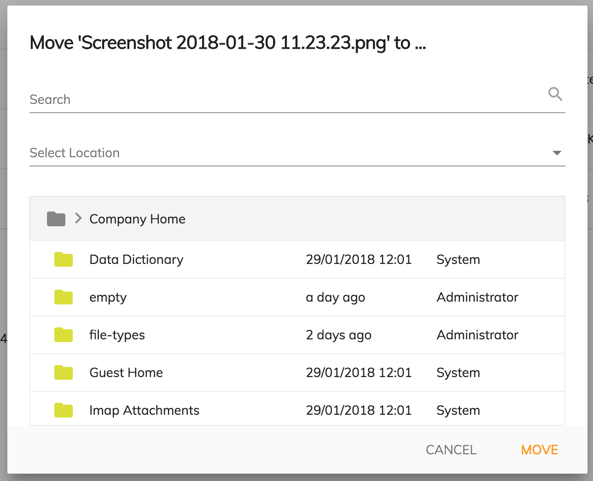

### Login Enhancements

-   the authentication status is now correctly resolved for scenarios where the "remember me" feature is switched off
-   it is now possible to use Login in scenarios where Cookies are not allowed or available (Electron desktop wrappers)

### Process Pagination - There is no way to paginate the result

With ADF 2.2.0 the processes list result are easy to paginate. You just need to pass the process list reference #processList as target of the [pagination component](../core/components/pagination.component.md)

    <adf-process-instance-list
       #processList
       [appId]="processFilter?.appId"
       [name]="processFilter?.filter?.name"
       [state]="processFilter?.filter?.state"
       [sort]="processFilter?.filter?.sort"
       [size]="'5'"
       [data]="dataProcesses">
    </adf-process-instance-list>

    <adf-pagination
       *ngIf="processList"
       [target]="processList"
       [supportedPageSizes]="'[5, 10, 15, 20]'">
    </adf-pagination>

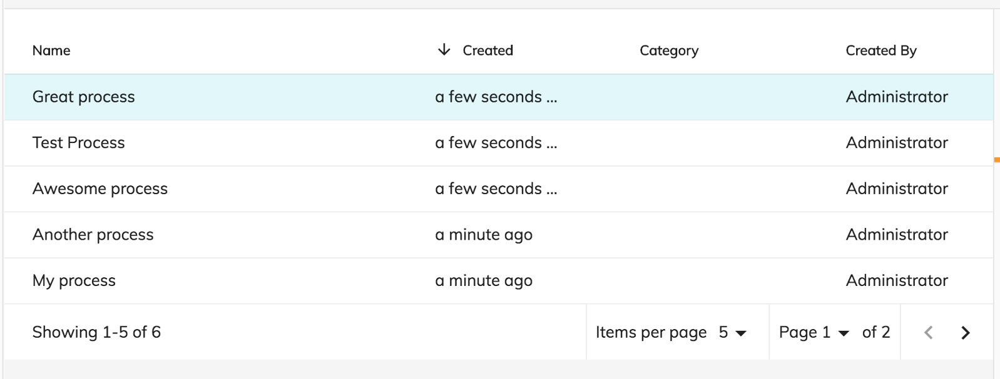

### App list - The component shows No Apps found until all the apps are loaded

With ADF 2.2.0, the app list component is shows the mat-spinner until the apps are loaded.

### Task Header - Make it customizable from the config file

You can decide which properties the [Task header component](../process-services/components/task-header.component.md) should render from the app.config.json file. By default, the component will render all the available properties. You can restrict those by changing app.config.json.
For instance, in this example, I would like to show the id, priority, parentName, and status.

    "adf-task-header": {
      "presets": {
        "properties": [
           "assignee",
           "status",
           "priority",
           "parentName",
           "id"
        ]
      }
    }

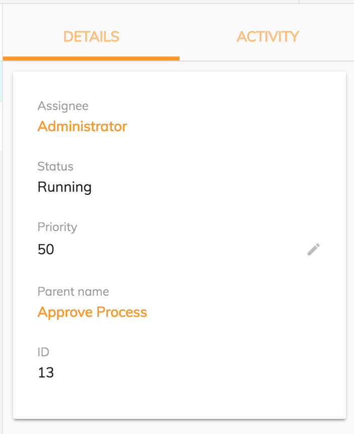

### Process List - Provide a way to support custom html template and static columns at same time

As with the Task List, now you can create your own process list with static and dynamic columns.
You can declare the static columns that your process list should show from the "app.config.json" file using custom presets.

     "adf-process-list": {
            "presets": {
                "custom": [
                    {
                        "key": "name",
                        "type": "text",
                        "title": "ADF_PROCESS_LIST.PROPERTIES.NAME",
                        "cssClass": "dw-dt-col-4 ellipsis-cell",
                        "sortable": true
                    },
                    {
                        "key": "started",
                        "type": "date",
                        "title": "ADF_PROCESS_LIST.PROPERTIES.CREATED",
                        "cssClass": "dw-dt-col-2 ellipsis-cell",
                        "format": "timeAgo",
                        "sortable": true
                    }
                ]
            }
        },

You can define your custom template in the HTML code:

    <adf-process-instance-list
        [appId]="appId"
        [presetColumn]="'custom'">

        <data-columns>
            <data-column key="startedBy" title="ADF_PROCESS_LIST.PROPERTIES.CREATED_BY" class="desktop-only dw-dt-col-3 ellipsis-cell">
                <ng-template let-entry="$implicit">
                    
{{getFullName(entry.row.obj.startedBy)}}

                </ng-template>
            </data-column>
        </data-columns>
    </adf-process-instance-list>

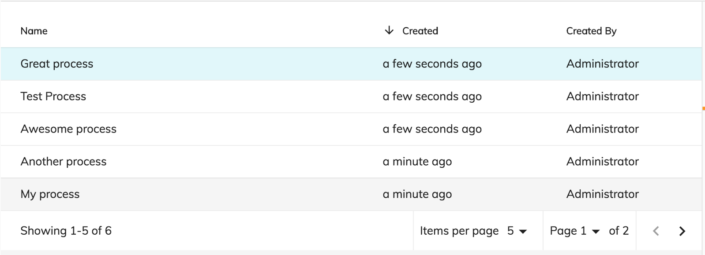

### Date Time Widget

We have added the new date time widget provided with APS 1.7.
This widget lets you choose the date and the time in the format given by the APS form.

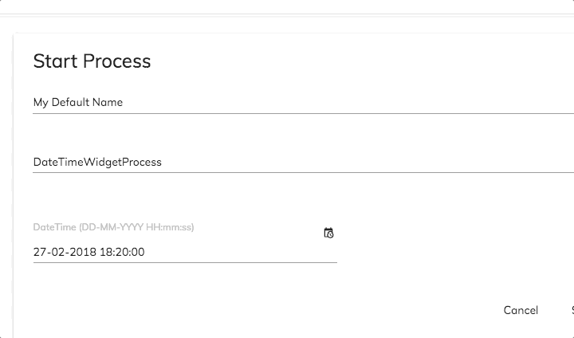

### Form Upload Widget Actions menu

We have added a new menu for actions to perform on the Upload widget.
We have provided 3 actions for each file added: Show, Remove and Download.
Clicking on the Show button will trigger the viewer to open with the given document.
Clicking on the Download button will allow you to download the selected file.
Clicking on the Remove button will remove the file from the Upload widget value.

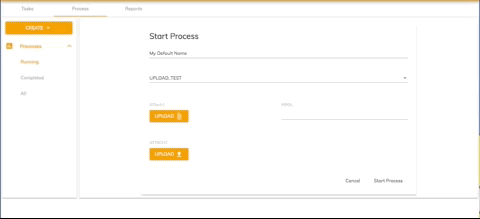

### Search custom empty template

We enhanced the [search control component](../content-services/components/search-control.component.md) by adding the option of customizing the template shown when no result is found via the tag _adf-empty-search-result._

    <adf-search-control [highlight]="true"
     (optionClicked)="onItemClicked($event)"
     (submit)="onSearchSubmit($event)">
     <adf-empty-search-result>
     Empty
     </adf-empty-search-result>
    </adf-search-control>

This lets you customize the empty search template as you want.

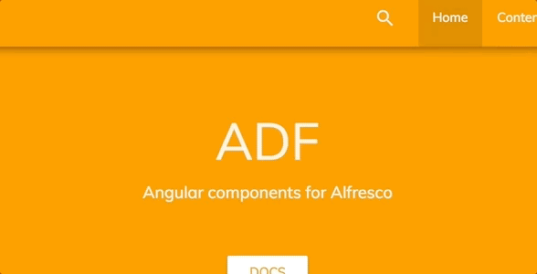

### CI changes

Two new scripts have been added in order to avoid export BC

## Localisation

This release includes: French, German, Italian, Spanish, Japanese, Dutch, Norwegian (BokmÅl), Russian, Brazilian Portuguese and Simplified Chinese versions.

## References

Below you can find a brief list of references to help you start to use the new release.

[Official GitHub Project - alfresco-ng2-components](https://github.com/Alfresco/alfresco-ng2-components)

[Getting started guides with Alfresco Application Development Framework](https://community.alfresco.com/community/application-development-framework/pages/get-started)

Component catalog

[Gitter chat supporting Alfresco ADF](https://gitter.im/Alfresco/alfresco-ng2-components)

[ADF examples](https://github.com/Alfresco/adf-examples)

[List of all components](https://github.com/Alfresco/alfresco-ng2-components/tree/master/ng2-components)

[Alfresco-JS-API](https://github.com/Alfresco/alfresco-js-api)

[ADF App Generator ](https://github.com/Alfresco/generator-ng2-alfresco-app)

Please refer to the [official documentation](http://docs.alfresco.com/) for further details and suggestions.

## Issues addressed

Release Notes - Apps Development Framework - Version 2.2.

### Documentation

-   \[[ADF-2204](https://issues.alfresco.com/jira/browse/ADF-2204)] - Docker hub missing documentation
-   \[[ADF-2228](https://issues.alfresco.com/jira/browse/ADF-2228)] - I18n support and example documentation
-   \[[ADF-2248](https://issues.alfresco.com/jira/browse/ADF-2248)] - Docker hub usage demo shell article
-   \[[ADF-2262](https://issues.alfresco.com/jira/browse/ADF-2262)] - Review of theming docs

### Feature

-   \[[ADF-1532](https://issues.alfresco.com/jira/browse/ADF-1532)] - Inconsistent assignee selection view in [`StartTaskComponent`](../process-services/components/start-task.component.md) (ng2-activiti-tasklist)
-   \[[ADF-1925](https://issues.alfresco.com/jira/browse/ADF-1925)] - Add new Datetime form widget to ADF
-   \[[ADF-2064](https://issues.alfresco.com/jira/browse/ADF-2064)] - Provide support for lazy loading
-   \[[ADF-2123](https://issues.alfresco.com/jira/browse/ADF-2123)] - Process [`Pagination`](../../lib/content-services/document-list/models/document-library.model.ts) - There is no way to paginate the result
-   \[[ADF-2197](https://issues.alfresco.com/jira/browse/ADF-2197)] - 'Process Heat map' is not showing the proper informations related to the dropdown.
-   \[[ADF-2232](https://issues.alfresco.com/jira/browse/ADF-2232)] - [Metadata Component] Layout oriented configurations
-   \[[ADF-2249](https://issues.alfresco.com/jira/browse/ADF-2249)] - Add schema check in generator app
-   \[[ADF-2259](https://issues.alfresco.com/jira/browse/ADF-2259)] - Expose the "sorting changed" event from DocumentList and DataTable
-   \[[ADF-2296](https://issues.alfresco.com/jira/browse/ADF-2296)] - Background color on form buttons
-   \[[ADF-2297](https://issues.alfresco.com/jira/browse/ADF-2297)] - App-list - The component shows "No Apps found" until all the apps are loaded
-   \[[ADF-2312](https://issues.alfresco.com/jira/browse/ADF-2312)] - Sites Dropdown component - default select option
-   \[[ADF-2317](https://issues.alfresco.com/jira/browse/ADF-2317)] - Design update for searching within the Destination Picker
-   \[[ADF-2326](https://issues.alfresco.com/jira/browse/ADF-2326)] - Process List - Provide a way to support custom html template and static columns at same time

### Story

-   \[[ADF-1412](https://issues.alfresco.com/jira/browse/ADF-1412)] - File Viewer - Documents
-   \[[ADF-1416](https://issues.alfresco.com/jira/browse/ADF-1416)] - File Viewer - Images
-   \[[ADF-1418](https://issues.alfresco.com/jira/browse/ADF-1418)] - File Viewer - Next/Previous File
-   \[[ADF-2137](https://issues.alfresco.com/jira/browse/ADF-2137)] - Document Thumbnail Pane
-   \[[ADF-2138](https://issues.alfresco.com/jira/browse/ADF-2138)] - Getting transformations of images
-   \[[ADF-2206](https://issues.alfresco.com/jira/browse/ADF-2206)] - Document Zoom and Browser Full Screen

### Bug

-   \[[ADF-1899](https://issues.alfresco.com/jira/browse/ADF-1899)] - [`ProcessService`](../process-services/services/process.service.md).deleteProcessInstanceVariable has incorrect method signature
-   \[[ADF-2000](https://issues.alfresco.com/jira/browse/ADF-2000)] - Destination picker is not completely translated
-   \[[ADF-2026](https://issues.alfresco.com/jira/browse/ADF-2026)] - Breadcrumb displays wrong path after reloading the page.
-   \[[ADF-2077](https://issues.alfresco.com/jira/browse/ADF-2077)] - [Destination picker] User should not be able to copy / move items into a site outside of the documentLibrary
-   \[[ADF-2118](https://issues.alfresco.com/jira/browse/ADF-2118)] - Process Initiator should be able to complete a task.
-   \[[ADF-2139](https://issues.alfresco.com/jira/browse/ADF-2139)] - Not possible to hide "remember me" on Login
-   \[[ADF-2169](https://issues.alfresco.com/jira/browse/ADF-2169)] - [Destination picker] Dialog does not match design
-   \[[ADF-2171](https://issues.alfresco.com/jira/browse/ADF-2171)] - [Destination picker] Copy / Move buttons are always enabled
-   \[[ADF-2175](https://issues.alfresco.com/jira/browse/ADF-2175)] - Document List requests are executed twice when opening the copy/move dialog
-   \[[ADF-2176](https://issues.alfresco.com/jira/browse/ADF-2176)] - CLONE - [Destination picker] File Libraries are not displayed
-   \[[ADF-2187](https://issues.alfresco.com/jira/browse/ADF-2187)] - 'Involve people' into task component don't have the proper color in dark themes
-   \[[ADF-2199](https://issues.alfresco.com/jira/browse/ADF-2199)] - Visibility of items dependent on a radio button list not showing on completed tasks
-   \[[ADF-2215](https://issues.alfresco.com/jira/browse/ADF-2215)] - Comments are not ordered by 'Created by' column
-   \[[ADF-2225](https://issues.alfresco.com/jira/browse/ADF-2225)] - [Form component] In a task form the complete button stays disabled if hidden mandatory fields are emptyIn a task form the complete button stays disabled if hidden mandatory fields are empty
-   \[[ADF-2231](https://issues.alfresco.com/jira/browse/ADF-2231)] - Moment.js library needs to be updated to fix security issues
-   \[[ADF-2233](https://issues.alfresco.com/jira/browse/ADF-2233)] - Could not import [`ContentMetadataService`](../../lib/content-services/content-metadata/services/content-metadata.service.ts) in 2.1 version
-   \[[ADF-2235](https://issues.alfresco.com/jira/browse/ADF-2235)] - User names and icons are not being retrieved if user has a profile picture.
-   \[[ADF-2242](https://issues.alfresco.com/jira/browse/ADF-2242)] - Search on custom sources is not working.
-   \[[ADF-2243](https://issues.alfresco.com/jira/browse/ADF-2243)] - Translation is missing for the 'Extended Search'.
-   \[[ADF-2246](https://issues.alfresco.com/jira/browse/ADF-2246)] - [Destination Picker] The selection from the dropdown is ignored after 'Clear' action
-   \[[ADF-2251](https://issues.alfresco.com/jira/browse/ADF-2251)] - [`ContentWidgetModule`](lib/process-services/src/lib/form/widgets/content-widget/content-widget.module.ts) is not exposed from ADF
-   \[[ADF-2254](https://issues.alfresco.com/jira/browse/ADF-2254)] - Viewer does not update top menu on "fileNodeId" changes
-   \[[ADF-2255](https://issues.alfresco.com/jira/browse/ADF-2255)] - SelectBox field does not render the data in ADF form
-   \[[ADF-2260](https://issues.alfresco.com/jira/browse/ADF-2260)] - Action menu translation is missing when right clicking on a file/folder
-   \[[ADF-2263](https://issues.alfresco.com/jira/browse/ADF-2263)] - Translation is missing on delete warning messages when user has no permission.
-   \[[ADF-2264](https://issues.alfresco.com/jira/browse/ADF-2264)] - [Destination picker] File Libraries visibility column is not displayed
-   \[[ADF-2265](https://issues.alfresco.com/jira/browse/ADF-2265)] - UserPreferences service does not return "defaultValue" for missing keys
-   \[[ADF-2288](https://issues.alfresco.com/jira/browse/ADF-2288)] - [JS-API] - Auth2 use the formParam instead of queryParam
-   \[[ADF-2289](https://issues.alfresco.com/jira/browse/ADF-2289)] - Login - Provider AUTH0
-   \[[ADF-2290](https://issues.alfresco.com/jira/browse/ADF-2290)] - PDF Viewer - scroll event dispatch outside view container
-   \[[ADF-2301](https://issues.alfresco.com/jira/browse/ADF-2301)] - [Datatable] event.preventDefault()
-   \[[ADF-2302](https://issues.alfresco.com/jira/browse/ADF-2302)] - Generator install dependencies missing
-   \[[ADF-2305](https://issues.alfresco.com/jira/browse/ADF-2305)] - Process app tiles on process workspace landing page show "..." in Firefox
-   \[[ADF-2310](https://issues.alfresco.com/jira/browse/ADF-2310)] - Error is thrown if isSelectionValid optional property is not defined
-   \[[ADF-2311](https://issues.alfresco.com/jira/browse/ADF-2311)] - [Content Metadata Card component](../content-services/components/content-metadata-card.component.md) does not work for folder node.
-   \[[ADF-2324](https://issues.alfresco.com/jira/browse/ADF-2324)] - Process [`Pagination`](../../lib/content-services/document-list/models/document-library.model.ts) - Items per page is not saved on user preferences
-   \[[ADF-2329](https://issues.alfresco.com/jira/browse/ADF-2329)] - Start Task form elements are not properly aligned in other themes than Developer Theme
-   \[[ADF-2338](https://issues.alfresco.com/jira/browse/ADF-2338)] - Close 'X' button for Document Thumbnail Pane is not displayed
-   \[[ADF-2342](https://issues.alfresco.com/jira/browse/ADF-2342)] - Password can be retrieved from the [login component](../core/components/login.component.md)
-   \[[ADF-2343](https://issues.alfresco.com/jira/browse/ADF-2343)] - [Demo shell] Not able to create a new folder on content services page
-   \[[ADF-2344](https://issues.alfresco.com/jira/browse/ADF-2344)] - Drag and drop image is not properly displayed on Process Services
-   \[[ADF-2346](https://issues.alfresco.com/jira/browse/ADF-2346)] - Name and profile picture is not displayed when trying to assign a user to a task.
-   \[[ADF-2350](https://issues.alfresco.com/jira/browse/ADF-2350)] - [Demo shell] Recent [Files component](../../demo-shell/src/app/components/files/files.component.ts) image is not properly displayed when DocumentList is empty
-   \[[ADF-2351](https://issues.alfresco.com/jira/browse/ADF-2351)] - [Gallery view] 'Sort by' drop-down option has an empty option that can be selected

### New Feature

-   \[[ADF-2161](https://issues.alfresco.com/jira/browse/ADF-2161)] - Content action download folder
-   \[[ADF-2163](https://issues.alfresco.com/jira/browse/ADF-2163)] - content-action target folder and file option
-   \[[ADF-2298](https://issues.alfresco.com/jira/browse/ADF-2298)] - Process Header - Make it customizable from config file
-   \[[ADF-2300](https://issues.alfresco.com/jira/browse/ADF-2300)] - [Upload Widget] Actions menu is needed
-   \[[ADF-2304](https://issues.alfresco.com/jira/browse/ADF-2304)] - Add option to Content [`Node`](https://github.com/Alfresco/alfresco-js-api/blob/develop/src/api/content-rest-api/docs/Node.md) Selector to transform the breadcrumb folder node
-   \[[ADF-2322](https://issues.alfresco.com/jira/browse/ADF-2322)] - [Document List] Gallery view
-   \[[ADF-2340](https://issues.alfresco.com/jira/browse/ADF-2340)] - [Delete directive] delete permanent form trashcan
-   \[[ADF-2352](https://issues.alfresco.com/jira/browse/ADF-2352)] - It should be possible to project toolbar buttons for the Viewer

### Task

-   \[[ADF-2316](https://issues.alfresco.com/jira/browse/ADF-2316)] - Upgrade to ngx-translate/core 9.1.1
-   \[[ADF-1876](https://issues.alfresco.com/jira/browse/ADF-1876)] - Add the possibility to have a custom "No result found" template for [search component](../content-services/components/search.component.md)
-   \[[ADF-1952](https://issues.alfresco.com/jira/browse/ADF-1952)] - Split the current test suites to test cases in Test Rail
-   \[[ADF-2085](https://issues.alfresco.com/jira/browse/ADF-2085)] - [Test Automation] create test for starting a task
-   \[[ADF-2087](https://issues.alfresco.com/jira/browse/ADF-2087)] - [Test Automation] Create test to cover starting a process
-   \[[ADF-2089](https://issues.alfresco.com/jira/browse/ADF-2089)] - [Test Automation] create test to cover [tag component](../../demo-shell/src/app/components/tag/tag.component.ts)
-   \[[ADF-2134](https://issues.alfresco.com/jira/browse/ADF-2134)] - Create a schema.json for app.config.json
-   \[[ADF-2147](https://issues.alfresco.com/jira/browse/ADF-2147)] - Breaking changes check
-   \[[ADF-2149](https://issues.alfresco.com/jira/browse/ADF-2149)] - Remove comments from the dist ng-pkg
-   \[[ADF-2159](https://issues.alfresco.com/jira/browse/ADF-2159)] - Update angular-cli to last version
-   \[[ADF-2211](https://issues.alfresco.com/jira/browse/ADF-2211)] - Task Header - Make it customizable from config file
-   \[[ADF-2212](https://issues.alfresco.com/jira/browse/ADF-2212)] - Task List - Improve the pagination using the interface
-   \[[ADF-2229](https://issues.alfresco.com/jira/browse/ADF-2229)] - Refactoring viewer tests
-   \[[ADF-2236](https://issues.alfresco.com/jira/browse/ADF-2236)] - Export test
-   \[[ADF-2245](https://issues.alfresco.com/jira/browse/ADF-2245)] - Setting Component - Emit an event to detect the changed url
-   \[[ADF-2261](https://issues.alfresco.com/jira/browse/ADF-2261)] - Missing documentation to render json in a [form component](../core/components/form.component.md)
-   \[[ADF-2267](https://issues.alfresco.com/jira/browse/ADF-2267)] - [Login Component] Password field autocomplete
-   \[[ADF-2293](https://issues.alfresco.com/jira/browse/ADF-2293)] - Ripristinate the loading in the generator/ demo shell
-   \[[ADF-2307](https://issues.alfresco.com/jira/browse/ADF-2307)] - Add a data-automation-id tag for Process Services navigation bar.
-   \[[ADF-2354](https://issues.alfresco.com/jira/browse/ADF-2354)] - Paginator Component - Add an unique id to the overlay menu

Please refer to  [the Alfresco issue tracker](https://issues.alfresco.com/jira/projects/ADF/issues/ADF-581?filter=allopenissues) for other known issues in this release. If you have more questions, please reply here or contact us using  [gitter](https://gitter.im/Alfresco/alfresco-ng2-components).
