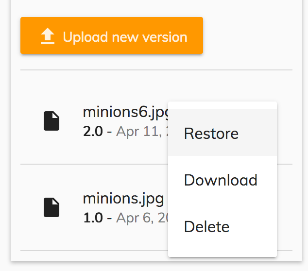

# Alfresco Application Development Framework, version 2.3.0 Release Note

These release notes provide information for the **2.3.0 release** of the Alfresco Application
Development Framework.
This a **General Available** release of the Application Development Framework, which contains the
Angular components to build a Web Application on top of the Alfresco Platform.
The release can be found on GitHub at [this link.](https://github.com/Alfresco/alfresco-ng2-components/releases/tag/1.7.0)

## Contents

-   [New package versions](#new-package-versions)
-   [Goals for this release](#goals-for-this-release)
-   [Notable new features](#notable-new-features)
    -   [Share File](#share-file)
    -   [Lock File](#lock-file)
    -   [Comment a Node](#comment-a-node)
    -   [Inherit Permission Button](#inherit-permission-button)
    -   [Permission List Component](#permission-list-component)
    -   [Sidenav Layout Component](#sidenav-layout-component)
    -   [Content metadata component enhancement](#content-metadata-component-enhancement)
    -   [Search Enhancements](#search-enhancements)
    -   [Search Filter](#search-filter)
    -   [Search Chip List](#search-chip-list)
    -   [Version Management Enhancements](#version-management-enhancements)
    -   [Task Standalone](#task-standalone)
-   [Localisation](#localisation)
-   [References](#references)
-   [Issues addressed](#issues-addressed)
    -   [Documentation](#documentation)
    -   [Feature](#feature)
    -   [Epic](#epic)
    -   [Story](#story)
    -   [Bug](#bug)
    -   [New Feature](#new-feature)
    -   [Task](#task)

## New package versions

    "@alfresco/adf-content-services" : "2.3.0"
    "@alfresco/adf-process-services" : "2.3.0"
    "@alfresco/adf-core" : "2.3.0"
    "@alfresco/adf-insights" : "2.3.0"
    "alfresco-js-api": "2.3.0"

Suggested devDependencies update:

    "@angular/cli": "1.7.4"

## Goals for this release

In this release we have continued to focus on new big features such as Content Permissions, Faceted Search and production builds with support for [AOT](https://angular.io/guide/aot-compiler). We've consolidated theComment component to work across Process and Content and we have a new common Side Navigation component to have a consistent look'n'feel across all of our apps. See all the new features and bug fixes below.

Please report issues with this release in the  [issue tracker](https://github.com/Alfresco/alfresco-ng2-components/issues/new). You can collaborate on this release or share feedback by using the discussion tools on  [Gitter](http://gitter.im/Alfresco/alfresco-ng2-components).

## Notable new features

Below are the most important new features of this release:

-   Inherit permission button
-   Share File
-   Lock File
-   Comment a [`Node`](https://github.com/Alfresco/alfresco-js-api/blob/develop/src/api/content-rest-api/docs/Node.md)
-   Inherit Permission Button
-   [Permission List Component](../content-services/components/permission-list.component.md)
-   [Sidenav Layout Component](../core/components/sidenav-layout.component.md)
-   [Content metadata component](../content-services/components/content-metadata-card.component.md) enhancement
-   Search Enhancements
-   Search Chip List
-   Version Management Enhancements
-   Task Standalone

### Share File

Creates and manages public shared links for files.

    <button mat-icon-button
     [baseShareUrl]="[http://localhos:8080/myrouteForShareFile/](http://localhos:8080/myrouteForShareFile/)"
     [adf-share]="documentList.selection[0]">
     <mat-icon>share</mat-icon>
    </button>

### Lock File

When the directive is clicked a dialog is shown and you can lock or unlock a file
(folder cannot be locked)
There are two types of lock: indefinite lock and time lock.
If the time is not selected the user will lock the file it until will not unlock it
When a file is locked it can be locked and unlocked by default only by the user that creates the lock but you can also allow the other file owners to modify it.

    <button mat-icon-button [adf-node-lock]="node.entry">
     <mat-icon>lock</mat-icon> Lock file
    </button>

### Comment a Node

The [comments component](../core/components/comments.component.md) can now be used also on files.

    <adf-comments
     [nodeId]="YOUR_NODE_ID"
     [readOnly]="YOUR_READ_ONLY_FLAG">
    </adf-comments>

### Inherit Permission Button

Is it now possible add remove inherit permissions to a specific node via ADF adding the directive:

    <button mat-raised-button
     adf-inherit-permission [nodeId]="nodeId"
     (updated)="onUpdatedPermissions($event)">
    BUTTON TEXT</button>

This directive should be added to a button and when the button is clicked this will add/remove the inherited permission based on the actual node configuration.

### Permission List Component

We have added a new component to show the list of the permission actually present for a specific node:

     <adf-permission-list [nodeId]="nodeId">
     </adf-permission-list>

Also this component will allow a role change for the locally set permissions using a dropdown.

### Sidenav Layout Component

We have added a new component to make this common layout organisation easier to reuse:

    <adf-sidenav-layout [sidenavMin]="70" [sidenavMax]="220" [stepOver]="600">

     <adf-sidenav-layout-header>
     <ng-template let-toggleMenu="toggleMenu">...</ng-template>
     </adf-sidenav-layout-header>

     <adf-sidenav-layout-navigation>
     <ng-template let-isMenuMinimized="isMenuMinimized">...</ng-template>
     </adf-sidenav-layout-navigation>

     <adf-sidenav-layout-content>
     <ng-template>
     <router-outlet></router-outlet>
     </ng-template>
     </adf-sidenav-layout-content>

    </adf-sidenav-layout>

### Content metadata component enhancement

Two new input parameters have been added to the content-metadata component.

-   With parameter **multi**, the component is able to open multiple expansion panel at the same time.
-   With parameter **readOnly**, the metadata can't be edited, there is no pencil icon.

    <adf-content-metadata-card
     [node]="node"
     [multi]="true"
     [readOnly]="true">
    </adf-content-metadata-card>

### Search Enhancements

In this release we have started working on the various search enhancements and ground work for the Faceted Search support.
Please note that the work is still in progress and you should expect more features in the upcoming releases.

### Search Filter

This is a new component that adds advanced search capabilities for your application.
You can find more details in the following Jira ticket: [\[ADF-2128\] Facet Container (P1) - Alfresco JIRA](https://issues.alfresco.com/jira/browse/ADF-2128)

The working demo can be found in the "demo shell" application.

### Search Chip List

This is a new component that allows you to display a list of chips reflecting the facet queries and facet buckets user has selected in the [Search Filter component](../content-services/components/search-filter.component.md). It is possible to remove the chips to perform an automatic data update.

### Version Management Enhancements

Version Management component now allows you the following features out of the box:

-   View all document versions
-   Upload new versions of the documents
-   (new) Delete any of the previous versions
-   (new) Download any of the previous versions

In addition, all actions are wired with the node permissions. Users won't be able to delete, restore or upload new versions if they are not granted permissions to update the given node.

### Task Standalone

With the current ADF release, we have a new component **adf-task-standalone** that contains all the code related to a Task that doesn't belong to a process.
The component exposes basic properties to hide or shows buttons or customize the title like the taskName.

    <adf-task-standalone
     [taskName]= "taskname"
     [isCompleted]="false"
     [hideCancelButton]="true">
    </adf-task-standalone>

## Localisation

This release includes: French, German, Italian, Spanish, Japanese, Dutch, Norwegian (BokmÅl), Russian, Brazilian Portuguese and Simplified Chinese versions.

## References

Below you can find a brief list of references to help youstart to use the new release.

[Official GitHub Project -alfresco-ng2-components](https://github.com/Alfresco/alfresco-ng2-components)

[Getting started guides with Alfresco Application Development Framework](https://community.alfresco.com/community/application-development-framework/pages/get-started)

Component catalog

[Gitter chat supporting Alfresco ADF](https://gitter.im/Alfresco/alfresco-ng2-components)

[ADF examples](https://github.com/Alfresco/adf-examples)

[List of all components](https://github.com/Alfresco/alfresco-ng2-components/tree/master/ng2-components)

[Alfresco-JS-API](https://github.com/Alfresco/alfresco-js-api)

[ADF App Generator](https://github.com/Alfresco/generator-ng2-alfresco-app)

Please refer to the [official documentation](http://docs.alfresco.com/) for further details and suggestions.

## Issues addressed

Release Notes - Apps Development Framework - Version 2.3.0

### Documentation

-   \[[ADF-2360](https://issues.alfresco.com/jira/browse/ADF-2360)] - Wiki test style
-   \[[ADF-2451](https://issues.alfresco.com/jira/browse/ADF-2451)] - Initial doc review
-   \[[ADF-2456](https://issues.alfresco.com/jira/browse/ADF-2456)] - Document List documentation for properties needs enhancements
-   \[[ADF-2458](https://issues.alfresco.com/jira/browse/ADF-2458)] - Overhaul [process.service](../process-services/services/process.service.md).md doc file
-   \[[ADF-2463](https://issues.alfresco.com/jira/browse/ADF-2463)] - Organise doc files into library subfolders
-   \[[ADF-2526](https://issues.alfresco.com/jira/browse/ADF-2526)] - Fix interpolation markers in doc code samples
-   \[[ADF-2596](https://issues.alfresco.com/jira/browse/ADF-2596)] - Properties of renamed input/output are wrong
-   \[[ADF-2695](https://issues.alfresco.com/jira/browse/ADF-2695)] - DocumentList content action documentation
-   \[[ADF-2697](https://issues.alfresco.com/jira/browse/ADF-2697)] - [Viewer] Add sharedLinkId example in Viewer documentation

### Feature

-   \[[ADF-711](https://issues.alfresco.com/jira/browse/ADF-711)] - Drag and drop doesn't have the acceptedFilesType property
-   \[[ADF-2197](https://issues.alfresco.com/jira/browse/ADF-2197)] - 'Process Heat map' is not showing the proper informations related to the dropdown.
-   \[[ADF-2431](https://issues.alfresco.com/jira/browse/ADF-2431)] - Support Content Projection for Card View
-   \[[ADF-2433](https://issues.alfresco.com/jira/browse/ADF-2433)] - Calling custom REST end points with JS API
-   \[[ADF-2434](https://issues.alfresco.com/jira/browse/ADF-2434)] - Rename file and folders
-   \[[ADF-2435](https://issues.alfresco.com/jira/browse/ADF-2435)] - SSO AuthGuards
-   \[[ADF-2452](https://issues.alfresco.com/jira/browse/ADF-2452)] - [Task Standalone component](../process-services/components/task-standalone.component.md)
-   \[[ADF-2457](https://issues.alfresco.com/jira/browse/ADF-2457)] - Comment component - Hide the table header
-   \[[ADF-2459](https://issues.alfresco.com/jira/browse/ADF-2459)] - ADF Pipeline build - is not running the production mode
-   \[[ADF-2477](https://issues.alfresco.com/jira/browse/ADF-2477)] - Message bus in [log service](../core/services/log.service.md)
-   \[[ADF-2493](https://issues.alfresco.com/jira/browse/ADF-2493)] - alfresco-js-api search api regeneration
-   \[[ADF-2504](https://issues.alfresco.com/jira/browse/ADF-2504)] - Provide Option to Disable Metadata Edit
-   \[[ADF-2528](https://issues.alfresco.com/jira/browse/ADF-2528)] - Share Directive
-   \[[ADF-2540](https://issues.alfresco.com/jira/browse/ADF-2540)] - Lock and Unlock directive
-   \[[ADF-2542](https://issues.alfresco.com/jira/browse/ADF-2542)] - Permission display component
-   \[[ADF-2559](https://issues.alfresco.com/jira/browse/ADF-2559)] - Import the Sidebar component in ADF
-   \[[ADF-2588](https://issues.alfresco.com/jira/browse/ADF-2588)] - Make comment components compatible with [content service](../core/services/content.service.md)
-   \[[ADF-2609](https://issues.alfresco.com/jira/browse/ADF-2609)] - Provide a way to change the BPM context
-   \[[ADF-2614](https://issues.alfresco.com/jira/browse/ADF-2614)] - Edit icon misses in Info-drawer Assignee
-   \[[ADF-2632](https://issues.alfresco.com/jira/browse/ADF-2632)] - Version Manager should support application configuration settings

### Epic

-   \[[ADF-2430](https://issues.alfresco.com/jira/browse/ADF-2430)] - Enable Data Table to provide a card view

### Story

-   \[[ADF-1294](https://issues.alfresco.com/jira/browse/ADF-1294)] - CS 5.2.1 - Search - JS-API update
-   \[[ADF-2128](https://issues.alfresco.com/jira/browse/ADF-2128)] - Facet Container (P1)
-   \[[ADF-2561](https://issues.alfresco.com/jira/browse/ADF-2561)] - View comments on previous versions
-   \[[ADF-2562](https://issues.alfresco.com/jira/browse/ADF-2562)] - Download a previous version
-   \[[ADF-2567](https://issues.alfresco.com/jira/browse/ADF-2567)] - Delete a version

### Bug

-   \[[ADF-1714](https://issues.alfresco.com/jira/browse/ADF-1714)] - Task List and Process List does not react properly on Enter key
-   \[[ADF-1787](https://issues.alfresco.com/jira/browse/ADF-1787)] - [Mobile] for upload dialog text overlapping, not displaying full file name
-   \[[ADF-1814](https://issues.alfresco.com/jira/browse/ADF-1814)] - [Mobile] Files/folders is not deleted when selecting multiple
-   \[[ADF-1816](https://issues.alfresco.com/jira/browse/ADF-1816)] - [Mobile] Cannot view folder correctly when moving/copying folder/file
-   \[[ADF-1828](https://issues.alfresco.com/jira/browse/ADF-1828)] - [Mobile] if navigating to folder with long filename all items are pushed off the screen
-   \[[ADF-1913](https://issues.alfresco.com/jira/browse/ADF-1913)] - [Mobile] 'Category' link is overflowing on Process page.
-   \[[ADF-1932](https://issues.alfresco.com/jira/browse/ADF-1932)] - [Mobile][demo shell]Settings button on login page is not displayed properly
-   \[[ADF-1935](https://issues.alfresco.com/jira/browse/ADF-1935)] - [Mobile] Long content on widgets is not properly displayed.
-   \[[ADF-2018](https://issues.alfresco.com/jira/browse/ADF-2018)] - [Mobile][demo shell] Info drawer for Versions is not properly displayed
-   \[[ADF-2124](https://issues.alfresco.com/jira/browse/ADF-2124)] - Should be able to login with security.csrf.disabled=false
-   \[[ADF-2255](https://issues.alfresco.com/jira/browse/ADF-2255)] - SelectBox field does not render the data in ADF form
-   \[[ADF-2320](https://issues.alfresco.com/jira/browse/ADF-2320)] - Complete button is visible on an involved task
-   \[[ADF-2337](https://issues.alfresco.com/jira/browse/ADF-2337)] - [Viewer] Dark Theming color are not working properly
-   \[[ADF-2358](https://issues.alfresco.com/jira/browse/ADF-2358)] - Copy action for consumer user on demo shell denied
-   \[[ADF-2368](https://issues.alfresco.com/jira/browse/ADF-2368)] - Manage file version is updating wrong files.
-   \[[ADF-2373](https://issues.alfresco.com/jira/browse/ADF-2373)] - User should be able to see just the sites in which is member in SiteList drop-down
-   \[[ADF-2393](https://issues.alfresco.com/jira/browse/ADF-2393)] - Error when deleting a folder when Infinite scrolling is enabled and all items are loaded
-   \[[ADF-2397](https://issues.alfresco.com/jira/browse/ADF-2397)] - Sometimes Load more on Content [`Node`](https://github.com/Alfresco/alfresco-js-api/blob/develop/src/api/content-rest-api/docs/Node.md) Selector does not load next page of results
-   \[[ADF-2414](https://issues.alfresco.com/jira/browse/ADF-2414)] - Translation missing for warning message on Login Page
-   \[[ADF-2421](https://issues.alfresco.com/jira/browse/ADF-2421)] - CLONE - Unable to copy / move a file from Recent or Favorites when user has only granular permissions on the file
-   \[[ADF-2428](https://issues.alfresco.com/jira/browse/ADF-2428)] - \[Demo shell Unable to view document metadata from document list view
-   \[[ADF-2429](https://issues.alfresco.com/jira/browse/ADF-2429)] - Viewer - media file full screen
-   \[[ADF-2442](https://issues.alfresco.com/jira/browse/ADF-2442)] - [Search Service](lib/content-services/src/lib/search/services/search.service.ts) has wrong types for the 'search' API
-   \[[ADF-2443](https://issues.alfresco.com/jira/browse/ADF-2443)] - Typo in the UserPreferences service
-   \[[ADF-2444](https://issues.alfresco.com/jira/browse/ADF-2444)] - CLONE - Incorrect Items per page values on all lists after upgrade to ADF 2.2.0
-   \[[ADF-2448](https://issues.alfresco.com/jira/browse/ADF-2448)] - Wrong type definition for [`RequestPagination`](https://github.com/Alfresco/alfresco-js-api/blob/develop/src/api/search-rest-api/docs/RequestPagination.md)
-   \[[ADF-2450](https://issues.alfresco.com/jira/browse/ADF-2450)] - Search api type definition is not defined
-   \[[ADF-2454](https://issues.alfresco.com/jira/browse/ADF-2454)] - Login dialog icon and header text not centered correctly
-   \[[ADF-2455](https://issues.alfresco.com/jira/browse/ADF-2455)] - Document List does not render thumbnails
-   \[[ADF-2461](https://issues.alfresco.com/jira/browse/ADF-2461)] - Pdf viewer worker are not unregistered
-   \[[ADF-2465](https://issues.alfresco.com/jira/browse/ADF-2465)] - Sometimes, navigating using the breadcrumb opens another folder instead of the clicked one - after search performed on the Content [`Node`](https://github.com/Alfresco/alfresco-js-api/blob/develop/src/api/content-rest-api/docs/Node.md) Selector
-   \[[ADF-2468](https://issues.alfresco.com/jira/browse/ADF-2468)] - Error message displayed in console when navigating to tag page
-   \[[ADF-2470](https://issues.alfresco.com/jira/browse/ADF-2470)] - Search API implementation is incomplete
-   \[[ADF-2480](https://issues.alfresco.com/jira/browse/ADF-2480)] - Document List is not refreshed after deleting a file
-   \[[ADF-2483](https://issues.alfresco.com/jira/browse/ADF-2483)] - Validate folder name on change
-   \[[ADF-2484](https://issues.alfresco.com/jira/browse/ADF-2484)] - Content actions do not translate well
-   \[[ADF-2486](https://issues.alfresco.com/jira/browse/ADF-2486)] - Input Mask Placeholder for TextWidget not showing in ADF
-   \[[ADF-2492](https://issues.alfresco.com/jira/browse/ADF-2492)] - Task without a form is not displayed when assignment is preselected on APS
-   \[[ADF-2500](https://issues.alfresco.com/jira/browse/ADF-2500)] - The full content of Trashcan is not displayed.
-   \[[ADF-2501](https://issues.alfresco.com/jira/browse/ADF-2501)] - Checkbox form Widget - TASK "Complete" button not grayed out when widget set as required
-   \[[ADF-2514](https://issues.alfresco.com/jira/browse/ADF-2514)] - AOT build [process service](../process-services/services/process.service.md) error in typescript compiler
-   \[[ADF-2522](https://issues.alfresco.com/jira/browse/ADF-2522)] - Date and time widget - Incorrect min/max values applied
-   \[[ADF-2535](https://issues.alfresco.com/jira/browse/ADF-2535)] - Content Metadata - group title translation
-   \[[ADF-2575](https://issues.alfresco.com/jira/browse/ADF-2575)] - User details are not displayed when searching for a user to add it to 'involve people' on a task
-   \[[ADF-2586](https://issues.alfresco.com/jira/browse/ADF-2586)] - Components do not work prod mode when importing in code
-   \[[ADF-2591](https://issues.alfresco.com/jira/browse/ADF-2591)] - [Document list] Selection icon is cut
-   \[[ADF-2592](https://issues.alfresco.com/jira/browse/ADF-2592)] - Different types of tooltips appear in the viewer
-   \[[ADF-2604](https://issues.alfresco.com/jira/browse/ADF-2604)] - Incorrect definitions for Enums
-   \[[ADF-2607](https://issues.alfresco.com/jira/browse/ADF-2607)] - Task [`Form`](../../lib/process-services/src/lib/task-list/models/form.model.ts) - Number Widget placeholder no longer displayed
-   \[[ADF-2624](https://issues.alfresco.com/jira/browse/ADF-2624)] - All metadata card component children display parent info drawer tooltip
-   \[[ADF-2625](https://issues.alfresco.com/jira/browse/ADF-2625)] - [`Node`](https://github.com/Alfresco/alfresco-js-api/blob/develop/src/api/content-rest-api/docs/Node.md) name not updated when changing its value in metadata component
-   \[[ADF-2628](https://issues.alfresco.com/jira/browse/ADF-2628)] - Metadata editors miss tooltips
-   \[[ADF-2630](https://issues.alfresco.com/jira/browse/ADF-2630)] - demo shell: tabs of the info drawer are not translated
-   \[[ADF-2634](https://issues.alfresco.com/jira/browse/ADF-2634)] - [`Node`](https://github.com/Alfresco/alfresco-js-api/blob/develop/src/api/content-rest-api/docs/Node.md) Version List actions are not localised
-   \[[ADF-2636](https://issues.alfresco.com/jira/browse/ADF-2636)] - Console gives an error when trying to load ADF on safari
-   \[[ADF-2660](https://issues.alfresco.com/jira/browse/ADF-2660)] - ADF [Process Service](../process-services/services/process.service.md) lib is not importing the content dependency
-   \[[ADF-2662](https://issues.alfresco.com/jira/browse/ADF-2662)] - [Settings Component] Still able to sign in when changing APS or ACS URLS to invalid URL
-   \[[ADF-2669](https://issues.alfresco.com/jira/browse/ADF-2669)] - Delete version confirmation dialog has wrong 'cancel' color
-   \[[ADF-2673](https://issues.alfresco.com/jira/browse/ADF-2673)] - [`DebugAppConfigService`](lib/core/src/lib/app-config/debug-app-config.service.ts) breaks default values for application config
-   \[[ADF-2676](https://issues.alfresco.com/jira/browse/ADF-2676)] - SupportedPageSizes from app.config.json file are not displayed in Content Services Page
-   \[[ADF-2681](https://issues.alfresco.com/jira/browse/ADF-2681)] - Not all sites are displayed in Site List dropdown
-   \[[ADF-2682](https://issues.alfresco.com/jira/browse/ADF-2682)] - Number of page doesn't change when navigating to another folder
-   \[[ADF-2684](https://issues.alfresco.com/jira/browse/ADF-2684)] - [Task Pagination][pagination](../../lib/content-services/document-list/models/document-library.model.ts) isn't displayed properly when 'Items per page' is 25
-   \[[ADF-2687](https://issues.alfresco.com/jira/browse/ADF-2687)] - [Demo shell] No message is displayed when deleting a file/folder from content action
-   \[[ADF-2689](https://issues.alfresco.com/jira/browse/ADF-2689)] - Task [`Form`](../../lib/process-services/src/lib/task-list/models/form.model.ts) - Text Widget placeholder no longer displayed
-   \[[ADF-2690](https://issues.alfresco.com/jira/browse/ADF-2690)] - Title is not properly displayed in Metadata component - 'Properties' tab
-   \[[ADF-2711](https://issues.alfresco.com/jira/browse/ADF-2711)] - [Involve People Widget] When scrolling down the result box scrolls with the page
-   \[[ADF-2714](https://issues.alfresco.com/jira/browse/ADF-2714)] - [Demo shell]Not able to download a version of a file
-   \[[ADF-2715](https://issues.alfresco.com/jira/browse/ADF-2715)] - [Document List] Can't display content of a folder on any page after the first
-   \[[ADF-2719](https://issues.alfresco.com/jira/browse/ADF-2719)] - [Demo shell] The message is not translated when deleting a folder from content action menu
-   \[[ADF-2723](https://issues.alfresco.com/jira/browse/ADF-2723)] - File viewer - Document list reverting to user's folder after viewing file from another location
-   \[[ADF-2725](https://issues.alfresco.com/jira/browse/ADF-2725)] - Folder content is not displayed after clicking it from search suggestion
-   \[[ADF-2734](https://issues.alfresco.com/jira/browse/ADF-2734)] - [Demo shell] Supported page size in Trashcan is different form the others
-   \[[ADF-2735](https://issues.alfresco.com/jira/browse/ADF-2735)] - Wrong fall back icon when thumbnails enable - Document List
-   \[[ADF-2746](https://issues.alfresco.com/jira/browse/ADF-2746)] - [Demo shell] Created by' column is empty
-   \[[ADF-2755](https://issues.alfresco.com/jira/browse/ADF-2755)] - Cannot close the viewer after viewing a file from a process/task.

### New Feature

-   \[[ADF-2306](https://issues.alfresco.com/jira/browse/ADF-2306)] - DocumentList should let configure the includeFields request to the server
-   \[[ADF-2361](https://issues.alfresco.com/jira/browse/ADF-2361)] - rootId behavior of [`BreadcrumbComponent`](../content-services/components/breadcrumb.component.md)
-   \[[ADF-2415](https://issues.alfresco.com/jira/browse/ADF-2415)] - PDF Viewer - open password protected files
-   \[[ADF-2552](https://issues.alfresco.com/jira/browse/ADF-2552)] - Create a directive to add/remove inherited permissions
-   \[[ADF-2553](https://issues.alfresco.com/jira/browse/ADF-2553)] - Add a dropdown choice for role into permission list for locally set permissions
-   \[[ADF-2580](https://issues.alfresco.com/jira/browse/ADF-2580)] - [Demo Shell]Improve the inherit button to show better the 'toggle' status

### Task

-   \[[ADF-645](https://issues.alfresco.com/jira/browse/ADF-645)] - Expose a Claim Task event on activiti-task-details.component - 1883 Github
-   \[[ADF-1572](https://issues.alfresco.com/jira/browse/ADF-1572)] - Remove sorting option from comments.
-   \[[ADF-2086](https://issues.alfresco.com/jira/browse/ADF-2086)] - [Test Automation] Create smoke test for analytics
-   \[[ADF-2088](https://issues.alfresco.com/jira/browse/ADF-2088)] - [Test Automation] Create test to cover form widgets
-   \[[ADF-2353](https://issues.alfresco.com/jira/browse/ADF-2353)] - Comment component - Use the mat-list
-   \[[ADF-2376](https://issues.alfresco.com/jira/browse/ADF-2376)] - Remove logs in instances
-   \[[ADF-2380](https://issues.alfresco.com/jira/browse/ADF-2380)] - Adding start task tests for custom app
-   \[[ADF-2394](https://issues.alfresco.com/jira/browse/ADF-2394)] - Process List Component - Should expose the mutiSelect property
-   \[[ADF-2405](https://issues.alfresco.com/jira/browse/ADF-2405)] - [Process Service](../process-services/services/process.service.md) - Add a new method to get all process definition versions
-   \[[ADF-2412](https://issues.alfresco.com/jira/browse/ADF-2412)] - Task List - refactoring
-   \[[ADF-2417](https://issues.alfresco.com/jira/browse/ADF-2417)] - Remove the default [`Node`](https://github.com/Alfresco/alfresco-js-api/blob/develop/src/api/content-rest-api/docs/Node.md) ID from tag page in demo-shell
-   \[[ADF-2424](https://issues.alfresco.com/jira/browse/ADF-2424)] - Docker file size decreasing
-   \[[ADF-2462](https://issues.alfresco.com/jira/browse/ADF-2462)] - Automatic PR script after any beta release
-   \[[ADF-2471](https://issues.alfresco.com/jira/browse/ADF-2471)] - Create smoke tests to cover Colour change component
-   \[[ADF-2475](https://issues.alfresco.com/jira/browse/ADF-2475)] - Create smoke test to cover infinite scrolling
-   \[[ADF-2476](https://issues.alfresco.com/jira/browse/ADF-2476)] - Create smoke test for metadata component
-   \[[ADF-2491](https://issues.alfresco.com/jira/browse/ADF-2491)] - Code of Conduct document for the project
-   \[[ADF-2495](https://issues.alfresco.com/jira/browse/ADF-2495)] - Change all fit/fdescribe to it/describe
-   \[[ADF-2517](https://issues.alfresco.com/jira/browse/ADF-2517)] - Travis pipeline test dist
-   \[[ADF-2521](https://issues.alfresco.com/jira/browse/ADF-2521)] - Stabilise failures within auto suite against development branch
-   \[[ADF-2531](https://issues.alfresco.com/jira/browse/ADF-2531)] - Support for AoT compilation and Production builds
-   \[[ADF-2533](https://issues.alfresco.com/jira/browse/ADF-2533)] - Clean double name component and directive
-   \[[ADF-2534](https://issues.alfresco.com/jira/browse/ADF-2534)] - Update Generator angular-cli 1.7.3
-   \[[ADF-2558](https://issues.alfresco.com/jira/browse/ADF-2558)] - Update the JS-API to fully support the ACS Versions API
-   \[[ADF-2587](https://issues.alfresco.com/jira/browse/ADF-2587)] - Update the i18n files
-   \[[ADF-2638](https://issues.alfresco.com/jira/browse/ADF-2638)] - Event for other components when Content Metadata updates node
-   \[[ADF-2645](https://issues.alfresco.com/jira/browse/ADF-2645)] - [App generator] 2.3.0 update

Please refer to  [the Alfresco issue tracker](https://issues.alfresco.com/jira/projects/ADF/issues/ADF-581?filter=allopenissues) for other known issues in this release. If you have more questions, please reply here or contact us using [gitter](https://gitter.im/Alfresco/alfresco-ng2-components).
