# Alfresco Application Development Framework, version 2.4.0 Release Note

These release notes provide information about the **2.4.0 release** of the Alfresco Application Development Framework.
This is the latest **General Available** release of the Application Development Framework, which contains the Angular components to build a Web Application on top of the Alfresco Platform.
The release can be found on GitHub at [this location.](https://github.com/Alfresco/alfresco-ng2-components/releases/tag/1.7.0)

## Contents

-   [New name packages](#new-name-packages)
-   [Goals for this release](#goals-for-this-release)
-   [Notable new features](#notable-new-features)
    -   [SSO Login support](#sso-login-support)
    -   [SSO Implicit Flow with Keycloak Login page](#sso-implicit-flow-with-keycloak-login-page)
    -   [File versioning enhancement](#file-versioning-enhancement)
    -   [Empty Page Component](#empty-page-component)
    -   [TaskList Empty Page](#tasklist-empty-page)
    -   [ProcessList Empty Page](#processlist-empty-page)
    -   [Error Page Component](#error-page-component)
    -   [Search Improvements](#search-improvements)
    -   [App Config Pipe](#app-config-pipe)
    -   [Intercepting and Resuming Upload](#intercepting-and-resuming-upload)
    -   [Conditional Visibility for Data Columns](#conditional-visibility-for-data-columns)
    -   [Conditional States for Content Actions](#conditional-states-for-content-actions)
    -   [Responsive Button Menu](#responsive-button-menu)
-   [Localization](#localization)
-   [References](#references)
-   [Issues addressed](#issues-addressed)
    -   [Documentation](#documentation)
    -   [Feature](#feature)
    -   [Story](#story)
    -   [Bug](#bug)
    -   [Task](#task)
    -   [Feature Bug](#feature-bug)
    -   [Feature (Task)](#feature-task)

## New name packages

    "@alfresco/adf-content-services" : "2.4.0"
    "@alfresco/adf-process-services" : "2.4.0"
    "@alfresco/adf-core" : "2.4.0"
    "@alfresco/adf-insights" : "2.4.0"

## Goals for this release

This release introduces native support for OpenID Connect and oAuth2 implicit flows. This enables complex Single Sign-On configurations using JWT and OpenID Connect and aligns with the new authentication features in Alfresco Process Services (powered by Activiti) 1.9 and Alfresco Content Services 6.0 which both include native support for using Keycloak. If you have SSO requirements for your project then this release (along with APS 1.9, ACS 6.0, and Keycloak) will be useful to you. 

The release also contains new components such as Error Pages and Empty Page. Searchs continues to be improved and the Upload component has new features to customize the upload flow by providing new events and configuration properties to enable providing metadata and nodeType as part of the upload. See all the new features and bug fixes below.

## Notable new features

Below are the most important new features of this release:

-   SSO Login support
-   SSO Implicit flow Keycloak login page
-   File Versioning enhancements
-   Empty Page Component
-   TaskList Empty Page
-   [`ProcessList`](../../lib/process-services/src/lib/mock/process/process.model.mock.ts) Empty Page
-   Error Page Component
-   Search Improvements 
-   [App config pipe](../core/pipes/app-config.pipe.md)
-   Intercepting and Resuming Upload
-   Conditional Visibility for Data Columns
-   Conditional States for Content Actions
-   Responsive button component 

### SSO Login support

With ADF 2.4.0 we support SSO as login for CS and PS both of which include native support for using Keycloak.
For more information about how to configure SSO on ADF please refer to:
[the SSO section of the Login component docs.](../core/components/login.component.md#single-sign-on-sso)

**Please note that the SSO support requires ACS 6.0, APS 1.9 or later using Keycloak.**

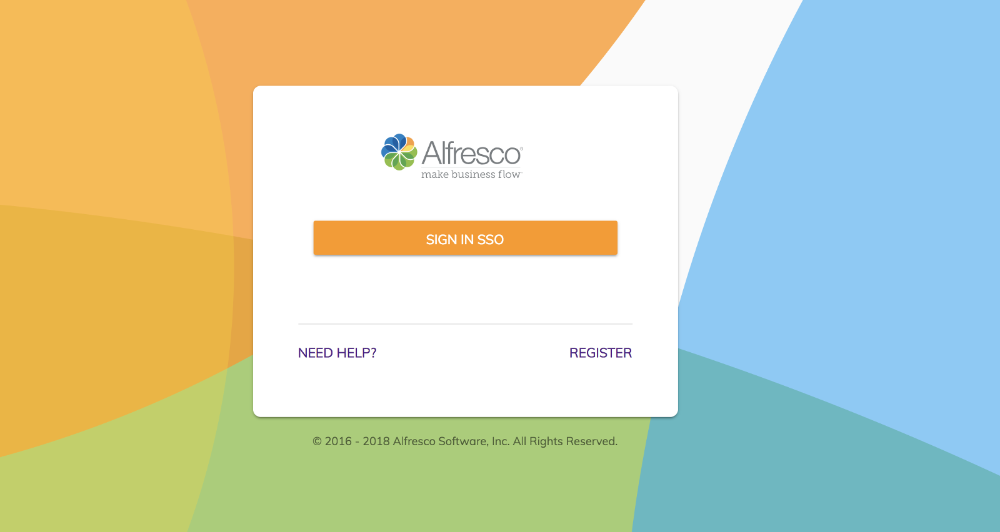

### SSO Implicit Flow with Keycloak Login page

You can configure the app.config.json file to redirect the user to the Keycloak login page to fetch the JWT token if you need this functionality.

As you can see from the configuration we are pointing to an Alfresco Process Services _(powered by Activiti)_ [_1.9.0_ ](https://www.alfresco.com/platform/process-services-bpm/trial/download) instance with Keycloak enabled ([http://myactivitikeycloak.com](https://community.alfresco.com/myactivitikeycloak.com)). 
AuthType is **OAuth**, which means that the JS API will add the JWT token as part of the header when an API call is performed. In addition, we provide all the necessary configuration for the Keycloak,
**host, clientId, scope and redirectUri**.

When the app is bootstrapped, the user is redirected to the Keycloak login if they are not logged in. 
As a prerequisite, the user must be known to Keycloak and Activiti.
Once the Keycloak login is performed the user is redirected back to the app based on the **redirectUri** that has been specified. From now on every time we do a call a JWT token is added to the header.

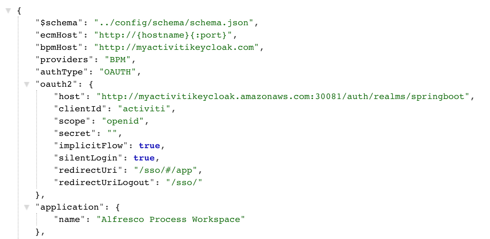

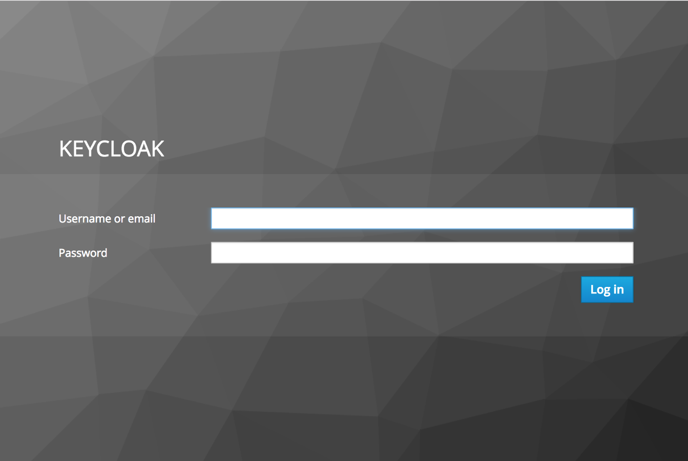

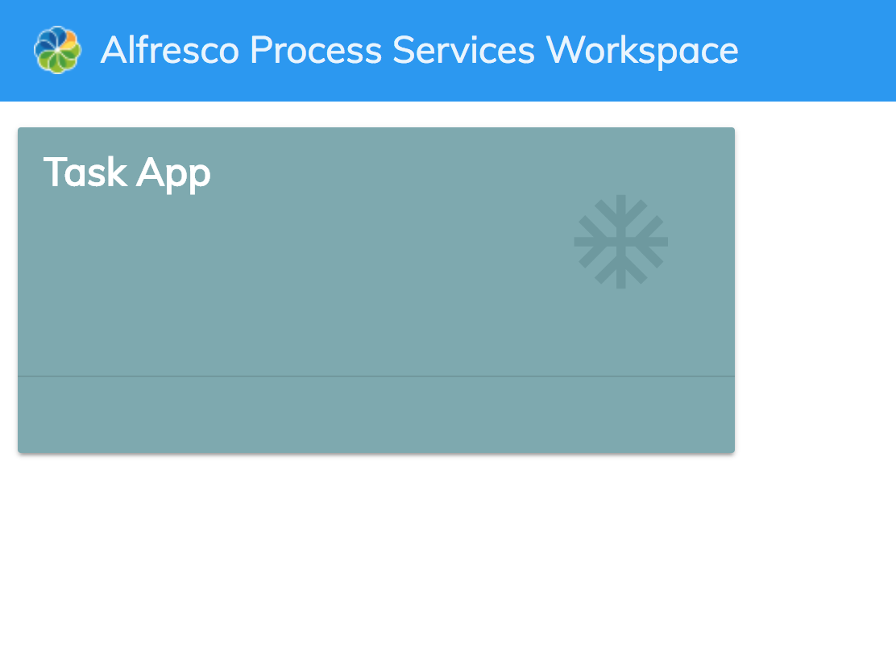

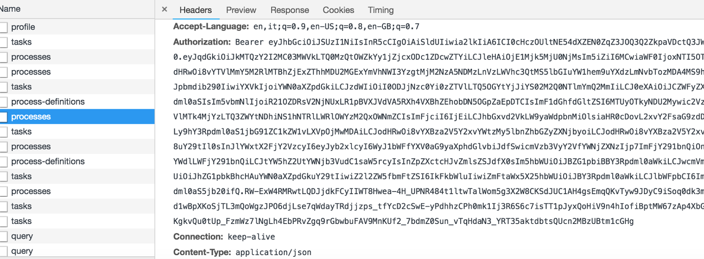

### File versioning enhancement

With ADF 2.4.0, you can now upload minor or major versions of a file. We have also removed the restriction where you were limited to uploading only same file types as new versions.
For more information about this component please refer to [the official documentation.](../content-services/components/version-manager.component.md)

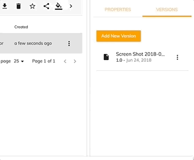

### Empty Page Component

We have created a general-purpose Empty Page Component to allow you to have a consistent empty state for your tables.
This component needs just 3 inputs: icon, title, and subtitle.
You can also transclude external content into the component's body.
For more information about this component please refer to [the official documentation.](../core/components/empty-content.component.md) 

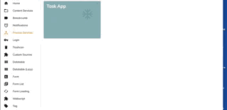

### TaskList Empty Page

In the version 2.4, the TaskList uses the empty state component if there are no available tasks.
You can still override it from the parent component using `<ng-template>`.

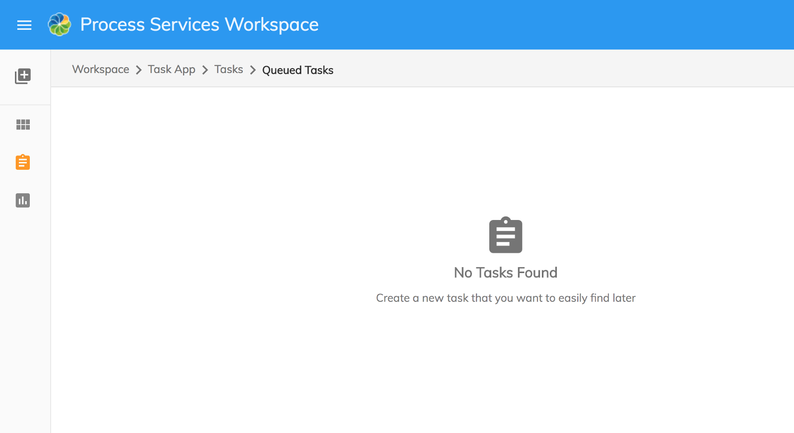

### ProcessList Empty Page

In the version 2.4, the [`ProcessList`](../../lib/process-services/src/lib/mock/process/process.model.mock.ts) uses the empty state component if there are no available processes.  
You can still override it from the parent component using `<ng-template>`.

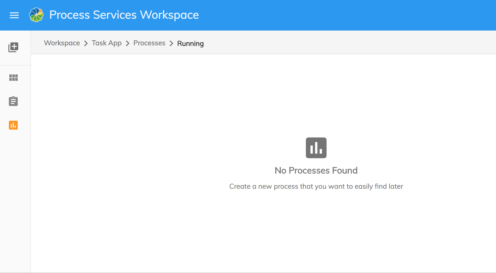

### Error Page Component

We have created an error page component that will show buttons and messages relevant to the error that occurred (404, 403, etc...)
For more information about this component please refer to [the official documentation.](../core/components/error-content.component.md) 

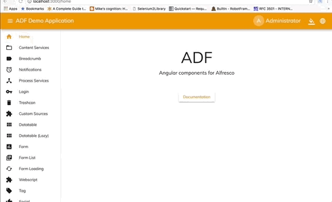

### Search Improvements

In this release we have provided a great number of Search enhancements.

-   Simplified configuration settings
-   Stability improvements
-   Configuration schema for "app.config.json" updates that provide you with validation and code completion
-   Server-side sorting with full customization support
-   Support for custom widgets in the Search Filter
-   Multi-select facet, Date range facet, Number range facet,  Slider range facet
    A full list of details and examples is available in the [Search filter component documentation.](../content-services/components/search-filter.component.md)

### App Config Pipe

In 2.4.0 we provide a special Angular Pipe to deal with application configuration without coding overhead. You can now extract a value from the configuration directly into the component property or content:

    <adf-login
        copyrightText="{{ 'application.copyright' | adfAppConfig }}">
    </adf-login>

Developers can also provide fallback values and chain the pipe with other pipes, such as Translate.

You can find details and examples on the [App config pipe page.](../core/pipes/app-config.pipe.md)

### Intercepting and Resuming Upload

You can now intercept a file or folder upload to perform additional actions. With the current release you can:

-   pause the upload process and get access to the array of file models prepared for upload
-   show dialogs (confirmation or custom)
-   perform extra steps (making other API calls, updating nodes, etc)
-   resume the upload when needed

Note that this feature applies to all methods of uploading (drag and drop, buttons, etc).

You can find more details and examples of how to set up the confirmation dialog on the [Upload drag area page.](../content-services/components/upload-drag-area.component.md#intercepting-uploads)

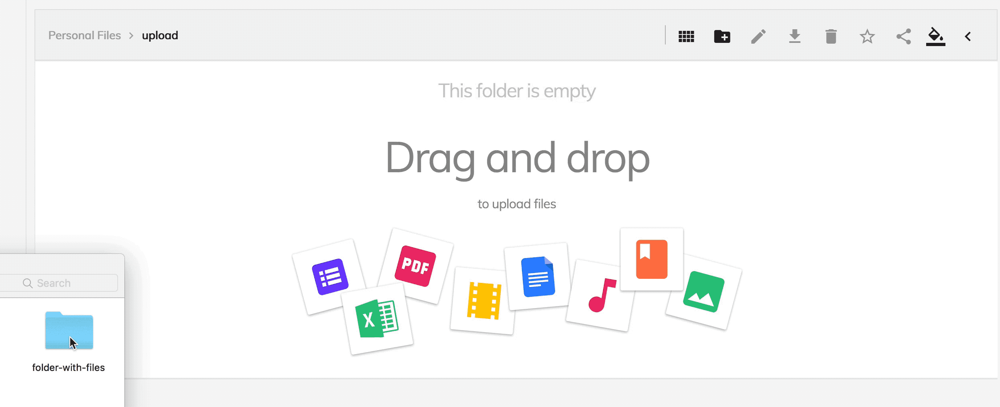

### Conditional Visibility for Data Columns

You can now toggle Data Column visibility based on a static value or expression.

    <data-column
        *nfIg="showNameColumn"
        key="name"
        title="MY.RESOURCE.KEY">
    </data-column>

Find more details and examples on the [Document list component page.](../content-services/components/document-list.component.md#conditional-visibility)

### Conditional States for Content Actions

You can now control the visibility and disabled state of the Content Actions.
Specifically, you can:

-   Set static values
-   Bind to functions that take the corresponding node and evaluate the state

More details are available on the [Content action component page.](../content-services/components/content-action.component.md#conditional-visibility)

### Responsive Button Menu

We have added a new component which allows you add a custom list of buttons. The list will automatically collapse into a burger menu choice for small screens so the menu button will always fit inside your page.
See the [Buttons menu component page](../core/components/buttons-menu.component.md) for more information.

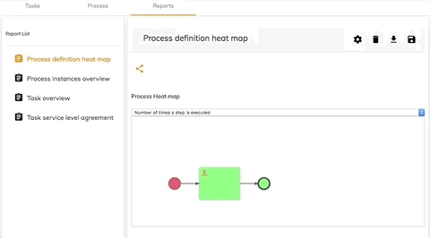

## Localization

This release includes: French, German, Italian, Spanish, Japanese, Dutch, Norwegian (BokmÅl), Russian, Brazilian Portuguese and Simplified Chinese versions.

## References

Below you can find a brief list of references to help you start using the new release.

-   [Official GitHub Project - alfresco-ng2-components](https://github.com/Alfresco/alfresco-ng2-components)
-   [Getting started guides with Alfresco Application Development Framework](https://community.alfresco.com/community/application-development-framework/pages/get-started)
-   Component catalog
-   [Gitter chat supporting Alfresco ADF](https://gitter.im/Alfresco/alfresco-ng2-components)
-   [ADF examples](https://github.com/Alfresco/adf-examples)
-   [List of all components](https://github.com/Alfresco/alfresco-ng2-components/tree/master/ng2-components)
-   [Alfresco-JS-API](https://github.com/Alfresco/alfresco-js-api)
-   [ADF App Generator ](https://github.com/Alfresco/generator-ng2-alfresco-app)

Please refer to the [official documentation](http://docs.alfresco.com/) for further details and suggestions.

## Issues addressed

Release Notes - Apps Development Framework - Version 2.4.0

### Documentation

-   \[[ADF-1848](https://issues.alfresco.com/jira/browse/ADF-1848)] - Article on how to use the ADF logService to feed web analytics systems
-   \[[ADF-2437](https://issues.alfresco.com/jira/browse/ADF-2437)] - Provide instructions on Tomcat deployment
-   \[[ADF-2525](https://issues.alfresco.com/jira/browse/ADF-2525)] - Documentation for the Faceted Search
-   \[[ADF-2643](https://issues.alfresco.com/jira/browse/ADF-2643)] - Update CS and PS supported documentation
-   \[[ADF-2688](https://issues.alfresco.com/jira/browse/ADF-2688)] - [Content Node Selector component](../content-services/components/content-node-selector.component.md) properties documentation
-   \[[ADF-2789](https://issues.alfresco.com/jira/browse/ADF-2789)] - alfresco-js-api downlaodapi
-   \[[ADF-2847](https://issues.alfresco.com/jira/browse/ADF-2847)] - Update all doc file structures to match script requirements
-   \[[ADF-2969](https://issues.alfresco.com/jira/browse/ADF-2969)] - Move doc tools into the new tools folder
-   \[[ADF-2989](https://issues.alfresco.com/jira/browse/ADF-2989)] - Pre-populating Start Process [`Form`](../../lib/process-services/src/lib/task-list/models/form.model.ts) with multiple files from ACS doesn't work
-   \[[ADF-3049](https://issues.alfresco.com/jira/browse/ADF-3049)] - Release Note 2.4.0
-   \[[ADF-3087](https://issues.alfresco.com/jira/browse/ADF-3087)] - Better explanation of replacing i18n keys in the user guide
-   \[[ADF-3142](https://issues.alfresco.com/jira/browse/ADF-3142)] - [Login component](../core/components/login.component.md) should explain what "remember me" is for
-   \[[ADF-3150](https://issues.alfresco.com/jira/browse/ADF-3150)] - Doc tool configuration settings should all be in one place

### Feature

-   \[[ADF-2303](https://issues.alfresco.com/jira/browse/ADF-2303)] - Conditional visibility for data columns
-   \[[ADF-2503](https://issues.alfresco.com/jira/browse/ADF-2503)] - Customize Document List Content Action at a Row level
-   \[[ADF-2556](https://issues.alfresco.com/jira/browse/ADF-2556)] - Search user/groups to add to the permissions component
-   \[[ADF-2560](https://issues.alfresco.com/jira/browse/ADF-2560)] - Create an empty template for file and folders with empty permission list
-   \[[ADF-2581](https://issues.alfresco.com/jira/browse/ADF-2581)] - Add the sidebar in the App Generator
-   \[[ADF-2589](https://issues.alfresco.com/jira/browse/ADF-2589)] - [Document list] Data columns ngIf enabling
-   \[[ADF-2618](https://issues.alfresco.com/jira/browse/ADF-2618)] - ADF UploadVersion component
-   \[[ADF-2626](https://issues.alfresco.com/jira/browse/ADF-2626)] - Sidenav component should preserve its state
-   \[[ADF-2627](https://issues.alfresco.com/jira/browse/ADF-2627)] - Provide icons-only mode for Info Drawer
-   \[[ADF-2649](https://issues.alfresco.com/jira/browse/ADF-2649)] - Read only option for adf-version-manager component
-   \[[ADF-2650](https://issues.alfresco.com/jira/browse/ADF-2650)] - Responsive buttons component
-   \[[ADF-2753](https://issues.alfresco.com/jira/browse/ADF-2753)] - Error pages component
-   \[[ADF-2795](https://issues.alfresco.com/jira/browse/ADF-2795)] - OpenID Connect Implicit Flow support
-   \[[ADF-2852](https://issues.alfresco.com/jira/browse/ADF-2852)] - Create an [about component](../core/components/about.component.md)
-   \[[ADF-2930](https://issues.alfresco.com/jira/browse/ADF-2930)] - Introduce general purpose "Empty Page" component
-   \[[ADF-2961](https://issues.alfresco.com/jira/browse/ADF-2961)] - Application config - Hard-coded protocols for ecmHost and bpmHost
-   \[[ADF-2973](https://issues.alfresco.com/jira/browse/ADF-2973)] - Angular pipe to get application configuration settings
-   \[[ADF-2975](https://issues.alfresco.com/jira/browse/ADF-2975)] - New "nodeType" input for [Upload Button Component](../content-services/components/upload-button.component.md)
-   \[[ADF-2984](https://issues.alfresco.com/jira/browse/ADF-2984)] - Show date invalid message on search date range picker
-   \[[ADF-3028](https://issues.alfresco.com/jira/browse/ADF-3028)] - [Page Title Service](../core/services/page-title.service.md) should support i18n
-   \[[ADF-3041](https://issues.alfresco.com/jira/browse/ADF-3041)] - TaskList Component - Empty State issue.
-   \[[ADF-3066](https://issues.alfresco.com/jira/browse/ADF-3066)] - [`ProcessList`](../../lib/process-services/src/lib/mock/process/process.model.mock.ts) Component - Empty State issue.
-   \[[ADF-3095](https://issues.alfresco.com/jira/browse/ADF-3095)] - Upload and DragArea component events to intercept uploads
-   \[[ADF-3118](https://issues.alfresco.com/jira/browse/ADF-3118)] - [Notification Service](../core/services/notification.service.md) should support i18n resource keys

### Story

-   \[[ADF-1852](https://issues.alfresco.com/jira/browse/ADF-1852)] - Multi-select facet basic (P1)
-   \[[ADF-1987](https://issues.alfresco.com/jira/browse/ADF-1987)] - Date range facet (P1)
-   \[[ADF-1988](https://issues.alfresco.com/jira/browse/ADF-1988)] - Number range facet (P2)
-   \[[ADF-2128](https://issues.alfresco.com/jira/browse/ADF-2128)] - Facet Container (P1)
-   \[[ADF-2189](https://issues.alfresco.com/jira/browse/ADF-2189)] - Slider range facet (P1)
-   \[[ADF-2327](https://issues.alfresco.com/jira/browse/ADF-2327)] - Multi-select facet config (P1)
-   \[[ADF-2328](https://issues.alfresco.com/jira/browse/ADF-2328)] - Multi-select facet search (P1)

### Bug

-   \[[ADF-1934](https://issues.alfresco.com/jira/browse/ADF-1934)] - [Mobile] Tap on a content displayed in the Search Dialog is not managed on mobile devices
-   \[[ADF-1997](https://issues.alfresco.com/jira/browse/ADF-1997)] - Custom stencils being registered twice causes errors
-   \[[ADF-2044](https://issues.alfresco.com/jira/browse/ADF-2044)] - Login footer switch is not properly displayed when changing language.
-   \[[ADF-2238](https://issues.alfresco.com/jira/browse/ADF-2238)] - 'Created by' changes when adding an assignee in a task
-   \[[ADF-2319](https://issues.alfresco.com/jira/browse/ADF-2319)] - Cancel button is displayed for a completed checklist
-   \[[ADF-2323](https://issues.alfresco.com/jira/browse/ADF-2323)] - [File viewer] Title max length is not 35 characters
-   \[[ADF-2449](https://issues.alfresco.com/jira/browse/ADF-2449)] - VS Code intellisense not working for changes in ADF (demo shell)
-   \[[ADF-2467](https://issues.alfresco.com/jira/browse/ADF-2467)] - [Destination Picker] Breadcrumb is not displayed
-   \[[ADF-2481](https://issues.alfresco.com/jira/browse/ADF-2481)] - Large files fail to upload
-   \[[ADF-2529](https://issues.alfresco.com/jira/browse/ADF-2529)] - Unselect single element doesn't work
-   \[[ADF-2551](https://issues.alfresco.com/jira/browse/ADF-2551)] - Content actions not correctly disabled
-   \[[ADF-2582](https://issues.alfresco.com/jira/browse/ADF-2582)] - [Manage version] Image preview shows old version even if the image gets changed
-   \[[ADF-2593](https://issues.alfresco.com/jira/browse/ADF-2593)] - [Demo Shell] App list Icon is overlapping the search
-   \[[ADF-2595](https://issues.alfresco.com/jira/browse/ADF-2595)] - [`Pagination`](../../lib/content-services/document-list/models/document-library.model.ts) settings not supported
-   \[[ADF-2601](https://issues.alfresco.com/jira/browse/ADF-2601)] - Can edit file properties as consumer user on moderated site
-   \[[ADF-2603](https://issues.alfresco.com/jira/browse/ADF-2603)] - getVersionContent type definition missing parameters
-   \[[ADF-2608](https://issues.alfresco.com/jira/browse/ADF-2608)] - [Demo Shell]The table from content services is loaded twice when navigating to a folder
-   \[[ADF-2621](https://issues.alfresco.com/jira/browse/ADF-2621)] - Document List - When enabling infinite scrolling after page 1, we can't load previous files
-   \[[ADF-2672](https://issues.alfresco.com/jira/browse/ADF-2672)] - Version Manager does not disable actions based on permissions
-   \[[ADF-2677](https://issues.alfresco.com/jira/browse/ADF-2677)] - [Process] Can't attach large files
-   \[[ADF-2678](https://issues.alfresco.com/jira/browse/ADF-2678)] - [Tasks] Can't attach large files
-   \[[ADF-2685](https://issues.alfresco.com/jira/browse/ADF-2685)] - [Demo shell] The Gallery view is changed after navigating to another folder
-   \[[ADF-2692](https://issues.alfresco.com/jira/browse/ADF-2692)] - Process Filters doesn't update immediately after completing the last task of the process.
-   \[[ADF-2699](https://issues.alfresco.com/jira/browse/ADF-2699)] - dataTimeAgo Pipe is not localized
-   \[[ADF-2702](https://issues.alfresco.com/jira/browse/ADF-2702)] - Try to open an  type with the viewer returns an error
-   \[[ADF-2703](https://issues.alfresco.com/jira/browse/ADF-2703)] - Info Drawer - Header does not navigate to name of default tab
-   \[[ADF-2710](https://issues.alfresco.com/jira/browse/ADF-2710)] - Share toggle gets enabled when clicking on Share icon
-   \[[ADF-2717](https://issues.alfresco.com/jira/browse/ADF-2717)] - [Lock file] Long file name overflow
-   \[[ADF-2726](https://issues.alfresco.com/jira/browse/ADF-2726)] - Not able to view a file from the attach file widget.
-   \[[ADF-2739](https://issues.alfresco.com/jira/browse/ADF-2739)] - Breadcrumb issue if the folder name is too big.
-   \[[ADF-2760](https://issues.alfresco.com/jira/browse/ADF-2760)] - Background colour for document lists is not white
-   \[[ADF-2766](https://issues.alfresco.com/jira/browse/ADF-2766)] - Download [`Node`](https://github.com/Alfresco/alfresco-js-api/blob/develop/src/api/content-rest-api/docs/Node.md) Directive does not work with Shared Links
-   \[[ADF-2767](https://issues.alfresco.com/jira/browse/ADF-2767)] - Side nav is not responsive
-   \[[ADF-2771](https://issues.alfresco.com/jira/browse/ADF-2771)] - [Sidebar action menu component](../core/components/sidebar-action-menu.component.md) - UX review
-   \[[ADF-2772](https://issues.alfresco.com/jira/browse/ADF-2772)] - Sidenav Layout - UX review
-   \[[ADF-2786](https://issues.alfresco.com/jira/browse/ADF-2786)] - Search Filter: AOT build error
-   \[[ADF-2792](https://issues.alfresco.com/jira/browse/ADF-2792)] - [`Pagination`](../../lib/content-services/document-list/models/document-library.model.ts) - does not return to previous page when current is empty
-   \[[ADF-2813](https://issues.alfresco.com/jira/browse/ADF-2813)] - [Demo-Shell]Files are not properly sorted when navigating to content services page if the items per page is set to default value
-   \[[ADF-2826](https://issues.alfresco.com/jira/browse/ADF-2826)] - An error should be shown when user re-add same user/group with same permissions
-   \[[ADF-2832](https://issues.alfresco.com/jira/browse/ADF-2832)] - Task filter accordion header height changes
-   \[[ADF-2843](https://issues.alfresco.com/jira/browse/ADF-2843)] - Create folder and edit folder icons from Content Services page don't have tooltip
-   \[[ADF-2844](https://issues.alfresco.com/jira/browse/ADF-2844)] - The styling of Properties in metadata is not as in the design
-   \[[ADF-2845](https://issues.alfresco.com/jira/browse/ADF-2845)] - The People image logo is not visible in people list
-   \[[ADF-2857](https://issues.alfresco.com/jira/browse/ADF-2857)] - Issue with DateWidget error message- dateformat needs to be displayed as per the format set in APS
-   \[[ADF-2859](https://issues.alfresco.com/jira/browse/ADF-2859)] - content-actions do not get disabled in context-menu-holder
-   \[[ADF-2884](https://issues.alfresco.com/jira/browse/ADF-2884)] - Task List - Custom apps display all tasks
-   \[[ADF-2885](https://issues.alfresco.com/jira/browse/ADF-2885)] - Missing typings for Search API
-   \[[ADF-2891](https://issues.alfresco.com/jira/browse/ADF-2891)] - [`Pagination`](../../lib/content-services/document-list/models/document-library.model.ts) gets set to 5 on search results page when searching twice with same input
-   \[[ADF-2892](https://issues.alfresco.com/jira/browse/ADF-2892)] - [Mobile] Can't hide Sidebar
-   \[[ADF-2900](https://issues.alfresco.com/jira/browse/ADF-2900)] - Metadata card is not scrolling when embedded into full page viewer
-   \[[ADF-2901](https://issues.alfresco.com/jira/browse/ADF-2901)] - Breadcrumb colors do not match design
-   \[[ADF-2904](https://issues.alfresco.com/jira/browse/ADF-2904)] - Redirect on search breaks
-   \[[ADF-2928](https://issues.alfresco.com/jira/browse/ADF-2928)] - [Search component] Translation of search facets
-   \[[ADF-2964](https://issues.alfresco.com/jira/browse/ADF-2964)] - Auth Guard - error when state is not an active route
-   \[[ADF-2965](https://issues.alfresco.com/jira/browse/ADF-2965)] - CLONE - On AcaDev the collapsed side nav can't be closed when user clicks the document list
-   \[[ADF-2967](https://issues.alfresco.com/jira/browse/ADF-2967)] - [Demo shell] Not able to create a new task on Task App first time
-   \[[ADF-2971](https://issues.alfresco.com/jira/browse/ADF-2971)] - Mandatory search config
-   \[[ADF-2976](https://issues.alfresco.com/jira/browse/ADF-2976)] - Sidenav mobile/desktop change is not emitting event
-   \[[ADF-2977](https://issues.alfresco.com/jira/browse/ADF-2977)] - Items are not translated anymore into selected language after refreshing the page
-   \[[ADF-2978](https://issues.alfresco.com/jira/browse/ADF-2978)] - Can't add user/group to permissions
-   \[[ADF-2985](https://issues.alfresco.com/jira/browse/ADF-2985)] - ADF Login - executeSubmit should not emit the password
-   \[[ADF-2986](https://issues.alfresco.com/jira/browse/ADF-2986)] - User Preferences pagination size.
-   \[[ADF-2992](https://issues.alfresco.com/jira/browse/ADF-2992)] - Create Process dropdown menu doesn't respect UX specifications
-   \[[ADF-2995](https://issues.alfresco.com/jira/browse/ADF-2995)] - CLONE - User should be able to upload a new version for his file on a private site with Consumer permissions
-   \[[ADF-2999](https://issues.alfresco.com/jira/browse/ADF-2999)] - [Form component][form](../../lib/process-services/task-list/models/form.model.ts) validation icon is not displayed when showValidationIcon option is enabled
-   \[[ADF-3043](https://issues.alfresco.com/jira/browse/ADF-3043)] - [Destination Picker]The breadcrumb is not aligned
-   \[[ADF-3044](https://issues.alfresco.com/jira/browse/ADF-3044)] - It is not possible to use breadcrumb outside the toolbar demo
-   \[[ADF-3045](https://issues.alfresco.com/jira/browse/ADF-3045)] - Breadcrumb icons are not always the same
-   \[[ADF-3047](https://issues.alfresco.com/jira/browse/ADF-3047)] - First time changing task filter reloads the page
-   \[[ADF-3048](https://issues.alfresco.com/jira/browse/ADF-3048)] - [Mobile] The Login Page is not responsive
-   \[[ADF-3052](https://issues.alfresco.com/jira/browse/ADF-3052)] - Typo in 'success' translation key
-   \[[ADF-3053](https://issues.alfresco.com/jira/browse/ADF-3053)] - Breadcrumb in ACA broken
-   \[[ADF-3056](https://issues.alfresco.com/jira/browse/ADF-3056)] - Show more/less buttons are not consistent
-   \[[ADF-3082](https://issues.alfresco.com/jira/browse/ADF-3082)] - Custom Task filters don't work
-   \[[ADF-3083](https://issues.alfresco.com/jira/browse/ADF-3083)] - The breadcrumb is not translated when user is selecting a preferred language
-   \[[ADF-3096](https://issues.alfresco.com/jira/browse/ADF-3096)] - BreadCrumb and Toolbar are not respecting design
-   \[[ADF-3102](https://issues.alfresco.com/jira/browse/ADF-3102)] - [Demo Shell] Process filter accordion wrong arrow displayed
-   \[[ADF-3108](https://issues.alfresco.com/jira/browse/ADF-3108)] - Facet Queries panel renders when not defined in configuration
-   \[[ADF-3111](https://issues.alfresco.com/jira/browse/ADF-3111)] - [Demo shell] Not able to see the pagination on processes on webdriver
-   \[[ADF-3112](https://issues.alfresco.com/jira/browse/ADF-3112)] - Toolbar content is aligned to the left.
-   \[[ADF-3115](https://issues.alfresco.com/jira/browse/ADF-3115)] - Search Input missing aria-label
-   \[[ADF-3116](https://issues.alfresco.com/jira/browse/ADF-3116)] - Viewer title is not in the center
-   \[[ADF-3120](https://issues.alfresco.com/jira/browse/ADF-3120)] - Sorting by Name is not working on process list and task list.
-   \[[ADF-3122](https://issues.alfresco.com/jira/browse/ADF-3122)] - Can't select any task/process
-   \[[ADF-3123](https://issues.alfresco.com/jira/browse/ADF-3123)] - APS form radio buttons are rendered with the first option selected automatically
-   \[[ADF-3127](https://issues.alfresco.com/jira/browse/ADF-3127)] - the task list is not correctly updated after creating a new task assigned to someone else
-   \[[ADF-3134](https://issues.alfresco.com/jira/browse/ADF-3134)] - Increasing search calls - possible unsubscribing issue
-   \[[ADF-3144](https://issues.alfresco.com/jira/browse/ADF-3144)] - Error component is displayed when closing the viewer for a file in the attachment list.
-   \[[ADF-3156](https://issues.alfresco.com/jira/browse/ADF-3156)] - App.config default configuration providers ALL (ECM and BPM)
-   \[[ADF-3161](https://issues.alfresco.com/jira/browse/ADF-3161)] - Setting Component - The ECM button is always disabled
-   \[[ADF-3162](https://issues.alfresco.com/jira/browse/ADF-3162)] - Setting component - Show only the providers passed as input
-   \[[ADF-3163](https://issues.alfresco.com/jira/browse/ADF-3163)] - For a file/folder the action buttons are not working
-   \[[ADF-3173](https://issues.alfresco.com/jira/browse/ADF-3173)] - [Task List] - Empty list message is not translated
-   \[[ADF-3174](https://issues.alfresco.com/jira/browse/ADF-3174)] - Content actions dropdown is not properly displayed
-   \[[ADF-3175](https://issues.alfresco.com/jira/browse/ADF-3175)] - Files can't be dragged to a subfolder when allowDropFiles property is set to "true"
-   \[[ADF-3176](https://issues.alfresco.com/jira/browse/ADF-3176)] - When editing a metadata property of a pdf file in the viewer the content of the file is not displayed
-   \[[ADF-3179](https://issues.alfresco.com/jira/browse/ADF-3179)] - The password dialog input is not displayed when a password protected pdf file is opened in the viewer
-   \[[ADF-3181](https://issues.alfresco.com/jira/browse/ADF-3181)] - URL with a file opened in the viewer is not opening in the viewer when you log in in the account
-   \[[ADF-3185](https://issues.alfresco.com/jira/browse/ADF-3185)] - The drop-down toolbar is not displaying the options in the viewer
-   \[[ADF-3187](https://issues.alfresco.com/jira/browse/ADF-3187)] - [Task list] - the task is displayed twice when double click on it
-   \[[ADF-3190](https://issues.alfresco.com/jira/browse/ADF-3190)] - When editing a value of a property the aspect gets collapsed
-   \[[ADF-3191](https://issues.alfresco.com/jira/browse/ADF-3191)] - Not able to login only to BPM or ECM
-   \[[ADF-3195](https://issues.alfresco.com/jira/browse/ADF-3195)] - SettingComponent SSO Config - The fields are not prefilled
-   \[[ADF-3196](https://issues.alfresco.com/jira/browse/ADF-3196)] - [Task list / Process list] - The 'Task details' are not displayed for the selected Task
-   \[[ADF-3200](https://issues.alfresco.com/jira/browse/ADF-3200)] - Custom Extension filter - file with different extension is uploaded with drag and drop
-   \[[ADF-3208](https://issues.alfresco.com/jira/browse/ADF-3208)] - Aspect title not translated
-   \[[ADF-3209](https://issues.alfresco.com/jira/browse/ADF-3209)] - [Task list] Error 401 - unauthorised when login with a user linked to a tenant
-   \[[ADF-3210](https://issues.alfresco.com/jira/browse/ADF-3210)] - Assignee window not displayed properly when changing task's assignee
-   \[[ADF-3212](https://issues.alfresco.com/jira/browse/ADF-3212)] - Uploading new version in the file preview doesn't work at all
-   \[[ADF-3217](https://issues.alfresco.com/jira/browse/ADF-3217)] - Search settings are not reset
-   \[[ADF-3219](https://issues.alfresco.com/jira/browse/ADF-3219)] - SettingComponent - AuthType should return BASIC as default
-   \[[ADF-3222](https://issues.alfresco.com/jira/browse/ADF-3222)] - User is not redirected to login page after selecting BPM from settings page
-   \[[ADF-3223](https://issues.alfresco.com/jira/browse/ADF-3223)] - Error message is not displayed when the original location no longer exists
-   \[[ADF-3224](https://issues.alfresco.com/jira/browse/ADF-3224)] - Authentication Guard (ACS) does not redirect to Login on page reload
-   \[[ADF-3225](https://issues.alfresco.com/jira/browse/ADF-3225)] - Download version button is still displayed after the modification in code
-   \[[ADF-3226](https://issues.alfresco.com/jira/browse/ADF-3226)] - Version comments are still displayed after the code modification
-   \[[ADF-3229](https://issues.alfresco.com/jira/browse/ADF-3229)] - People widget's result box shouldn't be displayed when deleting the search
-   \[[ADF-3232](https://issues.alfresco.com/jira/browse/ADF-3232)] - [Document list] - "Cannot read property 'toLowerCase' of undefined" error loaded in console when go to Content services
-   \[[ADF-3235](https://issues.alfresco.com/jira/browse/ADF-3235)] - Items per page displays wrong number on search results for 'folder'
-   \[[ADF-3242](https://issues.alfresco.com/jira/browse/ADF-3242)] - No message is displayed in the message bus

### Task

-   \[[ADF-2510](https://issues.alfresco.com/jira/browse/ADF-2510)] - Create automated test for default filters when creating a process
-   \[[ADF-2520](https://issues.alfresco.com/jira/browse/ADF-2520)] - Creat automated tests for Upload file - TaskList
-   \[[ADF-2568](https://issues.alfresco.com/jira/browse/ADF-2568)] - Create app.config schema for faceted search
-   \[[ADF-2646](https://issues.alfresco.com/jira/browse/ADF-2646)] - [Alfresco-js-api] Demo shell e2e test piepeline
-   \[[ADF-2709](https://issues.alfresco.com/jira/browse/ADF-2709)] - Replace the ADF accordion with material accordion
-   \[[ADF-2756](https://issues.alfresco.com/jira/browse/ADF-2756)] - Add lock files
-   \[[ADF-2797](https://issues.alfresco.com/jira/browse/ADF-2797)] - [Automated test] datatable - pagination, 5 Items per page
-   \[[ADF-2798](https://issues.alfresco.com/jira/browse/ADF-2798)] - [Automated test] datatable - pagination, 10 Items per page
-   \[[ADF-2800](https://issues.alfresco.com/jira/browse/ADF-2800)] - [Automated test] datatable - pagination, 15 Items per page
-   \[[ADF-2801](https://issues.alfresco.com/jira/browse/ADF-2801)] - [Automated test] datatable - pagination, default pagination
-   \[[ADF-2821](https://issues.alfresco.com/jira/browse/ADF-2821)] - Sidebar action button move Module
-   \[[ADF-2833](https://issues.alfresco.com/jira/browse/ADF-2833)] - Create automated test [`Pagination`](../../lib/content-services/document-list/models/document-library.model.ts) when the content is sorted
-   \[[ADF-2834](https://issues.alfresco.com/jira/browse/ADF-2834)] - Create automated test Items per page when having 25 files
-   \[[ADF-2835](https://issues.alfresco.com/jira/browse/ADF-2835)] - Create automated test for [`Pagination`](../../lib/content-services/document-list/models/document-library.model.ts) in an empty folder
-   \[[ADF-2836](https://issues.alfresco.com/jira/browse/ADF-2836)] - Create automated test for Trashcan - Supported page size
-   \[[ADF-2837](https://issues.alfresco.com/jira/browse/ADF-2837)] - Create automated test for [`Pagination`](../../lib/content-services/document-list/models/document-library.model.ts) - returns to previous page when current is empty
-   \[[ADF-2860](https://issues.alfresco.com/jira/browse/ADF-2860)] - Create automated test for [`Pagination`](../../lib/content-services/document-list/models/document-library.model.ts) at first 20 started tasks (tasklist)
-   \[[ADF-2861](https://issues.alfresco.com/jira/browse/ADF-2861)] - Create automated test for Items per page set to 15 (tasklist)
-   \[[ADF-2862](https://issues.alfresco.com/jira/browse/ADF-2862)] - Create automated test for Items per page set to 10 (tasklist)
-   \[[ADF-2863](https://issues.alfresco.com/jira/browse/ADF-2863)] - Create automated test for Items per page set to 5 (tasklist)
-   \[[ADF-2864](https://issues.alfresco.com/jira/browse/ADF-2864)] - Create automated test for Items per page set to 15 and adding of tasks (tasklist)
-   \[[ADF-2865](https://issues.alfresco.com/jira/browse/ADF-2865)] - Create automated test for Items per page set to 20 (tasklist)
-   \[[ADF-2866](https://issues.alfresco.com/jira/browse/ADF-2866)] - Create automated test for sorting by name (tasklist)
-   \[[ADF-2867](https://issues.alfresco.com/jira/browse/ADF-2867)] - Create automated test for page number dropdown (tasklist)
-   \[[ADF-2868](https://issues.alfresco.com/jira/browse/ADF-2868)] - Create automated test for [`Pagination`](../../lib/content-services/document-list/models/document-library.model.ts) at first 20 started processes (processlist)
-   \[[ADF-2869](https://issues.alfresco.com/jira/browse/ADF-2869)] - Create automated test for Items per page set to 15 (processlist)
-   \[[ADF-2870](https://issues.alfresco.com/jira/browse/ADF-2870)] - Create automated test for Items per page set to 10 (processlist)
-   \[[ADF-2871](https://issues.alfresco.com/jira/browse/ADF-2871)] - Create automated test for Items per page set to 5 (processlist)
-   \[[ADF-2872](https://issues.alfresco.com/jira/browse/ADF-2872)] - Create automated test for Items per page set to 15 and adding of processes (tasklist)
-   \[[ADF-2873](https://issues.alfresco.com/jira/browse/ADF-2873)] - Create automated test for Items per page set to 20 (processlist)
-   \[[ADF-2874](https://issues.alfresco.com/jira/browse/ADF-2874)] - Create automated test for sorting by name (processlist)
-   \[[ADF-2875](https://issues.alfresco.com/jira/browse/ADF-2875)] - Create automated test for page number dropdown (processlist)
-   \[[ADF-2906](https://issues.alfresco.com/jira/browse/ADF-2906)] - Add the style form zeplin in the adf-empty-list component
-   \[[ADF-2912](https://issues.alfresco.com/jira/browse/ADF-2912)] - Group EVERYONE should always be showed for search on add permission results
-   \[[ADF-2913](https://issues.alfresco.com/jira/browse/ADF-2913)] - Search Filter does not preserve original query
-   \[[ADF-2988](https://issues.alfresco.com/jira/browse/ADF-2988)] - Replace existing Alfresco Logo on the [login component](../core/components/login.component.md)
-   \[[ADF-3037](https://issues.alfresco.com/jira/browse/ADF-3037)] - [js-api] Add newly introduced isFavorite property to Nodes
-   \[[ADF-3042](https://issues.alfresco.com/jira/browse/ADF-3042)] - Use the custom date adapter from adf-core on Search Date Range widget
-   \[[ADF-3062](https://issues.alfresco.com/jira/browse/ADF-3062)] - [`NodeFavoriteDirective`](../core/directives/node-favorite.directive.md) should support ACS 5x and 6x
-   \[[ADF-3088](https://issues.alfresco.com/jira/browse/ADF-3088)] - Remove sub component folder in the core
-   \[[ADF-3094](https://issues.alfresco.com/jira/browse/ADF-3094)] - Test ADF against ACS6
-   \[[ADF-3114](https://issues.alfresco.com/jira/browse/ADF-3114)] - CardViewItemProperty extra custom data
-   \[[ADF-3153](https://issues.alfresco.com/jira/browse/ADF-3153)] - Provide example for DataTable filtering
-   \[[ADF-3170](https://issues.alfresco.com/jira/browse/ADF-3170)] - Storage JS-API ticket and user

### Feature Bug

-   \[[ADF-2925](https://issues.alfresco.com/jira/browse/ADF-2925)] - The error message for "To" field is not the correct one when the field is not completed by the user

### Feature (Task)

-   \[[ADF-3055](https://issues.alfresco.com/jira/browse/ADF-3055)] - pageSize not working for facetField
-   \[[ADF-3060](https://issues.alfresco.com/jira/browse/ADF-3060)] - Multi-select facet basic (P2)

Please refer to [the Alfresco issue tracker](https://issues.alfresco.com/jira/projects/ADF/issues/ADF-581?filter=allopenissues) for other known issues in this release. If you have any questions about the release,please contact us using [gitter](https://gitter.im/Alfresco/alfresco-ng2-components) . 
