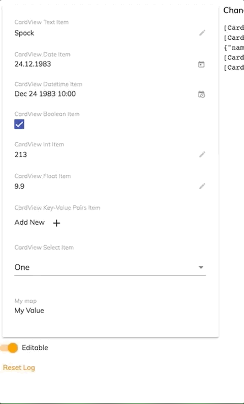
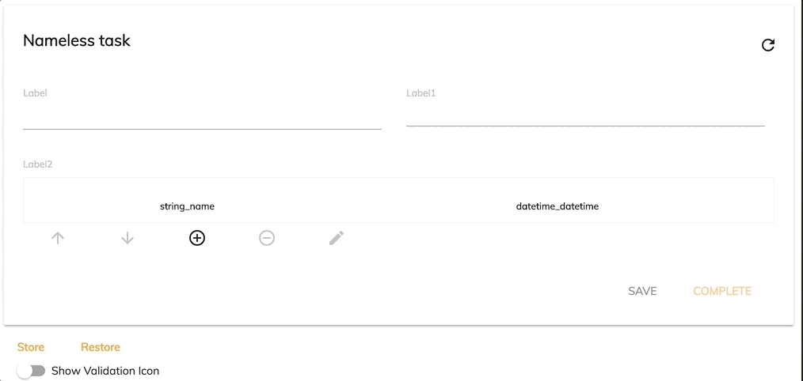
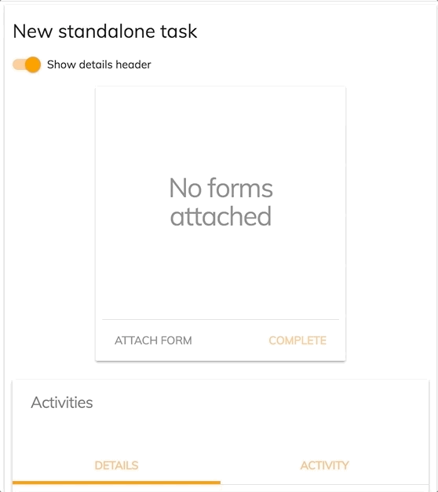
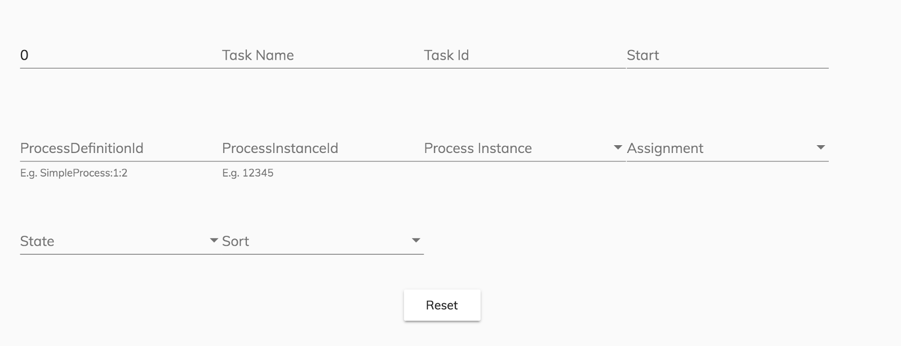

# Alfresco Application Development Framework, version 2.5.0 Release Note

These release notes provide information about the **2.5.0 release**
of the Alfresco Application Development Framework.
This is the latest **General Available**
release of the Application Development Framework, which contains the Angular components to build a Web Application on top of the Alfresco Platform.
The release can be found on GitHub at
[this location.](https://github.com/Alfresco/alfresco-ng2-components/releases/tag/1.7.0)

### New name packages

    "@alfresco/adf-content-services" : "2.5.0"
    "@alfresco/adf-process-services" : "2.5.0"
    "@alfresco/adf-core" : "2.5.0"
    "@alfresco/adf-insights" : "2.5.0"

## Contents

-   [New name packages](#new-name-packages)
-   [Goals for this release](#goals-for-this-release)
-   [Notable new features](#notable-new-features)
    -   [Update Angular 6 and Material 6](#update-angular-6-and-material-6)
    -   [Search Improvements](#search-improvements)
    -   [General Header component](#general-header-component)
    -   [Default metadata properties hide/show](#default-metadata-properties-hideshow)
    -   [Card view new property types rendering](#card-view-new-property-types-rendering)
    -   [NotificationService customizability improvement](#notificationservice-customizability-improvement)
    -   [Dynamic Table - Datetime widget](#dynamic-table---datetime-widget)
    -   [Attach a form to a standalone Task](#attach-a-form-to-a-standalone-task)
    -   [Task list/Process list processDefinitionId filter](#task-listprocess-list-processdefinitionid-filter)
    -   [Lazy loading improvements](#lazy-loading-improvements)
    -   [Localization](#localization)
-   [References](#references)
-   [Issues addressed](#issues-addressed)
    -   [Documentation](#documentation)
    -   [Feature](#feature)
    -   [Epic](#epic)
-   [Story](#story)
    -   [Bug](#bug)
    -   [Task](#task)
    -   [Feature Bug](#feature-bug)
    -   [Feature (Task)](#feature-task)

## Goals for this release

In this release we have focused on updating the version of the Angular and Material libraries from 5 to 6. The team has also spent part of the sprints improving the e2e test coverage.

We truly believe in TDD and the whole library has a unit test coverage of 90%. The e2e coverage is still partly achieved with manual work but this is due to a technical debt that we want to fix. The commitment of the team to increasing the coverage of the automatic e2e tests is an added guarantee of the quality and stability that we want delivery in ADF.

Amongst all this hard work, we also found a little time to add some new functionality and fix bugs.

Please report issues with this release in the 
[issue tracker](https://github.com/Alfresco/alfresco-ng2-components/issues/new).
You can collaborate on this release or share feedback by using the discussion tools on
[Gitter](http://gitter.im/Alfresco/alfresco-ng2-components).

## Notable new features

Below are the most important new features of this release:

-   **Update Angular 6 and Material 6**
-   **Search Improvements**
-   **General Header component**
-   **Card view new property types rendering**
-   **Default metadata properties hide/show property**
-   **[`NotificationService`](../core/services/notification.service.md) expose MatSnackBarConfig**
-   **Dynamic Table - Datetime widget**
-   **Attach a form to a standalone Task**
-   **Task list/Process list processDefinitionId filter**

### Update Angular 6 and Material 6

In this release, we have updated our direct dependency on the Angular and Material libraries from version 5 to 6. In forthcoming releases, this will allow us to use some of the new improvements released in the last major version. The update of our direct dependency is also a good habit that we always follow for security reasons.

### Search Improvements

-   You can now select multiple buckets for the facet result. All buckets from the same facet are combined with logical "OR", so you can select "JPEG" and "PNG" for the "content.mimetype" for example.
-   Facet fields and queries now respect the order of declaration in the application configuration file. When rendering query results, the Search Filter uses the order of declaration.
-   Facet buckets get the numbers automatically updated based on user interaction.

### General Header component

This component is a reusable header for Alfresco applications. It displays a customizable header that can be reused. Use the input properties to configure the left side (title, button) and the primary color of the header. The right side of the header can contain other components which are transcluded in the header component.

    <adf-layout-header
        title="title"
        logo="logo.png"
        [redirectUrl]="'/home'"
        color="primary"
        (toggled)=toggleMenu($event)>
        .......
     </adf-layout-header>

For more information about this component please refer to the 
[official documentation](../core/components/header.component.md).

### Default metadata properties hide/show

In ADF 2.5.0 you can now customize the metadata card with the option of showing or hiding the default properties of the file.

    <adf-content-metadata-card .......
        [displayEmpty]="false">
    </adf-content-metadata-card>

### Card view new property types rendering

Two new property types are now available in the card view:

    new CardViewKeyValuePairsItemModel({
        label: 'CardView Key-Value Pairs Item',
        value: [],
        key: 'key-value-pairs',
        editable: this.isEditable
    }),
    new CardViewSelectItemModel({
        label: 'CardView Select Item',
        value: 'one',
        options$: of([{ key: 'one', label: 'One' }, { key: 'two', label: 'Two' }]),
        key: 'select',
        editable: this.isEditable
    }),

KeyValuePairs is a map key value that is rendered as shown in the image to the left. It uses a nicely-formatted table that allows also for easy editing.ViewSelectItem is a selectBox that allows you to limit the set of possible values for a property.

For more information about this component please refer to the 
[official documentation](../core/components/card-view.component.md).

### NotificationService customizability improvement

The [`NotificationService`](../core/services/notification.service.md) now exposes a new input parameter to allow a full customization of the notification message: 

-   Direction : Text layout direction for the snack bar.
-   Duration : The length of time in milliseconds to wait before automatically dismissing the snack bar.
-   Horizontal Position : The horizontal position to place the snack bar.
-   Vertical Position : The vertical position to place the snack bar.
-   panelClass :  Extra CSS classes to be added to the snack bar container.

For more information about this component please refer to the 
[official documentation](../core/services/notification.service.md).

### Dynamic Table - Datetime widget

You can now render DateTime items in the dynamic table of a form.

### Attach a form to a standalone Task

You can now attach a form to a new task that is not part of a Process using the task-standalone component 

    <adf-task-standalone
        [taskName]= "taskname">
    </adf-task-standalone>

For more information about this component please refer to the 
[official documentation](../process-services/components/task-standalone.component.md). 

### Task list/Process list processDefinitionId filter

A new input parameter processDefinitionId has been added to the Tasklist and the Processlist to allow you to filter the list by processDefinitionId.

### Lazy loading improvements

You can now use ADF libraries with the lazy-loaded feature modules. Every ADF library now supports "forRoot" and "forChild" semantics for the main modules.
For example, you should use ["CoreModule](lib/core/src/lib/core.module.ts).forRoot()" in the main application module, and ["CoreModule](lib/core/src/lib/core.module.ts).forChild()" in the lazy modules.

### Localization

This release includes: French, German, Italian, Spanish, Japanese, Dutch, Norwegian (BokmÅl), Russian, Brazilian Portuguese and Simplified Chinese versions.

## References

Below you can find a brief list of references to help you start using the new release:

[Official GitHub Project - alfresco-ng2-components](https://github.com/Alfresco/alfresco-ng2-components)

[Getting started guides with Alfresco Application Development Framework](https://community.alfresco.com/community/application-development-framework/pages/get-started)

Component catalog

[Gitter chat supporting Alfresco ADF](https://gitter.im/Alfresco/alfresco-ng2-components)

[ADF examples](https://github.com/Alfresco/adf-examples)

[List of all components](https://github.com/Alfresco/alfresco-ng2-components/tree/master/ng2-components)

[Alfresco-JS-API](https://github.com/Alfresco/alfresco-js-api)

[ADF App Generator ](https://github.com/Alfresco/generator-ng2-alfresco-app)

Please refer to the 
[official documentation](http://docs.alfresco.com/)
for further details and suggestions.

## Issues addressed

Release Notes - Apps Development Framework - Version 2.5.0

### Documentation

-   \[
    [ADF-3288](https://issues.alfresco.com/jira/browse/ADF-3288)
    ] - Update version upload documentation

### Feature

-   \[
    [ADF-2494](https://issues.alfresco.com/jira/browse/ADF-2494)
    ] - Task Standalone - Provide a way to attach a form
-   \[
    [ADF-2671](https://issues.alfresco.com/jira/browse/ADF-2671)
    ] - When user doesn't have permissions, a tooltip should be showed
-   \[
    [ADF-2927](https://issues.alfresco.com/jira/browse/ADF-2927)
    ] - Add Clear all button to facet fields and facet queries
-   \[
    [ADF-3103](https://issues.alfresco.com/jira/browse/ADF-3103)
    ] - Task List - Provide a way to filter the list by ProcessDefinitionId
-   \[
    [ADF-3141](https://issues.alfresco.com/jira/browse/ADF-3141)
    ] - ADF-ProcessList Enanchement
-   \[
    [ADF-3149](https://issues.alfresco.com/jira/browse/ADF-3149)
    ] - Create fake Report Issues page for Error Component
-   \[
    [ADF-3193](https://issues.alfresco.com/jira/browse/ADF-3193)
    ] - CardView item key-value pair properties
-   \[
    [ADF-3237](https://issues.alfresco.com/jira/browse/ADF-3237)
    ] - Task Details - Create a way to change and remove a form
-   \[
    [ADF-3267](https://issues.alfresco.com/jira/browse/ADF-3267)
    ] - Dynamic Table - The boolean column should render Yes/No value
-   \[
    [ADF-3268](https://issues.alfresco.com/jira/browse/ADF-3268)
    ] - Dynamic Table - Add the datetime widget
-   \[
    [ADF-3274](https://issues.alfresco.com/jira/browse/ADF-3274)
    ] - Start Task - Use the people widget instead of the people list
-   \[
    [ADF-3275](https://issues.alfresco.com/jira/browse/ADF-3275)
    ] - ADF Card view combobox
-   \[
    [ADF-3284](https://issues.alfresco.com/jira/browse/ADF-3284)
    ] - ProcessFilter - the method ng doesn't check the property filterParam
-   \[
    [ADF-3286](https://issues.alfresco.com/jira/browse/ADF-3286)
    ] - [`NotificationService`](../core/services/notification.service.md) expose MatSnackBarConfig
-   \[
    [ADF-3299](https://issues.alfresco.com/jira/browse/ADF-3299)
    ] - Upgrade Angular
-   \[
    [ADF-3300](https://issues.alfresco.com/jira/browse/ADF-3300)
    ] - Upgrade Angular Material Design
-   \[
    [ADF-3308](https://issues.alfresco.com/jira/browse/ADF-3308)
    ] - [`ProcessList`](../../lib/process-services/src/lib/mock/process/process.model.mock.ts) Component - Provide a way to filter the list by fields
-   \[
    [ADF-3366](https://issues.alfresco.com/jira/browse/ADF-3366)
    ] - Update Site details

### Epic

-   \[
    [ADF-3177](https://issues.alfresco.com/jira/browse/ADF-3177)
    ] - General ADF Header component

## Story

-   \[
    [ADF-2131](https://issues.alfresco.com/jira/browse/ADF-2131)
    ] - Search sorting (P1)
-   \[
    [ADF-2563](https://issues.alfresco.com/jira/browse/ADF-2563)
    ] - Upload new version information options
-   \[
    [ADF-3367](https://issues.alfresco.com/jira/browse/ADF-3367)
    ] - Multi-selection on facets
-   \[
    [ADF-3372](https://issues.alfresco.com/jira/browse/ADF-3372)
    ] - Ability to hide/show "Properties" Content Metadata Card

### Bug

-   \[
    [ADF-2669](https://issues.alfresco.com/jira/browse/ADF-2669)
    ] - Delete version confirmation dialog has wrong 'cancel' color
-   \[
    [ADF-2765](https://issues.alfresco.com/jira/browse/ADF-2765)
    ] - Card view has broken layout in demo shell
-   \[
    [ADF-2769](https://issues.alfresco.com/jira/browse/ADF-2769)
    ] - Search on document picker not working - when having custom dropdown defined.
-   \[
    [ADF-2854](https://issues.alfresco.com/jira/browse/ADF-2854)
    ] - [Demo shell] User is not redirected to active process when completing the first task as initiator
-   \[
    [ADF-2876](https://issues.alfresco.com/jira/browse/ADF-2876)
    ] - Activiti [`Form`](../../lib/process-services/src/lib/task-list/models/form.model.ts) - Complete button does not get enabled when logged in as Active Directory users.
-   \[
    [ADF-2962](https://issues.alfresco.com/jira/browse/ADF-2962)
    ] - Can't reach the Hide/Show password icon using tab key
-   \[
    [ADF-3157](https://issues.alfresco.com/jira/browse/ADF-3157)
    ] - Comma in file name causes problems in Chrome browser #3458
-   \[
    [ADF-3172](https://issues.alfresco.com/jira/browse/ADF-3172)
    ] - the task list is not correctly updated after creating a new task assigned to someone else
-   \[
    [ADF-3199](https://issues.alfresco.com/jira/browse/ADF-3199)
    ] - Datatable columns are not aligned.
-   \[
    [ADF-3214](https://issues.alfresco.com/jira/browse/ADF-3214)
    ] - [`PathElementEntity`](../../lib/content-services/document-list/models/document-library.model.ts) is missing properties
-   \[
    [ADF-3255](https://issues.alfresco.com/jira/browse/ADF-3255)
    ] - [Login page] -> The user remain logged on even the 'Remember me' checkbox unchecked
-   \[
    [ADF-3283](https://issues.alfresco.com/jira/browse/ADF-3283)
    ] - CLONE - Thumbs.db files are uploading with a folder upload
-   \[
    [ADF-3289](https://issues.alfresco.com/jira/browse/ADF-3289)
    ] - [`AppsDefinitionApi`](https://github.com/Alfresco/alfresco-js-api/blob/develop/src/api-legacy/activiti-rest-api/src/api/AppsDefinitionApi.ts) contains two methods with same name and different firms
-   \[
    [ADF-3292](https://issues.alfresco.com/jira/browse/ADF-3292)
    ] - CLONE - Filter category should be deselected when user makes a new search query
-   \[
    [ADF-3294](https://issues.alfresco.com/jira/browse/ADF-3294)
    ] - CLONE - DND - uploading folder into a folder fails
-   \[
    [ADF-3298](https://issues.alfresco.com/jira/browse/ADF-3298)
    ] - [`CardViewSelectItemComponent`](lib/core/src/lib/card-view/components/card-view-selectitem/card-view-selectitem.component.ts) has the label twice
-   \[
    [ADF-3301](https://issues.alfresco.com/jira/browse/ADF-3301)
    ] - Error thrown when user downloads from DocumentList
-   \[
    [ADF-3309](https://issues.alfresco.com/jira/browse/ADF-3309)
    ] - Files with pptx extension are not generated first time
-   \[
    [ADF-3324](https://issues.alfresco.com/jira/browse/ADF-3324)
    ] - Preview - unshared file breaks preview
-   \[
    [ADF-3328](https://issues.alfresco.com/jira/browse/ADF-3328)
    ] - Page title not translated on reloads
-   \[
    [ADF-3361](https://issues.alfresco.com/jira/browse/ADF-3361)
    ] - Search on document picker returns 0 results after change in adf-sites-dropdown
-   \[
    [ADF-3362](https://issues.alfresco.com/jira/browse/ADF-3362)
    ] - Search on document picker with custom site list has problems
-   \[
    [ADF-3365](https://issues.alfresco.com/jira/browse/ADF-3365)
    ] - ADF [search filter component](../content-services/components/search-filter.component.md) doesn't provide the option to control the order of the facets
-   \[
    [ADF-3373](https://issues.alfresco.com/jira/browse/ADF-3373)
    ] - Refresh button is not displayed on the form
-   \[
    [ADF-3383](https://issues.alfresco.com/jira/browse/ADF-3383)
    ] - Incorrect datatype for password in [`PersonBodyCreate`](https://github.com/Alfresco/alfresco-js-api/blob/develop/src/api/content-rest-api/model/personBodyCreate.ts) in index.d.ts
-   \[
    [ADF-3386](https://issues.alfresco.com/jira/browse/ADF-3386)
    ] - Task Filters accordion is not expanding / collapsing
-   \[
    [ADF-3406](https://issues.alfresco.com/jira/browse/ADF-3406)
    ] - Search chips do not remove queries
-   \[
    [ADF-3424](https://issues.alfresco.com/jira/browse/ADF-3424)
    ] - Start Task - the Autocomplete shows an Object
-   \[
    [ADF-3426](https://issues.alfresco.com/jira/browse/ADF-3426)
    ] - The translation not working properly
-   \[
    [ADF-3445](https://issues.alfresco.com/jira/browse/ADF-3445)
    ] - Document list is not refreshed after editing the name of a folder
-   \[
    [ADF-3448](https://issues.alfresco.com/jira/browse/ADF-3448)
    ] - Menu dropdown is not properly displayed after right clicking on a node
-   \[
    [ADF-3449](https://issues.alfresco.com/jira/browse/ADF-3449)
    ] - Reports calendar is not displaying day numbers
-   \[
    [ADF-3450](https://issues.alfresco.com/jira/browse/ADF-3450)
    ] - The colour of the custom toolbar enabled icons is changing to white when selecting other colour
-   \[
    [ADF-3451](https://issues.alfresco.com/jira/browse/ADF-3451)
    ] - Setting PageSize 0 to content mimeType of facet no type is showed
-   \[
    [ADF-3452](https://issues.alfresco.com/jira/browse/ADF-3452)
    ] - Show file - active form
-   \[
    [ADF-3456](https://issues.alfresco.com/jira/browse/ADF-3456)
    ] - Context menu is not displayed when right clicking on a row on document list
-   \[
    [ADF-3459](https://issues.alfresco.com/jira/browse/ADF-3459)
    ] - Putting invalid format date in Create Date Range filter doesn't show the correct error
-   \[
    [ADF-3461](https://issues.alfresco.com/jira/browse/ADF-3461)
    ] - Search results sorting by Author isn't working properly
-   \[
    [ADF-3463](https://issues.alfresco.com/jira/browse/ADF-3463)
    ] - Process Heat Map doesn't display all the information

### Task

-   \[
    [ADF-2506](https://issues.alfresco.com/jira/browse/ADF-2506)
    ] - Create automated test for empty process list
-   \[
    [ADF-3018](https://issues.alfresco.com/jira/browse/ADF-3018)
    ] - Create automated test for apps > replacing
-   \[
    [ADF-3030](https://issues.alfresco.com/jira/browse/ADF-3030)
    ] - Move ADF E2E tests
-   \[
    [ADF-3259](https://issues.alfresco.com/jira/browse/ADF-3259)
    ] - Consolidate [login component](../core/components/login.component.md)
-   \[
    [ADF-3273](https://issues.alfresco.com/jira/browse/ADF-3273)
    ] - Consolidating the [User info component](../core/components/user-info.component.md)
-   \[
    [ADF-3305](https://issues.alfresco.com/jira/browse/ADF-3305)
    ] - Expose the alfresco logo image
-   \[
    [ADF-3321](https://issues.alfresco.com/jira/browse/ADF-3321)
    ] - Share the knowledge - APS - ADF
-   \[
    [ADF-3329](https://issues.alfresco.com/jira/browse/ADF-3329)
    ] - Create automated tests for datatable component
-   \[
    [ADF-3330](https://issues.alfresco.com/jira/browse/ADF-3330)
    ] - Create automated tests for Uploader component
-   \[
    [ADF-3334](https://issues.alfresco.com/jira/browse/ADF-3334)
    ] - Create automated tests for Task list - Start Task
-   \[
    [ADF-3335](https://issues.alfresco.com/jira/browse/ADF-3335)
    ] - Create automated tests for [Task filters component](../process-services/components/task-filters.component.md)
-   \[
    [ADF-3336](https://issues.alfresco.com/jira/browse/ADF-3336)
    ] - Create automated tests for Document List
-   \[
    [ADF-3337](https://issues.alfresco.com/jira/browse/ADF-3337)
    ] - Create automated tests for [Process filters component](../process-services/components/process-filters.component.md)
-   \[
    [ADF-3339](https://issues.alfresco.com/jira/browse/ADF-3339)
    ] - Create component in demo-shell to facilitate the testing of the header component
-   \[
    [ADF-3344](https://issues.alfresco.com/jira/browse/ADF-3344)
    ] - Setup Automation test framework in ADF
-   \[
    [ADF-3358](https://issues.alfresco.com/jira/browse/ADF-3358)
    ] - Possibility to set a hyperlink on logo - header component
-   \[
    [ADF-3359](https://issues.alfresco.com/jira/browse/ADF-3359)
    ] - Make header background color fully customizable
-   \[
    [ADF-3360](https://issues.alfresco.com/jira/browse/ADF-3360)
    ] - Possibility to customize tooltip-text on logo - Header component
-   \[
    [ADF-3363](https://issues.alfresco.com/jira/browse/ADF-3363)
    ] - Create automated tests for Info drawer
-   \[
    [ADF-3370](https://issues.alfresco.com/jira/browse/ADF-3370)
    ] - Create automated tests for process filters - sorting
-   \[
    [ADF-3374](https://issues.alfresco.com/jira/browse/ADF-3374)
    ] - Commenting on files (Adding / Viewing)
-   \[
    [ADF-3380](https://issues.alfresco.com/jira/browse/ADF-3380)
    ] - Provide lazy loading support for the Viewer
-   \[
    [ADF-3384](https://issues.alfresco.com/jira/browse/ADF-3384)
    ] - Create automated tests for Version Component
-   \[
    [ADF-3388](https://issues.alfresco.com/jira/browse/ADF-3388)
    ] - Create automated tests for Notification Component
-   \[
    [ADF-3399](https://issues.alfresco.com/jira/browse/ADF-3399)
    ] - Create an automated test to cover Header component tests.
-   \[
    [ADF-3407](https://issues.alfresco.com/jira/browse/ADF-3407)
    ] - Create tests to cover comment functionality on Content Services PT1
-   \[
    [ADF-3418](https://issues.alfresco.com/jira/browse/ADF-3418)
    ] - Add the new localised Files
-   \[
    [ADF-3419](https://issues.alfresco.com/jira/browse/ADF-3419)
    ] - Update Generator App to 2.5.0
-   \[
    [ADF-3420](https://issues.alfresco.com/jira/browse/ADF-3420)
    ] - Release Note 2.5.0
-   \[
    [ADF-3439](https://issues.alfresco.com/jira/browse/ADF-3439)
    ] - Create automated test for Header component (update).

### Feature Bug

-   \[
    [ADF-3091](https://issues.alfresco.com/jira/browse/ADF-3091)
    ] - User can't access the action toolbar for "Version Manager" in info drawer panel
-   \[
    [ADF-3092](https://issues.alfresco.com/jira/browse/ADF-3092)
    ] - User can't upload a new version for a file from the info drawer panel
-   \[
    [ADF-3178](https://issues.alfresco.com/jira/browse/ADF-3178)
    ] - [Demo Shell] Not able to login to APS when SSO is selected in settings
-   \[
    [ADF-3400](https://issues.alfresco.com/jira/browse/ADF-3400)
    ] - CLONE - The filter facets number are not updated when another filter facet item is applied
-   \[
    [ADF-3409](https://issues.alfresco.com/jira/browse/ADF-3409)
    ] - Attach form button is always displayed as enabled
-   \[
    [ADF-3410](https://issues.alfresco.com/jira/browse/ADF-3410)
    ] - Required fields on a form are not displayed on a read-only mode.
-   \[
    [ADF-3413](https://issues.alfresco.com/jira/browse/ADF-3413)
    ] - [`Form`](../../lib/process-services/src/lib/task-list/models/form.model.ts) name still displayed after removing form

### Feature (Task)

-   \[
    [ADF-3031](https://issues.alfresco.com/jira/browse/ADF-3031)
    ] - Moving of E2E tests
-   \[
    [ADF-3032](https://issues.alfresco.com/jira/browse/ADF-3032)
    ] - Refactor APS/ACS API calls
-   \[
    [ADF-3033](https://issues.alfresco.com/jira/browse/ADF-3033)
    ] - Refactor related bamboo jobs
-   \[
    [ADF-3034](https://issues.alfresco.com/jira/browse/ADF-3034)
    ] - Document running of tests
-   \[
    [ADF-3136](https://issues.alfresco.com/jira/browse/ADF-3136)
    ] - Create automated test for attachment list > menu functionality for Tasks.
-   \[
    [ADF-3137](https://issues.alfresco.com/jira/browse/ADF-3137)
    ] - Create automated tests for Attachment list - complete task
-   \[
    [ADF-3317](https://issues.alfresco.com/jira/browse/ADF-3317)
    ] - Upload file - TaskList - Task App
-   \[
    [ADF-3319](https://issues.alfresco.com/jira/browse/ADF-3319)
    ] - [Empty list component](../core/components/empty-list.component.md)
-   \[
    [ADF-3369](https://issues.alfresco.com/jira/browse/ADF-3369)
    ] - Add 'showHeaderContent' property of adf-task-details set on false on Demo-Shell

Please refer to 
[the Alfresco issue tracker](https://issues.alfresco.com/jira/projects/ADF/issues/ADF-581?filter=allopenissues)
for other known issues in this release. If you have any questions about the release, please contact us
using
[gitter](https://gitter.im/Alfresco/alfresco-ng2-components).
