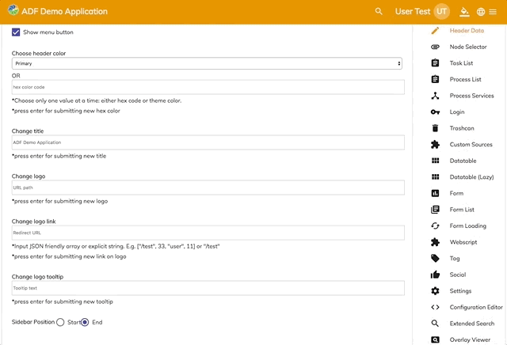

# Alfresco Application Development Framework, version 2.6.0 Release Note

These release notes provide information about the **2.6.0 release** of the Alfresco Application Development Framework.
This is the latest **General Available** release of the Application Development Framework, which contains the Angular components to build a Web Application on top of the Alfresco Platform.
The release can be found on GitHub at [this location.](https://github.com/Alfresco/alfresco-ng2-components/releases/tag/1.7.0)

## Contents

-   [New package versions](#new-package-versions)
-   [Goals for this release](#goals-for-this-release)
    -   [Show more/less tag](#show-moreless-tag)
    -   [Show sidebar on the right option](#show-sidebar-on-the-right-option)
    -   [Double sidebar for viewer](#double-sidebar-for-viewer)
    -   [Smart folder icon](#smart-folder-icon)
    -   [Tag node list component has a configurable delete button for tag](#tag-node-list-component-has-a-configurable-delete-button-for-tag)
    -   [Validation summary support for form component](#validation-summary-support-for-form-component)
    -   [Share link with expiry date](#share-link-with-expiry-date)
    -   [Base extensibility support](#base-extensibility-support)
-   [Localization](#localization)
-   [References](#references)
-   [Issues addressed](#issues-addressed)
    -   [Documentation](#documentation)
    -   [Feature](#feature)
    -   [Bug](#bug)
    -   [Task](#task)
    -   [Feature Bug](#feature-bug)
    -   [Feature (Task)](#feature-task)

## New package versions

    "@alfresco/adf-content-services" : "2.6.0"
    "@alfresco/adf-process-services" : "2.6.0"
    "@alfresco/adf-core" : "2.6.0"
    "@alfresco/adf-insights" : "2.6.0",
    "@alfresco/adf-extensions": "2.6.0"

## Goals for this release

In this release we added some new minor features such as validation summary for forms, filter support in the process list and setting an expiry date for the public sharing features. The team also worked on the extensibility features for applications, which we will talk much more about in the following months. As usual the team closed a lot of bugs and minor enhancements to provide an even better experience when using ADF - check out the full list below.

Please report issues with this release in the [issue tracker](https://github.com/Alfresco/alfresco-ng2-components/issues/new). You can collaborate on this release or share feedback by using the discussion tools on [Gitter](http://gitter.im/Alfresco/alfresco-ng2-components).

Notable new features
Below are the most important new features of this release:

-   **Show More/Less Tag**
-   **Show sidebar on the right option**
-   **Double sidebar for viewer**
-   **Smart folder icon**
-   **[Tag node list component](../content-services/components/tag-node-list.component.md) has a configurable delete button for tag**
-   **Validation summary for [form component](../core/components/form.component.md)**
-   **Share link with expiry date**
-   **Base extensibility support**

### Show more/less tag

The **[Tag List Component](../content-services/components/tag-list.component.md)** has two new buttons that allow the user to see more/less tags. This turns out to be more useful than showing the whole list of tags related to a node. This functionality is already embedded into the component and the user doesn't have to do anything to make it work.

    <adf-tag-list></adf-tag-list>

### Show sidebar on the right option

The **Sidenav Component** now accepts the **position** as an input parameter so you can decide where to show the sidebar. The possible values are **start** for the left of the screen and **end** for the right of the screen.

    <adf-sidenav-layout [position]="'end'"></adf-sidenav-layout>

### Double sidebar for viewer

An extra sidebar is now available to use within the **[Viewer Component](../core/components/viewer.component.md)**. This helps the user to organise the information related to the node in a better way.

     <ng-template #sidebarRightTemplate>
       //your right sidebar content here
     </ng-template>
     <ng-template #sidebarLeftTemplate>
      //your left sidebar content here
    </ng-template>
     <adf-viewer
        [nodeId]="nodeId"
        [showSidebar]="showRightSidebar"
        [showLeftSidebar]="showLeftSidebar"
        [sidebarLeftTemplate]="sidebarLeftTemplate"
        [sidebarTemplate]="sidebarRightTemplate"></adf-viewer>

### Smart folder icon

The **DocumentList Component** can now show different icons for **Smart Folders** and Standard Folders. No extra action is needed by the user to use this functionality.

### Tag node list component has a configurable delete button for tag

A configurable delete button has been added to the **Tag [`Node`](https://github.com/Alfresco/alfresco-js-api/blob/develop/src/api/content-rest-api/docs/Node.md) List Component** to let you show it only when user has permissions.

    <adf-tag-node-list [showDelete]="showDelete" [nodeId]="nodeId"></adf-tag-node-list>

### Validation summary support for form component

The **[`Form`](../../lib/process-services/src/lib/task-list/models/form.model.ts) Component** will now use the **formError** event to send a validation summary for all the fields with errors. This will be useful particularly with big forms for showing which fields are in error without scrolling the whole form by creating a summary.

    

    <adf-form
        [showRefreshButton]="false"
        [form]="form"
        (formError)="logErrors($event)">
    </adf-form>
    

     

     <h3>Error log:</h3>
     
Error {{ error.name }} {{error.validationSummary.message | translate}}

    

### Share link with expiry date

Some extra information is now available for shared links: expiry date. The earliest date accepted is at least 24h after the time you created it (following the ACS specification : [here](https://docs.alfresco.com/5.2/concepts/repository-properties.html) is the link). This is embedded into the **[Share Dialog Component](../../lib/content-services/content-node-share/content-node-share.dialog.ts)** and will be automatically shown when the share dialog is displayed.

### Base extensibility support

With this release, we also add basic extensibility support in the scope of the **@alfresco/adf-extensions** library.
This library powers the extensibility layer in the Alfresco Content Application, and you can find more details about the features it supports here: [Alfresco Content App](https://alfresco.github.io/alfresco-content-app/#/extending)
In the following releases we will provide more documentation and examples of how to use this library and how to build your own extension points.

## Localization

This release includes: French, German, Italian, Spanish, Japanese, Dutch, Norwegian (BokmÅl), Russian, Brazilian Portuguese and Simplified Chinese versions.

## References

Below you can find a brief list of references to help you start using the new release.

[Official GitHub Project - alfresco-ng2-components](https://github.com/Alfresco/alfresco-ng2-components)

[Getting started guides with Alfresco Application Development Framework](https://community.alfresco.com/community/application-development-framework/pages/get-started)

Component catalog

[Gitter chat supporting Alfresco ADF](https://gitter.im/Alfresco/alfresco-ng2-components)

[ADF examples](https://github.com/Alfresco/adf-examples)

[List of all components](https://github.com/Alfresco/alfresco-ng2-components/tree/master/ng2-components)

[Alfresco-JS-API](https://github.com/Alfresco/alfresco-js-api)

[ADF App Generator ](https://github.com/Alfresco/generator-ng2-alfresco-app)

Please refer to the [official documentation](http://docs.alfresco.com/) for further details and suggestions.

## Issues addressed

release note JIRA

Release Notes - Apps Development Framework - Version 2.6.

### Documentation

-   \[[ADF-3534](https://issues.alfresco.com/jira/browse/ADF-3534)] - Add Markdown versions of the release notes to the main repo
-   \[[ADF-3551](https://issues.alfresco.com/jira/browse/ADF-3551)] - Doc review for 2.6
-   \[[ADF-3577](https://issues.alfresco.com/jira/browse/ADF-3577)] - Content metadata docs reference the wrong class
-   \[[ADF-3587](https://issues.alfresco.com/jira/browse/ADF-3587)] - Issues with deprecated tag and missing properties in doc tools

### Feature

-   \[[ADF-584](https://issues.alfresco.com/jira/browse/ADF-584)] - Validation summary support for [`Form`](../../lib/process-services/src/lib/task-list/models/form.model.ts) component
-   \[[ADF-2640](https://issues.alfresco.com/jira/browse/ADF-2640)] - adf-tag-node-list with remove option configurable
-   \[[ADF-2921](https://issues.alfresco.com/jira/browse/ADF-2921)] - Icons for smart folders, links and folders with rules
-   \[[ADF-3308](https://issues.alfresco.com/jira/browse/ADF-3308)] - [`ProcessList`](../../lib/process-services/src/lib/mock/process/process.model.mock.ts) Component - Provide a way to filter the list by fields
-   \[[ADF-3352](https://issues.alfresco.com/jira/browse/ADF-3352)] - [Viewer Component](../core/components/viewer.component.md) - Allow multiple side bar
-   \[[ADF-3382](https://issues.alfresco.com/jira/browse/ADF-3382)] - Start a Process - Change the process definition from a dropdown to autocomplete
-   \[[ADF-3397](https://issues.alfresco.com/jira/browse/ADF-3397)] - Task Filter - Doesn't show the right icon
-   \[[ADF-3415](https://issues.alfresco.com/jira/browse/ADF-3415)] - Process Filter - Doesn't show the right icon
-   \[[ADF-3422](https://issues.alfresco.com/jira/browse/ADF-3422)] - Process Services - Create settings tab
-   \[[ADF-3438](https://issues.alfresco.com/jira/browse/ADF-3438)] - Task List Demo Page - Add page/size parameters
-   \[[ADF-3443](https://issues.alfresco.com/jira/browse/ADF-3443)] - Move print from ACA to ADF
-   \[[ADF-3499](https://issues.alfresco.com/jira/browse/ADF-3499)] - ACS APS Integration - Not able to upload a file in case the user has more than one alfresco repositories
-   \[[ADF-3507](https://issues.alfresco.com/jira/browse/ADF-3507)] - Show more/fewer tags buttons in [Tag List Component](../content-services/components/tag-list.component.md)
-   \[[ADF-3512](https://issues.alfresco.com/jira/browse/ADF-3512)] - [`SidenavLayoutComponent`](../core/components/sidenav-layout.component.md) option to show the sidebar on the right
-   \[[ADF-3553](https://issues.alfresco.com/jira/browse/ADF-3553)] - Cache management for application configuration file
-   \[[ADF-3570](https://issues.alfresco.com/jira/browse/ADF-3570)] - Migration to APS2 - Add a interceptor to be able to use APS2 API
-   \[[ADF-3607](https://issues.alfresco.com/jira/browse/ADF-3607)] - [Demo shell] JSON Editor in [`Form`](../../lib/process-services/src/lib/task-list/models/form.model.ts) Page

### Bug

-   \[[ADF-2460](https://issues.alfresco.com/jira/browse/ADF-2460)] - Incorrect entries in i18n file of process-services in ADF
-   \[[ADF-2828](https://issues.alfresco.com/jira/browse/ADF-2828)] - Collapse configuration of "Header" form control not working in ADF
-   \[[ADF-2996](https://issues.alfresco.com/jira/browse/ADF-2996)] - Process list - Sorting by column is not kept after changing the 'items per page'
-   \[[ADF-3009](https://issues.alfresco.com/jira/browse/ADF-3009)] - Start task - form date error remains displayed after choosing a date from date picker
-   \[[ADF-3119](https://issues.alfresco.com/jira/browse/ADF-3119)] - DocumentList CardView style issues
-   \[[ADF-3155](https://issues.alfresco.com/jira/browse/ADF-3155)] - "versionComment" is missing in typings
-   \[[ADF-3247](https://issues.alfresco.com/jira/browse/ADF-3247)] - Dynamic Table not working properly
-   \[[ADF-3324](https://issues.alfresco.com/jira/browse/ADF-3324)] - Preview - unshared file breaks preview
-   \[[ADF-3340](https://issues.alfresco.com/jira/browse/ADF-3340)] - adf-add-permission component search does not return the groups
-   \[[ADF-3357](https://issues.alfresco.com/jira/browse/ADF-3357)] - Viewer does not scroll plain text files
-   \[[ADF-3436](https://issues.alfresco.com/jira/browse/ADF-3436)] - The selected filter item "x" button from the toolbar is not working
-   \[[ADF-3455](https://issues.alfresco.com/jira/browse/ADF-3455)] - Show More and Show Less buttons are always showed instead of be hided.
-   \[[ADF-3482](https://issues.alfresco.com/jira/browse/ADF-3482)] - Alfresco JS-API fails to return URL with SSO mode on
-   \[[ADF-3486](https://issues.alfresco.com/jira/browse/ADF-3486)] - [Start Task] Assignee label not properly displayed
-   \[[ADF-3491](https://issues.alfresco.com/jira/browse/ADF-3491)] - CLONE - Logo link should be also on logo text
-   \[[ADF-3493](https://issues.alfresco.com/jira/browse/ADF-3493)] - ADF 2.4 does not work Properly in MS Internet Explorer 11
-   \[[ADF-3494](https://issues.alfresco.com/jira/browse/ADF-3494)] - DateCell component format ignored
-   \[[ADF-3495](https://issues.alfresco.com/jira/browse/ADF-3495)] - 'cm:lockOwner' field contains literal string value '[object Object]' when requesting it via the nodesApi
-   \[[ADF-3498](https://issues.alfresco.com/jira/browse/ADF-3498)] - Any search on add permission panel gets Internal Server Error
-   \[[ADF-3500](https://issues.alfresco.com/jira/browse/ADF-3500)] - [Demo shell] Running processes aren't displayed when creating a new process
-   \[[ADF-3501](https://issues.alfresco.com/jira/browse/ADF-3501)] - Viewer does not render fonts correctly
-   \[[ADF-3508](https://issues.alfresco.com/jira/browse/ADF-3508)] - angular-flex needs to be updated
-   \[[ADF-3509](https://issues.alfresco.com/jira/browse/ADF-3509)] - Dynamic Table overflows the form
-   \[[ADF-3510](https://issues.alfresco.com/jira/browse/ADF-3510)] - Search facets date-range goes invalid when empty #3736
-   \[[ADF-3511](https://issues.alfresco.com/jira/browse/ADF-3511)] - CLONE - The error message for "Created date" fields is not the correct one when are no inputs
-   \[[ADF-3513](https://issues.alfresco.com/jira/browse/ADF-3513)] - Remove switch E2E in with task details
-   \[[ADF-3517](https://issues.alfresco.com/jira/browse/ADF-3517)] - TaskList overflows container when empty
-   \[[ADF-3531](https://issues.alfresco.com/jira/browse/ADF-3531)] - Implicit Flow Enabled - The iframe inject another app into the page
-   \[[ADF-3532](https://issues.alfresco.com/jira/browse/ADF-3532)] - Document list scrolls down file/folders names when clicking on pagination dropdown.
-   \[[ADF-3536](https://issues.alfresco.com/jira/browse/ADF-3536)] - Search categories get collapsed/expanded to initial state after applying filter
-   \[[ADF-3546](https://issues.alfresco.com/jira/browse/ADF-3546)] - CLONE - TypeError when doing a Sign out while having something typed in the Search input
-   \[[ADF-3552](https://issues.alfresco.com/jira/browse/ADF-3552)] - JS-API - When a page is refresh the js api remove the part after the #
-   \[[ADF-3555](https://issues.alfresco.com/jira/browse/ADF-3555)] - Process selection isn't working properly
-   \[[ADF-3561](https://issues.alfresco.com/jira/browse/ADF-3561)] - Save and Complete Outcome not translateable
-   \[[ADF-3562](https://issues.alfresco.com/jira/browse/ADF-3562)] - PeopleWidget component mix rexctive/template syntax
-   \[[ADF-3575](https://issues.alfresco.com/jira/browse/ADF-3575)] - Translation should fallback to English when browser is set to an unsupported language
-   \[[ADF-3580](https://issues.alfresco.com/jira/browse/ADF-3580)] - Success event not fired when upload file is paused and resume
-   \[[ADF-3582](https://issues.alfresco.com/jira/browse/ADF-3582)] - Roles other than standard roles don't show up in the permission component\`
-   \[[ADF-3610](https://issues.alfresco.com/jira/browse/ADF-3610)] - PDF viewer worker doesn't unregister when file is closed
-   \[[ADF-3614](https://issues.alfresco.com/jira/browse/ADF-3614)] - The name of the file is not properly displayed on custom sources
-   \[[ADF-3626](https://issues.alfresco.com/jira/browse/ADF-3626)] - No user is displayed when searching for an assignee of a task
-   \[[ADF-3630](https://issues.alfresco.com/jira/browse/ADF-3630)] - No translation when browser is set to a supported language
-   \[[ADF-3639](https://issues.alfresco.com/jira/browse/ADF-3639)] - Start Process Component does not select first process when there is no default process selected
-   \[[ADF-3641](https://issues.alfresco.com/jira/browse/ADF-3641)] - Broken form layout for Involve people widget
-   \[[ADF-3642](https://issues.alfresco.com/jira/browse/ADF-3642)] - Broken layout for select process definition drop down when starting a process
-   \[[ADF-3643](https://issues.alfresco.com/jira/browse/ADF-3643)] - Viewer shows both sidebar icons
-   \[[ADF-3646](https://issues.alfresco.com/jira/browse/ADF-3646)] - The task list is not refreshed after completing an active task of a process
-   \[[ADF-3649](https://issues.alfresco.com/jira/browse/ADF-3649)] - Complete button is enabled for completed tasks

### Task

-   \[[ADF-3335](https://issues.alfresco.com/jira/browse/ADF-3335)] - Create automated tests for [Task filters component](../process-services/components/task-filters.component.md)
-   \[[ADF-3393](https://issues.alfresco.com/jira/browse/ADF-3393)] - Add delete AWS environment in the creator/destructor script
-   \[[ADF-3480](https://issues.alfresco.com/jira/browse/ADF-3480)] - Fix failing automated tests
-   \[[ADF-3504](https://issues.alfresco.com/jira/browse/ADF-3504)] - Add needed images to stack adf-acs6. 
-   \[[ADF-3505](https://issues.alfresco.com/jira/browse/ADF-3505)] - Fix the report for e2e tests
-   \[[ADF-3518](https://issues.alfresco.com/jira/browse/ADF-3518)] - Change the automated tests that are creating content on the admin root
-   \[[ADF-3545](https://issues.alfresco.com/jira/browse/ADF-3545)] - Codecov fix
-   \[[ADF-3558](https://issues.alfresco.com/jira/browse/ADF-3558)] - Fix failing test for unshare file
-   \[[ADF-3564](https://issues.alfresco.com/jira/browse/ADF-3564)] - Add documentation for printing feature
-   \[[ADF-3566](https://issues.alfresco.com/jira/browse/ADF-3566)] - Modifications related to task filters automated tests
-   \[[ADF-3592](https://issues.alfresco.com/jira/browse/ADF-3592)] - Remove Polyfill web animation
-   \[[ADF-3621](https://issues.alfresco.com/jira/browse/ADF-3621)] - Update Generator App to 2.6. 

### Feature Bug

-   \[[ADF-3413](https://issues.alfresco.com/jira/browse/ADF-3413)] - [`Form`](../../lib/process-services/src/lib/task-list/models/form.model.ts) name still displayed after removing form
-   \[[ADF-3567](https://issues.alfresco.com/jira/browse/ADF-3567)] - The default items per page value is not displayed
-   \[[ADF-3571](https://issues.alfresco.com/jira/browse/ADF-3571)] - Due After field not working as expected
-   \[[ADF-3573](https://issues.alfresco.com/jira/browse/ADF-3573)] - Showing NaN-20 of 20 is displayed instead of 20
-   \[[ADF-3574](https://issues.alfresco.com/jira/browse/ADF-3574)] - Items per page field is not working properly
-   \[[ADF-3595](https://issues.alfresco.com/jira/browse/ADF-3595)] - Add documentation about showIcon property

### Feature (Task)

-   \[[ADF-3376](https://issues.alfresco.com/jira/browse/ADF-3376)] - Create automated tests for comments - Process services - Process
-   \[[ADF-3377](https://issues.alfresco.com/jira/browse/ADF-3377)] - Create automated tests for comments - Process services - Tasks
-   \[[ADF-3378](https://issues.alfresco.com/jira/browse/ADF-3378)] - Create automated tests for comments - Content Services PT2
-   \[[ADF-3414](https://issues.alfresco.com/jira/browse/ADF-3414)] - Create automated test for [Attach form component](../process-services/components/attach-form.component.md)
-   \[[ADF-3481](https://issues.alfresco.com/jira/browse/ADF-3481)] - Updated automated tests for [attach form component](../process-services/components/attach-form.component.md)
-   \[[ADF-3519](https://issues.alfresco.com/jira/browse/ADF-3519)] - Fixing tests for Task Filters
-   \[[ADF-3520](https://issues.alfresco.com/jira/browse/ADF-3520)] - Fixing tests for Document List - Actions
-   \[[ADF-3521](https://issues.alfresco.com/jira/browse/ADF-3521)] - Fixing tests for Version - Actions
-   \[[ADF-3522](https://issues.alfresco.com/jira/browse/ADF-3522)] - Reviewing failing tests
-   \[[ADF-3524](https://issues.alfresco.com/jira/browse/ADF-3524)] - Fixing tests for Notifications
-   \[[ADF-3525](https://issues.alfresco.com/jira/browse/ADF-3525)] - Fixing tests for Search Page
-   \[[ADF-3527](https://issues.alfresco.com/jira/browse/ADF-3527)] - Fixing tests for Search - Multiselect
-   \[[ADF-3533](https://issues.alfresco.com/jira/browse/ADF-3533)] - Automated test for Process List - Sorting
-   \[[ADF-3535](https://issues.alfresco.com/jira/browse/ADF-3535)] - Create automated test to cover the 'Unshared file should show 404 page' functionality
-   \[[ADF-3537](https://issues.alfresco.com/jira/browse/ADF-3537)] - Automated test for Permissions - Search
-   \[[ADF-3544](https://issues.alfresco.com/jira/browse/ADF-3544)] - Automated test for Dynamic DataTable
-   \[[ADF-3548](https://issues.alfresco.com/jira/browse/ADF-3548)] - Create an automated test to cover 'hide remove' option on a tag
-   \[[ADF-3556](https://issues.alfresco.com/jira/browse/ADF-3556)] - Create an automated test to cover sidebar position
-   \[[ADF-3557](https://issues.alfresco.com/jira/browse/ADF-3557)] - Automated test for removing search filter using chip remove button
-   \[[ADF-3560](https://issues.alfresco.com/jira/browse/ADF-3560)] - Create an automated test to cover 'Add group' on permissions
-   \[[ADF-3563](https://issues.alfresco.com/jira/browse/ADF-3563)] - Automated test for Show More/Less button in Search Filters
-   \[[ADF-3594](https://issues.alfresco.com/jira/browse/ADF-3594)] - Create automated test for Show more/ less button on Tag component.
-   \[[ADF-3596](https://issues.alfresco.com/jira/browse/ADF-3596)] - Automated tests for start a process
-   \[[ADF-3597](https://issues.alfresco.com/jira/browse/ADF-3597)] - Create automated test to cover Error Log on [`Form`](../../lib/process-services/src/lib/task-list/models/form.model.ts) component

Please refer to [the Alfresco issue tracker](https://issues.alfresco.com/jira/projects/ADF/issues/ADF-581?filter=allopenissues) for other known issues in this release. If you have any questions about the release, please contact us using [gitter](https://gitter.im/Alfresco/alfresco-ng2-components).
