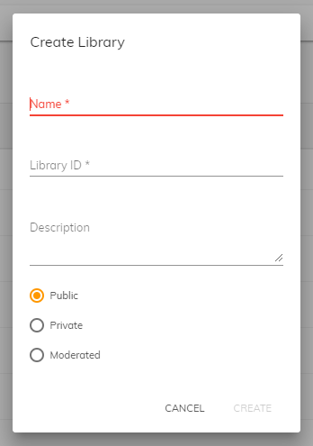

# Alfresco Application Development Framework (ADF) version 3.0.0 Release Note

These release notes provide information about the **3.0.0 release** of the Alfresco Application Development Framework.

This is the latest **General Available** release of the Application Development Framework, which contains the Angular components to build a Web Application on top of the Alfresco Platform.

The release can be found on GitHub at [this location](https://github.com/Alfresco/alfresco-ng2-components/releases/tag/3.0.0).

If you want to be updated on the [ADF roadmap](../roadmap.md), check the public page [here](../roadmap.md). 

## Contents

-   [New package versions](#new-package-versions)
-   [Goals for this release](#goals-for-this-release)
    -   [Extensibility](#extensibility)
    -   [Search enhancement](#search-enhancement)
    -   [Single Sign On enhancement](#single-sign-on-enhancement)
    -   [JS-API in Typescript](#js-api-in-typescript)
    -   [Angular 7](#angular-7)
    -   [Create library Component](#create-library-component)
    -   [Tree view component](#tree-view-component)
    -   [Deprecation removal](#deprecation-removal)
    -   [Activiti 7 support (Experimental)](#activiti-7-support-experimental)
-   [Localization](#localization)
-   [References](#references)
    -   [Icon Component](#icon-component)
-   [Issues addressed](#issues-addressed)
    -   [Documentation](#documentation)
    -   [Feature](#feature)
    -   [Epic](#epic)
    -   [Story](#story)
    -   [Bug](#bug)
    -   [Task](#task)
    -   [Feature Documentation](#feature-documentation)
    -   [Feature Bug](#feature-bug)
    -   [Feature (Task)](#feature-task)

## New package versions

    "@alfresco/adf-content-services" : "3.0.0"
    "@alfresco/adf-process-services" : "3.0.0"
    "@alfresco/adf-core" : "3.0.0"
    "@alfresco/adf-insights" : "3.0.0",
    "@alfresco/adf-extensions": "3.0.0"

## Goals for this release

This is a major release of the Alfresco Application Development Framework, developed to speed up the applications running in production environments, thanks to a porting of the [JS-API](https://github.com/Alfresco/alfresco-js-api) to Typescript. All the benefits of [Extensibility](../user-guide/app-extensions.md), initially introduced in [Alfresco Content Application (ACA)](https://github.com/Alfresco/alfresco-content-app) and the Alfresco Digital Workspace (ADW), are now available at the framework level and more enhancements are planned to be introduced in the following releases.

This new major version of ADF has been updated to the latest and greatest [Angular 7](https://angular.io/), together with a first iteration of support for [Activiti 7](https://www.activiti.org/), the next generation Cloud Native implementation of Activiti. Also the [Yeoman App Generator](https://github.com/Alfresco/generator-ng2-alfresco-app) has been updated to let you create five small [Angular CLI](https://cli.angular.io/) based applications to help get you started: one on content only, two on process only (using APS 1.6.4 or higher or using Activiti 7), two on content and process.

Please report issues with this release in the [issue tracker](https://github.com/Alfresco/alfresco-ng2-components/issues/new). You can collaborate on this release or share feedback by using the discussion tools on [Gitter](http://gitter.im/Alfresco/alfresco-ng2-components).

Below are the most important new features of this release:

-   [Extensibility](#extensibility)
-   [Search enhancement](#search-enhancement)
-   [Single Sign On enhancement](#single-sign-on-enhancement)
-   [JS-API in Typescript](#js-api-in-typescript)
-   [Angular 7](#angular-7)
-   [Create Library Component](#create-library-component)
-   [Tree view component](#tree-view-component)
-   [Deprecation removal](#deprecation-removal)
-   [Activiti 7 support (experimental)](#activiti-7-support-experimental)

### Extensibility

Extensibility was first introduced into the [Alfresco Content Application (ACA)](https://github.com/Alfresco/alfresco-content-app) and the Alfresco Digital Workspace (ADW), and has now been moved to the main ADF framework, for the benefit of all developers.

The home of extensibility support in the framework is the **@alfresco/adf-extensions** library. Check the documentation [here](https://alfresco.github.io/alfresco-content-app/#/extending/) for further details on how to add extension features to any ADF application.

### Search enhancement

#### Grouped facet queries

By default, the queries declared in the `facetQueries` are collected into a single collapsible category.
This new functionality lets you group different facet queries under custom labels by using the `group` property on those facet queries:


Please refer to the [search filter component documentation](../content-services/components/search-filter.component.md#facet-queries) for more details.

#### filterWithContains

You can  now choose to filter facet field results using 'contains' instead of 'starts with', by using the `filterWithContains` boolean property (default is false):

```json
{
    "search": { "filterWithContains": true }
}
```

### Single Sign On enhancement

#### SSO ticket fix

In order to make the SSO work completely with the new ACS 6.1.0, a new exchange token for alf_ticket mechanism has been introduced via a new flow in the JS-API that performs this operation. 
For more details about this issue please refer to the [this JIRA ticket](https://issues.alfresco.com/jira/browse/ADF-3882).

#### withCredential

The `withCredentials` property has been added as a configuration Boolean parameter in the JS-API and in ADF. 
This indicates whether or not cross-site Access-Control requests should be made using credentials.
This configuration is usually needed when you are dealing with **Kerberos**.

For more details please see the links below:

-   [App config withCredentials configuration](../core/services/app-config.service.md)
-   [Login component withCredentials behaviour](../core/components/login.component.md)
-   [alfresco-js-api withCredentials PR](https://github.com/Alfresco/alfresco-js-api/pull/358/files)

### JS-API in Typescript

The [Alfresco JS-API layer](https://github.com/Alfresco/alfresco-js-api) has been rewritten in [TypeScript](https://en.wikipedia.org/wiki/TypeScript). _Note that the output of the project is still JavaScript code so you can use in the usual way._
This rewrite has been necessary to make the JS-API  lighter and  faster with the following benefits:

-   Tree-shakable.
-   Strong typing enhances code quality and readability.
-   In the JS-API project, it is now easier to generate new code thanks our code generator template.
-   TypeScript already provides a number of features that are planned for future version of JavaScript.
-   Intellisense in your IDE will now work much better with the JS-API

Note that the following old package names have been deprecated: **alfresco-js-api**, **alfresco-js-api-node**.

The [`Node`](https://github.com/Alfresco/alfresco-js-api/blob/develop/src/api/content-rest-api/docs/Node.md) and Browser version are now both in: **_@alfresco/js-api_**
Refer to the official [Alfresco JS-API documenation](https://github.com/Alfresco/alfresco-js-api) to learn more about this.

### Angular 7

Alfresco ADF 3.0.0 has been updated to version 7.0.3 of Angular and Material.
Refer to the official project CHANGELOG files to find out what's new inside:

-   [Angular 7 CHANGELOG](https://github.com/angular/angular/blob/master/CHANGELOG.md)
-   [Material 7 CHANGELOG](https://github.com/angular/material2/blob/master/CHANGELOG.md)

### Create library Component

You can now create a new Content Services document library/site with the Create Library dialog:



 For more information about the dialog, see the [component documentation](../content-services/dialogs/library.dialog.md)

### Tree view component


Shows the folder and subfolders of a node as a tree view. For more information about the [Tree View component,](../content-services/components/tree-view.component.md) see the [component documentation](../content-services/components/tree-view.component.md)

#### Basic Usage

```html
<adf-tree-view-list [nodeId]="'74cd8a96-8a21-47e5-9b3b-a1b3e296787d'" 
                    (nodeClicked)="onClick($event)">
</adf-tree-view-list>
```

### Deprecation removal

Following the [SEMVER 2.0](https://semver.org/) strategy, ADF 3.0.0 introduces breaking changes only in major versions like this one. For this reason, all the features, components and services, marked as deprecated in ADF 2.X, have been removed.

### Activiti 7 support (Experimental)

From ADF 3.0.0, Alfresco is excited to announce ADF support for [Activiti 7](https://www.activiti.org/). This is a first iteration and more coverage of the services will be added in the following versions of ADF. This is the reason why this support is marked as **experimental** for this release. The next release (3.1) plans on moving from experimental to standard ADF components with more complete coverage. 

This ADF release introduces a collection of brand new components re-designed and implemented from scratch for  [Activiti 7](https://www.activiti.org/).

Below is a list of all new components services and pipes added along with
links to documentation and source code: 

#### Components

| Name | Description | Source link |
| ---- | ----------- | ----------- |
| [App list cloud component](../process-services-cloud/components/app-list-cloud.component.md)  | Shows all deployed cloud application instances. | [Source](../../lib/process-services-cloud/src/lib/app/components/app-list-cloud.component.ts) |
| [Group cloud component](../process-services-cloud/components/group-cloud.component.md)  | Searches Groups. | [Source](../../lib/process-services-cloud/src/lib/group/components/group-cloud.component.ts) |
| [Edit process filter cloud component](../process-services-cloud/components/edit-process-filter-cloud.component.md)  | Shows Process Filter Details. | [Source](../../lib/process-services-cloud/src/lib/process/process-filters/components/edit-process-filter-cloud.component.ts) |
| [Process filters cloud component](../process-services-cloud/components/process-filters-cloud.component.md)  | Lists all available process filters and allows to select a filter. | [Source](../../lib/process-services-cloud/src/lib/process/process-filters/components/process-filters-cloud.component.ts) |
| [Process list cloud component](../process-services-cloud/components/process-list-cloud.component.md)  | Renders a list containing all the process instances matched by the parameters specified. | [Source](../../lib/process-services-cloud/src/lib/process/process-list/components/process-list-cloud.component.ts) |
| [Start process cloud component](../process-services-cloud/components/start-process-cloud.component.md)  | Starts a process. | [Source](../../lib/process-services-cloud/src/lib/process/start-process/components/start-process-cloud.component.ts) |
| [People cloud component](../process-services-cloud/components/people-cloud.component.md)  | Allows one or more users to be selected (with auto-suggestion) based on the input parameters. | [Source](../../lib/process-services-cloud/src/lib/task/start-task/components/people-cloud/people-cloud.component.ts) |
| [Start task cloud component](../process-services-cloud/components/start-task-cloud.component.md)  | Creates/starts a new task for the specified app. | [Source](../../lib/process-services-cloud/src/lib/task/start-task/components/start-task-cloud.component.ts) |
| [Edit task filter cloud component](../process-services-cloud/components/edit-task-filter-cloud.component.md)  | Edits Task Filter Details. | [Source](../../lib/process-services-cloud/src/lib/task/task-filters/components/edit-task-filter-cloud.component.ts) |
| [Task filters cloud component](../process-services-cloud/components/task-filters-cloud.component.md)  | Shows all available filters. | [Source](../../lib/process-services-cloud/src/lib/task/task-filters/components/task-filters-cloud.component.ts) |
| [Task header cloud component](../process-services-cloud/components/task-header-cloud.component.md)  | Shows all the information related to a task. | [Source](../../lib/process-services-cloud/src/lib/task/task-header/components/task-header-cloud.component.ts) |
| [Task list cloud component](../process-services-cloud/components/task-list-cloud.component.md)  | Renders a list containing all the tasks matched by the parameters specified. | [Source](../../lib/process-services-cloud/src/lib/task/task-list/components/task-list-cloud.component.ts) |

#### Pipes

| Name | Description | Source link |
| ---- | ----------- | ----------- |
| [Group initial pipe](../process-services-cloud/pipes/group-initial.pipe.md) | Extracts the initial character from a group name. | [Source](../../lib/process-services-cloud/src/lib/group/pipe/group-initial.pipe.ts) |

#### Services

| Name | Description | Source link |
| ---- | ----------- | ----------- |
| [Apps process cloud service](../process-services-cloud/services/apps-process-cloud.service.md)  | Gets details of deployed apps for the current user. | [Source](../../lib/process-services-cloud/src/lib/app/services/apps-process-cloud.service.ts) |
| [Group cloud service](../process-services-cloud/services/group-cloud.service.md)  | Searches and gets information for groups. | [Source](../../lib/process-services-cloud/src/lib/group/services/group-cloud.service.ts) |
| [Process filter cloud service](../process-services-cloud/services/process-filter-cloud.service.md)  | Manage Process Filters, which are pre-configured Process Instance queries. | [Source](../../lib/process-services-cloud/src/lib/process/process-filters/services/process-filter-cloud.service.ts) |
| [Process list cloud service](../process-services-cloud/services/process-list-cloud.service.md)  | Searches processes. | [Source](../../lib/process-services-cloud/src/lib/process/process-list/services/process-list-cloud.service.ts) |
| [Start process cloud service](../process-services-cloud/services/start-process-cloud.service.md)  | Gets process definitions and starts processes. | [Source](../../lib/process-services-cloud/src/lib/process/start-process/services/start-process-cloud.service.ts) |
| [Start task cloud service](../process-services-cloud/services/start-task-cloud.service.md)  | Starts standalone tasks. | [Source](../../lib/process-services-cloud/src/lib/task/start-task/services/start-task-cloud.service.ts) |
| [Task filter cloud service](../process-services-cloud/services/task-filter-cloud.service.md)  | Manages task filters. | [Source](../../lib/process-services-cloud/src/lib/task/task-filters/services/task-filter-cloud.service.ts) |
| [Task cloud service](../process-services-cloud/services/task-cloud.service.md)  | Manages cloud tasks. | [Source](../../lib/process-services-cloud/src/lib/task/services/task-cloud.service.ts) |
| [Task list cloud service](../process-services-cloud/services/task-list-cloud.service.md)  | Searches tasks. | [Source](../../lib/process-services-cloud/src/lib/task/task-list/services/task-list-cloud.service.ts) |

<!--process-services-cloud end-->

## Localization

This release includes: French, German, Italian, Spanish, Japanese, Dutch, Norwegian (BokmÅl), Russian, Brazilian Portuguese and Simplified Chinese versions.

## References

Below is a brief list of references to help you start using the new release:

-   [Getting started guides with Alfresco Application Development Framework](https://community.alfresco.com/community/application-development-framework/pages/get-started)
-   [Alfresco ADF Documentation on the Builder Network](../README.md)
-   [Gitter chat supporting Alfresco ADF](https://gitter.im/Alfresco/alfresco-ng2-components)
-   [ADF examples on GitHub](https://github.com/Alfresco/adf-examples)
-   [Official GitHub Project - alfresco-ng2-components](https://github.com/Alfresco/alfresco-ng2-components)
-   [Official GitHub Project - alfresco-js-api](https://github.com/Alfresco/alfresco-js-api)
-   [Official GitHub Project - generator-ng2-alfresco-app](https://github.com/Alfresco/generator-ng2-alfresco-app)

Please refer to the [official documentation](http://docs.alfresco.com/) for further details and suggestions.

### Icon Component

Universal [icon component](../core/components/icon.component.md) that supports Material Ligatures and custom registered SVG icons in the same format.

```html
<!-- Font ligature -->
<adf-icon value="alert"></adf-icon>

<!-- ADF Thumbnail Service -->
<adf-icon value="adf:image/png"></adf-icon>

<!-- Custom icon from MatIconRegistry -->
<adf-icon value="my-company:my-icon"></adf-icon>
```

See [Icon Component](../core/components/icon.component.md) [documentation](../core/components/icon.component.md) for more details.

## Issues addressed

Below the list of JIRA issues, closed for this release.

### Documentation

<ul>
<li>[<a href='https://issues.alfresco.com/jira/browse/ADF-3323'>ADF-3323</a>] -         Investigate using DocFX file format with doc tools
</li>
<li>[<a href='https://issues.alfresco.com/jira/browse/ADF-3437'>ADF-3437</a>] -         Bring doc index tool in line with the other tools
</li>
<li>[<a href='https://issues.alfresco.com/jira/browse/ADF-3682'>ADF-3682</a>] -         Review content of project README files
</li>
<li>[<a href='https://issues.alfresco.com/jira/browse/ADF-3731'>ADF-3731</a>] -         Language locale - Missing documentation
</li>
<li>[<a href='https://issues.alfresco.com/jira/browse/ADF-3760'>ADF-3760</a>] -         Change the documentation for the Form Field Component mapping
</li>
<li>[<a href='https://issues.alfresco.com/jira/browse/ADF-3792'>ADF-3792</a>] -         Add title metadata to Markdown files
</li>
<li>[<a href='https://issues.alfresco.com/jira/browse/ADF-3801'>ADF-3801</a>] -         Doc files should each contain a link to the source Typescript file
</li>
<li>[<a href='https://issues.alfresco.com/jira/browse/ADF-3806'>ADF-3806</a>] -         Update docs for Search Service
</li>
<li>[<a href='https://issues.alfresco.com/jira/browse/ADF-3816'>ADF-3816</a>] -         Document list sortingMode property docs need more information
</li>
<li>[<a href='https://issues.alfresco.com/jira/browse/ADF-3852'>ADF-3852</a>] -         Add YAML Builder Network index file to doc folder
</li>
<li>[<a href='https://issues.alfresco.com/jira/browse/ADF-3898'>ADF-3898</a>] -         Incorrect example for the filtersAppId property of the AppsListComponent in component catalog
</li>
<li>[<a href='https://issues.alfresco.com/jira/browse/ADF-3902'>ADF-3902</a>] -         Mark *Cloud components as experimental
</li>
<li>[<a href='https://issues.alfresco.com/jira/browse/ADF-3913'>ADF-3913</a>] -         Create a public Roadmap page for ADF
</li>
<li>[<a href='https://issues.alfresco.com/jira/browse/ADF-3921'>ADF-3921</a>] -         Review docs where deprecated items were removed
</li>
<li>[<a href='https://issues.alfresco.com/jira/browse/ADF-4016'>ADF-4016</a>] -         Define the compatibility matrix page for ADF
</li>
<li>[<a href='https://issues.alfresco.com/jira/browse/ADF-4053'>ADF-4053</a>] -         Third party Open Source dependencies
</li>
<li>[<a href='https://issues.alfresco.com/jira/browse/ADF-4069'>ADF-4069</a>] -         Third party Open Source dependencies for the ADF 3.0 release (and future)
</li>
</ul>

### Feature

<ul>
<li>[<a href='https://issues.alfresco.com/jira/browse/ADF-3039'>ADF-3039</a>] -         Task List - Enanchement
</li>
<li>[<a href='https://issues.alfresco.com/jira/browse/ADF-3354'>ADF-3354</a>] -         Remove ADF accordion-group - wrong behaviour
</li>
<li>[<a href='https://issues.alfresco.com/jira/browse/ADF-3442'>ADF-3442</a>] -         Move Create Site functionality to ADF
</li>
<li>[<a href='https://issues.alfresco.com/jira/browse/ADF-3496'>ADF-3496</a>] -         Grouped facet queries on search filter
</li>
<li>[<a href='https://issues.alfresco.com/jira/browse/ADF-3530'>ADF-3530</a>] -         CLONE - Sharing files, publically
</li>
<li>[<a href='https://issues.alfresco.com/jira/browse/ADF-3538'>ADF-3538</a>] -         Tasklist Component
</li>
<li>[<a href='https://issues.alfresco.com/jira/browse/ADF-3539'>ADF-3539</a>] -         Process List Component APS 2
</li>
<li>[<a href='https://issues.alfresco.com/jira/browse/ADF-3540'>ADF-3540</a>] -         Start Task Component APS2
</li>
<li>[<a href='https://issues.alfresco.com/jira/browse/ADF-3543'>ADF-3543</a>] -         Start Process APS 2
</li>
<li>[<a href='https://issues.alfresco.com/jira/browse/ADF-3547'>ADF-3547</a>] -         TaskFiltersComponent
</li>
<li>[<a href='https://issues.alfresco.com/jira/browse/ADF-3550'>ADF-3550</a>] -         App List Component
</li>
<li>[<a href='https://issues.alfresco.com/jira/browse/ADF-3606'>ADF-3606</a>] -         Icons for links and folders with rules
</li>
<li>[<a href='https://issues.alfresco.com/jira/browse/ADF-3666'>ADF-3666</a>] -         User Profile - Provide a way to show SSO Logged-In User
</li>
<li>[<a href='https://issues.alfresco.com/jira/browse/ADF-3676'>ADF-3676</a>] -         Task Header - Expose task properties out of the box
</li>
<li>[<a href='https://issues.alfresco.com/jira/browse/ADF-3723'>ADF-3723</a>] -         Create a folder tree view component
</li>
<li>[<a href='https://issues.alfresco.com/jira/browse/ADF-3749'>ADF-3749</a>] -         Process Filter Component - APS2
</li>
<li>[<a href='https://issues.alfresco.com/jira/browse/ADF-3778'>ADF-3778</a>] -         TaskFilterCloud - Define the default filters
</li>
<li>[<a href='https://issues.alfresco.com/jira/browse/ADF-3799'>ADF-3799</a>] -         Process Filter definition in a component APS2
</li>
<li>[<a href='https://issues.alfresco.com/jira/browse/ADF-3812'>ADF-3812</a>] -         Add multi selection and roles filtering to adf-cloud-people component
</li>
<li>[<a href='https://issues.alfresco.com/jira/browse/ADF-3813'>ADF-3813</a>] -          Add filterWithContains configuration option for SearchFilter
</li>
<li>[<a href='https://issues.alfresco.com/jira/browse/ADF-3841'>ADF-3841</a>] -         Improve edit-task-filter-cloud by adding inputs to control filters
</li>
<li>[<a href='https://issues.alfresco.com/jira/browse/ADF-3847'>ADF-3847</a>] -         Add data input to dynamic component in extension package.
</li>
<li>[<a href='https://issues.alfresco.com/jira/browse/ADF-3874'>ADF-3874</a>] -         Universal icon component
</li>
<li>[<a href='https://issues.alfresco.com/jira/browse/ADF-3883'>ADF-3883</a>] -         Improve edit-process-filter-cloud by adding inputs to control filters
</li>
<li>[<a href='https://issues.alfresco.com/jira/browse/ADF-3892'>ADF-3892</a>] -         [JS-API] Support the new exchange ticket introduced in 6.1.0
</li>
<li>[<a href='https://issues.alfresco.com/jira/browse/ADF-3919'>ADF-3919</a>] -         Add roles filtering to adf-cloud-group
</li>
<li>[<a href='https://issues.alfresco.com/jira/browse/ADF-3935'>ADF-3935</a>] -         [Demo-shell] Remove Task List Cloud demo page
</li>
</ul>

### Epic

<ul>
<li>[<a href='https://issues.alfresco.com/jira/browse/ADF-9'>ADF-9</a>] -         Document List enhancements
</li>
<li>[<a href='https://issues.alfresco.com/jira/browse/ADF-14'>ADF-14</a>] -         Destination Picker (Copy/Move)
</li>
<li>[<a href='https://issues.alfresco.com/jira/browse/ADF-262'>ADF-262</a>] -         File Viewer
</li>
<li>[<a href='https://issues.alfresco.com/jira/browse/ADF-1452'>ADF-1452</a>] -         Improved Documentation
</li>
<li>[<a href='https://issues.alfresco.com/jira/browse/ADF-1463'>ADF-1463</a>] -         Adding of automated tests
</li>
<li>[<a href='https://issues.alfresco.com/jira/browse/ADF-3296'>ADF-3296</a>] -         APS 2.x &amp; Activiti 7 compatibility
</li>
<li>[<a href='https://issues.alfresco.com/jira/browse/ADF-3349'>ADF-3349</a>] -         Migrate ADF to APS 2.X
</li>
<li>[<a href='https://issues.alfresco.com/jira/browse/ADF-3742'>ADF-3742</a>] -         Extensibility of components, previously developed into ACA/ADW and moved to the ADF framework.
</li>
<li>[<a href='https://issues.alfresco.com/jira/browse/ADF-3744'>ADF-3744</a>] -         Removal of all the deprecated features in ADF version 2
</li>
</ul>

### Story

<ul>
<li>[<a href='https://issues.alfresco.com/jira/browse/ADF-3598'>ADF-3598</a>] -         CLONE - Unshare a Link
</li>
<li>[<a href='https://issues.alfresco.com/jira/browse/ADF-3773'>ADF-3773</a>] -         Filter definition in a component APS2
</li>
<li>[<a href='https://issues.alfresco.com/jira/browse/ADF-3775'>ADF-3775</a>] -         APS 2 Process and Task view in the ADF Demo Application
</li>
<li>[<a href='https://issues.alfresco.com/jira/browse/ADF-3824'>ADF-3824</a>] -         Reorganize Process Services Cloud Folder
</li>
<li>[<a href='https://issues.alfresco.com/jira/browse/ADF-3882'>ADF-3882</a>] -         Support for AIS (Identity Services) on ACS 6.1
</li>
</ul>

### Bug

<ul>
<li>[<a href='https://issues.alfresco.com/jira/browse/ADF-1344'>ADF-1344</a>] -         Not possible to set custom &quot;Loading content template&quot; for Document List
</li>
<li>[<a href='https://issues.alfresco.com/jira/browse/ADF-1443'>ADF-1443</a>] -         Download Zip dialog does not cancel Zip creation
</li>
<li>[<a href='https://issues.alfresco.com/jira/browse/ADF-2121'>ADF-2121</a>] -         Message is not displayed when copying/moving a file without permission.
</li>
<li>[<a href='https://issues.alfresco.com/jira/browse/ADF-2617'>ADF-2617</a>] -         Document metadata - we have a &quot;More Information&quot; button instead of &quot;Less Information&quot; and vice versa
</li>
<li>[<a href='https://issues.alfresco.com/jira/browse/ADF-2661'>ADF-2661</a>] -         Comments component - site content - Comment field visible for consumer users
</li>
<li>[<a href='https://issues.alfresco.com/jira/browse/ADF-2675'>ADF-2675</a>] -         The string given for &#39;Extension accepted&#39; is not trim
</li>
<li>[<a href='https://issues.alfresco.com/jira/browse/ADF-2700'>ADF-2700</a>] -         Alfresco folder picker stops working if user is deleted or disabled (or deauthorized)
</li>
<li>[<a href='https://issues.alfresco.com/jira/browse/ADF-3124'>ADF-3124</a>] -         Metadata -&gt;The File Name is not properly displayed for a long string 
</li>
<li>[<a href='https://issues.alfresco.com/jira/browse/ADF-3215'>ADF-3215</a>] -         Version Manager enforces its height to 800px
</li>
<li>[<a href='https://issues.alfresco.com/jira/browse/ADF-3220'>ADF-3220</a>] -         Document List changes icons when multiselect mode is enabled
</li>
<li>[<a href='https://issues.alfresco.com/jira/browse/ADF-3256'>ADF-3256</a>] -         [Search] - 500 (Internal Server Error) when search by &quot;%&quot;
</li>
<li>[<a href='https://issues.alfresco.com/jira/browse/ADF-3282'>ADF-3282</a>] -         [Task/Process] - can&#39;t create a task/process with a name bigger then 255 characters
</li>
<li>[<a href='https://issues.alfresco.com/jira/browse/ADF-3405'>ADF-3405</a>] -         &quot;removeFavorite&quot; api is missing
</li>
<li>[<a href='https://issues.alfresco.com/jira/browse/ADF-3411'>ADF-3411</a>] -         Some fields are incorrectly required in PersonBodyCreate in index.d.ts
</li>
<li>[<a href='https://issues.alfresco.com/jira/browse/ADF-3454'>ADF-3454</a>] -         CLONE - Comments are merged together when quickly switching between files 
</li>
<li>[<a href='https://issues.alfresco.com/jira/browse/ADF-3460'>ADF-3460</a>] -         [Demo shell] Pagination in search result is not reset correctly
</li>
<li>[<a href='https://issues.alfresco.com/jira/browse/ADF-3471'>ADF-3471</a>] -         removeFavoriteSite method should be renamed to removeFavorite
</li>
<li>[<a href='https://issues.alfresco.com/jira/browse/ADF-3492'>ADF-3492</a>] -         &quot;No results found&quot; is displayed when user search for an item
</li>
<li>[<a href='https://issues.alfresco.com/jira/browse/ADF-3561'>ADF-3561</a>] -         Save and Complete Outcome not translatable
</li>
<li>[<a href='https://issues.alfresco.com/jira/browse/ADF-3609'>ADF-3609</a>] -         Metadata card fails when value and title are not defined
</li>
<li>[<a href='https://issues.alfresco.com/jira/browse/ADF-3615'>ADF-3615</a>] -         Form outcomes generating IDs with spaces
</li>
<li>[<a href='https://issues.alfresco.com/jira/browse/ADF-3624'>ADF-3624</a>] -         [Start Process] Not able to start a process with a form that contains a user widget
</li>
<li>[<a href='https://issues.alfresco.com/jira/browse/ADF-3635'>ADF-3635</a>] -         Missing translation for checklist component
</li>
<li>[<a href='https://issues.alfresco.com/jira/browse/ADF-3648'>ADF-3648</a>] -         Alfresco-js-api authentication + session keeping alive is broken with implicitFlow: false
</li>
<li>[<a href='https://issues.alfresco.com/jira/browse/ADF-3650'>ADF-3650</a>] -         People widget not properly aligned
</li>
<li>[<a href='https://issues.alfresco.com/jira/browse/ADF-3655'>ADF-3655</a>] -         Widget value is not properly displayed on IE11
</li>
<li>[<a href='https://issues.alfresco.com/jira/browse/ADF-3670'>ADF-3670</a>] -         Checklist component a unit test is failing
</li>
<li>[<a href='https://issues.alfresco.com/jira/browse/ADF-3672'>ADF-3672</a>] -         Login page - Incorrect error message displayed for Username filed
</li>
<li>[<a href='https://issues.alfresco.com/jira/browse/ADF-3695'>ADF-3695</a>] -         &#39;Complete&#39; button is displayed as enabled on a form with a required upload folder widget
</li>
<li>[<a href='https://issues.alfresco.com/jira/browse/ADF-3724'>ADF-3724</a>] -         ProcecessFilter is importing the setupBed with a relative path
</li>
<li>[<a href='https://issues.alfresco.com/jira/browse/ADF-3727'>ADF-3727</a>] -         An amount field in APS 1.9 form with a &quot;£&quot; currency symbol is rendered as &quot;$&quot; in ADF
</li>
<li>[<a href='https://issues.alfresco.com/jira/browse/ADF-3734'>ADF-3734</a>] -         Search filter does not wrap
</li>
<li>[<a href='https://issues.alfresco.com/jira/browse/ADF-3736'>ADF-3736</a>] -         An APS form rendered in ADF displays PS-TAB.TASK-SHOW-HEADER in the header
</li>
<li>[<a href='https://issues.alfresco.com/jira/browse/ADF-3748'>ADF-3748</a>] -         Yoman generates apps with MIT-license
</li>
<li>[<a href='https://issues.alfresco.com/jira/browse/ADF-3776'>ADF-3776</a>] -         Locale in app.config &amp; translation is not working 
</li>
<li>[<a href='https://issues.alfresco.com/jira/browse/ADF-3777'>ADF-3777</a>] -         About component is not localised
</li>
<li>[<a href='https://issues.alfresco.com/jira/browse/ADF-3784'>ADF-3784</a>] -         Fail to load translations to Portuguese (Brasil) and Chinese (Simplified)
</li>
<li>[<a href='https://issues.alfresco.com/jira/browse/ADF-3785'>ADF-3785</a>] -         Cloud components should load their translated texts from the process-service-cloud folder
</li>
<li>[<a href='https://issues.alfresco.com/jira/browse/ADF-3791'>ADF-3791</a>] -         [User Info] - SSO - User Info displays only the First Name 
</li>
<li>[<a href='https://issues.alfresco.com/jira/browse/ADF-3810'>ADF-3810</a>] -         Should rearrange toolbar actions in Viewer
</li>
<li>[<a href='https://issues.alfresco.com/jira/browse/ADF-3811'>ADF-3811</a>] -         Node icon and name-location aren&#39;t properly aligned
</li>
<li>[<a href='https://issues.alfresco.com/jira/browse/ADF-3814'>ADF-3814</a>] -         PDF files are displayed on the left of the viewer component
</li>
<li>[<a href='https://issues.alfresco.com/jira/browse/ADF-3815'>ADF-3815</a>] -         Image viewer component renders differently with IE 11
</li>
<li>[<a href='https://issues.alfresco.com/jira/browse/ADF-3854'>ADF-3854</a>] -         Destination picker - Sites: only document library content could be selected as destination
</li>
<li>[<a href='https://issues.alfresco.com/jira/browse/ADF-3860'>ADF-3860</a>] -         [508 compliance] Tables should be recognisable as tables. 
</li>
<li>[<a href='https://issues.alfresco.com/jira/browse/ADF-3877'>ADF-3877</a>] -         [Task Filters cloud] - APS2 - The first filter from the list is not selected as default after reloading the same app
</li>
<li>[<a href='https://issues.alfresco.com/jira/browse/ADF-3880'>ADF-3880</a>] -         Logo must have alternate text
</li>
<li>[<a href='https://issues.alfresco.com/jira/browse/ADF-3905'>ADF-3905</a>] -         CLONE - Upload counter displays &quot;Uploading 0 / 1&quot;
</li>
<li>[<a href='https://issues.alfresco.com/jira/browse/ADF-3908'>ADF-3908</a>] -         Datatable Component should not display header when a user has no permission to view its content
</li>
<li>[<a href='https://issues.alfresco.com/jira/browse/ADF-3910'>ADF-3910</a>] -         Start Task Cloud - not able to load a person
</li>
<li>[<a href='https://issues.alfresco.com/jira/browse/ADF-3917'>ADF-3917</a>] -         The user is logged out after trying to attach a file from a second Alfresco repo
</li>
<li>[<a href='https://issues.alfresco.com/jira/browse/ADF-3918'>ADF-3918</a>] -         The language fall back to the default one after refreshing the page
</li>
<li>[<a href='https://issues.alfresco.com/jira/browse/ADF-3920'>ADF-3920</a>] -         adf-cloud-app-list should be able to render apps data without theme and icon properties
</li>
<li>[<a href='https://issues.alfresco.com/jira/browse/ADF-3922'>ADF-3922</a>] -         PeopleCloud - In multiselection mode the preselected user is not filtered from the list
</li>
<li>[<a href='https://issues.alfresco.com/jira/browse/ADF-3923'>ADF-3923</a>] -         Favorites - remove favorite node doesn&#39;t work
</li>
<li>[<a href='https://issues.alfresco.com/jira/browse/ADF-3924'>ADF-3924</a>] -         [Strat Process Cloud] Error displayed in console when start a process 
</li>
<li>[<a href='https://issues.alfresco.com/jira/browse/ADF-3926'>ADF-3926</a>] -         Start Task Cloud - user is not part of the list once is cancelled as default assignee
</li>
<li>[<a href='https://issues.alfresco.com/jira/browse/ADF-3929'>ADF-3929</a>] -         [ACA] Modifier is displayed in Move/Copy dialog
</li>
<li>[<a href='https://issues.alfresco.com/jira/browse/ADF-3930'>ADF-3930</a>] -         [ACA] Can&#39;t load more results in Copy/Move dialog
</li>
<li>[<a href='https://issues.alfresco.com/jira/browse/ADF-3931'>ADF-3931</a>] -         [E2E] Fix Travis pipeline e2e share-file.e2e.ts
</li>
<li>[<a href='https://issues.alfresco.com/jira/browse/ADF-3932'>ADF-3932</a>] -         [E2E] Fix Travis pipeline e2e lock-file.e2e.ts
</li>
<li>[<a href='https://issues.alfresco.com/jira/browse/ADF-3941'>ADF-3941</a>] -         Settings Page - SSO  -&gt; Identity Host is not visible when open the page for the first time
</li>
<li>[<a href='https://issues.alfresco.com/jira/browse/ADF-3956'>ADF-3956</a>] -         [Start Task Cloud] - Fields are not properly alligned
</li>
<li>[<a href='https://issues.alfresco.com/jira/browse/ADF-3964'>ADF-3964</a>] -         &quot;No results found&quot; is not displayed when no results are found in Search
</li>
<li>[<a href='https://issues.alfresco.com/jira/browse/ADF-3965'>ADF-3965</a>] -         [Settings Page] - Incorrect label for Client ID - &quot;Client IDd&quot;
</li>
<li>[<a href='https://issues.alfresco.com/jira/browse/ADF-3966'>ADF-3966</a>] -         [Login SSO] - The page is refreshed twice after login using SSO configuration
</li>
<li>[<a href='https://issues.alfresco.com/jira/browse/ADF-3974'>ADF-3974</a>] -         Uploading and downloading a document in tasks detais component using the attach document control results in the downloaded file being corrupt
</li>
<li>[<a href='https://issues.alfresco.com/jira/browse/ADF-3975'>ADF-3975</a>] -         Fix TASK_FILTER_PROPERTY_KEYS  and PROCESS_FILTER_PROPERTY_KEYS Property in app.config
</li>
<li>[<a href='https://issues.alfresco.com/jira/browse/ADF-3997'>ADF-3997</a>] -         People/Group Cloud Demo should update the preselected changes
</li>
<li>[<a href='https://issues.alfresco.com/jira/browse/ADF-3999'>ADF-3999</a>] -         Card view layout for metadata is messed up
</li>
<li>[<a href='https://issues.alfresco.com/jira/browse/ADF-4001'>ADF-4001</a>] -         StartProcessCloud - not assign a name to a process
</li>
<li>[<a href='https://issues.alfresco.com/jira/browse/ADF-4005'>ADF-4005</a>] -         [Demo-Shell] Status column is called &#39;Name&#39; column
</li>
<li>[<a href='https://issues.alfresco.com/jira/browse/ADF-4010'>ADF-4010</a>] -         ADF icon &quot;folder&quot; clashes with Material one
</li>
<li>[<a href='https://issues.alfresco.com/jira/browse/ADF-4017'>ADF-4017</a>] -         Broken layout on destination picker
</li>
<li>[<a href='https://issues.alfresco.com/jira/browse/ADF-4019'>ADF-4019</a>] -         Some of the fields in the Task cloud filter don&#39;t work.
</li>
<li>[<a href='https://issues.alfresco.com/jira/browse/ADF-4020'>ADF-4020</a>] -         Destination picker in copy/move dialog is not displayed properly
</li>
<li>[<a href='https://issues.alfresco.com/jira/browse/ADF-4027'>ADF-4027</a>] -         Node Selector - navigation inside -mysites- Custom Site List not working anymore
</li>
<li>[<a href='https://issues.alfresco.com/jira/browse/ADF-4032'>ADF-4032</a>] -         People Cloud Component - Nothing is happening when adding a preselected value.
</li>
<li>[<a href='https://issues.alfresco.com/jira/browse/ADF-4035'>ADF-4035</a>] -         &quot;Enable Drop Files in a folder&quot; toggle inverted
</li>
<li>[<a href='https://issues.alfresco.com/jira/browse/ADF-4037'>ADF-4037</a>] -         DocumentList displays only last elements when deleting a folder/file in Infinite Scrolling
</li>
<li>[<a href='https://issues.alfresco.com/jira/browse/ADF-4039'>ADF-4039</a>] -         Copy/Move of the files/folders is not working when the root folder of the user is chosen.
</li>
<li>[<a href='https://issues.alfresco.com/jira/browse/ADF-4040'>ADF-4040</a>] -         Destination folder content not refreshed when copying/moving node to a folder in a different page
</li>
<li>[<a href='https://issues.alfresco.com/jira/browse/ADF-4042'>ADF-4042</a>] -         Document list - pagination skipCount is not reset when navigating inside folder
</li>
<li>[<a href='https://issues.alfresco.com/jira/browse/ADF-4050'>ADF-4050</a>] -         The search results in Copy/Move dialogs is not consistent.
</li>
<li>[<a href='https://issues.alfresco.com/jira/browse/ADF-4055'>ADF-4055</a>] -         The menu actions for the attached file of a Process don&#39;t work.
</li>
<li>[<a href='https://issues.alfresco.com/jira/browse/ADF-4056'>ADF-4056</a>] -         sites-dropdown broken on Content Node Selector
</li>
<li>[<a href='https://issues.alfresco.com/jira/browse/ADF-4057'>ADF-4057</a>] -         Group Cloud Component - Groups with APS_USER and APS_ADMIN role are not displayed when search by ACTIVITI_ADMIN/ACTIVITI_USER role
</li>
<li>[<a href='https://issues.alfresco.com/jira/browse/ADF-4060'>ADF-4060</a>] -         [ACA] Search results aren&#39;t displayed when searching in Copy/Move dialog
</li>
<li>[<a href='https://issues.alfresco.com/jira/browse/ADF-4062'>ADF-4062</a>] -         Can&#39;t add comments with Contributor permission
</li>
<li>[<a href='https://issues.alfresco.com/jira/browse/ADF-4071'>ADF-4071</a>] -         Saved report isn&#39;t displayed in the report list
</li>
<li>[<a href='https://issues.alfresco.com/jira/browse/ADF-4073'>ADF-4073</a>] -         Process Definition Heat Map doesn&#39;t display values
</li>
<li>[<a href='https://issues.alfresco.com/jira/browse/ADF-4075'>ADF-4075</a>] -         DemoShell - Error when accessing active task in the DemoShell
</li>
</ul>

### Task

<ul>
<li>[<a href='https://issues.alfresco.com/jira/browse/ADF-1873'>ADF-1873</a>] -         Remove all deprecated code from ADF 
</li>
<li>[<a href='https://issues.alfresco.com/jira/browse/ADF-3017'>ADF-3017</a>] -         Create automated test for apps &gt; update
</li>
<li>[<a href='https://issues.alfresco.com/jira/browse/ADF-3351'>ADF-3351</a>] -         Angular 7 upgrade
</li>
<li>[<a href='https://issues.alfresco.com/jira/browse/ADF-3381'>ADF-3381</a>] -         Provide visual feedback during search execution
</li>
<li>[<a href='https://issues.alfresco.com/jira/browse/ADF-3396'>ADF-3396</a>] -         Create automated Test For Lock component
</li>
<li>[<a href='https://issues.alfresco.com/jira/browse/ADF-3464'>ADF-3464</a>] -         Create automated test for Attach form button is always displayed as enabled
</li>
<li>[<a href='https://issues.alfresco.com/jira/browse/ADF-3465'>ADF-3465</a>] -         Create automated test for ADF-3413
</li>
<li>[<a href='https://issues.alfresco.com/jira/browse/ADF-3469'>ADF-3469</a>] -         Create automation test for selecting assignee
</li>
<li>[<a href='https://issues.alfresco.com/jira/browse/ADF-3477'>ADF-3477</a>] -         Create automated tests for No Form attached tasks
</li>
<li>[<a href='https://issues.alfresco.com/jira/browse/ADF-3591'>ADF-3591</a>] -         Add spellcheck to ADF travis build
</li>
<li>[<a href='https://issues.alfresco.com/jira/browse/ADF-3593'>ADF-3593</a>] -         remove rxjs-compat
</li>
<li>[<a href='https://issues.alfresco.com/jira/browse/ADF-3665'>ADF-3665</a>] -         Fix the report of automated tests
</li>
<li>[<a href='https://issues.alfresco.com/jira/browse/ADF-3669'>ADF-3669</a>] -         Create matrix of environments (ACS/APS) on travis.
</li>
<li>[<a href='https://issues.alfresco.com/jira/browse/ADF-3671'>ADF-3671</a>] -         Create automated tests for Form Widgets
</li>
<li>[<a href='https://issues.alfresco.com/jira/browse/ADF-3681'>ADF-3681</a>] -         Fix the skipped automated tests
</li>
<li>[<a href='https://issues.alfresco.com/jira/browse/ADF-3697'>ADF-3697</a>] -         tree shaking support for services
</li>
<li>[<a href='https://issues.alfresco.com/jira/browse/ADF-3706'>ADF-3706</a>] -         Implement Search check list component
</li>
<li>[<a href='https://issues.alfresco.com/jira/browse/ADF-3710'>ADF-3710</a>] -         Implement Search date range component manual tests
</li>
<li>[<a href='https://issues.alfresco.com/jira/browse/ADF-3713'>ADF-3713</a>] -         Implement Search radio component tests
</li>
<li>[<a href='https://issues.alfresco.com/jira/browse/ADF-3714'>ADF-3714</a>] -         Implement Search slider component manual tests
</li>
<li>[<a href='https://issues.alfresco.com/jira/browse/ADF-3715'>ADF-3715</a>] -         Implement Search text component manual tests
</li>
<li>[<a href='https://issues.alfresco.com/jira/browse/ADF-3722'>ADF-3722</a>] -         Template for TS-API codegen
</li>
<li>[<a href='https://issues.alfresco.com/jira/browse/ADF-3728'>ADF-3728</a>] -         Implement Search number range component manual tests
</li>
<li>[<a href='https://issues.alfresco.com/jira/browse/ADF-3729'>ADF-3729</a>] -         License header update
</li>
<li>[<a href='https://issues.alfresco.com/jira/browse/ADF-3732'>ADF-3732</a>] -         Fixing the automated tests that are failing
</li>
<li>[<a href='https://issues.alfresco.com/jira/browse/ADF-3746'>ADF-3746</a>] -         Add stylelint in ADF
</li>
<li>[<a href='https://issues.alfresco.com/jira/browse/ADF-3747'>ADF-3747</a>] -         Refactor app list page
</li>
<li>[<a href='https://issues.alfresco.com/jira/browse/ADF-3753'>ADF-3753</a>] -         Refactor task filters page
</li>
<li>[<a href='https://issues.alfresco.com/jira/browse/ADF-3756'>ADF-3756</a>] -         Refactor process list page
</li>
<li>[<a href='https://issues.alfresco.com/jira/browse/ADF-3757'>ADF-3757</a>] -         Improve performances move to webp
</li>
<li>[<a href='https://issues.alfresco.com/jira/browse/ADF-3769'>ADF-3769</a>] -         Task Header APS2
</li>
<li>[<a href='https://issues.alfresco.com/jira/browse/ADF-3786'>ADF-3786</a>] -         Automation tests for Search Sorting
</li>
<li>[<a href='https://issues.alfresco.com/jira/browse/ADF-3836'>ADF-3836</a>] -         My Task Filter Cloud - It should return the list ordered by Create Date Desc
</li>
<li>[<a href='https://issues.alfresco.com/jira/browse/ADF-3842'>ADF-3842</a>] -         Start Task Cloud - Assignee field
</li>
<li>[<a href='https://issues.alfresco.com/jira/browse/ADF-3850'>ADF-3850</a>] -         APS2 - Create new groups component
</li>
<li>[<a href='https://issues.alfresco.com/jira/browse/ADF-3856'>ADF-3856</a>] -         List of languages should be localised
</li>
<li>[<a href='https://issues.alfresco.com/jira/browse/ADF-3869'>ADF-3869</a>] -         Move document list extension components from the ACA
</li>
<li>[<a href='https://issues.alfresco.com/jira/browse/ADF-3885'>ADF-3885</a>] -         Change auth host path in cloud e2e tests
</li>
<li>[<a href='https://issues.alfresco.com/jira/browse/ADF-3891'>ADF-3891</a>] -         Update creator environments to ACS 6.1
</li>
<li>[<a href='https://issues.alfresco.com/jira/browse/ADF-3897'>ADF-3897</a>] -         Upload dialog - show upload error messages on uploaded files (part 1)
</li>
<li>[<a href='https://issues.alfresco.com/jira/browse/ADF-3906'>ADF-3906</a>] -         Update Login docs with SSO details
</li>
<li>[<a href='https://issues.alfresco.com/jira/browse/ADF-3938'>ADF-3938</a>] -         Provide support for XMLHttpRequest.withCredentials flag
</li>
<li>[<a href='https://issues.alfresco.com/jira/browse/ADF-3943'>ADF-3943</a>] -         EditTaskComponent - We are exposing properties that are not working on activiti 7
</li>
<li>[<a href='https://issues.alfresco.com/jira/browse/ADF-3946'>ADF-3946</a>] -         Provide a way to test multiselection for GroupCloud
</li>
<li>[<a href='https://issues.alfresco.com/jira/browse/ADF-3960'>ADF-3960</a>] -         [E2E] Fix failing tests in Search folder
</li>
<li>[<a href='https://issues.alfresco.com/jira/browse/ADF-3961'>ADF-3961</a>] -         [E2E] Fix failing tests in Process Services Cloud folder
</li>
<li>[<a href='https://issues.alfresco.com/jira/browse/ADF-3967'>ADF-3967</a>] -         Automate Settings Component
</li>
<li>[<a href='https://issues.alfresco.com/jira/browse/ADF-3968'>ADF-3968</a>] -         Create a Page to test the PeopleComponent and GroupComponent in the ADF Demo Shell
</li>
<li>[<a href='https://issues.alfresco.com/jira/browse/ADF-3972'>ADF-3972</a>] -         Replace new localisation file
</li>
<li>[<a href='https://issues.alfresco.com/jira/browse/ADF-3982'>ADF-3982</a>] -         [TaskListCloudComponent] Be able to filter tasks with all possible params
</li>
<li>[<a href='https://issues.alfresco.com/jira/browse/ADF-3987'>ADF-3987</a>] -         Set the clientId for ACS and APS in e2e tests
</li>
<li>[<a href='https://issues.alfresco.com/jira/browse/ADF-3998'>ADF-3998</a>] -         Fixing failing tests for metadata-smoke-tests
</li>
<li>[<a href='https://issues.alfresco.com/jira/browse/ADF-4009'>ADF-4009</a>] -         GroupComponentPage - Allow the user to filter by roles
</li>
<li>[<a href='https://issues.alfresco.com/jira/browse/ADF-4030'>ADF-4030</a>] -         Update app generator
</li>
<li>[<a href='https://issues.alfresco.com/jira/browse/ADF-4044'>ADF-4044</a>] -         Update Process Services Cloud Dependencies 
</li>
<li>[<a href='https://issues.alfresco.com/jira/browse/ADF-4067'>ADF-4067</a>] -         [APS2] Application Name input should have the same name in all components
</li>
</ul>

### Feature Documentation

<ul>
<li>[<a href='https://issues.alfresco.com/jira/browse/ADF-3693'>ADF-3693</a>] -         Update documentation about task details
</li>
<li>[<a href='https://issues.alfresco.com/jira/browse/ADF-3764'>ADF-3764</a>] -         Missing documentation for task filters component APS2
</li>
<li>[<a href='https://issues.alfresco.com/jira/browse/ADF-3782'>ADF-3782</a>] -         processDefinitionId is displayed twice in the docs
</li>
<li>[<a href='https://issues.alfresco.com/jira/browse/ADF-3820'>ADF-3820</a>] -         Missing documentation for Create Site functionality
</li>
</ul>

### Feature Bug

<ul>
<li>[<a href='https://issues.alfresco.com/jira/browse/ADF-3568'>ADF-3568</a>] -         Page field displayes the results for next page
</li>
<li>[<a href='https://issues.alfresco.com/jira/browse/ADF-3571'>ADF-3571</a>] -         Due After field not working as expected
</li>
<li>[<a href='https://issues.alfresco.com/jira/browse/ADF-3578'>ADF-3578</a>] -         The due date of a task is different on the task list page
</li>
<li>[<a href='https://issues.alfresco.com/jira/browse/ADF-3585'>ADF-3585</a>] -         When items per page is set to 0, no items should be displayed
</li>
<li>[<a href='https://issues.alfresco.com/jira/browse/ADF-3586'>ADF-3586</a>] -         Results still displayed when changing App ID
</li>
<li>[<a href='https://issues.alfresco.com/jira/browse/ADF-3588'>ADF-3588</a>] -         Only active processes are displayed when no status is selected
</li>
<li>[<a href='https://issues.alfresco.com/jira/browse/ADF-3589'>ADF-3589</a>] -         Status isn&#39;t applied when using ProcessInstanceID
</li>
<li>[<a href='https://issues.alfresco.com/jira/browse/ADF-3684'>ADF-3684</a>] -         A placeholder should be displayed when having more than one process with no ProcessDefinitionId preselected
</li>
<li>[<a href='https://issues.alfresco.com/jira/browse/ADF-3685'>ADF-3685</a>] -         [Demo shell] Destination picker remains on screen after user is redirected to login page.
</li>
<li>[<a href='https://issues.alfresco.com/jira/browse/ADF-3689'>ADF-3689</a>] -         End date field is displayed twice
</li>
<li>[<a href='https://issues.alfresco.com/jira/browse/ADF-3690'>ADF-3690</a>] -         Duration displays &#39;null ms&#39; on a task that has duration null
</li>
<li>[<a href='https://issues.alfresco.com/jira/browse/ADF-3691'>ADF-3691</a>] -         Parent name field is displayed twice
</li>
<li>[<a href='https://issues.alfresco.com/jira/browse/ADF-3719'>ADF-3719</a>] -         Content isn&#39;t displayed when accessing a Word file shared on ACS using URL
</li>
<li>[<a href='https://issues.alfresco.com/jira/browse/ADF-3763'>ADF-3763</a>] -         Sub-folders are multiplied every time you add -my- in Node Id
</li>
<li>[<a href='https://issues.alfresco.com/jira/browse/ADF-3765'>ADF-3765</a>] -         Folders of User home are displayed when adding an invalid nodeId
</li>
<li>[<a href='https://issues.alfresco.com/jira/browse/ADF-3787'>ADF-3787</a>] -         [Demo-shell]The create date is not displayed in a user-friendly manner
</li>
<li>[<a href='https://issues.alfresco.com/jira/browse/ADF-3802'>ADF-3802</a>] -         Can&#39;t set default order for search sort-by options
</li>
<li>[<a href='https://issues.alfresco.com/jira/browse/ADF-3817'>ADF-3817</a>] -         Should be able to set App Id to 0
</li>
<li>[<a href='https://issues.alfresco.com/jira/browse/ADF-3818'>ADF-3818</a>] -         Should be able to filter without App Id
</li>
<li>[<a href='https://issues.alfresco.com/jira/browse/ADF-3822'>ADF-3822</a>] -         [Demo-Shell] The &#39;Create Library&#39; button is not displayed in mobile view
</li>
<li>[<a href='https://issues.alfresco.com/jira/browse/ADF-3826'>ADF-3826</a>] -         [Start Task] - Assignee field should display the logged user as default 
</li>
<li>[<a href='https://issues.alfresco.com/jira/browse/ADF-3827'>ADF-3827</a>] -         [Start task] - layout issue - the validation for date field not properly aligned 
</li>
<li>[<a href='https://issues.alfresco.com/jira/browse/ADF-3828'>ADF-3828</a>] -         [Start Task] - Can&#39;t assign an user by searching after last name or username
</li>
<li>[<a href='https://issues.alfresco.com/jira/browse/ADF-3851'>ADF-3851</a>] -         The check for already existing library name is case sensitive
</li>
<li>[<a href='https://issues.alfresco.com/jira/browse/ADF-3855'>ADF-3855</a>] -         The check for existing library name is not reliable due to API behaviour
</li>
<li>[<a href='https://issues.alfresco.com/jira/browse/ADF-3864'>ADF-3864</a>] -         No error is displayed when library name contains white spaces only
</li>
<li>[<a href='https://issues.alfresco.com/jira/browse/ADF-3866'>ADF-3866</a>] -         Save As button remains enabled when a new filter is created
</li>
<li>[<a href='https://issues.alfresco.com/jira/browse/ADF-3867'>ADF-3867</a>] -         After creating a new filter, the list is not refreshed after clicking on another filter
</li>
<li>[<a href='https://issues.alfresco.com/jira/browse/ADF-3879'>ADF-3879</a>] -         &#39;Column&#39; column name should be named differently
</li>
<li>[<a href='https://issues.alfresco.com/jira/browse/ADF-3881'>ADF-3881</a>] -         After creating a new filter, the list is not refreshed after clicking on another filter
</li>
<li>[<a href='https://issues.alfresco.com/jira/browse/ADF-3889'>ADF-3889</a>] -         [Start Process Cloud] - APS2 - error displayed when try to create an process with an name bigger the 255 characters  
</li>
<li>[<a href='https://issues.alfresco.com/jira/browse/ADF-3890'>ADF-3890</a>] -         [Start Process Cloud] - User is redirected to My task list instead of Running Process list after creating an process
</li>
<li>[<a href='https://issues.alfresco.com/jira/browse/ADF-3899'>ADF-3899</a>] -         [Start Process Cloud] - APS2 - Process Name is not displayed in the Processes List
</li>
<li>[<a href='https://issues.alfresco.com/jira/browse/ADF-3903'>ADF-3903</a>] -         [Start Process cloud] Can&#39;t start a process
</li>
<li>[<a href='https://issues.alfresco.com/jira/browse/ADF-3916'>ADF-3916</a>] -         Process definition id is not displayed in the datatable
</li>
<li>[<a href='https://issues.alfresco.com/jira/browse/ADF-3939'>ADF-3939</a>] -         End date is displayed on a task that is not completed
</li>
<li>[<a href='https://issues.alfresco.com/jira/browse/ADF-3940'>ADF-3940</a>] -         Parent name is not displayed on task header
</li>
<li>[<a href='https://issues.alfresco.com/jira/browse/ADF-3944'>ADF-3944</a>] -         Parent name value is clickable without being editable
</li>
<li>[<a href='https://issues.alfresco.com/jira/browse/ADF-3980'>ADF-3980</a>] -         Automation test for toolbar actions order
</li>
<li>[<a href='https://issues.alfresco.com/jira/browse/ADF-3988'>ADF-3988</a>] -         The list of apps in &#39;appName&#39; filter  is duplicated after switching between saved filters 
</li>
<li>[<a href='https://issues.alfresco.com/jira/browse/ADF-3990'>ADF-3990</a>] -         &#39;ProcessName&#39; field is displayed by default
</li>
<li>[<a href='https://issues.alfresco.com/jira/browse/ADF-4033'>ADF-4033</a>] -         People/Group Cloud - Not working to filter by role, all result are displayed
</li>
</ul>

### Feature (Task)

<ul>
<li>[<a href='https://issues.alfresco.com/jira/browse/ADF-3430'>ADF-3430</a>] -         E2E for using fields to filter Process List
</li>
<li>[<a href='https://issues.alfresco.com/jira/browse/ADF-3569'>ADF-3569</a>] -         Create automated tests for Task List Demo Page
</li>
<li>[<a href='https://issues.alfresco.com/jira/browse/ADF-3608'>ADF-3608</a>] -         Automated test for required dropdown column in Dynamic Table
</li>
<li>[<a href='https://issues.alfresco.com/jira/browse/ADF-3644'>ADF-3644</a>] -         Automated test for search filters collapse
</li>
<li>[<a href='https://issues.alfresco.com/jira/browse/ADF-3652'>ADF-3652</a>] -         Automated test for people widget in start process
</li>
<li>[<a href='https://issues.alfresco.com/jira/browse/ADF-3653'>ADF-3653</a>] -         Automated test for people widget in completed task
</li>
<li>[<a href='https://issues.alfresco.com/jira/browse/ADF-3692'>ADF-3692</a>] -         Create automated tests
</li>
<li>[<a href='https://issues.alfresco.com/jira/browse/ADF-3696'>ADF-3696</a>] -         Create an automated test to cover the search filter buckets scenario
</li>
<li>[<a href='https://issues.alfresco.com/jira/browse/ADF-3699'>ADF-3699</a>] -         Add some more automated tests
</li>
<li>[<a href='https://issues.alfresco.com/jira/browse/ADF-3700'>ADF-3700</a>] -         Create an automated test to cover the start process placeholder
</li>
<li>[<a href='https://issues.alfresco.com/jira/browse/ADF-3739'>ADF-3739</a>] -         Implement Settings Page with SSO - Demo-shell
</li>
<li>[<a href='https://issues.alfresco.com/jira/browse/ADF-3740'>ADF-3740</a>] -         Refactor task list page
</li>
<li>[<a href='https://issues.alfresco.com/jira/browse/ADF-3755'>ADF-3755</a>] -         Create Automation tests for app list
</li>
<li>[<a href='https://issues.alfresco.com/jira/browse/ADF-3758'>ADF-3758</a>] -         Create a test case to cover the scenario of the currency icons
</li>
<li>[<a href='https://issues.alfresco.com/jira/browse/ADF-3761'>ADF-3761</a>] -         Create automated tests for taskfilters page
</li>
<li>[<a href='https://issues.alfresco.com/jira/browse/ADF-3762'>ADF-3762</a>] -         Create e2e test / test case to cover the Tree View component
</li>
<li>[<a href='https://issues.alfresco.com/jira/browse/ADF-3774'>ADF-3774</a>] -         Create automation tests for Process list
</li>
<li>[<a href='https://issues.alfresco.com/jira/browse/ADF-3779'>ADF-3779</a>] -         Update test cases for Process Filters
</li>
<li>[<a href='https://issues.alfresco.com/jira/browse/ADF-3780'>ADF-3780</a>] -         Create automated tests for task list cloud
</li>
<li>[<a href='https://issues.alfresco.com/jira/browse/ADF-3783'>ADF-3783</a>] -         [Demo-shell]Create a page in demo-shell were all the properties of task list cloud component can be tested
</li>
<li>[<a href='https://issues.alfresco.com/jira/browse/ADF-3788'>ADF-3788</a>] -         process-service coverage
</li>
<li>[<a href='https://issues.alfresco.com/jira/browse/ADF-3789'>ADF-3789</a>] -         Content service coverage
</li>
<li>[<a href='https://issues.alfresco.com/jira/browse/ADF-3790'>ADF-3790</a>] -         Fix core coverage
</li>
<li>[<a href='https://issues.alfresco.com/jira/browse/ADF-3793'>ADF-3793</a>] -         Fix taskFilterCloud e2e tests
</li>
<li>[<a href='https://issues.alfresco.com/jira/browse/ADF-3807'>ADF-3807</a>] -         Add automated tests for Process Filters
</li>
<li>[<a href='https://issues.alfresco.com/jira/browse/ADF-3808'>ADF-3808</a>] -         Add automated tests for TaskFilters cloud
</li>
<li>[<a href='https://issues.alfresco.com/jira/browse/ADF-3821'>ADF-3821</a>] -         Create automation tests for start task APS2
</li>
<li>[<a href='https://issues.alfresco.com/jira/browse/ADF-3823'>ADF-3823</a>] -         Automate tests for Create Library component
</li>
<li>[<a href='https://issues.alfresco.com/jira/browse/ADF-3829'>ADF-3829</a>] -         [Demo-shell]Add a way to test multiselect and selectionMode property on demo-shell
</li>
<li>[<a href='https://issues.alfresco.com/jira/browse/ADF-3830'>ADF-3830</a>] -         Decide if landingTaskId and selectFirstRow properties are needed
</li>
<li>[<a href='https://issues.alfresco.com/jira/browse/ADF-3837'>ADF-3837</a>] -         Removed unused service properties
</li>
<li>[<a href='https://issues.alfresco.com/jira/browse/ADF-3838'>ADF-3838</a>] -         [Demo-shell]Add a way to test multiselect and selectionMode property on demo-shell
</li>
<li>[<a href='https://issues.alfresco.com/jira/browse/ADF-3839'>ADF-3839</a>] -         [Demo-shell]Create a page in demo-shell were all the properties of process list cloud component can be tested
</li>
<li>[<a href='https://issues.alfresco.com/jira/browse/ADF-3848'>ADF-3848</a>] -         Automate edit filter cloud component
</li>
<li>[<a href='https://issues.alfresco.com/jira/browse/ADF-3870'>ADF-3870</a>] -         Automation test for facet field filter with contains
</li>
<li>[<a href='https://issues.alfresco.com/jira/browse/ADF-3872'>ADF-3872</a>] -         Add the posibility in configuration editor to change the default columns of adf-process-list-cloud
</li>
<li>[<a href='https://issues.alfresco.com/jira/browse/ADF-3884'>ADF-3884</a>] -         Create automation tests for Start Process
</li>
<li>[<a href='https://issues.alfresco.com/jira/browse/ADF-3886'>ADF-3886</a>] -         Automation test for hyperlink navigation
</li>
<li>[<a href='https://issues.alfresco.com/jira/browse/ADF-3900'>ADF-3900</a>] -         Create automated tests for Universal Icon Component
</li>
<li>[<a href='https://issues.alfresco.com/jira/browse/ADF-3933'>ADF-3933</a>] -         Implement automated tests for task header cloud
</li>
<li>[<a href='https://issues.alfresco.com/jira/browse/ADF-3951'>ADF-3951</a>] -         Automate tests to check the upload tooltips
</li>
</ul>

Please refer to the [Alfresco issue tracker](https://issues.alfresco.com/jira/projects/ADF/issues/ADF-581?filter=allopenissues) for other known issues in this release. If you have any questions about the release, please contact us using [Gitter](https://gitter.im/Alfresco/alfresco-ng2-components).

Thanks to the whole application team and the amazing Alfresco community for the hard work.
