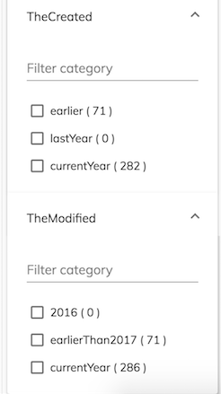

# Alfresco Application Development Framework (ADF) version 3.1.0 Release Note

These release notes provide information about the **3.1.0 release** of the Alfresco Application Development Framework.

This is the latest **General Available** release of the Application Development Framework, which contains the Angular components to build a Web Application on top of the Alfresco Platform.

The release can be found on GitHub at [this location](https://github.com/Alfresco/alfresco-ng2-components/releases/tag/3.1.0).

See the [ADF roadmap](../roadmap.md) for details of features planned for future
versions of ADF. 

## Contents

-   [New package versions](#new-package-versions)
-   [Goals for this release](#goals-for-this-release)
    -   [More on Activiti 7](#more-on-activiti-7)
    -   [Enhanced DocumentList](#enhanced-documentlist)
    -   [Enhanced Metadata viewer](#enhanced-metadata-viewer)
    -   [Search pattern highlight](#search-pattern-highlight)
    -   [Facet Intervals](#facet-intervals)
    -   [SSO Role AuthGuard](#sso-role-authguard)
    -   [Improved accessibility](#improved-accessibility)
    -   [Arabic and RTL languages support](#arabic-and-rtl-languages-support)
    -   [ADF Testing pacakge](#adf-testing-pacakge)
-   [Localisation](#localisation)
-   [References](#references)
-   [Issues addressed](#issues-addressed)
    -   [Documentation](#documentation)
    -   [Feature](#feature)
    -   [Epic](#epic)
    -   [Story](#story)
    -   [Bug](#bug)
    -   [Task](#task)
    -   [Feature (Task)](#feature-task)

## New package versions

    "@alfresco/adf-content-services" : "3.1.0"
    "@alfresco/adf-process-services" : "3.1.0"
    "@alfresco/adf-core" : "3.1.0"
    "@alfresco/adf-insights" : "3.1.0",
    "@alfresco/adf-extensions": "3.1.0"

## Goals for this release

This is the first minor release since ADF version 3 which was released in February 2019.

This release goes a step further in the direction of complete support for [Activiti 7](https://www.activiti.org/), the next generation Cloud Native implementation of Activiti. Also, some enhancements have been introduced to the DocumentList and the Metadata viewer, as a consequence of some requests coming from the eco-system of developers using ADF in complex applications.

Another enhancement introduced in ADF 3.1, is search pattern highlighting, considered as relevant in Share and now available to ADF applications as of this version.

In the area of [accessibility](https://en.wikipedia.org/wiki/Computer_accessibility), the new release of ADF takes advantage of some bugfixes and enhancements related to [Section508](https://www.section508.gov/).

Following the good number of requests coming from developers, we are pleased to announce the official support of Arabic and Right To Left languages in ADF applications. The benefit for the market is clear, opening up to a broader number of potential users and use cases.

Please report issues with this release in the [issue tracker](https://github.com/Alfresco/alfresco-ng2-components/issues/new). You can collaborate on this release or share feedback by using the discussion tools on [Gitter](http://gitter.im/Alfresco/alfresco-ng2-components).

Below are the most important new features of this release:

-   [More on Activiti 7](#more-on-activiti-7)
-   [Enhanced DocumentList](#enhanced-documentlist)
-   [Enhanced Metadata viewer](#enhanced-metadata-viewer)
-   [Search pattern highlight](#search-pattern-highlight)
-   [Facet Intervals](#facet-intervals)
-   [SSO Role AuthGuard](#sso-role-authguard)
-   [Improved accessibility](#improved-accessibility)
-   [Arabic and RTL languages support](#arabic-and-rtl-languages-support)
-   [ADF Testing pacakge](#ADF-testing-pacakge)

### More on Activiti 7

In ADF 3.0.0 (released in February) we announced the introduction of the new `*Cloud` package. This contains a set of components to support [Activiti 7](https://www.activiti.org/), the next generation Cloud Native implementation of Activiti BPM Engine. With the ADF 3.1 release, the journey continues with more supported features, like: 

#### Claim a task

```html
<button adf-claim-task [appName]="appName" [taskId]="taskId" (success)="onTaskClaimed()">Complete</button>
```

For more details refer to the :

-   [Claim task directive](../process-services-cloud/directives/claim-task.directive.md) 

#### EditTaskComponent allows sorting and actions customization

You can supply various _filter properties_ to edit that will determine
which tasks are found by a filter.

By default, the **_id_**,  **_name_**, **_createdDate_** and **_priority_** properties are
displayed in the editor. However, you can also choose which sort properties
to show using the `sortProperties` array.

For more details refer to the :

-   [Edit Task Filter Cloud component](../process-services-cloud/components/edit-task-filter-cloud.component.md) 

#### EditProcessComponent allow sorting and actions customization

You can supply various _filter properties_ to edit that will determine
which tasks are found by a filter.

By default, the **_status_**, **_sort_** and **_order_** properties are
displayed in the editor. However, you can also choose which properties
to show using the `filterProperties` array.

For more details refer to the :

-   [Edit Process Filter Cloud component](../process-services-cloud/components/edit-process-filter-cloud.component.md) 

#### Complete task directive

```html
<button adf-cloud-complete-task [appName]="appName" [taskId]="taskId" (success)="onTaskCompleted()">Complete</button>
```

For more details refer to the :

-   [Complete task directive](../process-services-cloud/directives/complete-task.directive.md) 

### Enhanced DocumentList

Following some suggestions from customers and partners, we enhanced the `Datatable` and `Document List` to allow a "sticky" header.
If you have a long table with many rows, you might want to fix the header in place so it is
always visible. You can do this using the following steps.

First, set the `stickyHeader` property of your datatable to `true`:

```html
<adf-datatable 
    [data]="data"
    [stickyHeader]="true">
</adf-datatable>
```

```html
<adf-document-list
    [data]="data"
    [stickyHeader]="true">
</adf-document-list>
```

For more details refer to the :

-   [Document List Component](../content-services/components/document-list.component.md) 
-   [DataTable component](../core/components/datatable.component.md) 

### Enhanced Metadata viewer

As of this version of ADF, developers can include the full list of types/aspects into the metadata viewer, without the need to specify all of them. The limit of the previous version was that developers were requested to specify the list of types/aspects or an asterisk to say "include all". The use case represented by "include all except X, Y, Z..." was not covered but now it is.

You can list all the properties by simply adding  `includeAll: boolean` to your config. This config will display all the aspects and properties available for that specific file.

```json
"content-metadata": {
    "presets": {
        "default": {
            "includeAll": true
        }
    }
}
```

Futhermore, you can also exclude specific aspects by adding the `exclude` property. It can be either a string if it's only one aspect or an array if you want to exclude multiple aspects at once:

```json
"content-metadata": {
    "presets": {
        "default": {
            "includeAll": true,
            "exclude": "exif:exif"
        }
    }
}
```

For more details refer to the :

-   [Content Metadata Card component](../content-services/components/content-metadata-card.component.md) 

### Search pattern highlight

As another example of good feedback we had from the developers on the ground about improving ADF, we introduced the custom highlighting of results in search. With ADF 3.1, developers can customize the pattern highlighting and the markers to use.

You can configure highlighting using the `search` entry in the `app.config.json` file.
An example query for search highlighting could look like this:

```json
{
    "search": {
      "highlight": {
        "prefix": "¿",
        "postfix": "?",
        "mergeContiguous": true,
        "fields": [
          {
            "field": "cm:title"
          },
          {
            "field": "description",
            "prefix": "(",
            "postfix": ")"
          }
    
        ]
      }
  }
}
```

The example above changes the highlighting prefix and postfix from the default  to '¿?' for all
fields except the "description" field, which uses '()' instead. The highlight information will
then be added in each node entry response.

For more details refer to the :

-   [Search Filter component highlight](../content-services/components/search-filter.component.md#highlight) 

### Facet Intervals

These provide custom categories based on admin defined ranges inside `intervals`.
You can specify exactly what you want for each interval in the config file and you can
use overlapping ranges if necessary.

#### FacetIntervals Properties

| Name | Type | Description |
| ---- | ---- | ----------- |
| intervals | array | Specifies the fields to facet by interval. |
| expanded | boolean | Toggles expanded state of the facet intervals. |

Note: the `sets` parameter from the Search API (which sets the intervals for all fields)
is not yet supported.

```json
{
    "search": {
      "facetIntervals":{
        "expanded": true,
        "intervals":[
          {
            "label":"TheCreated",
            "field":"cm:created",
            "sets":[
              { "label":"lastYear", "start":"2017", "end":"2018", "endInclusive":false },
              { "label":"currentYear", "start":"NOW/YEAR", "end":"NOW/YEAR+1YEAR" },
              { "label":"earlier", "start":"*", "end":"2017", "endInclusive":false }
            ]
          },
          {
            "label":"TheModified",
            "field":"cm:modified",
            "sets":[
              { "label":"2016", "start":"2017", "end":"2018", "endInclusive":false },
              { "label":"currentYear", "start":"NOW/YEAR", "end":"NOW/YEAR+1YEAR" },
              { "label":"earlierThan2017", "start":"*", "end":"2017", "endInclusive":false }
            ]
          }
        ]
      }
  }
}
```

You can specify a value for the `mincount` property inside each `intervals` item to set the minimum count required for a facet interval to be displayed. By default, only the intervals that have 1 or more response entries are displayed at runtime.
Check the [schema.json](https://github.com/Alfresco/alfresco-ng2-components/blob/master/lib/core/app-config/schema.json) file
for further details about the structure and properties of `intervals` that you can set inside the configuration file.

Each defined `intervals` item is collected into its own collapsible category identified uniquely
by its `label`. The code snippet just above will result in the following display of facet intervals:



For more details refer to the :

-   [Facet intervals section of the Search Filter Component docs](../content-services/components/search-filter.component.md#facet-intervals) 

### SSO Role AuthGuard

The [Auth Guard SSO role service](../core/services/auth-guard-sso-role.service.md) implements an Angular
[route guard](https://angular.io/guide/router#milestone-5-route-guards)
to check the user has the right role permission. This is typically used with the
`canActivate` guard check in the route definition. The roles that user needs to have in order to access the route has to be specified in the roles array as in the example below:

```ts
const appRoutes: Routes = [
    ...
    {
        path: 'examplepath',
        component: ExampleComponent,
        canActivate: [ AuthGuardSsoRoleService ],
        data: { roles: ['USER_ROLE1', 'USER_ROLE2']}
    },
    ...
]
```

For more details refer to the :

-   [Facet intervals](../core/services/auth-guard-sso-role.service.md) 

### Improved accessibility

In terms of [accessibility](https://en.wikipedia.org/wiki/Computer_accessibility), ADF version 3.1 introduces some bug fixes kindly requested from some customers and partners about [Section508](https://www.section508.gov/). Alfresco plans to introduce more enhancements from this point of view, so more improvements will be added in the next releases.

### Arabic and RTL languages support

Due to regular requests, we also decided to support the Arabic language in ADF. In ADF 3.1 the team introduces another new feature by starting the first iteration of support for Right To Left languages. Starting from ADF version 3.1, you can (easily) [change an ADF application to work correctly with a RTL language](../user-guide/rtl-support.md).

We are quite happy with the current support of RTL languages on ADF, but feedback is welcome if you find something that could be improved or added for a better user experience.

### ADF Testing pacakge

If you are creating e2e in your project where ADF is involved we have started to export some utils and pages in the package @alfresco/adf-testing pacakges. 

## Localisation

This release includes: French, German, Italian, Spanish, Arabic, Japanese, Dutch, Norwegian (Bokmål), Russian, Brazilian Portuguese and Simplified Chinese versions.

In the next version we plan to include as supported languages also: Danish, Finnish, Swedish, Czech, Polish.

## References

Below is a brief list of references to help you start using the new release:

-   [Getting started guides with Alfresco Application Development Framework](https://community.alfresco.com/community/application-development-framework/pages/get-started)
-   [Alfresco ADF Documentation on the Builder Network](../README.md)
-   [Gitter chat supporting Alfresco ADF](https://gitter.im/Alfresco/alfresco-ng2-components)
-   [ADF examples on GitHub](https://github.com/Alfresco/adf-examples)
-   [Official GitHub Project - alfresco-ng2-components](https://github.com/Alfresco/alfresco-ng2-components)
-   [Official GitHub Project - alfresco-js-api](https://github.com/Alfresco/alfresco-js-api)
-   [Official GitHub Project - generator-ng2-alfresco-app](https://github.com/Alfresco/generator-ng2-alfresco-app)

Please refer to the [official documentation](http://docs.alfresco.com/) for further details and suggestions.

## Issues addressed

Below is the list of JIRA issues that were closed for this release.

### Documentation

-   [ADF-271](https://issues.alfresco.com/jira/browse/ADF-271) -         ADD all valid fields that the tasklist can display - 1643 Github

-   [ADF-449](https://issues.alfresco.com/jira/browse/ADF-449) -         Missing documentation for content-action in Data table

-   [ADF-588](https://issues.alfresco.com/jira/browse/ADF-588) -         tasks/processes  - more documentation about the available fields

-   [ADF-3040](https://issues.alfresco.com/jira/browse/ADF-3040) -         Markdown templates sometimes add whitespace incorrectly

-   [ADF-4008](https://issues.alfresco.com/jira/browse/ADF-4008) -         Add the documentation for the default columns available in adf-process-list-cloud

-   [ADF-4146](https://issues.alfresco.com/jira/browse/ADF-4146) -         How to migrate an application from ADF 2.6 to ADF 3.0

-   [ADF-4152](https://issues.alfresco.com/jira/browse/ADF-4152) -         Add subfolders to docs library folders to represent class types

-   [ADF-4160](https://issues.alfresco.com/jira/browse/ADF-4160) -         Clarify the behaviour of the InfoDrawer configuration for default \*

-   [ADF-4189](https://issues.alfresco.com/jira/browse/ADF-4189) -         Improve `allowDropFiles` prop description for Document List docs

-   [ADF-4190](https://issues.alfresco.com/jira/browse/ADF-4190) -         Fix source file paths generated by auto-linking tools

-   [ADF-4228](https://issues.alfresco.com/jira/browse/ADF-4228) -         Tutorial on how to switch an ADF app to be able to support RTL languages

-   [ADF-4239](https://issues.alfresco.com/jira/browse/ADF-4239) -         Update introduction text

-   [ADF-4249](https://issues.alfresco.com/jira/browse/ADF-4249) -         Doc review for 3.1

-   [ADF-4260](https://issues.alfresco.com/jira/browse/ADF-4260) -         How to migrate an application from ADF 3.0 to ADF 3.1

-   [ADF-4262](https://issues.alfresco.com/jira/browse/ADF-4262) -         Release note for version 3.1.0

-   [ADF-4285](https://issues.alfresco.com/jira/browse/ADF-4285) -         The documentation of [content metadata component](../../lib/content-services/content-metadata/components/content-metadata/content-metadata.component.ts) is misleading

-   [ADF-4294](https://issues.alfresco.com/jira/browse/ADF-4294) -         Creating the list of third party Open Source for ADF 3.1 (to be done as last task)

-   [ADF-4300](https://issues.alfresco.com/jira/browse/ADF-4300) -         Add the sort properties for edit task cloud component

### Feature

-   [ADF-3497](https://issues.alfresco.com/jira/browse/ADF-3497) -         Facet intervals on search filter

-   [ADF-3677](https://issues.alfresco.com/jira/browse/ADF-3677) -         [`SearchQueryBuilderService`](../content-services/services/search-query-builder.service.md) to support highlight

-   [ADF-3735](https://issues.alfresco.com/jira/browse/ADF-3735) -         SSO Login Error for [login component](../core/components/login.component.md)

-   [ADF-3798](https://issues.alfresco.com/jira/browse/ADF-3798) -         [Demo Shell][aps2] Show Task list related to a Process

-   [ADF-4003](https://issues.alfresco.com/jira/browse/ADF-4003) -         Add roles filtering to [`PeopleCloudComponent`](../process-services-cloud/components/people-cloud.component.md)

-   [ADF-4078](https://issues.alfresco.com/jira/browse/ADF-4078) -         Fixed headers in the document list

-   [ADF-4099](https://issues.alfresco.com/jira/browse/ADF-4099) -         The metadata group is always showed even though the properties are not there

-   [ADF-4122](https://issues.alfresco.com/jira/browse/ADF-4122) -         Sticky header on DataTable

-   [ADF-4125](https://issues.alfresco.com/jira/browse/ADF-4125) -         Simplify extension load in extension module

-   [ADF-4127](https://issues.alfresco.com/jira/browse/ADF-4127) -         Claim a task on the new generation of BPM engines

-   [ADF-4128](https://issues.alfresco.com/jira/browse/ADF-4128) -         Task Cloud completion/back

-   [ADF-4162](https://issues.alfresco.com/jira/browse/ADF-4162) -         Adding the "includeAll" type of object to the presets configurations of the InforDrawer

-   [ADF-4221](https://issues.alfresco.com/jira/browse/ADF-4221) -         Avoiding to show a group of metadata, if any of the properties are empty

-   [ADF-4225](https://issues.alfresco.com/jira/browse/ADF-4225) -         Viewer extension accept multiple file type

-   [ADF-4267](https://issues.alfresco.com/jira/browse/ADF-4267) -         Sticky header on Document List

### Epic

-   [ADF-9](https://issues.alfresco.com/jira/browse/ADF-9) -         Document list feature

-   [ADF-14](https://issues.alfresco.com/jira/browse/ADF-14) -         Destination picker (copy/move)

-   [ADF-262](https://issues.alfresco.com/jira/browse/ADF-262) -         File viewer

-   [ADF-1452](https://issues.alfresco.com/jira/browse/ADF-1452) -         Documentation

-   [ADF-1463](https://issues.alfresco.com/jira/browse/ADF-1463) -         Adding of automated tests

-   [ADF-3296](https://issues.alfresco.com/jira/browse/ADF-3296) -         APS 2.x & Activiti 7 compatibility

-   [ADF-3349](https://issues.alfresco.com/jira/browse/ADF-3349) -         Activiti 7+ support

-   [ADF-3741](https://issues.alfresco.com/jira/browse/ADF-3741) -         Support for Activiti version 7 (and APS 2), maintaining the backward compatibility with APS 1.x.

-   [ADF-3742](https://issues.alfresco.com/jira/browse/ADF-3742) -         Extensibility of ADF applications

-   [ADF-3857](https://issues.alfresco.com/jira/browse/ADF-3857) -         Accessibility

-   [ADF-4246](https://issues.alfresco.com/jira/browse/ADF-4246) -         Testing Microsoft Internet Explorer

### Story

-   [ADF-2129](https://issues.alfresco.com/jira/browse/ADF-2129) -         Results highlighting (P2)

-   [ADF-3472](https://issues.alfresco.com/jira/browse/ADF-3472) -         Whitelisting metadata by default with the ability to hide some of them by configuration
                        

### Bug

-   [ADF-1713](https://issues.alfresco.com/jira/browse/ADF-1713) -         Small adjustments for Task and Process for consistency - Demo Shell

-   [ADF-1954](https://issues.alfresco.com/jira/browse/ADF-1954) -         [IE11] Breadcrumbs are not well aligned

-   [ADF-2971](https://issues.alfresco.com/jira/browse/ADF-2971) -         Mandatory search config

-   [ADF-3401](https://issues.alfresco.com/jira/browse/ADF-3401) -         The filter facets are not reseted when user makes a new search query 

-   [ADF-3444](https://issues.alfresco.com/jira/browse/ADF-3444) -         Site list displays only a certain number of sites.

-   [ADF-3604](https://issues.alfresco.com/jira/browse/ADF-3604) -         'Sign in' and copyrights is displayed on login dialog from 'Attach Folder' from Share.

-   [ADF-3678](https://issues.alfresco.com/jira/browse/ADF-3678) -         Custom Process Filter - Different results in APS than in ADF 

-   [ADF-3843](https://issues.alfresco.com/jira/browse/ADF-3843) -         Is not possible to change theInfinite pagination pageSize

-   [ADF-3861](https://issues.alfresco.com/jira/browse/ADF-3861) -         [508 compliance] Multi-select, hamburger menu (row-based action menu) should be 508 compliant

-   [ADF-3862](https://issues.alfresco.com/jira/browse/ADF-3862) -         [508 compliance] Documents and images should be readable

-   [ADF-3863](https://issues.alfresco.com/jira/browse/ADF-3863) -         [508 compliance] The user should be informed of what the label is that he/she is selecting

-   [ADF-3878](https://issues.alfresco.com/jira/browse/ADF-3878) -         Created date value of Column column should be in upper case

-   [ADF-3934](https://issues.alfresco.com/jira/browse/ADF-3934) -         [People Cloud Component](../process-services-cloud/components/people-cloud.component.md) - Remove the concept of assignee

-   [ADF-3979](https://issues.alfresco.com/jira/browse/ADF-3979) -         [`GroupCloudComponent`](../process-services-cloud/components/group-cloud.component.md) should be able to detect "preSelectGroups" input changes

-   [ADF-3989](https://issues.alfresco.com/jira/browse/ADF-3989) -         The list of apps in 'appName' filter  is duplicated after switching between saved filters 

-   [ADF-3995](https://issues.alfresco.com/jira/browse/ADF-3995) -         'ProcessInstanceId' value is not displayed into a saved filter

-   [ADF-4023](https://issues.alfresco.com/jira/browse/ADF-4023) -         [Demo-shell] Pagination layout is broken in Process List Cloud

-   [ADF-4058](https://issues.alfresco.com/jira/browse/ADF-4058) -         Process Cloud - 502 Bad Gateway when try to create an task or an process 

-   [ADF-4065](https://issues.alfresco.com/jira/browse/ADF-4065) -         The input field to add comments is visible when permission is denied.

-   [ADF-4068](https://issues.alfresco.com/jira/browse/ADF-4068) -         Tasks - Able to add a description with spaces

-   [ADF-4076](https://issues.alfresco.com/jira/browse/ADF-4076) -         Error when accessing Active Task after closing process diagram

-   [ADF-4097](https://issues.alfresco.com/jira/browse/ADF-4097) -         [Demo shell] Add comment button not displayed in Comment section

-   [ADF-4143](https://issues.alfresco.com/jira/browse/ADF-4143) -         LastModifiedFrom and LastModifiedTo fields of [edit task filter cloud component](../process-services-cloud/components/edit-task-filter-cloud.component.md) validations are wrong

-   [ADF-4148](https://issues.alfresco.com/jira/browse/ADF-4148) -         [kerberos] Text [Viewer Component](../core/components/viewer.component.md) not passing the withCredentials parameter 

-   [ADF-4153](https://issues.alfresco.com/jira/browse/ADF-4153) -         Unable to open the Task Details page.

-   [ADF-4154](https://issues.alfresco.com/jira/browse/ADF-4154) -         Unit tests failing after upgrade to ADF 3.1.0-beta3

-   [ADF-4156](https://issues.alfresco.com/jira/browse/ADF-4156) -         Regression in [`TaskListComponent`](../process-services/components/task-list.component.md) Caused by in-place Date Formatting

-   [ADF-4165](https://issues.alfresco.com/jira/browse/ADF-4165) -         ADF 3.0 Not able to login with implicitFlow false

-   [ADF-4179](https://issues.alfresco.com/jira/browse/ADF-4179) -         adf- prefix missing - style not applied to facet-buttons

-   [ADF-4183](https://issues.alfresco.com/jira/browse/ADF-4183) -         Login dialog does not redirect correctly after page reload

-   [ADF-4196](https://issues.alfresco.com/jira/browse/ADF-4196) -         Datatable component not always selects the row after click

-   [ADF-4199](https://issues.alfresco.com/jira/browse/ADF-4199) -         The 'Locally set' permission label is not displayed properly in the UI screen.

-   [ADF-4202](https://issues.alfresco.com/jira/browse/ADF-4202) -         Not able to start a standalone task using [start task cloud component](../process-services-cloud/components/start-task-cloud.component.md)

-   [ADF-4205](https://issues.alfresco.com/jira/browse/ADF-4205) -         Error in console when User tries to add user or group to permissions.

-   [ADF-4215](https://issues.alfresco.com/jira/browse/ADF-4215) -         Locale doesn't change when a user changes the browser locale

-   [ADF-4220](https://issues.alfresco.com/jira/browse/ADF-4220) -         [SSO] Not able to login with implicitFlow false after changing the config

-   [ADF-4229](https://issues.alfresco.com/jira/browse/ADF-4229) -         Big space issue in case of RTL ADF application

-   [ADF-4230](https://issues.alfresco.com/jira/browse/ADF-4230) -         Pagination arrows in the wrong order, in case or RTL ADF application

-   [ADF-4281](https://issues.alfresco.com/jira/browse/ADF-4281) -         Completed processes default filters is not doing the correct call

-   [ADF-4282](https://issues.alfresco.com/jira/browse/ADF-4282) -         The name of the content is not well aligned in documentList on small devices

-   [ADF-4287](https://issues.alfresco.com/jira/browse/ADF-4287) -         The alignment in datatable is wrong

-   [ADF-4301](https://issues.alfresco.com/jira/browse/ADF-4301) -         [Accessibility] Not able to navigate through tasks in task list using tab

-   [ADF-4305](https://issues.alfresco.com/jira/browse/ADF-4305) -         DocumentList - CardViewMode - Field values missing in the display.

-   [ADF-4313](https://issues.alfresco.com/jira/browse/ADF-4313) -         [Demo shell][form](../../lib/process-services/task-list/models/form.model.ts) field looks like an editable field in task header after task was completed

-   [ADF-4316](https://issues.alfresco.com/jira/browse/ADF-4316) -         [People component](../process-services/components/people.component.md) table is not well aligned

-   [ADF-4318](https://issues.alfresco.com/jira/browse/ADF-4318) -         Process definition is not automatically selected if the app contains more than one

### Task

-   [ADF-3873](https://issues.alfresco.com/jira/browse/ADF-3873) -         Create automated tests for edit process filters

-   [ADF-3888](https://issues.alfresco.com/jira/browse/ADF-3888) -         Implement automated tests for all the properties of task list and edit task filters components

-   [ADF-3976](https://issues.alfresco.com/jira/browse/ADF-3976) -         EditTaskComponent - Be able to customise the sorting and actions

-   [ADF-3977](https://issues.alfresco.com/jira/browse/ADF-3977) -         EditProcessComponent - Be able to change the sort and actions

-   [ADF-3978](https://issues.alfresco.com/jira/browse/ADF-3978) -         Travis on dev branch - should not run the jobs  Create docker pr  Deploy docker pr

-   [ADF-3981](https://issues.alfresco.com/jira/browse/ADF-3981) -         Automate [Login Component](../core/components/login.component.md) manual test C291854

-   [ADF-3986](https://issues.alfresco.com/jira/browse/ADF-3986) -         [ProcessListCloudComponent] Be able to filter process with all possible params

-   [ADF-4004](https://issues.alfresco.com/jira/browse/ADF-4004) -         Automate attach file test case

-   [ADF-4012](https://issues.alfresco.com/jira/browse/ADF-4012) -         Automate ADF-3872 - to be able to set default columns in adf-process-list-cloud

-   [ADF-4015](https://issues.alfresco.com/jira/browse/ADF-4015) -         automate ADF-3982 - Should be able to filter tasks with all possible params

-   [ADF-4045](https://issues.alfresco.com/jira/browse/ADF-4045) -         Automate test infinite pagination delete

-   [ADF-4048](https://issues.alfresco.com/jira/browse/ADF-4048) -         PeopleCloud - Improve the preselectUsers

-   [ADF-4061](https://issues.alfresco.com/jira/browse/ADF-4061) -         Automate test for navigating to a non empty folder in >= 2nd page

-   [ADF-4064](https://issues.alfresco.com/jira/browse/ADF-4064) -         Remove multiple elements locators

-   [ADF-4067](https://issues.alfresco.com/jira/browse/ADF-4067) -         [APS2] Application Name input should have the same name in all components

-   [ADF-4083](https://issues.alfresco.com/jira/browse/ADF-4083) -         Parse 'escaped' empty spaced labels inside facetFields or facetIntervals

-   [ADF-4089](https://issues.alfresco.com/jira/browse/ADF-4089) -         contentListPage refactoring

-   [ADF-4094](https://issues.alfresco.com/jira/browse/ADF-4094) -         Automate Permissions Component

-   [ADF-4121](https://issues.alfresco.com/jira/browse/ADF-4121) -         Fixing failing e2e tests

-   [ADF-4123](https://issues.alfresco.com/jira/browse/ADF-4123) -         Process Cloud Instance Details Header component

-   [ADF-4124](https://issues.alfresco.com/jira/browse/ADF-4124) -         [Demo Shell] TaskListCloud with the filter on a Process instance

-   [ADF-4132](https://issues.alfresco.com/jira/browse/ADF-4132) -         [Artificial Intelligence] Smart viewer for ADF recognising entities

-   [ADF-4145](https://issues.alfresco.com/jira/browse/ADF-4145) -         [Artificial Intelligence] Transformation Services added to the ACS instance in the ADF development pipeline

-   [ADF-4147](https://issues.alfresco.com/jira/browse/ADF-4147) -         Add a way to test selectionMode on demo-shell for [task list cloud component](../process-services-cloud/components/task-list-cloud.component.md)

-   [ADF-4149](https://issues.alfresco.com/jira/browse/ADF-4149) -         e2e tests - Move the pages from the e2e folder to the adf-testing

-   [ADF-4155](https://issues.alfresco.com/jira/browse/ADF-4155) -         AppList - be able to show the list of apps even in case the deployment service is missing

-   [ADF-4158](https://issues.alfresco.com/jira/browse/ADF-4158) -         No Alfresco-supplied docker image should run as root

-   [ADF-4159](https://issues.alfresco.com/jira/browse/ADF-4159) -         DemoShell add nested-menu

-   [ADF-4184](https://issues.alfresco.com/jira/browse/ADF-4184) -         Add Arabic i18n support 

-   [ADF-4192](https://issues.alfresco.com/jira/browse/ADF-4192) -         Remove spinner check from editTaskFilter tests

-   [ADF-4195](https://issues.alfresco.com/jira/browse/ADF-4195) -         Automate tests for SSO login with implicitFlow false

-   [ADF-4201](https://issues.alfresco.com/jira/browse/ADF-4201) -         [About component](../core/components/about.component.md) improvements

-   [ADF-4208](https://issues.alfresco.com/jira/browse/ADF-4208) -         [E2E] Make the pipeline green again !

-   [ADF-4217](https://issues.alfresco.com/jira/browse/ADF-4217) -         [Yeoman generator] Remove APS2 and leave Activiti only.

-   [ADF-4222](https://issues.alfresco.com/jira/browse/ADF-4222) -         Fix the compilation errors on the Development branch, so that this can be added to the rules.

-   [ADF-4223](https://issues.alfresco.com/jira/browse/ADF-4223) -         Export folder-name dialog validators 

-   [ADF-4233](https://issues.alfresco.com/jira/browse/ADF-4233) -         DemoShell - Change nested menu layout 

### Feature (Task)

-   [ADF-3945](https://issues.alfresco.com/jira/browse/ADF-3945) -         Provide a way to change the infinite pagination pageSize

-   [ADF-4038](https://issues.alfresco.com/jira/browse/ADF-4038) -         Add appName filter parameter for people/group demo component

-   [ADF-4095](https://issues.alfresco.com/jira/browse/ADF-4095) -         Automate C268974 - Inherit Permission

-   [ADF-4100](https://issues.alfresco.com/jira/browse/ADF-4100) -         Automate C274691 Dropdown menu

-   [ADF-4101](https://issues.alfresco.com/jira/browse/ADF-4101) -         Automate C276978 - Add user

-   [ADF-4102](https://issues.alfresco.com/jira/browse/ADF-4102) -         Automate - C276980 - Duplicate user/group

-   [ADF-4103](https://issues.alfresco.com/jira/browse/ADF-4103) -         Automate - C276982 - Remove User/Group

-   [ADF-4104](https://issues.alfresco.com/jira/browse/ADF-4104) -         Automate - C277014 - Role - Dropdown

-   [ADF-4105](https://issues.alfresco.com/jira/browse/ADF-4105) -         Automate C277002 - Role - Site Dropdown

-   [ADF-4106](https://issues.alfresco.com/jira/browse/ADF-4106) -         Automate C276993 - Role - Consumer

-   [ADF-4107](https://issues.alfresco.com/jira/browse/ADF-4107) -         Automate C276994 - Role - Site Consumer

-   [ADF-4108](https://issues.alfresco.com/jira/browse/ADF-4108) -         Automate - C276996 - Role - Contributor

-   [ADF-4109](https://issues.alfresco.com/jira/browse/ADF-4109) -         Automate C276997 - Role - Site Contributor

-   [ADF-4110](https://issues.alfresco.com/jira/browse/ADF-4110) -         Automate - C277000 - Role - Editor

-   [ADF-4111](https://issues.alfresco.com/jira/browse/ADF-4111) -         Automate C277003 - Role - Collaborator

-   [ADF-4112](https://issues.alfresco.com/jira/browse/ADF-4112) -         Automate C277005 Role - Site Collaborator

-   [ADF-4113](https://issues.alfresco.com/jira/browse/ADF-4113) -         Automate C277004 Role - Coordinator

-   [ADF-4114](https://issues.alfresco.com/jira/browse/ADF-4114) -         Automate - C277006 Role - Site Manager

-   [ADF-4115](https://issues.alfresco.com/jira/browse/ADF-4115) -         Automate C277100 - EVERYONE group

-   [ADF-4116](https://issues.alfresco.com/jira/browse/ADF-4116) -         Automate C277118 - Site Consumer - Add new version

-   [ADF-4117](https://issues.alfresco.com/jira/browse/ADF-4117) -         Automate C279881 - No permissions

-   [ADF-4120](https://issues.alfresco.com/jira/browse/ADF-4120) -         automate ADF-3989 - The list of apps in 'appName' filter is duplicated after switching between saved filters

-   [ADF-4126](https://issues.alfresco.com/jira/browse/ADF-4126) -         Automate ADF-4003 - Add roles filtering to [`PeopleCloudComponent`](../process-services-cloud/components/people-cloud.component.md)

-   [ADF-4129](https://issues.alfresco.com/jira/browse/ADF-4129) -         Automate ADF-4066 - Task doesn't have an assignee when the assignee is empty from Start Task form

-   [ADF-4151](https://issues.alfresco.com/jira/browse/ADF-4151) -         Automation test for code editor displayed when opening a .js file

-   [ADF-4166](https://issues.alfresco.com/jira/browse/ADF-4166) -         Move apps-section-cloud.e2e.ts to adf-testing

-   [ADF-4197](https://issues.alfresco.com/jira/browse/ADF-4197) -         Automation test for redirection after page reload

-   [ADF-4209](https://issues.alfresco.com/jira/browse/ADF-4209) -         [E2E] Fix Core tests

-   [ADF-4210](https://issues.alfresco.com/jira/browse/ADF-4210) -         [E2E] Fix Content-services and Search tests

-   [ADF-4211](https://issues.alfresco.com/jira/browse/ADF-4211) -         Fix process-services-cloud tests

-   [ADF-4218](https://issues.alfresco.com/jira/browse/ADF-4218) -         [E2E] Fix Insight tests

-   [ADF-4226](https://issues.alfresco.com/jira/browse/ADF-4226) -         Implement automated test for infinitePagination

-   [ADF-4244](https://issues.alfresco.com/jira/browse/ADF-4244) -         Fix search tests

Please refer to the [Alfresco issue tracker](https://issues.alfresco.com/jira/projects/ADF/issues/ADF-581?filter=allopenissues) for other known issues in this release. If you have any questions about the release, please contact us using [Gitter](https://gitter.im/Alfresco/alfresco-ng2-components).

Thanks to the whole application team and the amazing Alfresco community for the hard work.
