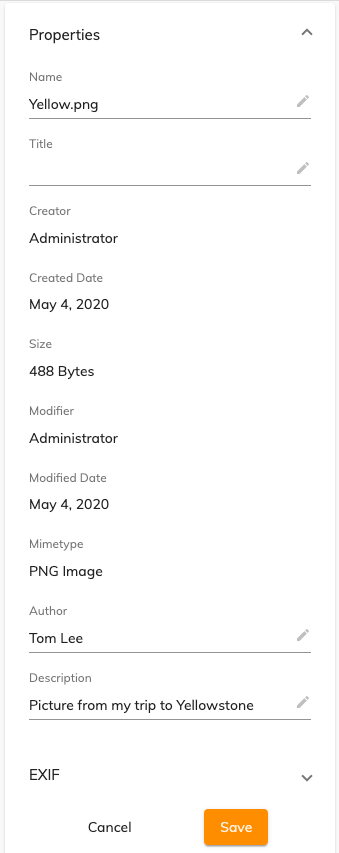

# Alfresco Application Development Framework (ADF) version 3.8.0 Release Note

These release notes provide information about the **3.8.0 release** of the Alfresco Application Development Framework.

This is the latest **General Available** release of the Application Development Framework, which contains the Angular components to build a Web Application on top of the Alfresco Platform.

The release can be found on GitHub at [this location](https://github.com/Alfresco/alfresco-ng2-components/releases/tag/3.8.0).

See the [ADF roadmap](../roadmap.md) for details of features planned for future versions of ADF. 

## Contents

-   [New package versions](#new-package-versions)
-   [Goals for this release](#goals-for-this-release)
    -   [Additional support for content and metadata management](#additional-support-for-content-and-metadata-management)
    -   [Improved accessibility](#improved-accessibility)
-   [Localisation](#localisation)
-   [References](#references)
-   [Issues addressed](#issues-addressed)

## New package versions

    "@alfresco/adf-content-services" : "3.8.0"
    "@alfresco/adf-process-services" : "3.8.0"
    "@alfresco/adf-core" : "3.8.0"
    "@alfresco/adf-insights" : "3.8.0",
    "@alfresco/adf-extensions": "3.8.0"
    "@alfresco/adf-testing": "3.8.0"
    "@alfresco/adf-cli": "3.8.0"

## Goals for this release

This is the seventh minor release of ADF since February 2019 when version 3.0.0 was released.

The highlights of this release include [additional support for content and metadata management](https://issues.alfresco.com/jira/browse/ADF-5108) as well as [improved accessibility](https://issues.alfresco.com/jira/browse/ADF-5089) and better support of [Activiti 7](https://www.activiti.org/).

Please report issues with this release in the [issue tracker](https://github.com/Alfresco/alfresco-ng2-components/issues/new). You can collaborate on this release or share feedback by using the discussion tools on [Gitter](http://gitter.im/Alfresco/alfresco-ng2-components).

### Additional support for content and metadata management

After some time  the content and metadata management hasn't been loved enough, with this version of ADF there are a good number of improvements on the way to consume content metadata in ADF components and ADF based applications. Most of them are developed for an improved and more appealing end-user experience.

#### Revised Content Metadata Component

As one of the most requested enhancements, it would be valuable to highlight the changed User Experience in the metadata editing on the adf-card-view-component ([ADF-4900](https://issues.alfresco.com/jira/browse/ADF-4900)).

ADF's Content Metadata Component has been revised with a fresh new style for a better user experience. Fields look much more uniform and the interaction with them has been simplified to avoid unwanted changes. 

This new version will make it clearer than ever to know what aspects can be changed and also how they can be saved.



Check [ADF-5108](https://issues.alfresco.com/jira/browse/ADF-5108) for the full list of issues done.

### Improved accessibility
To help the accessibility of ADF based applications, some colour changes have been developed with the purpose to reach the AA Accessibility. Check 1.  [ADF-5089](https://issues.alfresco.com/jira/browse/ADF-5089) for the full list of issues done.

## Localisation

This release includes: Arabic, Brazilian Portuguese, Czech, Danish, Dutch, Finnish, French, German, Italian, Japanese, Norwegian (Bokmål), Polish, Russian, Simplified Chinese, Spanish and Swedish versions.

## References

The following is a brief list of references to help you get started with the new release:

-   [Getting started guides with Alfresco Application Development Framework](https://community.alfresco.com/community/application-development-framework/pages/get-started)
-   [Alfresco ADF Documentation on the Builder Network](../README.md)
-   [Gitter chat supporting Alfresco ADF](https://gitter.im/Alfresco/alfresco-ng2-components)
-   [ADF examples on GitHub](https://github.com/Alfresco/adf-examples)
-   [Official GitHub Project - alfresco-ng2-components](https://github.com/Alfresco/alfresco-ng2-components)
-   [Official GitHub Project - alfresco-js-api](https://github.com/Alfresco/alfresco-js-api)
-   [Official GitHub Project - generator-ng2-alfresco-app](https://github.com/Alfresco/generator-ng2-alfresco-app)

Please refer to the [official documentation](http://docs.alfresco.com/) for further details and suggestions.

## Issues addressed
                        
```
[ADF-5134] REGRESSION - Fix People and Group Components firing twice 
ALL 16 LANGUAGES - fix for LOC-212 - updated localised files for ADF 3.8 
[ADF-5123] C315268 not working correctly 
[AAE-2505] [PS cloud] Should not allow to start the process if is not created 
[ACA-3229] - fixed error on start process cloud when all the value a… 
[ADF-5122] Unexclude C309674 test
[AAE-2487] Fix Checkbox Widget bug  
[ACA-3232] Fix console error expression has changed after it has…
[PRODDEL-3086] Release note in draft for 3.8.0.   documentation
[DW-1530] - created extra method for process definition key set on fi… 
[ACA-3040]Modify some methods of start-process PO 
[ADF-5132] Review UI strings  
[ADF-5129][ADF-5130] Fix Lock in Gallery view and Lock Dialog  
[AAE-2456] - Added a new function for generate lowercase and number strings 
[AAE-2020] Add release version filter for process instances 
[ADF-4900] Card View and Metadata Components refactoring 
[AAE-2321] Should not be able to start a process with space(s) in the beginning/end of process name (Process Services Cloud)  
[ACA-1894] - fixed missing behaviour for drag&drop  
[MNT-21469] TreeView component has events on icon only  
[DW-1669] [ADF-5107]- Added new api call for creating and starting a process in… 
[ACA-1894] - added the possibility to filter whenever is possible by … 
[ACA-3191] Remove adding Alfresco suffix by default in the repo name 
[ADF-5120] Fix initialization error of PS cloud Services  
[ACA-2523] Fix text color of comment user icon 
[ACA-3023]Refactor APS1 PO and ACS API calls of ADF testing package 
[ADF-5118] Enable E2E   
[ACA-3174] Add custom icons for processes and tasks 
[ACA-3170] Task/Process Add the sticky header feature  
[ACA-30333] FE - [Process-services] Create ADF task form. 
[AAE-1936] Attach File E2E APS1 
[ACA-2523] Update comment text colors  
[ADF-5106] allow to redefine form widgets (APS 1.x and cloud)  
[ACA-3080] Remove selecting first filter by default when no defaults …  
[ACA-3040] Refactor/and move to testing package POs and API calls  
[ACA-3020] Start process on process cloud updated the labels (always floating) 
[AAE-2321] Should not be able to start a process with space as name (Process Services) 
[ACA-2556] Change checking and welcome colors in login button  
[AAE-1948] Form Attach File cloud widget E2E 
[ADF-5116] Make ADF's pipeline GREEN again  
[ACA-2734] Fix API - Return an error in case the response isn't a json  
[ACA-2948] Add API to fetch the bpm properties  
[ACA-2520] Opacity of tab label of info drawer set to 1  
[ACA-2523] Change comment colors  
[ADF-5114] Change dialog action button color  
[ADF-155] Tags displayed only when they are referenced at least once  
[AAE-1929] Attach Folder APS1 E2E  
[ACA-2476] Fix color contrast in mat-calendar and mat-datetimepicker-calendar  
[ACA-2493] Fix disabled create folder button color  
[#5561] Translate notification action value  
[ACA-3000][ACA-2999] FE - Provide way to show ContextMenu on Task/Process list  
[ACA-2983] Changed the labels from the inputs name and type to always floating  
[AAE-2200] Add dynamic title to attach-file-widget-dialog  
[ADF-5105] Force color of header button of upload dialog  
[ADF-5104] Change color of location text  
[ADF-1881] Consolidate NodeService and NodesApiService  
[ADF-5102] Added indeterminate state for 'select all' in datatable  
[ADF-4264] Fixed the breadcrumb when changing to custom site in node selector  
[ACA-2951]Add APS1 calls to adf testing package  
[ADF-4264] Fixed the breadcrumb when changing to custom site in node selector  
[ADF-5101] Change empty folder text display colors  
[AAE-2200] Fix upload dialog title  
[ADF-3726] Enable/disable Copy to clipboard in Metadata from config  
[ADF-5091] Fix undefined accent variable  
[AAE-2202] Not able to search for files  
[ACA-2956] Add event emitter when processDefinition selection changes…  
[ADF-5095] Update text color of share dialog  
[ADF-5091] Change info drawer labels color  
[ADF-5093] Change datepicker color  
[ADF-5090] Change color of input button  
[ADF-5094] Changed focused chip color  
[ADF-5096] Icon on move dialog darker  
[ADF-5092] Change card view label color  
[AAE-2041] [APS-1] [ADF] download process audit log not working  
[ADF-4933] Adding keydown event on data row to simulate double click when pressing 'enter' key  
[AAE-2198] Error thrown on start process with pre-selected multiple files on start form.  
[ADF-3726] Add copy to clipboard support to card view properties  
[ACA-2368] UI Issues while editing Metadata in the Preview Page #1091  
[ADF-4341] Customise the property title into the InfoDrawer from configuration
[ADF-4559] Add chips to multivalue metadata properties  
[ACA-2474] - Card View DateItem - Calendar Accessibility Fixes  Accessibility  
[AAE-1725] ADF Task/Process filters - default filters should be recreated when they all get deleted  
[ADF-4673] Add editable property to metadata config  
[ACA-2789] - edit button a11y fixes  Accessibility   
[ACA-2597] search chip list accessibility  Accessibility  
[ACA-2566][ACA-2567] permissions a11y fixes  
[ACA-2567] - Data Table - Sortable SR text update  Accessibility  needs rebase
[ACA-2568] Permission-List - Removal of List ARIA  Accessibility PR: reviewed-changes-requested  
[ACA-2614] fix share link dialog header a11y  
[ADF-5087] Document List - custom sources 'where' clause not passed  
[AAE-1579] Fixing the style of the prefix of amount widget  
[ACA-2619][ACA-2616] a11y fixes for Share Link dialog  Accessibility   
[AAE-1772]Add CardSelectItemPage PO  
[AAE-1841] - added delete directive test  
[ADF-4522] Metadata value is not rolled back upon error  
[ADF-4856] Core refactor - be able to run ng build  PR: reviewed-changes-requested needs rebase
[ADF-4888] DocumentList - cell header title is announced over cell value  Accessibility
[AAE-1923] Form APS E2E  
[ACA-2618][ACA-2619] Share Dialog - Physical Labels  Accessibility  
[AAE-1923] Multilingual form unit test  
calendar card item a11y fixes  
[ADF-4559] Add chips to multivalue metadata properties  
[ACA-2474] - Card View DateItem - Calendar Accessibility Fixes  Accessibility  
[AAE-1725] ADF Task/Process filters - default filters should be recreated when they all get deleted  
[ADF-4673] Add editable property to metadata config  
[ACA-2789] - edit button a11y fixes  Accessibility   
[ACA-2597] search chip list accessibility  Accessibility  
[ACA-2566][ACA-2567] permissions a11y fixes  
[ACA-2567] - Data Table - Sortable SR text update  Accessibility  needs rebase
[ACA-2568] Permission-List - Removal of List ARIA  Accessibility PR: reviewed-changes-requested  
[ACA-2614] fix share link dialog header a11y  
[ADF-5087] Document List - custom sources 'where' clause not passed  
[AAE-1579] Fixing the style of the prefix of amount widget  
[ACA-2619][ACA-2616] a11y fixes for Share Link dialog  Accessibility   
[AAE-1772]Add CardSelectItemPage PO  
[AAE-1895]Add CardSelectItemPage PO  
[AAE-1841] - added delete directive test  
[ADF-4522] Metadata value is not rolled back upon error  
[ADF-4856] Core refactor - be able to run ng build  PR: reviewed-changes-requested needs rebase
[ADF-4888] DocumentList - cell header title is announced over cell value  Accessibility
[AAE-1923] Form APS E2E  
[ACA-2618][ACA-2619] Share Dialog - Physical Labels  Accessibility  
[AAE-1923] Multilingual form unit test  
 ```                      

Please refer to the [Alfresco issue tracker](https://issues.alfresco.com/jira/projects/ADF/issues/ADF-581?filter=allopenissues) for other known issues in this release. If you have any questions about the release, please contact us using [Gitter](https://gitter.im/Alfresco/alfresco-ng2-components).

Thanks to the whole application team and the amazing Alfresco community for the hard work.
