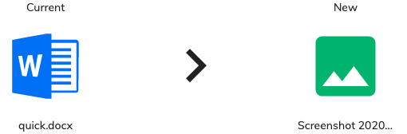

# Alfresco Application Development Framework (ADF) version 3.9.0 Release Note

These release notes provide information about the **3.9.0 release** of the Alfresco Application Development Framework.

This is the latest **General Available** release of the Application Development Framework, which contains the Angular components to build a Web Application on top of the Alfresco Platform.

The release can be found on GitHub at [this location](https://github.com/Alfresco/alfresco-ng2-components/releases/tag/3.9.0).

## Contents

-   [New package versions](#new-package-versions)
-   [Goals for this release](#goals-for-this-release)
    -   [DocumentList filtering](#documentlist-filtering)
    -   [ECM version directive](#ecm-version-directive)
    -   [SiteService to manage members and requests](#siteservice-to-manage-members-and-requests)
    -   [Updated JS Renditions API](#updated-js-renditions-api)
-   [Localisation](#localisation)
-   [References](#references)
-   [Issues addressed](#issues-addressed)

## New package versions

    "@alfresco/adf-content-services" : "3.9.0"
    "@alfresco/adf-process-services" : "3.9.0"
    "@alfresco/adf-core" : "3.9.0"
    "@alfresco/adf-insights" : "3.9.0",
    "@alfresco/adf-extensions": "3.9.0"
    "@alfresco/adf-testing": "3.9.0"
    "@alfresco/adf-cli": "3.9.0"

## Goals for this release

The highlights of this release include [DocumentList filtering](https://issues.alfresco.com/jira/browse/ADF-5108) for the benfit of the end user as well as technical improvements like the introduction of the ECM version directive, improvements of the SiteService and an updated JS Renditions API.

Please report issues with this release in the [issue tracker](https://github.com/Alfresco/alfresco-ng2-components/issues/new). You can collaborate on this release or share feedback by using the discussion tools on [Gitter](http://gitter.im/Alfresco/alfresco-ng2-components).

### New component and directive in 3.9.0

-   [Claim task cloud directive](../process-services-cloud/directives/claim-task-cloud.directive.md)
-   [Claim task directive](../process-services/directives/claim-task.directive.md)
-   [Form custom outcome component](../process-services/components/form-custom-outcome.component.md)
-   [Process name cloud pipe](../process-services-cloud/pipes/process-name-cloud.pipe.md)
-   [Process name pipe](../process-services/pipes/process-name.pipe.md)
-   [Search header component](../content-services/components/search-header.component.md)
-   [Unclaim task cloud directive](../process-services-cloud/directives/unclaim-task-cloud.directive.md)
-   [Unclaim task directive](../process-services/directives/unclaim-task.directive.md)
-   [Version comparison component](../content-services/components/version-comparison.component.md)
-   [Version compatibility directive](../core/directives/version-compatibility.directive.md)

### DocumentList filtering

This enhancement allows an end-user to filter the results in the document list, similarly to Excel/Google sheets (filter in the header), so that the view on the repository can be customized accordingly with her/his needs.

Filter components can be disabled, customized or replaced with custom components. You can check [ACA-3206](https://issues.alfresco.com/jira/browse/ACA-3206) for further details.

### ECM version directive

To properly manage the compatibility of the ADF components with a specific range of backend services, it has been introduced a way to enable/disable features through an [Angular Directive](https://angular.io/guide/attribute-directives).

You can check [ADF-5158](https://issues.alfresco.com/jira/browse/ADF-5158) for further details.

### SiteService to manage members and requests

As part of the enhancements of the SiteService, the following capabilities are added.

 - Members(users/groups):
	 - Add member to site
	 - Remove member from site
	 - Update site role of member

 - Membership request:
	 - Get pending request for site
	 - Approve request
	 - Reject request

You can check [ADF-5154](https://issues.alfresco.com/jira/browse/ADF-5154) for further details.

### Version comparison component

Displays the side by side comparison between the current target node (type, name, icon) and the new file that should update it's version.

## Localisation

This release includes: Arabic, Brazilian Portuguese, Czech, Danish, Dutch, Finnish, French, German, Italian, Japanese, Norwegian (Bokmål), Polish, Russian, Simplified Chinese, Spanish and Swedish versions.

## References

The following is a brief list of references to help you get started with the new release:

-   [Getting started guides with Alfresco Application Development Framework](https://community.alfresco.com/community/application-development-framework/pages/get-started)
-   [Alfresco ADF Documentation on the Builder Network](../README.md)
-   [Gitter chat supporting Alfresco ADF](https://gitter.im/Alfresco/alfresco-ng2-components)
-   [ADF examples on GitHub](https://github.com/Alfresco/adf-examples)
-   [Official GitHub Project - alfresco-ng2-components](https://github.com/Alfresco/alfresco-ng2-components)
-   [Official GitHub Project - alfresco-js-api](https://github.com/Alfresco/alfresco-js-api)
-   [Official GitHub Project - generator-ng2-alfresco-app](https://github.com/Alfresco/generator-ng2-alfresco-app)

Please refer to the [official documentation](http://docs.alfresco.com/) for further details and suggestions.

## PR Merged 
                        
* [[AAE-2570] prepare script to change name development to develop](https://github.com/Alfresco/alfresco-ng2-components/pull/5675)
* [Bump https-proxy-agent from 2.2.1 to 2.2.4 in /lib/cli](https://github.com/Alfresco/alfresco-ng2-components/pull/5677)
* [Deploy PR on request](https://github.com/Alfresco/alfresco-ng2-components/pull/5642)
* [[ADF-5131] Radio buttons display below label](https://github.com/Alfresco/alfresco-ng2-components/pull/5672)
* [[ADF-5135] Eventual Consistency Helper for e2e tests.](https://github.com/Alfresco/alfresco-ng2-components/pull/5668)
* [remove test release task](https://github.com/Alfresco/alfresco-ng2-components/pull/5683)
* [[ACA-3182] Extensions - Add property to define the parent route of an…](https://github.com/Alfresco/alfresco-ng2-components/pull/5684)
* [fix e2e](https://github.com/Alfresco/alfresco-ng2-components/pull/5686)
* [[AAE-2478] Add margin to the form title to avoid overlaping the buttons](https://github.com/Alfresco/alfresco-ng2-components/pull/5685)
* [updating simpleapp with new processes with pools](https://github.com/Alfresco/alfresco-ng2-components/pull/5688)
* [Fix resources path for releasing apps](https://github.com/Alfresco/alfresco-ng2-components/pull/5691)
* [CLI: new licences command](https://github.com/Alfresco/alfresco-ng2-components/pull/5690)
* [ [AAE-2557] - fixed variable mapping on start process](https://github.com/Alfresco/alfresco-ng2-components/pull/5680)
* [[ACA-3269]Move notificationPage to adf testing package](https://github.com/Alfresco/alfresco-ng2-components/pull/5687)
* [[ACA-3273] - fix start process empty message](https://github.com/Alfresco/alfresco-ng2-components/pull/5689)
* [[AAE-2537] - fix mark as read notification](https://github.com/Alfresco/alfresco-ng2-components/pull/5667)
* [[ACA-3251] Extenssion type data added](https://github.com/Alfresco/alfresco-ng2-components/pull/5692)
* [[ACA-3235] FE - Should not include invisible fields in payload on Start/Save adf-form.](https://github.com/Alfresco/alfresco-ng2-components/pull/5681)
* [[ACA-1606] use new api siteservice](https://github.com/Alfresco/alfresco-ng2-components/pull/5693)
* [[ADF-5103] FE - Process/task filter - Backporting the components styles to ADF](https://github.com/Alfresco/alfresco-ng2-components/pull/5614)
* [[ADF-5106] fix stencil registration](https://github.com/Alfresco/alfresco-ng2-components/pull/5694)
* [[ACA-3245] Fetch alfresco repo name from an API](https://github.com/Alfresco/alfresco-ng2-components/pull/5676)
* [audit command for adf cli](https://github.com/Alfresco/alfresco-ng2-components/pull/5699)
* [Ability to evaluate an object as payload](https://github.com/Alfresco/alfresco-ng2-components/pull/5697)
* [[Impreove e2e] Dev delete sites e2e missing](https://github.com/Alfresco/alfresco-ng2-components/pull/5695)
* [stabilize some e2e cloud](https://github.com/Alfresco/alfresco-ng2-components/pull/5701)
* [[AAE-2200] Upload dialog title should match selected site.](https://github.com/Alfresco/alfresco-ng2-components/pull/5648)
* [[ACA-3316] Fix process filters selection should reset if input changes to non ex…](https://github.com/Alfresco/alfresco-ng2-components/pull/5698)
* [Ability to change the route](https://github.com/Alfresco/alfresco-ng2-components/pull/5703)
* [[ACA-3028]Move breacrumb page to adf testing package](https://github.com/Alfresco/alfresco-ng2-components/pull/5705)
* [[ADF-5143] Fix Checkbox widget value parsing](https://github.com/Alfresco/alfresco-ng2-components/pull/5706)
* [[ACA-3317] Split About component into smaller components](https://github.com/Alfresco/alfresco-ng2-components/pull/5708)
* [Pre-Angular upgrade fixes](https://github.com/Alfresco/alfresco-ng2-components/pull/5709)
* [updated resources file with the new added form & processes](https://github.com/Alfresco/alfresco-ng2-components/pull/5711)
* [[ACA-45] Drag and Drop a New Version](https://github.com/Alfresco/alfresco-ng2-components/pull/5710)
* [Pre-Angular 9 upgrade fixes](https://github.com/Alfresco/alfresco-ng2-components/pull/5712)
* [[AAE-2666] fix dropdown rest](https://github.com/Alfresco/alfresco-ng2-components/pull/5714)
* [[ACA-3317] Make About Github Link Component input properties optional](https://github.com/Alfresco/alfresco-ng2-components/pull/5717)
* [[ACA-3326] Create the default filters following the new order](https://github.com/Alfresco/alfresco-ng2-components/pull/5713)
* [Ivy compatible test modules](https://github.com/Alfresco/alfresco-ng2-components/pull/5718)
* [update simpleapp with different ids and names for messages in pools-p…](https://github.com/Alfresco/alfresco-ng2-components/pull/5719)
* [Update entrypoint.sh](https://github.com/Alfresco/alfresco-ng2-components/pull/5720)
* [[AAE-2478] Long task title show ellipsis when too long and add tool tip to task title inside form](https://github.com/Alfresco/alfresco-ng2-components/pull/5704)
* [[ACA-3314] Add cancelButton and noFormTemplate form elements](https://github.com/Alfresco/alfresco-ng2-components/pull/5723)
* [[ACA-2989]Creating data-table-component PO to support all kind of columns, including custom](https://github.com/Alfresco/alfresco-ng2-components/pull/5715)
* [Update login-sso.page.ts](https://github.com/Alfresco/alfresco-ng2-components/pull/5725)
* [[ACA-3304] FE - Add a drop down to select running application on start process component](https://github.com/Alfresco/alfresco-ng2-components/pull/5702)
* [[ACA-3271] START PROCESS button is inactive first time when process model is loaded](https://github.com/Alfresco/alfresco-ng2-components/pull/5700)
* [Fixed simple app for DT problem](https://github.com/Alfresco/alfresco-ng2-components/pull/5731)
* [[ACA-3277] - remove unnecessary style](https://github.com/Alfresco/alfresco-ng2-components/pull/5729)
* [[ACA-2975] fix start process wrong response](https://github.com/Alfresco/alfresco-ng2-components/pull/5726)
* [[ADF-5150] Datatable sub-component each in its own folder](https://github.com/Alfresco/alfresco-ng2-components/pull/5734)
* [[ACA-3359] Disable processName/ProcessDefintions drop down if no application selected.](https://github.com/Alfresco/alfresco-ng2-components/pull/5736)
* [[ACA-3286] User gets error when removing the attached file](https://github.com/Alfresco/alfresco-ng2-components/pull/5735)
* [Revert "[ACA-3286] User gets error when removing the attached file"](https://github.com/Alfresco/alfresco-ng2-components/pull/5738)
* [[ACA-3252] Content Metadata - Use the translation key](https://github.com/Alfresco/alfresco-ng2-components/pull/5737)
* [[ACA-3368] Update datatable columns when presetColumn schema changes](https://github.com/Alfresco/alfresco-ng2-components/pull/5732)
* [[ACA-3332] Add Context menu click action for process and task list and selectRow for process list](https://github.com/Alfresco/alfresco-ng2-components/pull/5730)
* [[ACA-3074] Fix preselected file loading issue](https://github.com/Alfresco/alfresco-ng2-components/pull/5739)
* [[ACA-3390]Add startProcessWithApplication method on StartProcessPage](https://github.com/Alfresco/alfresco-ng2-components/pull/5741)
* [[ADF-5153] Transclusion exposed from the DataTable to the DocumentList](https://github.com/Alfresco/alfresco-ng2-components/pull/5743)
* [[ACA-3286] User gets error when removing the attached file](https://github.com/Alfresco/alfresco-ng2-components/pull/5744)
* [[ACA-3382] Expression - Fix the obj reference](https://github.com/Alfresco/alfresco-ng2-components/pull/5749)
* [[ADF-5154] Add missing API endpoints to SitesService](https://github.com/Alfresco/alfresco-ng2-components/pull/5751)
* [[ACA-3266] Improve version upload component](https://github.com/Alfresco/alfresco-ng2-components/pull/5750)
* [[ACS-259] refactor login page](https://github.com/Alfresco/alfresco-ng2-components/pull/5733)
* [[ACA-2989]Add doubleClickRow method](https://github.com/Alfresco/alfresco-ng2-components/pull/5728)
* [[ACA-2596] - fix: heading markup for bread crumbs](https://github.com/Alfresco/alfresco-ng2-components/pull/5755)
* [[ACA-2618] - fix: addition of persistent label](https://github.com/Alfresco/alfresco-ng2-components/pull/5754)
* [improve e2e configuration](https://github.com/Alfresco/alfresco-ng2-components/pull/5752)
* [Bump websocket-extensions from 0.1.3 to 0.1.4](https://github.com/Alfresco/alfresco-ng2-components/pull/5756)
* [add export missing model](https://github.com/Alfresco/alfresco-ng2-components/pull/5757)
* [not use testconfig if is not present](https://github.com/Alfresco/alfresco-ng2-components/pull/5758)
* [improve api service configuration](https://github.com/Alfresco/alfresco-ng2-components/pull/5759)
* [[ACA-3407] New component : Filter Menu created and implemented inside the Document List](https://github.com/Alfresco/alfresco-ng2-components/pull/5748)
* [Hide WIP filter inside document-list](https://github.com/Alfresco/alfresco-ng2-components/pull/5761)
* [[ACA-3358] Show user friendly error templates when there are no applications/processDefinitions](https://github.com/Alfresco/alfresco-ng2-components/pull/5746)
* [[ACA-3348] Add default process name pipe](https://github.com/Alfresco/alfresco-ng2-components/pull/5745)
* [[ACA-3358] Fix icon opacity ](https://github.com/Alfresco/alfresco-ng2-components/pull/5764)
* [[ACA_3292] - Add queued task as part of default task filter](https://github.com/Alfresco/alfresco-ng2-components/pull/5747)
* [[ACA-3416] Add Claim/Release actions on adf task form](https://github.com/Alfresco/alfresco-ng2-components/pull/5753)
* [[ACA-3266] Improve version upload component](https://github.com/Alfresco/alfresco-ng2-components/pull/5766)
* [[ADF-5157] Export default process name pipes](https://github.com/Alfresco/alfresco-ng2-components/pull/5768)
* [fix imports](https://github.com/Alfresco/alfresco-ng2-components/pull/5769)
* [fix e2e tests and cleanup e2e typings](https://github.com/Alfresco/alfresco-ng2-components/pull/5770)
* [[ACA-3201] Fix datatable styling non-sortable with sortable columns are not a…](https://github.com/Alfresco/alfresco-ng2-components/pull/5771)
* [Dev baptiste aca 3430](https://github.com/Alfresco/alfresco-ng2-components/pull/5773)
* [Fix start process e2e page](https://github.com/Alfresco/alfresco-ng2-components/pull/5774)
* [[ACA-2962] Fix attach file widget shows Local source when only link is enabled](https://github.com/Alfresco/alfresco-ng2-components/pull/5775)
* [Check for presence of the element before getText() in BreadcrumbPage PO.](https://github.com/Alfresco/alfresco-ng2-components/pull/5776)
* [[MNT-21584] fix rendering Hyperlink](https://github.com/Alfresco/alfresco-ng2-components/pull/5778)
* [[ACA-3109] Change order of default process filters for DW](https://github.com/Alfresco/alfresco-ng2-components/pull/5760)
* [[ACA-3329] Refactor isCompleteFormButtonDisabled method](https://github.com/Alfresco/alfresco-ng2-components/pull/5765)
* [Ability to set the image of pods based on label](https://github.com/Alfresco/alfresco-ng2-components/pull/5781)
* [Revert "Ability to set the image of pods based on label"](https://github.com/Alfresco/alfresco-ng2-components/pull/5783)
* [[ACA-3373] Update simpleapp](https://github.com/Alfresco/alfresco-ng2-components/pull/5784)
* [adf-cli k8s image - Be able to override image by label and namespace](https://github.com/Alfresco/alfresco-ng2-components/pull/5786)
* [[ACA-3454] disable floating label for ammount](https://github.com/Alfresco/alfresco-ng2-components/pull/5782)
* [[ADF-5160] Fix CardView Key-Value Pairs Item overflowing](https://github.com/Alfresco/alfresco-ng2-components/pull/5790)
* [Add attach file forms and processes to resources file](https://github.com/Alfresco/alfresco-ng2-components/pull/5793)
* [various code quality fixes](https://github.com/Alfresco/alfresco-ng2-components/pull/5792)
* [[ACA-3461] Start Process - show form for preselected process](https://github.com/Alfresco/alfresco-ng2-components/pull/5787)
* [[ACA-3218] Fix attach file widget - wrong payload when link is true](https://github.com/Alfresco/alfresco-ng2-components/pull/5777)
* [exclude failing test before the revert of the time modify is finalized](https://github.com/Alfresco/alfresco-ng2-components/pull/5794)
* [remove old unmaintained sub-projects](https://github.com/Alfresco/alfresco-ng2-components/pull/5798)
* [[ADF-5161] Add query token injection for search query builder](https://github.com/Alfresco/alfresco-ng2-components/pull/5799)
* [[ACA-3474] [Info Drawer] Error on save ](https://github.com/Alfresco/alfresco-ng2-components/pull/5791)
* [ACA-3426 - Search Headers for Document List](https://github.com/Alfresco/alfresco-ng2-components/pull/5800)
* [[ACA-3448] Candidate user is able to complete a task without a form attached before claiming it](https://github.com/Alfresco/alfresco-ng2-components/pull/5780)
* [[ACA-3426] - removed not used color code](https://github.com/Alfresco/alfresco-ng2-components/pull/5801)
* [Documentation review](https://github.com/Alfresco/alfresco-ng2-components/pull/5802)
* [[ACA-3426] - reverted method renaming](https://github.com/Alfresco/alfresco-ng2-components/pull/5803)
* [error message if log level is set with wrong name](https://github.com/Alfresco/alfresco-ng2-components/pull/5805)
* [[ACA-3426] Add translate pipe to search-header tooltip](https://github.com/Alfresco/alfresco-ng2-components/pull/5804)
* [[ADF-5158] ECM Version Directive](https://github.com/Alfresco/alfresco-ng2-components/pull/5779)
* [Update browser-actions.ts to warn instead of error](https://github.com/Alfresco/alfresco-ng2-components/pull/5807)
* [Fix unknown style](https://github.com/Alfresco/alfresco-ng2-components/pull/5810)
* [[AAE-2840] Not able to complete a task with attach file widget with mappings](https://github.com/Alfresco/alfresco-ng2-components/pull/5809)
* [ALL 16 LANGUAGES: Fix for LOC-231 - updated localised UI files for AD…](https://github.com/Alfresco/alfresco-ng2-components/pull/5811)
* [[ADF-5163] [Regression] Fix placeholder on Form widgets](https://github.com/Alfresco/alfresco-ng2-components/pull/5812)

Please refer to the [Alfresco issue tracker](https://issues.alfresco.com/jira/projects/ADF/issues/ADF-581?filter=allopenissues) for other known issues in this release. If you have any questions about the release, please contact us using [Gitter](https://gitter.im/Alfresco/alfresco-ng2-components).

Thanks to the whole application team and the amazing Alfresco community for the hard work.
