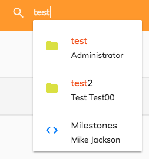

# Search component

Displays a input text which shows find-as-you-type suggestions.




<!-- markdown-toc start - Don't edit this section.  npm run toc to generate it-->

<!-- toc -->

- [Basic usage](#basic-usage)
  * [Properties](#properties)
  * [Events](#events)
- [Details](#details)

<!-- tocstop -->

<!-- markdown-toc end -->

## Basic usage

```html
<adf-search-control 
    [highlight]="true"
    (optionClicked)="onItemClicked($event)"
    (submit)="onSearchSubmit($event)">
</adf-search-control>
```

### Properties

| Name | Type | Default | Description |
| --- | --- | --- | --- |
| searchTerm | string  | |  Search term to pre-populate the field with |
| inputType | string  | "text" | Type of the input field to render, e.g. "search" or "text" (default) |
| autocomplete | boolean | true  | Whether the browser should offer field auto-completion for the input field to the user. |
| highlight | boolean | false  | Use the true value if you want to see the searched word highlighted. |
| expandable | boolean |  true  | Whether to use an expanding search control, if false then a regular input is used. |
| liveSearchEnabled | boolean | true  | Whether find-as-you-type suggestions should be offered for matching content items. Set to false to disable. |
| liveSearchRoot | string | "-root-" | NodeRef or node name where the search should start. |
| liveSearchResultType | string | |  Node type to filter live search results by, e.g. 'cm:content'. |
| liveSearchMaxResults | number | 5 |  Maximum number of results to show in the live search. |
| liveSearchResultSort | string | |  Criteria to sort live search results by, must be one of "name" ,  "modifiedAt" or "createdAt" |

### Events

| Name | Description |
| --- | --- |
| searchChange | Emitted when the search term is changed. The search term is provided in the 'value' property of the returned object.  If the term is less than three characters in length then the term is truncated to an empty string. |
| submit | Emitted when the search is submitted pressing ENTER button. The search term is provided as value of the event. |
| optionClicked | Emitted when a file item from the list of find-as-you-type results is selected |

## Details

```html
<adf-search-control 
    [highlight]="true"
    (optionClicked)="onItemClicked($event)"
    (submit)="onSearchSubmit($event)">
</adf-search-control>
```

Example of a component that uses the search control. In this example the search term is simply logged to the console
but instead the component could emit an event to be consumed upstream, or it could trigger a change inside a search
results component embedded inside the same component.
