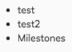

# Search Results component


<!-- markdown-toc start - Don't edit this section.  npm run toc to generate it-->

<!-- toc -->

- [Basic usage](#basic-usage)
  * [Properties](#properties)
  * [Events](#events)
- [Details](#details)

<!-- tocstop -->

<!-- markdown-toc end -->

## Basic usage

```html
<adf-search 
    [searchTerm]="searchTerm"
    (resultLoaded)="showSearchResult($event)">
</adf-search>
```

### Properties

| Name | Type | Default | Description |
| --- | --- | --- | --- |
| searchTerm | string | | Search term to use when executing the search. Updating this value will run a new search and update the results  |
| rootNodeId | string | "-root-" | NodeRef or node name where the search should start. |
| resultType | string | | Node type to filter search results by, e.g. 'cm:content', 'cm:folder' if you want only the files. |
| maxResults | number  | 20 | Maximum number of results to show in the search. |
| resultSort | string  | | Criteria to sort search results by, must be one of "name" , "modifiedAt" or "createdAt" |
| displayWith | function | | Define a function that can be applied to the element clicked which will be set to the input value |

### Events

| Name | Description |
| --- | --- |
| resultLoaded | Emitted when search results have fully loaded |

## Details

### Customise Search Results
You can add a template that will be shown when the results are loaded.

```html
<adf-search [searchTerm]="searchTerm">
    <ng-template let-result>
        <ul>
            <li *ngFor="let item of result?.list?.entries">
                {{ item?.entry.name }}
            </li>
        </ul>
    </ng-template>
</adf-search>
```
The results are provided via the [$implicit variable of angular2](https://angular.io/api/common/NgTemplateOutlet) and can be accessed via the sugar sintax 'let-yourChosenName'. As per example above the result will be something like : 



### Attach an input field to the search
You can also attach your input field to the adf-search component via the trigger [adfSearchAutocomplete]

```html
<input matInput type="text"
    [adfSearchAutocomplete]="search">

<adf-search #search="adfSearchAutocomplete">
    <ng-template let-result>
        <span *ngFor="let item of result?.list?.entries">
            {{ item?.entry.name }}
        </span>
    </ng-template>
</adf-search>        
```
In this way it is possible to fetch the results from the word typed into the input text straight into the adf-search component via the custom template variable.