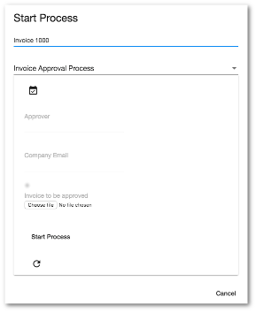

# Start Form component

Displays the Start Form for a process.



## Basic Usage

```html
<adf-start-form
    [processDefinitionId]="currentProcessDef.id"
    (outcomeClick)="onOutcomeClick($event)">
</adf-start-form>
```

### Properties

| Name | Type | Default | Description |
| --- | --- | --- | --- |
| processDefinitionId | string |  | Definition ID of the process to start. |
| processId | string |  | Process ID of the process to start. |
| showOutcomeButtons | boolean | true | Should form outcome buttons be shown? |
| showRefreshButton | boolean | true |  |
| readOnlyForm | boolean | false | Is the form read-only (ie, can't be edited)? |

### Events

| Name | Description |
| --- | --- |
| outcomeClick | Emitted when the user clicks one of the outcome buttons that completes the form. |

## Details

The [Start Process component](start-process.component.md) uses the Start Form component
to display the
[start form](http://docs.alfresco.com/process-services1.6/topics/none_start_event.html)
for the process.

The `outcomeClick` event is passed a string containing the ID of the outcome button that
the user clicked. You can pass this value to the `startProcess` method (defined in the
[Process service](process.service.md)) when activating the process, if necessary.

<!-- Don't edit the See also section. Edit seeAlsoGraph.json and run config/generateSeeAlso.js -->
<!-- seealso start -->

<!-- seealso end -->