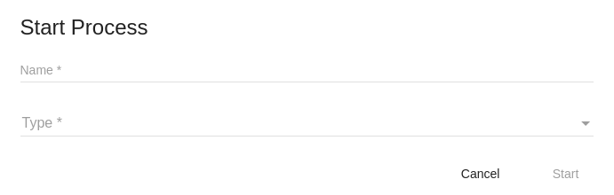

# Start Process component

Displays Start Process, allowing the user to specify some basic details needed to start a new process instance.



<!-- markdown-toc start - Don't edit this section.  npm run toc to generate it-->

<!-- toc -->

- [Basic Usage](#basic-usage)
  * [Properties](#properties)
  * [Events](#events)

<!-- tocstop -->

<!-- markdown-toc end -->

## Basic Usage

```html
<adf-start-process 
    appId="YOUR_APP_ID" >
</adf-start-process>
```

### Properties

| Name | Description |
| --- | --- |
| appId |  (required): Limit the list of processes which can be started to those contained in the specified app |
| variables | Variables in input to the process [RestVariable](https://github.com/Alfresco/alfresco-js-api/tree/master/src/alfresco-activiti-rest-api/docs/RestVariable.md)|

### Events

| Name | Description |
| --- | --- |
| start | Raised when the process start |
| cancel | Raised when the process canceled |
| error | Raised when the start process fail |
