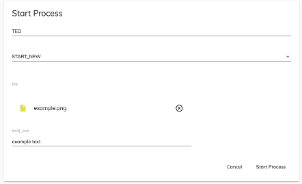

# Start Process component

Starts a process.


## Basic Usage

```html
<adf-start-process 
    appId="YOUR_APP_ID" >
</adf-start-process>
```

### Properties

| Name | Type | Description |
| ---- | -- | ----------- |
| appId | `number` | (required): Limit the list of processes which can be started to those contained in the specified app |
| name | `string` | (optional) name to assign to the current process |
| processDefinitionId | `string` | (optional) definition ID of the process to start |
| variables | `ProcessInstanceVariable[]` |Variables in input to the process [RestVariable](https://github.com/Alfresco/alfresco-js-api/tree/master/src/alfresco-activiti-rest-api/docs/RestVariable.md) |
| values | `FormValues` | Parameter to pass form field values in the start form if is associated |

### Events

| Name | Type | Description |
| ---- | -- | --------- |
| start | `EventEmitter<ProcessInstance>` | Emitted when the process starts |
| cancel | `EventEmitter<ProcessInstance>` |  Emitted when the process is canceled |
| error | `EventEmitter<ProcessInstance>` |  Emitted when the start process operation fails |

## Details

Displays the *Start Process* form, allowing the user to specify some details like process name and process definition, which are the most basic requirements to start a new process instance. The following
options are available for choosing which process to start:

-   If your app has only one `processDefinition` then the `adf-start-process` component will iind and
    use it automatically.
-   If your app has multiple `processDefinitions` and you don't define a `processDefinitionId` parameter
    then a drop down will allow you to select which one to use.
-   If your app has multiple `processDefinitions` and you do define a `processDefinitionId` parameter then the `adf-start-process` component will be automatically instantiated with the selected process.

An error message will be shown if no process definition at all is available.

### Start a process with processDefinitionId

```html
 <adf-start-process 
      [appId]="YOUR_APP_ID"
      [processName]="PROCESS_NAME"
      [processDefinitionId]="PROCESS_DEF_ID">
 </adf-start-process>		 
```

Use this method to preselect which process to start if there is more than one process in your app.

### Custom data example

Here is an example of how to pass in form field values to initialize the start form that has been
defined for the process:

```ts
const formValues: FormValues  = {
    'test_1': 'value_1',
    'test_2': 'value_2',
    'test_3': 'value_1',
    'test_4': 'dropdown_id',
    'test_5': 'dropdown_label',
    'dropdown': {'id': 'dropdown_id', 'name': 'dropdown_label'}
};
```

```html
<adf-start-process 
    [values]="formValues"
    appId="YOUR_APP_ID" >
</adf-start-process>
```

### Attaching a File to the start form of the process

After the repository is created in APS, you can it in the Alfresco Repositories list.
If the ID is set to 1 then all default values are fine. 
However, if it is set to something else, for example, _1002_ and the name is _alfresco_, you must set the property `alfrescoRepositoryName` in your `app.config.json` file to  _alfresco-1002_:

```json
        {
            name: 'Alfresco ADF Application'
        },
        ecmHost: 'http://{hostname}{:port}/ecm',
        bpmHost: 'http://{hostname}{:port}/bpm',
        logLevel: 'silent',
        alfrescoRepositoryName : 'alfresco-1002'
```

You then need to pass the node as the input `values` object with the other properties:

```ts
let node: MinimalNodeEntryEntity = this.nodesApiService.getNode(NODE_ID);

const formValues: FormValues  = {
    'file' : node
    'field_one': 'example text'
};
```

Note that in the object above, the key `file` is the name of the attach file field in the start form of the process. The value of the `file` property must be a
[MinimalNodeEntryEntity](document-library.model.md):

```html
<adf-start-process 
    [values]="formValues"
    appId="YOUR_APP_ID" >
</adf-start-process>
```

The result will be the start form prefilled with the file data:



## See also

-   [Select Apps Dialog component](select-apps-dialog.component.md)
