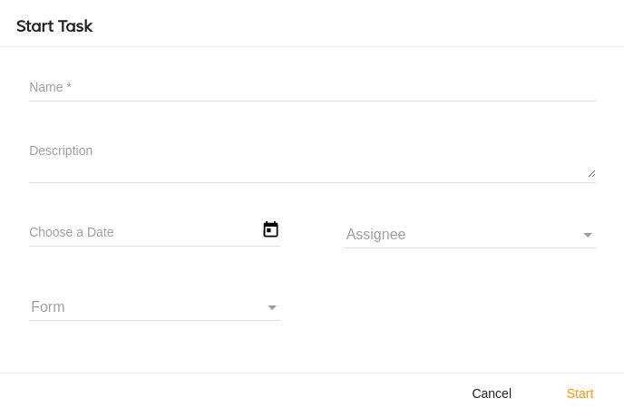

# Start Task Component

Creates/Starts new task for the specified app



## Basic Usage

```html
<adf-start-task
    [appId]="YOUR_APP_ID">
</adf-start-task>
```

### Properties

| Name | Type | Description |
| --- | --- | --- |
| appId | string | (**required**): The id of the app. |

### Events

| Name | Description |
| --- | --- |
| success | Raised when the task is successfully created |
| cancel | Raised when the cancel button is pressed by the user |
| error | Raised if there is an error during task creation |
