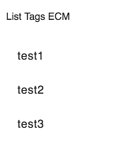

# Tag List component

Shows tags for an item.

## Basic Usage

### Events

| Name | Type | Description |
| ---- | ---- | ----------- |
| result | `EventEmitter<{}>` | Emitted when a tag is selected. |

## See Also

-   [Tag service](tag.service.md)
