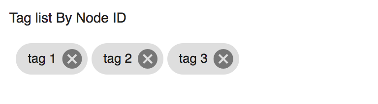

# Alfresco Tag Node List component



<!-- markdown-toc start - Don't edit this section.  npm run toc to generate it-->

<!-- toc -->

- [Basic Usage](#basic-usage)
  * [Properties](#properties)

<!-- tocstop -->

<!-- markdown-toc end -->

## Basic Usage

```html
<adf-tag-node-list 
    [nodeId]="nodeId">
</adf-tag-node-list>
``` 

### Properties

| Attribute | Type | Default | Description |
| --- | --- | --- | --- |
| nodeId | string | | The identifier of a node |
