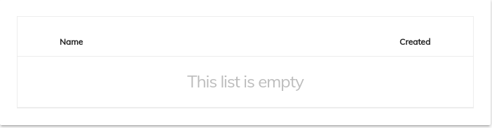

# Task Attachment List Component

Displays attached documents on a specified task.


<!-- markdown-toc start - Don't edit this section.  npm run toc to generate it-->

<!-- toc -->

- [Basic Usage](#basic-usage)
  * [Drag and Drop Functionality](#how-to-add-drag-and-drop-functionality)
  * [Properties](#properties)
  * [Events](#events)

<!-- tocstop -->

<!-- markdown-toc end -->

## Basic Usage

```html
<adf-task-attachment-list 
    [taskId]="YOUR_TASK_ID" 
    (attachmentClick)="YOUR_HANDLER">
</adf-task-attachment-list>
```
If the List is empty, a default no content template is displayed.



### How to Add Drag and Drop Functionality

If we want user to be able to upload attachments for empty lists, We can wrap our component with upload drag area component. In that case, We should also pass a custom *no content template* as shown below with our component urging the user to drag files to upload whenever the list is empty.

```html
<adf-upload-drag-area
    [parentId]="YOUR_TASK_ID"
    [showNotificationBar]="BOOLEAN">
    <adf-task-attachment-list  
        [taskId]="YOUR_TASK_ID"
        (attachmentClick)="YOUR_HANDLER">
            <div adf-empty-list> //no content template
                <adf-empty-list>
                    <div adf-empty-list-header>{{This List is empty}}</div>
                    <div adf-empty-list-body>{{Drag and drop to upload}}</div>
                    <div adf-empty-list-footer>
                        </div> 
                </adf-empty-list>
            </div>
    </adf-task-attachment-list>
</adf-upload-drag-area>
```

[Upload Drag Area Component](./upload-drag-area.component.md)

If the List is empty, the custom no-content template we passed is displayed. 


### Properties

| Name | Type | Description |
| --- | --- | --- |
| taskId | string | (**required**): The ID of the task to display |
| disabled | boolean | false | Disable/Enable read only mode for attachement list |

### Events

| Name | Description |
| --- | --- |
| attachmentClick | Raised when the attachment double clicked or selected view option from context menu by the user from within the component and return a Blob obj of the object clicker|
| success | Raised when the attachment list fetch all the attach and return a list of attachments |
| error | Raised when the attachment list is not able to fetch the attachments for example network error   |
