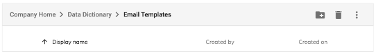
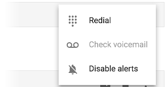

# Toolbar Component

Simple container for headers, titles, actions and breadcrumbs.


<!-- markdown-toc start - Don't edit this section.  npm run toc to generate it-->

<!-- toc -->

- [Basic Usage](#basic-usage)
  * [Properties](#properties)
- [Details](#details)
  * [Custom title](#custom-title)
  * [Divider](#divider)
  * [Dropdown menu](#dropdown-menu)
  * [Custom color](#custom-color)

<!-- tocstop -->

<!-- markdown-toc end -->

## Basic Usage

```html
<adf-toolbar title="Toolbar">
    <button mat-icon-button>
        <mat-icon>create_new_folder</mat-icon>
    </button>
    <button mat-icon-button>
        <mat-icon>delete</mat-icon>
    </button>
</adf-toolbar>
```

### Properties

| Name | Type | Default | Description |
| --- | --- | --- | --- |
| title | string | | Toolbar title |
| color | string | | Toolbar color, can be changed to empty value (default), `primary`, `accent` or `warn`. |

## Details

### Custom title

You can use any HTML layout or Angular component as a content of the Title section by using the special `<adf-toolbar-title>` component instead of the "title" attribute:

```html
<adf-toolbar>
    <adf-toolbar-title>
        <adf-breadcrumb ...></adf-breadcrumb>
    </adf-toolbar-title>
    ...
</adf-toolbar>
```

The toolbar should now look similar to the following:



### Divider

You can divide groups of elements with a visual separator `<adf-toolbar-divider>`:

```html
<adf-toolbar>
    <button></button>
    <button></button>
    <adf-toolbar-divider></adf-toolbar-divider>
    <button></button>
</adf-toolbar>
```

### Dropdown menu

You can use the following example to create a dropdown menu:

```html
<adf-toolbar title="Toolbar">
    ...

    <button mat-icon-button [matMenuTriggerFor]="menu">
        <mat-icon>more_vert</mat-icon>
    </button>
    <mat-menu #menu="matMenu">
        <button mat-menu-item>
            <mat-icon>dialpad</mat-icon>
            <span>Redial</span>
        </button>
        <button mat-menu-item disabled>
            <mat-icon>voicemail</mat-icon>
            <span>Check voicemail</span>
        </button>
        <button mat-menu-item>
            <mat-icon>notifications_off</mat-icon>
            <span>Disable alerts</span>
        </button>
    </mat-menu>
</adf-toolbar>
```

The code above is based on the `<mat-menu>` component from the `@angular/material` library. You can use any custom menu component as well.


Once you click the menu button you should see the following menu items as defined earlier:



### Custom color

Besides the default color you can use 'primary', 'accent', or 'warn' values:

Depending on the overall application theme the colors of the toolbar should change.

For example:


