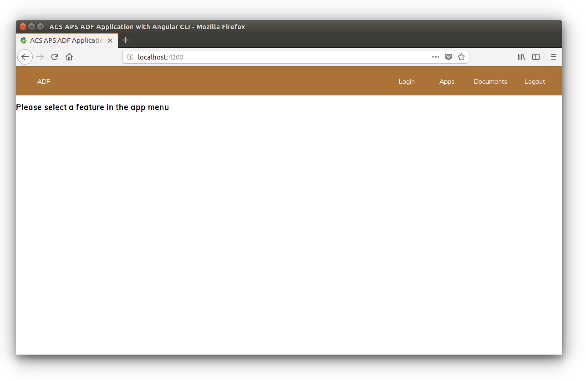

# Basic theming

In this tutorial you will see how to theme an ADF app by modifying the CSS. 

As detailed in the [user guide page about theming](../user-guide/theming.md), you can easily customize the [Cascading Style Sheets](https://en.wikipedia.org/wiki/Cascading_Style_Sheets) used by an ADF application. The focus of this tutorial is ADF apps built using Yeoman, but you can use the same principles to customize the themes in any ADF application.

## About the `adf-core` theming 

As described in the [user guide about theming](../user-guide/theming.md), eveything happens in the `src/custom-style.scss` file defining the *primary*, the *accent* and the *warn* set of palettes. For a detailed description of the different types of palettes, check the [user guide about theming](../user-guide/theming.md).

As you can see directly in the `css` file, the sets of palettes are configured using some predefined variables used in the source code as described below.

    $primary: mat-palette($alfresco-accent-orange);
    $accent:  mat-palette($alfresco-accent-purple);
    $warn:    mat-palette($alfresco-warn);

The `mat-palette` function is used to define the [Material Design](https://material.io/design/introduction/) Palettes from a collection of colors and `$alfresco-ecm-cyan`, `$alfresco-accent-purple` and `$alfresco-warn` are variables declared locally in the project to define the colors to be used in the application.

As you would expect, changing the parameter of the `mat-palette` function will change the colours of the entire application together.

All the available variables containing the set of palettes for the application can be found in the `node_modules/@alfresco/adf-core/_theming.css` file. In that file you can find:

 - `$alfresco-ecm-cyan`
 - `$alfresco-dev-teal`
 - `$alfresco-ecm-blue`
 - `$alfresco-bpm-green`
 - `$alfresco-warn`
 - `$alfresco-accent-purple`
 - `$alfresco-accent-orange`

Check the `_theming.css` file to see the latest changes and how the variables are structured and defined.

## Changing the palette of your application

As an example, let's change the set of palettes for the primary colours. In the `src/custom-style.scss` file, change the `$primary` definition as follows.

    $primary: mat-palette($alfresco-ecm-blue);

Once done, save the `custom-style.scss` file and you will see the application refreshed with different colours. That's all there is to it.

## Developing your own palette

In some cases you might want to do something more "customized", and you might want to choose your preferred colours for your application. In this case you simply need to develop your own palette in a local variable and use it as the primary, accent or warn palette.

As an example, let's edit the `src/custom-style.scss` file adding the following source code immediately before the definition of the `$primary` variable.

    $my-own-brown: (
        50: #f9f2ec,
        100: #ecd9c6,
        200: #dfbf9f,
        300: #d2a679,
        400: #c68c53,
        500: #ac7339,
        600: #86592d,
        700: #604020,
        800: #392613,
        900: #130d06,
        A100: #e6ccb3,
        A200: #cc9966,
        A400: #996633,
        A700: #4d3319,
        contrast: (
            50: $black-87-opacity,
            100: $black-87-opacity,
            200: $black-87-opacity,
            300: $black-87-opacity,
            400: $black-87-opacity,
            500: white,
            600: white,
            700: white,
            800: $white-87-opacity,
            900: $white-87-opacity,
            A100: $black-87-opacity,
            A200: white,
            A400: white,
            A700: white,
        )
    );

When you have done this, replace the `$primary` definition as follows and save the `custom-style.scss` file:

    $primary: mat-palette($my-own-brown);

After a few seconds you will see the application refreshing with different colours in the upper menu. In the following screenshot you can see how the new palette looks:

