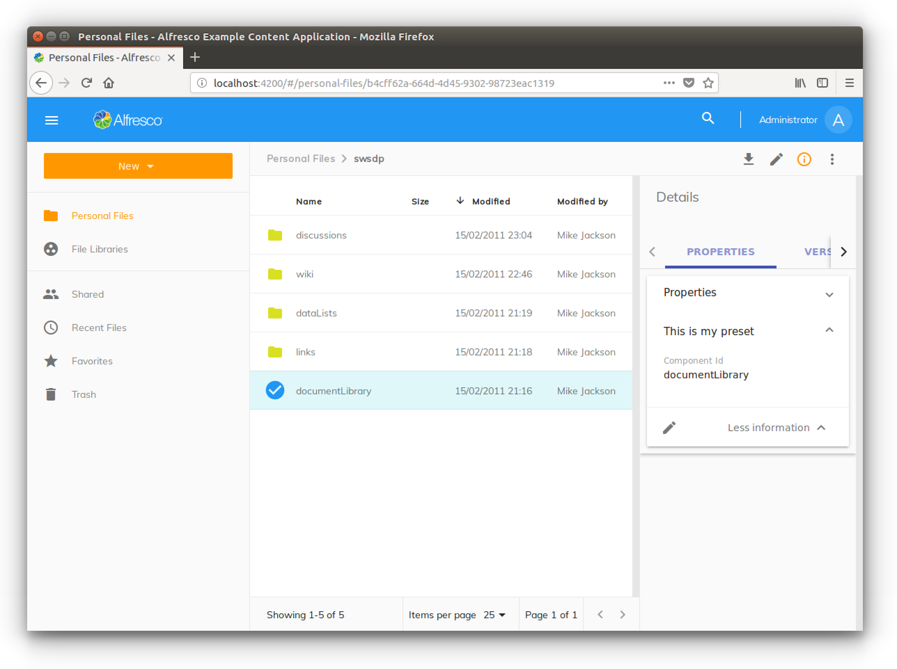

# Content metadata component

In this tutorial you will learn how to work with the [`ContentMetadataComponent`](../../lib/content-services/src/lib/content-metadata/components/content-metadata/content-metadata.component.ts).

This component is used to render the standard and custom metadata of generic content item (called a _node_) stored in Alfresco Content Services. With the usual approach "learning by doing", you will see here some practical examples you might find useful in your own applicatioin. As a starting point, we will use and customize the [Alfresco Content App](https://github.com/Alfresco/alfresco-content-app).

## About the `ContentMetadataComponent`

As described in the [`ContentMetadataComponent`](../../lib/content-services/src/lib/content-metadata/components/content-metadata/content-metadata.component.ts) documentation, the `adf-content-metadata-card` tag has some useful attributes, included the `preset` attribute, which is used to point to a collection of aspects/properties to render.

Below, you can see the `preset` value requesting to render all the available aspects/properties:

```html
<adf-content-metadata-card
    [node]="..."
    [preset]="'*'">
</adf-content-metadata-card>
```

As another example, you can see the `preset` value requesting to render all the available aspects/properties related to a specific configuration, named `custom`:

```html
<adf-content-metadata-card
    [node]="..."
    [preset]="'custom'">
</adf-content-metadata-card>
```

All the `preset` configurations are defined in one single configuration file named `app.config.json`, stored in the `src` folder of the project. The `app.config.json` file contains all the configurations of the ADF application, including a section named `content-metadata`, which is used to store the `presets`. The following JSON excerpt gives an example of configuration for the `preset` named `custom`:

```json
"content-metadata": {
    "presets": {
        "custom": [
            {
                "title": "APP.CONTENT_METADATA.EXIF_GROUP_TITLE",
                "items": [
                    {
                        "aspect": "exif:exif",
                        "properties": [
                            "exif:pixelXDimension",
                            "exif:pixelYDimension",
                            ...
                        ]
                    }
                ]
            }
        ]
    }
},
```

This configuration will show all the listed properties prefixed with `exif:*` in a group titled with the value of the variable  `APP.CONTENT_METADATA.EXIF_GROUP_TITLE` for the aspect `exif:exif`. Since this aspect is not related to the node, the component will simply ignore the rendering and nothing will be displayed for these properties. In other words: the aspects to be displayed are calculated as an intersection of the preset's aspects and the aspects related to the node.

## Adding and using a new `preset` configuration

In this example we will add a new preset configuration and see how it looks in the user interface.

### Adding a new `preset` configuration

To add a new `preset` configuration, edit the `src/app.config.json` file and locate the `content-metadata` section. Then, append the following JSON to the `presets` content and save the file:

```json
...,
"content-metadata": {
    "presets": {
        "custom": [...],
        "my-preset": [
            {
                "title": "This is my preset",
                "items": [
                    {
                        "aspect": "st:siteContainer",
                        "properties": ["*"]
                    }
                ]
            }
        ]
    }
},
```

**Note:** As an alternative to `"properties": ["*"]` (which matches all the properties of the `st:siteContainer` aspect), you can use `"properties": ["st:componentId"]`, which will render one property only.

### Using the `my-preset` configuration

Now that the `my-preset` configuration is defined, let's use it in a view of the ADF application. As an example, let's edit the files view, stored in the `src/app/files` folder. Specifically, let's change the [`files.component`](../../demo-shell/src/app/components/files/files.component.ts)`.html` file as follows:

```html
<adf-content-metadata-card
    ...
    [preset]="'my-preset'">
</adf-content-metadata-card>
```

### Viewing the result

After saving the html file, open the ADF app in a browser and dive into the `Personal Files > Sites > swsdp` folder of the Alfresco's repository. Once there, select the `documentLibrary` folder (one click only) and click on the view details icon (the `i` on the top right). Scrolling down the metadata tab on the right, click on the `More information` item at the bottom. Once clicked, you will see two different groups: `Properties` (already there by default) and `This is my preset`. Click on `This is my preset` to show the properties related.

In the following screenshot you can see how the result should look:



To check it out, double click on the `documentLibrary` folder and select (with one click) the `Presentations` folder. You should see the `This is my preset` group disappear from the metadata panel, because the node doesn't have the `st:siteContainer` aspect.
