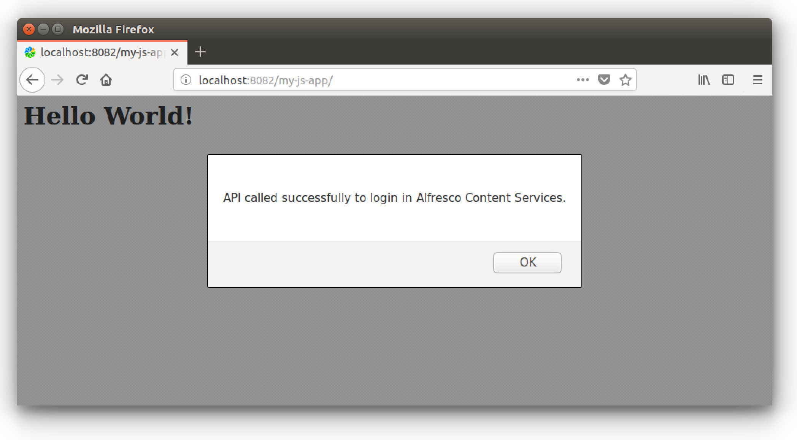

# Creating your Alfresco JavaScript application

In this tutorial you are going to see how to create from scratch an application in JavaScript to interact with Alfresco. This is a "getting started" task that should enable you to start developing your own JavaScript application on top of Alfresco Content Services or Alfresco Process Services.

In this tutorial you are going to learn how to develop on top of Alfresco Content Services, but the development on top of Alfresco Process Services follows exactly the same principle.

**Note:** The development on top of Alfresco Content Services AND Alfresco Process Services has the only limitation of the [CORS](https://en.wikipedia.org/wiki/Cross-origin_resource_sharing). In this case you might need to proxy your application first.

## Prerequisites

The only prerequisite of this tutorial is the availability of an instance of Alfresco Content Services in a [Docker](https://www.docker.com/) container. Docker is not the only option you might have for the deployment, but it is the faster we found to focus on the development instead of the environment setup.

If you don't have an instance of Alfresco Content Services up and running check the [preparation of the development environment](./preparing-the-development-environment.html).

Only to download the requested libraries, you will need the `npm` client. Also in this case check the [preparation of the development environment](./preparing-the-development-environment.html) for further details on how to install it into your development environment.

## Creating the JavaScript application

Assuming that you have your Alfresco Content Services instance up and running at `http://localhost:8082/alfresco`, let's see here how to develop a JavaScript application from scratch. The JavaScript application will be able to interact with Alfresco back-end services using the [`alfresco-js-api`](https://github.com/Alfresco/alfresco-js-api) library. This library does not necessarily require to be used into an Angular application but it is "framework agnostic".

Before starting with the development of the source code, let's create locally the `my-js-app` folder that will contain the entire JavaScript application.

### Creating the `index.html` file

Inside the `my-js-app` folder create the `index.html` file with the following content.

    <html>
    
        <head>
            
            
        </head>
    
        <body>
            <h1>Hello World!</h1>
        </body>
    
    </html>

As you can see, the content describes a very simple and basic HTML + JavaScript page, containing the source code to login into the Alfresco Content Services at the URL `http://localhost:8082/alfresco`.

All the magic happens because of the inclusion (and use) of the `alfresco-js-api.js` library.

### Adding the `alfresco-js-api` library

To install the `alfresco-js-api.js` library: open a terminal, move into the `my-js-app` folder and run the following command.

    npm install --save alfresco-js-api

Once launched the command downloads all the several files of the library into the `node_modules` folder.

**Note:** the `npm` execution will create a `package-lock.json` file into the root folder of your project. It won't be used and you can ignore it.

Believe it or not, but this is all you need to develop a (very basic) JavaScript application on top of Alfresco Content Services.

## Deploying the application

Now that the JavaScript application is created, the next step is to deploy it into the HTTP Server to be consumed. To avoid the [CORS](https://en.wikipedia.org/wiki/Cross-origin_resource_sharing) issue, for the purpose of this tutorial, the deployment will be done into the same instance of [Apache Tomcat](http://tomcat.apache.org/) used by Alfresco Content Services. If someone won't find this path ideal, this is the fastest way we found to show the results in a tutorial.

To deploy the  `my-js-app` application into the Alfresco Content Services Docker container, open a terminal and launch the following commands from inside the `my-js-app` folder.

    // List the active containers into your environment.
    docker container ls

	// Copy the CONTAINER_ID of the image with name 'alfresco/alfresco-content-repository-community:...'.

    // Open a shell into the container.
    docker exec -i -t <CONTAINER_ID> /bin/bash

    // Create the 'my-js-app' folder into the Tomcat's webapps folder.
    mkdir webapps/my-js-app

	// Back to the host's shell.
    exit

	// Copy the 'my-js-app' folder into the Tomcat's webapps folder.
    docker cp ../my-js-app <CONTAINER_ID>:/usr/local/tomcat/webapps

This is all you need to deploy the JavaScript application into the Tomcat instance of the container of Alfresco Content Services.

## The JavaScript application in action

To see the JavaScript application in action, open a browser at `http://localhost:8082/my-js-app` and you should see something like the following screenshot.

Of course this is a very basic example, used to show in practice how to develop from scratch a JavaScript application (not necessarily and Angular application) interacting with Alfresco Back-end Services using the [`alfresco-js-api`](https://github.com/Alfresco/alfresco-js-api) library.
