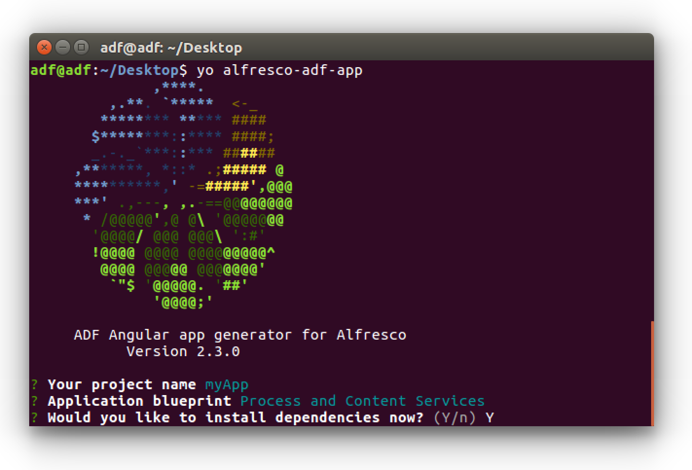
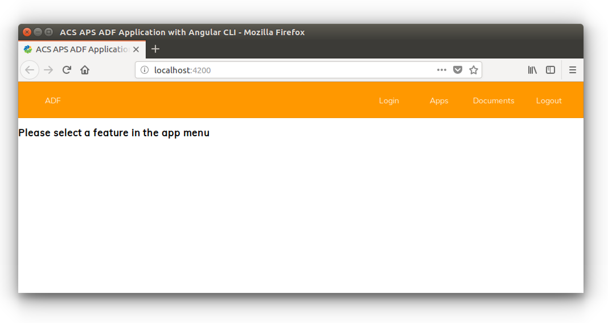

# Creating your ADF application using Yeoman

In this tutorial you are going to see how to create an ADF application from scratch, using the [Yeoman scaffolding tool](http://yeoman.io/).

This is a "getting started" task that should enable you to start developing your own ADF application.

## Prerequisites

Before any further task, be sure you executed the optional section described in [the preparation of the development environment](./preparing-environment.md), dedicated to the installation of the ADF Yeoman generator. This is a requested prerequisite to complete this tutorial with success.

## Creating the ADF application

The creation of a brand new application is straightforward using the [Yeoman generator](http://yeoman.io/). Open a terminal and execute the following command.

    yo alfresco-adf-app

After the execution, the generator asks few questions: mainly the name of your app (in this example we are going to use  `myApp`) and which blueprint you want to use. below the picture showing how the wizard looks like.

You can select one of the three following blueprints.

**Process Services**

This will generate an application for Alfresco Process Services. It mainly contains the following components: Login, App List, Task List, [`Form`](../../lib/process-services/task-list/models/form.model.ts) and Start Process.

**Content Services**

This will generate an application for Alfresco Content Services. It mainly contains the following components: Login, Document List, Viewer.

**Process and Content Services**

This will generate an application for both Alfresco Process and Content Services and will be a combination of the two blueprints above.

Select your preferred one and the generator asks if you want to install dependencies right away. Enter `Y` and hit enter. This can take a minute or two depending on your internet connection. You might see a few warnings at the end like this:

    npm notice created a lockfile as package-lock.json. You should commit this file.
    npm WARN @mat-datetimepicker/core@1.0.4 requires a peer of @angular/core@^5.2.3 but none is installed. You must install peer dependencies yourself.
    npm WARN @mat-datetimepicker/core@1.0.4 requires a peer of @angular/material@^5.2.4 but none is installed. You must install peer dependencies yourself.
    npm WARN @mat-datetimepicker/core@1.0.4 requires a peer of @angular/cdk@^5.2.4 but none is installed. You must install peer dependencies yourself.
    npm WARN @mat-datetimepicker/moment@1.0.4 requires a peer of @angular/material@^5.2.4 but none is installed. You must install peer dependencies yourself.
    npm WARN @mat-datetimepicker/moment@1.0.4 requires a peer of @angular/material-moment-adapter@^5.2.4 but none is installed. You must install peer dependencies yourself.
    npm WARN @angular/compiler-cli@5.2.10 requires a peer of @angular/compiler@5.2.10 but none is installed. You must install peer dependencies yourself.
    npm WARN optional SKIPPING OPTIONAL DEPENDENCY: fsevents@1.1.3 (node_modules/fsevents):
    npm WARN notsup SKIPPING OPTIONAL DEPENDENCY: Unsupported platform for fsevents@1.1.3: wanted {"os":"darwin","arch":"any"} (current: {"os":"linux","arch":"x64"})

These warnings are normal. Unfortunately they happen within the Angular Flex Layout package that ADF depends on. You can safely ignore them.

Once done, you will find a folder named  `myApp` where you can find all the ADF application already created and completed.

## Configuring the application

To configure the ADF application, you only need to point on the correct Alfresco Content Services and Alfresco Process Services, accordingly with the blueprint you decided to use during the creation.

To setup the correct back-end services, change into the directory of your app (`myApp`  in our case) and inspect the  `proxy.conf.json`  file. This file will tell Angular Webpack to create a proxy for your backend (Content or Process services). Change the URLs and ports to reflect where they are currently running. Below an example of how the `proxy.conf.json` file should look like.

    {  
     "/alfresco": {
     "target": "http://localhost:8080",  // <-- Change this!
     "secure": false,
     "changeOrigin": true
     },
     "/activiti-app": {
     "target": "http://localhost:9999",  // <-- Change this!
     "secure": false,  
     "changeOrigin": true  
     }
    }

## Using the application

Now that you ADF application is correctly configured, start it running the  `npm start`  command from a terminal, double checking you are located into the project folder (in our case  `myApp`). The execution of the command takes a couple of seconds and a browser will automatically open at  `http://localhost:4200/`.

As you can see from the user interface, the Alfresco ADF application is really straightforward and basic. This is a precise requirement for this example, because it focuses the attention on the comprehension of the basis, instead of containing complex features that will be part of an intermediate/expert learning path. Below a screenshot of how the home page looks like.

