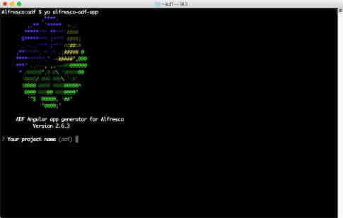
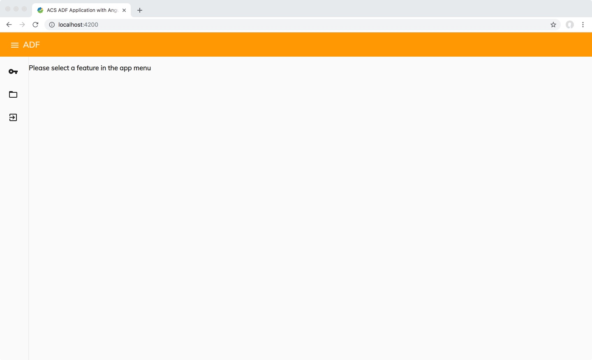

# Creating your first ADF application

This tutorial shows you how to set up your development environment and create an ADF application.

In order to get up and running with ADF development, you will need to install a few prerequisites: `node.js`, `Yeoman` and a code editor.
Once you have the prerequisites installed, you need to create the application using the ADF Yeoman generator, then configure your ADF application to point to your Alfresco Content Services repository.

## Install node.js

You need the latest `node.js` `8.x` release, which you can download from [https://nodejs.org/en/](https://nodejs.org/en/). Choose the installer for your OS and follow the install instructions. Once completed, open a terminal and verify the installation with the following command:

	node -v
	
Node `10.x` should work too, but we have had a few reports that it might not work out of the box for everyone.

**TIP**: If you are planning to do extensive development with ADF, `node.js` and Angular, you might consider installing a version manager for `node.js` such as [n](https://github.com/tj/n) or [nvm](https://github.com/creationix/nvm/). This tool will allow you to have multiple `node.js` versions installed at the same time, and easily switch between versions.

## Installing a code editor

All Angular development will be done using [Typescript](https://www.typescriptlang.org). With this in mind, it a great thing to have tools that make development a little easier, but really any text editor will do just fine.

We recommend [Visual Studio Code](http://code.visualstudio.com) - it's a free, lightweight and *very* powerful tool from Microsoft that works well with Angular development and has a [big ecosystem of plugins](https://marketplace.visualstudio.com/VSCode) to make the developer experience even better.

Other recommendations include IntelliJ IDEA or WebStorm from [JetBrains](https://www.jetbrains.com) *but note that the community edition does not support [Typescript](https://www.typescriptlang.org).*


## Install ADF Yeoman generator

**Note:** If you're on Linux or macOS you might need to run these commands with `sudo`




You need to ensure you have `Yeoman` installed by running `yo --version`. If this is not in your system you should run:

	npm install -g yo
	
Now install the latest version of the `generator-alfresco-adf-app`:

	npm install -g generator-alfresco-adf-app


## Create your first ADF application

Now that we have all the prerequisites in order, it's time to generate an application:

	yo alfresco-adf-app
	
Enter a name and choose `Content Services` as the application blueprint, then enter `Y` to install the dependencies.

The `Yeoman` generator will now create a new project and install all dependencies required for your application. 

## Configure ADF to work with Alfresco Content Services

The next step is to open up the newly-created project in your code editor, and open the file `proxy.conf.json`. Change the `target` property in this file so it points to your Alfresco Content Services URL and port. Please refer to your installation guide to find this URL, or if you're running an online trial you will find the information in the email.

Modify `"target": "http://localhost:8080",` so that it matches your URL and save the file.

Please note that you do not need `/alfresco` at the end of the target URL. Let's say you've launched Alfresco Content Services 6.1 using [Docker Compose](https://docs.alfresco.com/6.0/tasks/deploy-docker-compose.html). Your Alfresco Content Services repository might be available at `http://localhost:8082/alfresco`. In this case you will want the `proxy.conf.json` file to look like this:

```json
{
	"/alfresco": {
	"target": "http://localhost:8082",
	"secure": false,
	"changeOrigin": true
	}
}
```

## Start the application

To run the project, open a terminal and run 

	npm start
	
A browser will automatically open up at `http://localhost:4200`. 



Click the key icon in the side navigation and you can now log in!

*Note:* If you're running an online trial you can find your login credentials in the welcome email.

Take a few minutes to explore your application. You have the basic features: Browsing the repository, uploading and previewing documents.


# Next step

Congratulations! You're now ready to start developing your first ADF application! 

In the next tutorial you will explore how you can extend, use and configure ADF Components by customizing the login screen.

* [Extend, use and configure ADF Components](customising-login.md)
 