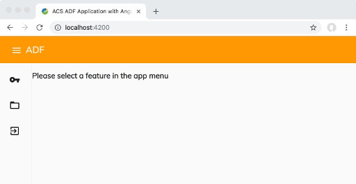

In this tutorial you are going to learn how to create a very basic (and almost “empty”) ADF-based application that you can start enriching with features, behaviors and customizations. The creation of this basic ADF-based application is possible through a scaffolding tool called [Yeoman](https://yeoman.io/ "https://yeoman.io/"), which makes this task very straightforward.

# Prerequisites and the requirements

The first thing to do is to check the prerequisites and the requirements to run the front-end application directly into a development environment.

More in particular check that you have:
-   Alfresco Content Services (alias ACS) Enterprise edition up and running (identify the URL that will be required as configuration).
-   The latest lts version of [NodeJs](https://nodejs.org/en/ "https://nodejs.org/en/"). For more convenient Node.js version management please check out [Node Version Management](./docs/tutorials/nvm.md).
-   A recent (and supported) version of a browser (see [here](https://github.com/Alfresco/alfresco-ng2-components#browser-support "https://github.com/Alfresco/alfresco-ng2-components#browser-support") for further details).

All the Angular development is done using the [Typescript](https://www.typescriptlang.org/ "https://www.typescriptlang.org/") language. With this in mind, it is highly suggested to adopt a good text editor to help you in this task. We recommend [Visual Studio Code](http://code.visualstudio.com/ "http://code.visualstudio.com/") a free, lightweight, and _very_ powerful tool from Microsoft that works well with Angular development and has a [big ecosystem of plugins](https://marketplace.visualstudio.com/VSCode "https://marketplace.visualstudio.com/VSCode") to make the developer experience even better.

# Installing the ADF Yeoman Generator

**Note:** If you're on Linux or MacOS, you might need to run the following commands using sudo.

You need to ensure you have [Yeoman](https://yeoman.io/ "https://yeoman.io/") installed by running `yo --version`. If this is not already installed, run the following command.

    npm install -g yo

Now install the latest version of the [generator-alfresco-adf-app](https://github.com/Alfresco/generator-alfresco-adf-app "https://github.com/Alfresco/generator-alfresco-adf-app").

    npm install -g generator-alfresco-adf-app@latest

Feel free to check the [generator-alfresco-adf-app](https://github.com/Alfresco/generator-alfresco-adf-app "https://github.com/Alfresco/generator-alfresco-adf-app") repository for further details. The project is Open Source and free.

# Installing the Angular CLI

To take full advantage of Angular, we suggest you install the latest version of [Angular CLI](https://cli.angular.io/ "https://cli.angular.io/").

    npm install -g @angular/cli

This will make it easy to create components, libraries, and much more.

To test the installed version [Angular CLI](https://cli.angular.io/ "https://cli.angular.io/"), launch the ng v command directly in the terminal.

# Create your first ADF application

Now that the system is properly configured, it's time to generate the application running the following command.

    yo alfresco-adf-app

Enter a name and choose Content Services as the application blueprint, then enter `Y` to install the dependencies (the following questions are optional and easy to understand).

The Yeoman generator will create a new project and install all dependencies required for your application.

**Note:** The Yeoman generator creates a new directory for your project. Make sure you change into this new directory.

# Configure the application to work with Alfresco Content Services

The next step is to open up the newly-created project in your code editor and open the file `proxy.conf.js`. Change the target property in this file, so it points to your Alfresco Content Services URL and port. Please refer to your installation guide to find this URL, or if you're running an online trial, you will find the information in the email.

Modify `"target": "http://localhost:8080"`, so that it matches your URL and save the file.

Please note that you do not need `/alfresco` at the end of the target URL. Let's say you've launched Alfresco Content Services 6.1 using Docker Compose. Your Alfresco Content Services repository might be available at `http://localhost:8080/alfresco`. In this case, you will want the `proxy.conf.json` file to look like this:

    module.exports = {
        "/alfresco": {
            "target": "http://localhost:8080",
            "secure": false,
            "changeOrigin": true
        }
    };

If you're running an online trial, consult your emails for the correct URL. The `proxy.conf.json` should look like this:

    module.exports = {
        "/alfresco": {
            "target": "https://xyz.trials.alfresco.com",
            "secure": false, "changeOrigin": true
        }
    };

# Start the application

To run the project, open a terminal and run:

    npm start

A browser will automatically open up at http://localhost:4200.

Click the key icon in the side navigation, and you can now log in!

**Note:** If you're running an online trial, you can find your login credentials in the welcome email.

Take a few minutes to explore your application. You have the essential features: Browsing the repository, uploading, and previewing documents.

# Troubleshooting and support

If you have any issue, don’t worry! There is an entire community available to help you.

In case of problems raise a question into the [Alfresco Forum](https://hub.alfresco.com/ "https://hub.alfresco.com/") (Application Development Framework section) or connect with the developers into the [Alfresco Gitter channel](https://alfresco.atlassian.net/wiki/spaces/PM/overview "https://alfresco.atlassian.net/wiki/spaces/PM/overview"). Being an Alfresco customer or partner you can also raise a request for support into the Alfresco Support Portal.

# Other types of ADF based applications

In this tutorial you learned how to create an ADF based application from scratch, running against an existing instance of Alfresco Content Services. Using the [ADF Yeoman Generator](https://github.com/Alfresco/generator-alfresco-adf-app "https://github.com/Alfresco/generator-alfresco-adf-app"), more in particular during the creation of the ADF based application, you can decide to use a different application blueprint (content only, content and process and process only). The tasks described above don’t really change except for the fact that you have to update the URLs of the backend services accordingly.
