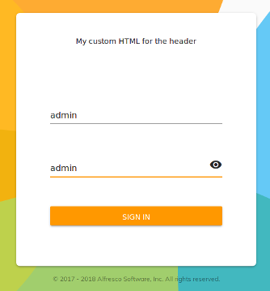

# Customizing the Login component

In this tutorial you will learn how to customize the [Login component](../core/components/login.component.md) following the technical documentation.

The task will be very simple. See the documentation for further details about customizing this component, along with examples.

## Locating the component into your application

Starting from an existing ADF application, the `Login` component, like any other component, is stored in a subfolder of the `app` folder. In the
[Alfresco Content App](https://github.com/Alfresco/alfresco-content-app)
it is stored in the `/src/app/components/login` path. In an ADF app created with [Yeoman](http://yeoman.io/)
it is stored in the `/src/app/login` path.

Once you have located the [Login component](../core/components/login.component.md) for your application, you can customize it as described below. 

## Changing the header

As with every regular
[Angular Component](https://angular.io/guide/architecture-components),
you can customize the [Login component](../core/components/login.component.md) can be customised via CSS, HTML and Typescript. In this simple
example, we will customize the header (as described also in the
[technical documentation](../core/components/login.component.md)).

Open the [`login.component`](../core/components/login.component.md)`.html` file and change the content to match the following source code:

```html
<adf-login ...>
	<adf-login-header><ng-template>My custom HTML for the header</ng-template></adf-login-header>
</adf-login>
```

After saving the file, the login form will look like this:



## More examples

As mentioned earlier, this is a very basic example and the [Login component](../core/components/login.component.md) can be customized
much more extensively than this. For a complete and detailed description, full of examples, check the
[technical documentation about the component](../core/components/login.component.md).
This describes every customization available for the [Login component](../core/components/login.component.md).
