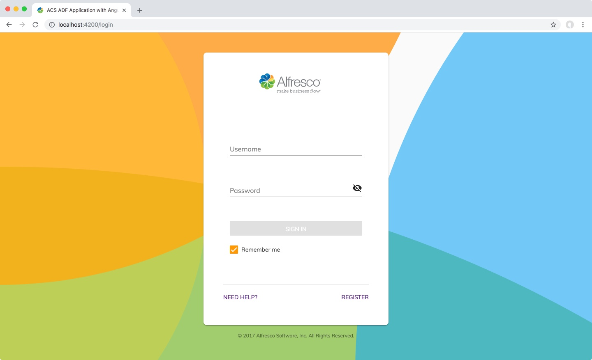
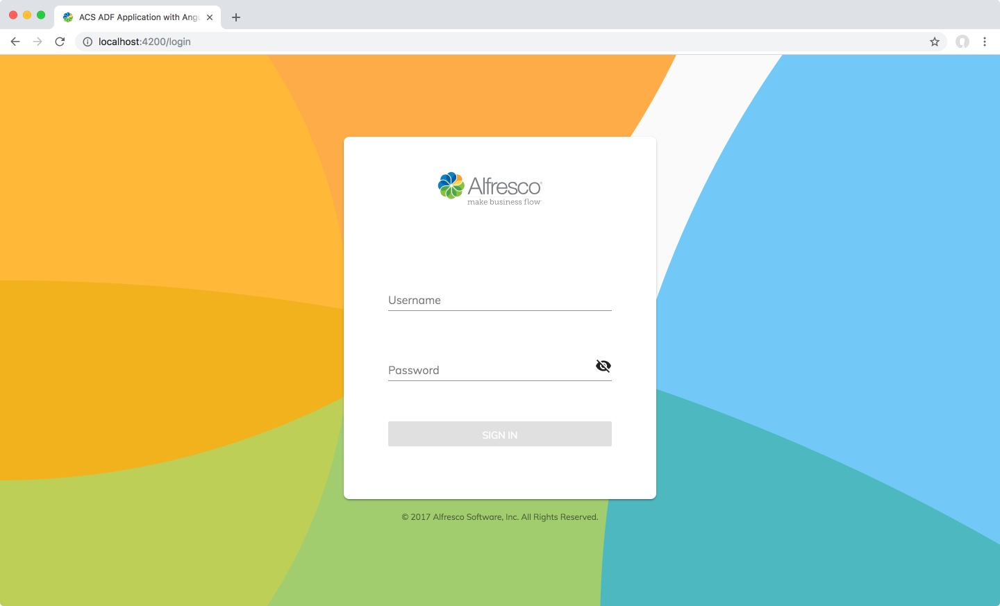

# Using ADF Components

In this tutorial, you will learn how to extend, use, and configure ADF Components.



We will be customizing the [Login component](../core/components/login.component.md) as an example, where we will remove the `Remember me`, `Need Help?` and `Register` links in the footer and setup an event listener that displays an alert when the login form is submitted. We will finish off by setting up a custom footer.

The final result will look like this:


We have carefully picked these three customizations because they cover the three fundamental ways you can use, extend, and configure ADF Components:

1.  Configuration Properties
2.  Event Listeners
3.  HTML Extensions / _Content Projection_

You should always consult the documentation for the component you are looking to use. For this exercise it would be useful to open a browser window with the [Login Component](../core/components/login.component.md)
documentation.

Let's do a practical example for each approach.

## Configuration Properties

Angular components can be configured via properties in the HTML template. In this example, we will remove the `Remember me`, `Need Help?` and `Register` links in the footer.

Make sure you have the application running from the [previous tutorial](creating-your-first-adf-application.md).

Open the project in a code editor. It's best to open the entire folder so it will be easier to switch between files. 

Open the `src/app/login/login.component.html` file. The contents will look like this:

```html
<adf-login
	copyrightText="© 2005-2023 Hyland Software, Inc. and its affiliates. All rights reserved."
	successRoute="/documentlist">
</adf-login>
```

Looking at the documentation, we can see that the `<adf-login/>` component has a lot of different properties. The ones we are interested in are `showRememberMe` and `showLoginActions`. These are set to `true` by default, but we can easily change them like this:

```html
<adf-login
	[showRememberMe]="false"
	[showLoginActions]="false"
	copyrightText="© 2005-2023 Hyland Software, Inc. and its affiliates. All rights reserved."
	successRoute="/documentlist">
</adf-login>
```

Save the file. The browser will automatically reload once the file is saved. The result will look like this:



**Note:** The two new properties are specified with `[]` around them. There are three ways to configure a component property:

1.  `[property]=""` This will be an expression or property from the typescript controller. Use this for boolean expressions or variables 
2.  `property=""` This will be passed in as raw text
3.  `[(property)]` This is called _banana in a box_ and is used for two way binding

## Event Listeners

Now that we've successfully configured properties on the `<adf-login/>` component, it's time to look at events.

Again, looking at the [Login Component](../core/components/login.component.md)
docs, we can see that it emits three events: `success`, `error` and `executeSubmit`.

We can subscribe to these events and have our custom code executed when these events are emitted. Let's hook into the `executeSubmit` and do a simple `alert()` when the form is submitted.

Open `src/app/login/login.component.html` and add `(executeSubmit)="myExecuteSubmitMethod($event)"` to the `<adf-login/>` component:

```html
<adf-login
	[showRememberMe]="false"
	[showLoginActions]="false"
	(executeSubmit)="myExecuteSubmitMethod($event)"
	copyrightText="© 2005-2023 Hyland Software, Inc. and its affiliates. All rights reserved."
	successRoute="/documentlist">
</adf-login>
```

Next we need to implement `myExecuteSubmitMethod` in the typescript. Open `src/app/login/login.component.ts` and add a new method:

```ts
// Add this!
myExecuteSubmitMethod(event: any) {
	alert('Form was submitted!');
	console.log(event);
}
```

The complete file should now look like this:

```ts
import { Component } from '@angular/core';

@Component({
	selector: 'app-login',
	templateUrl: './login.component.html',
	styleUrls: ['./login.component.css']
})
export class LoginComponent {

	// Add this!		
	myExecuteSubmitMethod(event: any) {
		alert('Form was submitted!');
		console.log(event);
	}
}
```

Save the files, go to the [login component,](../core/components/login.component.md) enter a valid username and password, and you should now see an alert. Looking in the console in the browser, you'll see the event data. Here we get all the details for the form. 

## Content Projection / HTMl Extensions

The last way a component can be configured or extended is through an approach called Content Projection. This allows components to put placeholders in their template, allowing developers to "project" their code or components into pre-defined locations within the component.

In normal HTML, elements can be nested, for example:

```html
<div>
	<p>
		<b>Here we have some bold text</b>
	</p>
</div>
```

We can use the same approach with ADF Components to inject custom code or whole components into the ADF component.

The documentation gives information about which targets are in place.  Components that support content
project has a
[Transclusions](../user-guide/transclusion.md)
section in the doc page with all the relevant details.

The `<adf-login/>` component supports two targets: `adf-login-header` and `adf-login-footer`. 

Let's add a simple Hello World message in the footer. Open the template `src/app/login/login.component.html` and add a new tag _inside_ the `<adf-login/>` HTML tag:

```html
<adf-login
	[showRememberMe]="false"
	[showLoginActions]="false"
	(executeSubmit)="myExecuteSubmitMethod($event)"
	copyrightText="© 2005-2023 Hyland Software, Inc. and its affiliates. All rights reserved."
	successRoute="/documentlist">
		<adf-login-footer>
			<ng-template>
				Hello World!
			</ng-template>
		</adf-login-footer>
</adf-login>
```

Be careful that you place the `<adf-login-footer/>` tag _inside_ the `<adf-login/>` tag.

Inside the `<adf-login-footer/>` or `<adf-login-header/>` tags, we can put anything we want, as long as we wrap it inside an `<ng-template/>` tag. We can also source in custom or 3rd party components.

### Bonus objective: Add a custom logo and background to the login screen

Are you up for a challenge? Explore the [Login component](../core/components/login.component.md)
docs to find out how you can change the logo and background image!

# Next steps

We have some tutorials for you to explore. Here are a few suggested ones to try next:

-   [Basic theming](basic-theming.md)
-   [Create a new page](new-view.md)
-   [Adding a new component](new-component.md)
