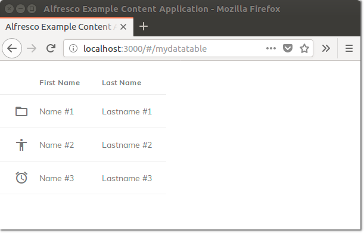
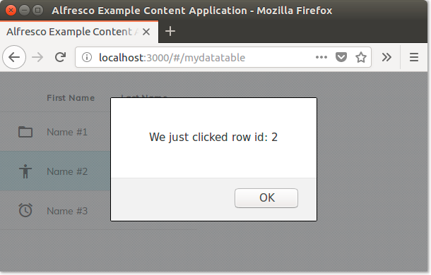
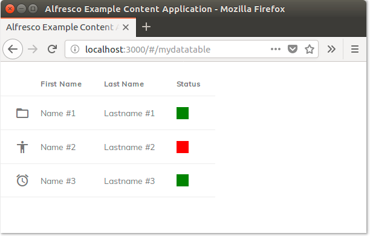
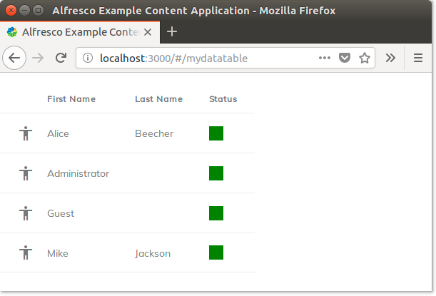
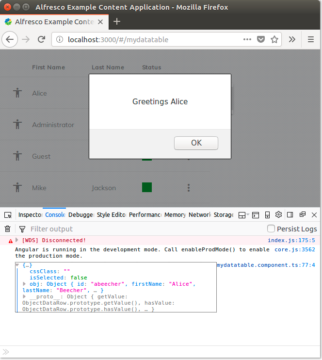
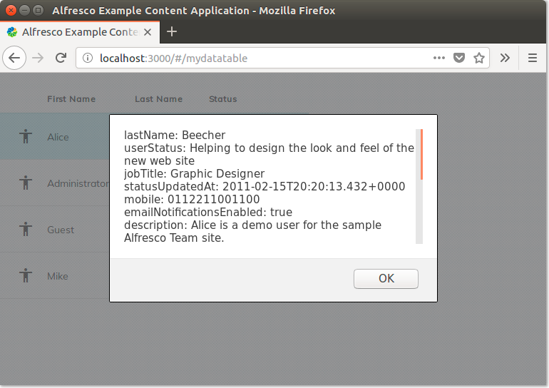

# Working with a Data Table

In this tutorial you will learn how to populate a DataTable component.

The custom data for the table generally comes from a generic back-end service or third party API. As an example we are going to use data from one of the available services on Alfresco Content Services. However, the procedure is much the same if want to use an Alfresco Process Services endpoint or a third party API.

## Prerequisites and data source

Before diving deep into the technical description of the
[DataTable component](../core/components/datatable.component.md),
let's start with a description of the development environment and its prerequisites.

In this tutorial we will start from an existing ADF application set up to use (at least) Alfresco Content
Services as a service layer. For convenience and relevance to the Data Table, we suggest using the
[Alfresco Example Content Application](https://github.com/Alfresco/alfresco-content-app). This application
is well documented, and you can choose to
[build it from the source code](https://alfresco.github.io/alfresco-content-app/#/build) or
[run it in a Docker container](https://alfresco.github.io/alfresco-content-app/#/docker).
However, if you prefer to create a brand new ADF application from scratch then you should still be able
to follow the tutorial without difficulty.

For this tutorial, the endpoint used to populate the [DataTable component](../core/components/datatable.component.md) is the
[`/people` service](https://api-explorer.alfresco.com/api-explorer/#!/people/listPeople) which lists
all users available in an Alfresco Content Services instance. The `/people` service is suitable for the
purpose of this tutorial because it is available by default in the Alfresco Content Services REST API.
As a follow-up, you could choose to use an Alfresco Process Services endpoint or a third party API.
Below is an example of the information returned by the
[`/people` service](https://api-explorer.alfresco.com/api-explorer/#!/people/listPeople):

```json
{
  "list": {
    "pagination": {
      "count": 46,
      "hasMoreItems": false,
      "totalItems": 46,
      "skipCount": 0,
      "maxItems": 100
    },
    "entries": [
      {
        "entry": {
          "firstName": "Jay",
          "lastName": "Veeru",
          "emailNotificationsEnabled": true,
          "company": {},
          "id": "JayVeeru2",
          "enabled": true,
          "email": "JayVeeru@test.con"
        },
        ...
      }
    ]
  }
}
```

## Adding a page using the `DataTable` component

Starting from the ADF application, let's add a new component that implements a new page containing a
basic `DataTable` component. Open a terminal and `cd` to the root of the application, then run the
following command to add the component for the new page:

    ng g c mydatatable -m app.module

In the `src/app/mydatatable` folder you should now find four files with extensions `html`, `scss`,
`spec.ts` and `ts`, that will be used to implement the new page.

To add the new page to the routing of the application, edit the `Routes` instance in `app.routes.ts`
(if you are using the Alfresco Example Content Application) or in `app.module.ts` (if you built the
application using the standard Angular CLI).

To define the new routing, ensure the following import is included in the file:

```ts
import {MydatatableComponent} from './mydatatable/mydatatable.component';
```

Then add a new item to the `Routes` instance, as described below.

```ts
export const APP_ROUTES: Routes = [
  ...,
  {
    path: 'mydatatable',
      component: MydatatableComponent
  },
  ...
];
```

The page will now be available at the URL `http://localhost:3000/#/mydatatable` (if you started from the
Alfresco Example Content Application).

Now that the new page is in place, let's add the `DataTable` component to it. To do this, open
the `src/app/mydatatable/mydatatable.component.ts` file and add the following import:

```ts
import { ObjectDataTableAdapter } from '@alfresco/adf-core';
```

A DataTable needs an instance of [`ObjectDataTableAdapter`](lib/core/src/lib/datatable/data/object-datatable-adapter.ts) to be configured as the data source. Add
the source code below to the `mydatatable` component, just before the constructor:

```ts
data = new ObjectDataTableAdapter(
  [
    {
      id: 1, 
      firstName: 'Name #1', 
      lastName: 'Lastname #1', 
      icon: 'material-icons://folder_open'
    },
    {
      id: 2, 
      firstName: 'Name #2', 
      lastName: 'Lastname #2', 
      icon: 'material-icons://accessibility'
    },
    {
      id: 3, 
      firstName: 'Name #3', 
      lastName: 'Lastname #3', 
      icon: 'material-icons://alarm'
    }
  ]
);
```

Next, we need to put the `<adf-datatable>` component in the template and bind the data property, which will
configure the columns. Open the `src/app/mydatatable/mydatatable.component.html` file and replace the content
with the following:

```html
<adf-datatable 
  [data]="data">
  <data-columns>
    <data-column 
      key="icon" 
      type="image" 
        [sortable]="false">
      </data-column>
    <data-column 
      key="firstName" 
      title="First Name">
    </data-column>
    <data-column 
      key="lastName" 
      title="Last Name" 
      class="full-width name-column">
    </data-column>
  </data-columns>
</adf-datatable>
```

Save the file and go back to the browser. You should now see a datatable showing three rows, each with
three columns:



## DataTable configuration

The DataTable can be configured in many different ways, which enables it to be used as the foundation
for all list components throughout ADF. The Document List, Task List, and Process List are extensions
of the DataTable, and even smaller components like Attachment List, Comment List, Version List and
Content Selector are also based on it.

Looking at the
[documentation](../core/components/datatable.component.md),
we can see that it has a lot of different options, including single/multi selection, click events,
context menus, actions and keyboard navigation.

As a simple example, we'll add a `click` event to display an alert when a row is clicked. Open
`src/app/mydatatable/mydatatable.component.html` and add the following:

```html
<adf-datatable 
  (rowClick)="onRowClick($event)"
  [data]="data">
  .......
```

Next, open `src/app/mydatatable/mydatatable.component.ts` and add the method `onRowClick` as described below:

```ts
onRowClick(event: any) {
  alert('We just clicked row id: ' + event.value.obj.id);
}
```

Note that the entire row is passed in the `event` parameter. This means that our method will have
access to all the data in the row, if required. When you click a row, you should now see a nice alert:



## DataTable columns

Let's dig a bit deeper into the different options for rendering columns within the DataTable. The documentation for the
[Data Column component](../core/components/data-column.component.md)
is quite in-depth and has lots of examples. We highly recommend checking it out.

From the documentation we can see that the [Data Column component](../core/components/data-column.component.md) has quite a few properties but the
most important ones are `key`, `type`, `sortable`, `title` and  `class`. 

-   `key` is the name of the corresponding property in the [`ObjectDataTableAdapter`](lib/core/src/lib/datatable/data/object-datatable-adapter.ts) object. 
-   `type` indicates how to render. By default it will take the `text` from the matching key in the data,
    but other modes are also available:
    	 \- `image` will take a URI for a Material Icon or a URL for any image and display it.
    	 \- `date` will format a date/datetime string. Use the `format` property to override it and define a custom time format.
    	 \- `fileSize` will convert into kb/mb/gb as needed.
    	 \- `location` assumes the value is a nodeId for ACS and will display the path.
-   `sortable` toggles whether or not the column can be sorted.
-   `title` sets the column title in the table header.
-   `class` allows you to set CSS classes for the column. Use `full-width` for the column to take as much width as it can while still leaving room for the remaining columns.

## Content projection

Sometimes it's not enough to simply render a text string or an image. To handle such cases, the Data Column
supports Content projection to allow you to control what gets rendered in the column.

Let's change the example above and introduce a status field. In the data, we define a new status field that can have the values `green` or `red`. Then we can use content projection to render the column with the color instead of the text.

Open `src/app/mydatatable/mydatatable.component.ts` and change the data to the following:

```ts
data = new ObjectDataTableAdapter(
  [
    {
      id: 1, 
      name: 'Name #1', 
      createdBy: 'User #1', 
      status: 'green', 
      icon: 'material-icons://folder_open'
    },
    {
      id: 2, 
      name: 'Name #2', 
      createdBy: 'User #2', 
      status: 'red', 
      icon: 'material-icons://accessibility'
    },
    {
      id: 3, 
      name: 'Name #3', 
      createdBy: 'User #3', 
      status: 'green', 
      icon: 'material-icons://alarm'
    }
  ]
);
```

Next we need to define a new column in the template and use `<ng-template/>` to project our own content
into it. Open the template and add the following code:

```html
<data-column key="status" title="Status">
  <ng-template let-entry="$implicit">
    <span *ngIf="entry.data.getValue(entry.row, entry.col) == 'red'" style="background-color: red; width: 20px; height: 20px"></span>
    <span *ngIf="entry.data.getValue(entry.row, entry.col) == 'green'" style="background-color: green; width: 20px; height: 20px"></span>
  </ng-template>
</data-column>
```

While this might not be best practise for setting the background, it does illustrate how to take
control over the rendition of the content within a table cell. In the picture below you can see what the
user experience looks like:



## Playing with the data source

Now that you know how to control you DataTable, let's add another element by changing the data source
to integrate an external API (in this example the
[`/people` service](https://api-explorer.alfresco.com/api-explorer/#!/people/listPeople)
that lists all the users available in an Alfresco Content Services instance).

As explained above, you can do this by populating the [`ObjectDataTableAdapter`](lib/core/src/lib/datatable/data/object-datatable-adapter.ts) object that acts as
the data source of the `DataTable` component. Open the `src/app/mydatatable/mydatatable.component.ts`
file and replace the content with the following:

```ts
import { Component, OnInit } from '@angular/core';
import { AlfrescoApiService } from '@alfresco/adf-core';
import { ObjectDataTableAdapter, ObjectDataRow } from '@alfresco/adf-core';

@Component({
  selector: 'app-mydatatable',
  templateUrl: './mydatatable.component.html',
  styleUrls: ['./mydatatable.component.scss']
})
export class MydatatableComponent implements OnInit {

  data = new ObjectDataTableAdapter([],[]);

  constructor(private apiService: AlfrescoApiService) {

    this.apiService.getInstance().webScript.executeWebScript(
      'GET',
      'people',
      [],
      null,
      'api/-default-/public/alfresco/versions/1',
      null
    ).then(
      (response: any) => {
        let results = [];
        for (var entry of response.list.entries) {
          results.push({
            id: entry.entry.id,
            firstName: entry.entry.firstName,
            lastName: entry.entry.lastName,
            status: 'green',
            icon: 'material-icons://accessibility'
          });
        }
        this.data.setRows(results.map(item => { return new ObjectDataRow(item); }));
      }
    );

  }

  onRowClick(event: any) {
    alert('We just clicked row id: ' + event.value.obj.status);
  }

}
```

As you can see, the major changes are in the constructor where the external API is invoked and the
`this.data` object id dynamically populates the table with the response of the services (assumed to
be in JSON but it could be in any format).

After saving the file, you should see something like the following in the browser:



## Adding an action

A common and straightforward customization for a DataTable is to add an action to each row or to rows
that meet certain conditions.

Make the changes shown below to the `src/app/mydatatable/mydatatable.component.html` file:

```html
<adf-datatable
    ...
    [actions]="true"
    (showRowActionsMenu)="onShowRowActionsMenu($event)"
    (executeRowAction)="onExecuteRowAction($event)">
</adf-datatable>
```

Also update `src/app/mydatatable/mydatatable.component.ts` as follows: 

```ts
import { DataCellEvent, DataRowActionEvent } from '@alfresco/adf-core';

onShowRowActionsMenu(event: DataCellEvent) {
    event.value.actions = [
        {
            title: 'Greetings'
            // Put here your custom metadata.
        }
    ];
}

onExecuteRowAction(event: DataRowActionEvent) {
    console.log(event.value.row);
    alert('${event.value.action.title} ${event.value.row.obj.firstName}');
}
```

After you have saved both files, you should see something like the following when you click the
three dots column in the table and select `Greetings` for the first row:



Note that the browser console has a log describing how the row object is shown for debugging purposes.

To make the example more realistic, let's add some interaction with an external service. We will use
the [`/people/{personId}` service](https://api-explorer.alfresco.com/api-explorer/#!/people/getPerson)
to get the complete profile data, retrieved as a JSON response. To make it simple, we will extract the data as a string, shown to the user through the usual `alert` command. In your final application you might want to use a more sophisticated modal window (the standard
[Material Dialog](https://material.angular.io/components/dialog/overview), perhaps).

To develop the enhancement, edit the `src/app/mydatatable/mydatatable.component.html` file, replacing the
`onExecuteRowAction` method as follows:

```ts
onExecuteRowAction(event: DataRowActionEvent) {

    if (event.value.action.title === "Greetings") {

        this.apiService.getInstance().webScript.executeWebScript(
          'GET',
          'people/' + event['value']['row']['obj']['id'],
          [],
          null,
          'api/-default-/public/alfresco/versions/1',
          null
        ).then(
          (response: any) => {
              alert(JSON.stringify(response.entry));
          }
        );

    }
}
```

After saving this, the application will be updated automatically and your browser should show something
like the following when the `Greetings` action is selected for a row:


