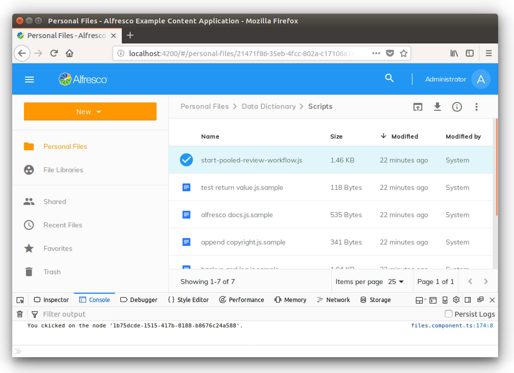
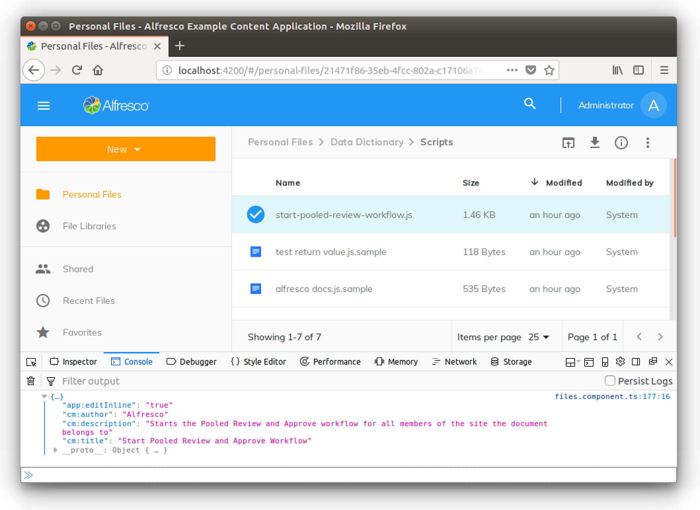
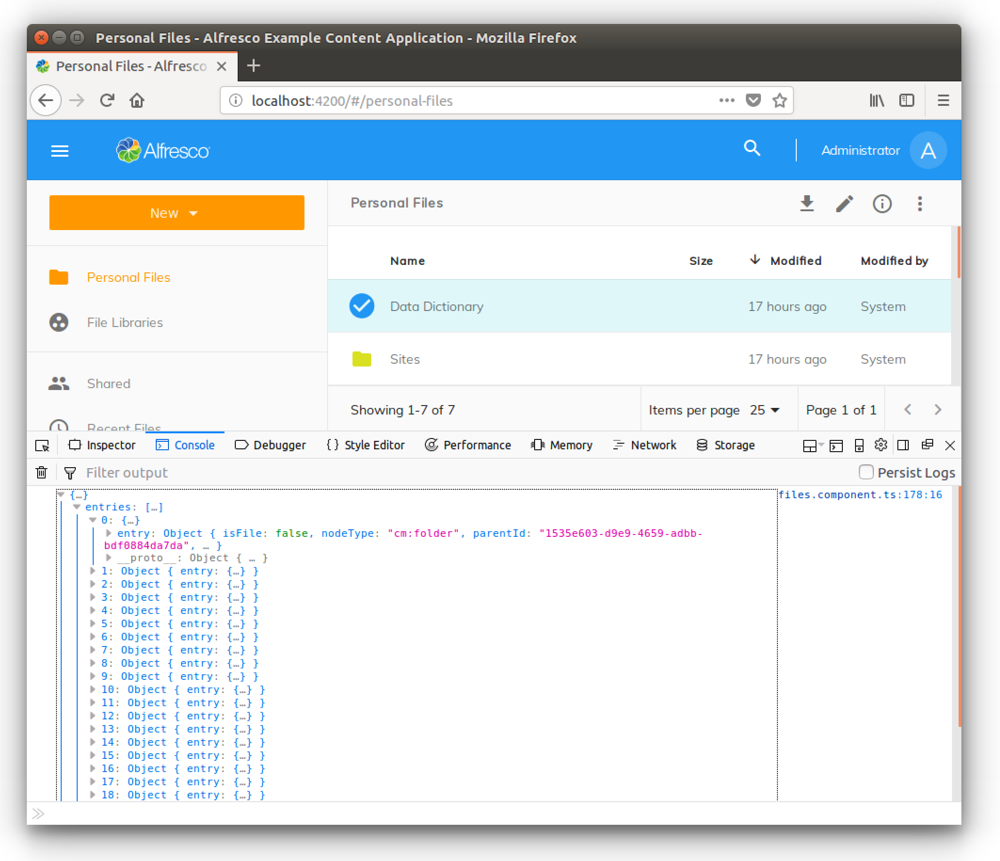
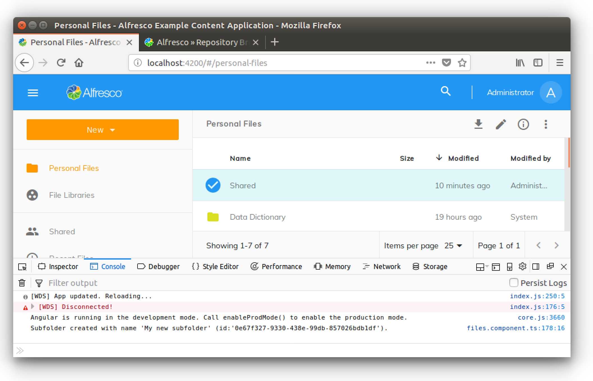
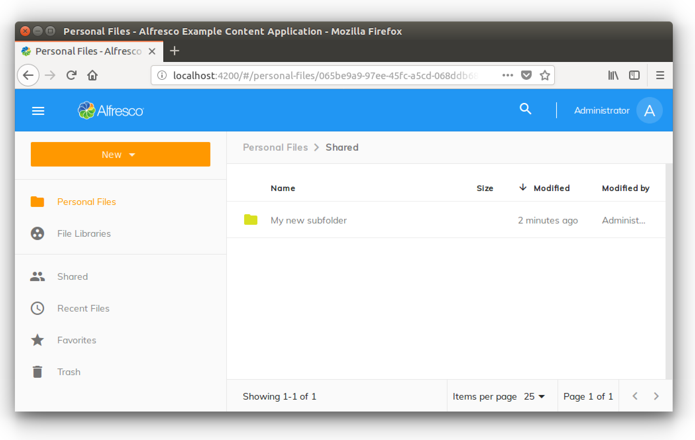
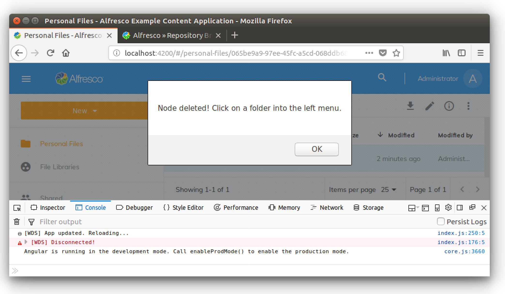

# Working with the Nodes API Service

In this tutorial you will learn how to use the [`NodesApiService`](../core/services/nodes-api.service.md).

We have developed some practical examples to show you how to interact with an instance of Alfresco Content Services without using the REST endpoints directly. With this approach the [`NodesApiService`](../core/services/nodes-api.service.md) is used as an abstraction layer, defined by one of the services in the ADF Core library.

## Contents

-   [Preparing the development environment](#preparing-the-development-environment)
-   [Basic examples of usage](#basic-examples-of-usage)
-   [About the NodesApiService](#about-the-nodesapiservice)
    -   [Observables](#observables)
    -   [MinimalNode](#minimalnode)
    -   [NodePaging](#nodepaging)
-   [Retrieving info and metadata from a node](#retrieving-info-and-metadata-from-a-node)
-   [Retrieving the node's children](#retrieving-the-nodes-children)
-   [Creating and deleting a subfolder](#creating-and-deleting-a-subfolder)
    -   [Creating a subfolder](#creating-a-subfolder)
    -   [Deleting a folder](#deleting-a-folder)

## Preparing the development environment

To focus the description on the [`NodesApiService`](../core/services/nodes-api.service.md), we will develop on top of the
[Alfresco Example Content Application](https://github.com/Alfresco/alfresco-content-app).
If you don't have it already installed in your development environment then see the prerequisites section in [creating your first ADF Application](./creating-your-first-adf-application.md).

When you have the Alfresco Example Content Application up and running, edit the `FileComponent`
defined in `src/app/components/files/files.component.ts`. Change the  `navigateTo` method
to match the source code below.

```ts
if (node.isFile) {
    this.myOnNodeDoubleClick(node.id);
}
```

Now add the `myOnNodeDoubleClick` method as described below and save the file:

```ts
myOnNodeDoubleClick(nodeId) {
    console.log("You ckicked on the node '" + nodeId + "'.");
}
```

This will change the user experience when you click on a content node (but _not_ a folder):
in the browser's console you will see something like the following screenshot, instead of
the preview of the content:



The Alfresco Example Content app is now set up to demonstrate the usage of the [`NodesApiService`](../core/services/nodes-api.service.md).

## Basic examples of usage

For a first look at the [`NodesApiService`](../core/services/nodes-api.service.md), let's check the `FileComponent` component stored in
`src/app/components/files/files.component.ts`. In the source code, you can see the `nodesApi`
property that represents the [`NodesApiService`](../core/services/nodes-api.service.md) in the [`FilesComponent`](../../demo-shell/src/app/components/files/files.component.ts). See the `fetchNode` and
`fetchNodes` methods for some very basic examples.

## About the NodesApiService

Before going further, let's introduce the [`NodesApiService`](../core/services/nodes-api.service.md) class.
As you can see, the available methods are easy to understand and they should be all you need to
manage the nodes of your content repository.

### Observables

Almost all the methods return an [`Observable`](http://reactivex.io/documentation/observable.html).
Observables provide support for passing messages between publishers and subscribers in Angular
applications. Observables offer significant benefits over other techniques for event handling,
asynchronous programming, and handling multiple values.

The return values of the [`NodesApiService`](../core/services/nodes-api.service.md) methods are managed in the usual way for Observables.
You "subscribe" to the asynchronous messaging using the following syntax:

```ts
this.nodesApi.getNode(nodeId).subscribe(
    (node) => { ... },
    error => { ... }
);
```

### MinimalNode

All the methods that manage content nodes return an [`Observable`](http://reactivex.io/documentation/observable.html) of the [`MinimalNode`](https://github.com/Alfresco/alfresco-js-api/blob/master/src/alfresco-core-rest-api/docs/NodeMinimalEntry.md)
class. [`MinimalNode`](https://github.com/Alfresco/alfresco-js-api/blob/master/src/alfresco-core-rest-api/docs/NodeMinimalEntry.md) is used to represent the node's content. See the
[official documentation](https://github.com/Alfresco/alfresco-js-api/blob/master/src/alfresco-core-rest-api/docs/NodeMinimalEntry.md)
for further details.

### NodePaging

When a method returns a list of nodes rather than a single node, it usually returns an [`Observable`](http://reactivex.io/documentation/observable.html) of the [`NodePaging`](https://github.com/Alfresco/alfresco-js-api/blob/develop/src/api/content-rest-api/docs/NodePaging.md) class. See the
[`NodePaging`](https://github.com/Alfresco/alfresco-js-api/blob/develop/src/api/content-rest-api/docs/NodePaging.md)
docs for further details.

## Retrieving info and metadata from a node

As a first example of the usage of the [`NodesApiService`](../core/services/nodes-api.service.md), let's retrieve the properties of a content node using its identifier. Edit the `myOnNodeDoubleClick` method in `src/app/components/files/files.component.ts`, as shown below:

```ts
myOnNodeDoubleClick(nodeId) {
    this.nodesApi.getNode(nodeId)
    .subscribe(
        (node) => {
            console.log(node.properties);
        },
        error => { console.log("Ouch, an error happened!"); }
    );
}
```

This will show the properties of the content node in the browser's console as a log. 
The screenshot below shows an example of what this looks like:



Of course, if you prefer to use the node's data in the user interface (using a `DataTable` or
other visual component) then the principle is the same.

## Retrieving the node's children

Another common use of the [`NodesApiService`](../core/services/nodes-api.service.md) is to retrieve a list of the children of a folder node.
Edit `src/app/components/files/files.component.ts` again, changing the `navigateTo` method
to match the source code below:

```ts
    if (node.isFolder) {
	    this.myOnFolderNodeDoubleClick(node.id);
    }
```

Now add the `myOnFolderNodeDoubleClick` method as shown below and save the file:

```ts
myOnFolderNodeDoubleClick(nodeId) {
    this.nodesApi.getNodeChildren(nodeId)
    .subscribe(
        (nodePaging) => {
            console.log(nodePaging.list);
        },
        error => { console.log("Ouch, an error happened!"); }
    );
}
```

Now, the user experience changes if you click on a folder node (but not a content node)
in the browser's console you will see something like the following screenshot:



## Creating and deleting a subfolder

The [`NodesApiService`](../core/services/nodes-api.service.md) class is not just for retrieving data. You can also use it to manage a
real CRUD of nodes (content and folders). In the following examples, you will see how to create
a subfolder of the double clicked folder and also how to delete it.

### Creating a subfolder

To create a subfolder, change the `myOnFolderNodeDoubleClick` method as described below and save the Typescript file.

```ts
myOnFolderNodeDoubleClick(nodeId) {
    this.nodesApi.createFolder(nodeId, { "name": "My new subfolder" })
    .subscribe(
        (node) => {
            console.log("Subfolder created with name '" + node.name + "' (id:'" + node.id + "').");
        },
        error => { console.log("Ouch, an error happened!"); }
    );
}
```

The user experience now changes if you click on a folder node (but not a content node). To check
it out, double click on the `Shared` folder and in the browser's console you will see something
like the following screenshot:



A new subfolder named `My new subfolder` will be created. You can check its existence using
Alfresco Share client or by replacing the content of the `myOnFolderNodeDoubleClick` method
with:

```ts
this.navigate(nodeId);`
```

...and then saving and navigating to the `Shared` folder.

In the following screenshot you can see how the browser should look:



Note that if you double-click several times on a folder then the action should only succeed for
the first click. The behaviour is correct if you bear in mind that you are trying to create folders
with the same name in the same parent folder, which is not permitted by Alfresco Content Services.

### Deleting a folder

To delete a folder, change the `myOnFolderNodeDoubleClick` method as described below and save the Typescript file.

```ts
myOnFolderNodeDoubleClick(nodeId) {
    this.nodesApi.deleteNode(nodeId)
    .subscribe(
        success => {
            alert("Node deleted! Click on a folder into the left menu.");
        },
        error => { console.log("Ouch, an error happened!"); }
    );
}
```

**NOTE:** This task could delete entire parts of your Alfresco repository if you double click
on the wrong folder. Test it carefully!

Now, if you click on a folder node (be careful which folder you choose!) then you will see
something like the following screenshot in the browser:



You can check that the folder does not exist anymore using Alfresco Share client or by replacing
the content of the `myOnFolderNodeDoubleClick` method with

```ts
this.navigate(nodeId);
```

...and saving the file.
