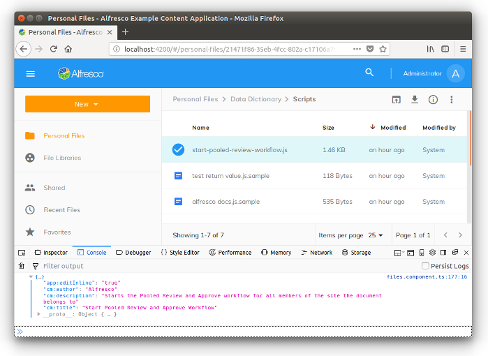

# Working with the Nodes API Service

In this tutorial you will learn how to use the [`NodesApiService`](https://github.com/Alfresco/alfresco-ng2-components/blob/master/lib/core/services/nodes-api.service.ts) in some practical examples developed to show you how to interact with your instance of Alfresco Content Services, without consuming directly the REST endpoints. With this approach, the `NodesApiService` is used as an abstraction layer, defining one of the core services of the ADF collection of components.

## Preparing the development environment

To focus the description on the `NodesApiService`, in this tutorial we are going to develop on top of the [Alfresco Example Content Application](https://github.com/Alfresco/alfresco-content-app). If you don't have it already installed into your development environment, check the *how-to* description into the [preparation of the development environment](https://alfresco.github.io/adf-component-catalog/additional-documentation/tutorials/preparing-the-development-environment.html).

Assuming that you have the Alfresco Example Content Application up and running, edit the `FileComponent` defined into the `src/app/components/files/files.component.ts` file. Change the  `onNodeDoubleClick` method accordingly with the source code below.

    if (PageComponent.isLockedNode(node)) {
    	    ...
    } else if (node.isFile) {

	    // Comment the line below.
	    // this.router.navigate(['./preview', node.id], { relativeTo: this.route });

	    // Add this line.
	    this.myOnNodeDoubleClick(node.id);
    }

Now add the `myOnNodeDoubleClick` method as described below, and save the typescript file.

    myOnNodeDoubleClick(nodeId) {
        console.log("You ckicked on the node '" + nodeId + "'.");
    }

Once done, the user experience changes if you click on a content node (not a folder): in the browser's console you will see the something like the following picture, instead of the preview of the content.

This is all you need, to prepare the Alfresco Example Content Application to be customised for demonstrating the `NodesApiService` usage.

## Basic examples of usage 

For a first contact with the `NodesApiService`, let's check the `FileComponent` component stored into the `src/app/components/files/files.component.ts` file. Directly in the source code you can check the `nodesApi` property that represent the `NodesApiService` into the `FilesComponent`. Check the `fetchNode` and `fetchNodes` methods for some very basic examples.

## About the `NodesApiService`

Before any example, let's introduce the `NodesApiService` component. For further details about the implementation, check the component catalog [here](https://alfresco.github.io/adf-component-catalog/injectables/NodesApiService.html). As you can see, the available methods are easy to understand and they should be all you would need to manage the nodes of your content repository.

### Observables

As you can see, almost all the methods return an [Observable](https://angular.io/guide/observables) as result. Observables provide support for passing messages between publishers and subscribers into Angular applications. Observables offer significant benefits over other techniques for event handling, asynchronous programming, and handling multiple values.

Returning Observables, the `NodesApiService` methods will be managed in the usual way: subscribing the asynchronous messaging using the following syntax.

    this.nodesApi.getNode(nodeId).subscribe(
	    (node) => { ... },
	    error => { ... }
    );

### MinimalNodeEntryEntity

All the methods managing content nodes return `Observable` of a `MinimalNodeEntryEntity` class. `MinimalNodeEntryEntity` is used to represent the node content. Refer to the [official documentation](https://github.com/Alfresco/alfresco-js-api/blob/master/src/alfresco-core-rest-api/docs/NodeMinimalEntry.md) for further details.

### NodePaging
If the result of a method is a list of nodes, instead of a single node, it usually returns on `Observable` of a `NodePaging` class instead. Refer to the [official documentation](https://alfresco.github.io/adf-component-catalog/classes/NodePaging.html) for further details.

## Retrieving info and metadata from a node

As a first example of usage of the `NodesApiService` component, let's retrieve the properties of a content node, starting from its identifier. To develop this usage, edit the `myOnNodeDoubleClick` method in the `src/app/components/files/files.component.ts` file, as described below.

    myOnNodeDoubleClick(nodeId) {
        this.nodesApi.getNode(nodeId)
        .subscribe(
            (node) => {
                console.log(node.properties);
            },
            error => { console.log("Ouch, an error happened!"); }
        );
    }

This source code will show the properties of the content node with a specific identifier, into the browser console as a log. In the screenshot below an example.

## Retrieving the node's children

## Creating and deleting a subfolder

