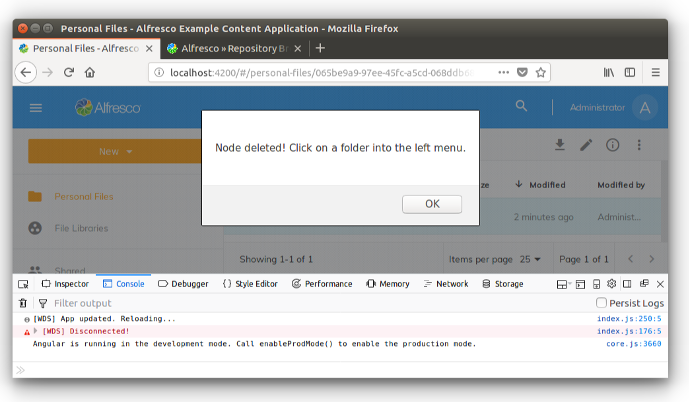

# Working with the Nodes API Service

In this tutorial you will learn how to use the [`NodesApiService`](https://github.com/Alfresco/alfresco-ng2-components/blob/master/lib/core/services/nodes-api.service.ts) in some practical examples developed to show you how to interact with your instance of Alfresco Content Services, without consuming directly the REST endpoints. With this approach the `NodesApiService` is used as an abstraction layer, defining one of the core services of the ADF collection of components.

## Preparing the development environment

To focus the description on the `NodesApiService`, in this tutorial we are going to develop on top of the [Alfresco Example Content Application](https://github.com/Alfresco/alfresco-content-app). If you don't have it already installed into your development environment, check the *how-to* description into the [preparation of the development environment](./preparing-the-development-environment.html).

Assuming that you have the Alfresco Example Content Application up and running, edit the `FileComponent` defined into the `src/app/components/files/files.component.ts` file. Change the  `onNodeDoubleClick` method accordingly with the source code below.

    if (PageComponent.isLockedNode(node)) {
    	    ...
    } else if (node.isFile) {

	    // Comment the line below.
	    // this.router.navigate(['./preview', node.id], { relativeTo: this.route });

	    // Add this line.
	    this.myOnNodeDoubleClick(node.id);
    }

Now add the `myOnNodeDoubleClick` method as described below and save the typescript file.

    myOnNodeDoubleClick(nodeId) {
        console.log("You ckicked on the node '" + nodeId + "'.");
    }

Once done, the user experience changes if you click on a content node (not a folder): in the browser's console you will see something like the following screenshot, instead of the preview of the content.

This is all you need, to prepare the Alfresco Example Content Application to be customised for demonstrating the `NodesApiService` usage.

## Basic examples of usage 

For a first contact with the `NodesApiService`, let's check the `FileComponent` component stored into the `src/app/components/files/files.component.ts` file. Directly in the source code you can check the `nodesApi` property that represent the `NodesApiService` into the `FilesComponent`. Check the `fetchNode` and `fetchNodes` methods for some very basic examples.

## About the `NodesApiService`

Before any development, let's introduce the `NodesApiService` class. For further details about the implementation, check the component catalog [here](https://alfresco.github.io/adf-component-catalog/injectables/NodesApiService.html). As you can see, the available methods are easy to understand and they should be all you would need to manage the nodes of your content repository.

### Observables

As you can see, almost all the methods return an [Observable](https://angular.io/guide/observables) as result. Observables provide support for passing messages between publishers and subscribers into Angular applications. Observables offer significant benefits over other techniques for event handling, asynchronous programming, and handling multiple values.

Returning Observables, the `NodesApiService` methods will be managed in the usual way: subscribing the asynchronous messaging using the following syntax.

    this.nodesApi.getNode(nodeId).subscribe(
	    (node) => { ... },
	    error => { ... }
    );

### MinimalNodeEntryEntity

All the methods managing content nodes return an `Observable` of a `MinimalNodeEntryEntity` class. `MinimalNodeEntryEntity` is used to represent the node's content. You can refer to the [official documentation](https://github.com/Alfresco/alfresco-js-api/blob/master/src/alfresco-core-rest-api/docs/NodeMinimalEntry.md) for further details.

### NodePaging

If the result of a method is a list of nodes, instead of a single node, it usually returns an `Observable` of a `NodePaging` class instead. You can refer to the [official documentation](https://alfresco.github.io/adf-component-catalog/classes/NodePaging.html) for further details.

## Retrieving info and metadata from a node

As a first example of usage of the `NodesApiService` class, let's retrieve the properties of a content node, starting from its identifier. To develop this usage, edit the `myOnNodeDoubleClick` method in the `src/app/components/files/files.component.ts` file, as described below.

    myOnNodeDoubleClick(nodeId) {
        this.nodesApi.getNode(nodeId)
        .subscribe(
            (node) => {
                console.log(node.properties);
            },
            error => { console.log("Ouch, an error happened!"); }
        );
    }

This source code will show the properties of the content node into the browser's console as a log. In the screenshot below an example of how the log looks like.

Of course, if you'd prefer to use the node's data into the user interface (a `DataTable` or any other visual component), the principle is the same but what differs is the details of the development.

## Retrieving the node's children

Another common example of `NodesApiService` usage is the retrieving of list of children of a folder node. As an example, edit again the `src/app/components/files/files.component.ts` file and change the  `onNodeDoubleClick` method accordingly with the source code below.

    if (node.isFolder) {

	    // Comment the line below.
        // this.navigate(node.id);

	    // Add this line.
	    this.myOnFolderNodeDoubleClick(node.id);

    }

Now add the `myOnFolderNodeDoubleClick` method as described below and save the typescript file.

    myOnFolderNodeDoubleClick(nodeId) {
        this.nodesApi.getNodeChildren(nodeId)
        .subscribe(
            (nodePaging) => {
                console.log(nodePaging.list);
            },
            error => { console.log("Ouch, an error happened!"); }
        );
    }

Once done, the user experience changes if you click on a folder node (not a content): in the browser's console you will see something like the following screenshot.

## Creating and deleting a subfolder

`NodesApiService` class is not only about retrieving data. With the `NodesApiService` you can also manage a real CRUD of nodes (content and folders). In the following examples, you will see how to create a subfolder of the double clicked folder and how to delete it, after its creation (dangerous task!).

### Creating a subfolder

To create a subfolder, change the `myOnFolderNodeDoubleClick` method as described below and save the typescript file.

    myOnFolderNodeDoubleClick(nodeId) {
        this.nodesApi.createFolder(nodeId, { "name": "My new subfolder" })
        .subscribe(
            (node) => {
                console.log("Subfolder created with name '" + node.name + "' (id:'" + node.id + "').");
            },
            error => { console.log("Ouch, an error happened!"); }
        );
    }

Once done, the user experience changes if you click on a folder node (not a content). As an example, double click on the `Shared` folder and in the browser's console you will see something like the following screenshot.

As a consequence, a new subfolder named `My new subfolder` will be created. As a proof, you can check the existence of the subfolder using Alfresco Share client or replacing the content of the `myOnFolderNodeDoubleClick` method with `this.navigate(nodeId);`, save it and navigate into the `Shared` folder.

In the following screenshot you can see how the browser should look like.

Note that double clicking several times on a folder, the first time only the action should succeed. The behaviour is correct considering that you are trying to create folders with the same name in the same parent folder and this is not admitted from Alfresco Content Services.

### Deleting a folder

To delete a folder, change the `myOnFolderNodeDoubleClick` method as described below and save the typescript file.

    myOnFolderNodeDoubleClick(nodeId) {
        this.nodesApi.deleteNode(nodeId)
        .subscribe(
            success => {
                alert("Node deleted! Click on a folder into the left menu.");
            },
            error => { console.log("Ouch, an error happened!"); }
        );
    }

**ATTENTION:** This task could delete entire parts of your Alfresco repository if you will double click on the wrong folder. Test it carefully!

Once saved, click on a folder node (pay attention to the chosen folder) and in the browser you will see something like the following screenshot.

As a proof, you can check that the folder does not exist anymore using Alfresco Share client or replacing the content of the `myOnFolderNodeDoubleClick` method with `this.navigate(nodeId);` and save it again.
