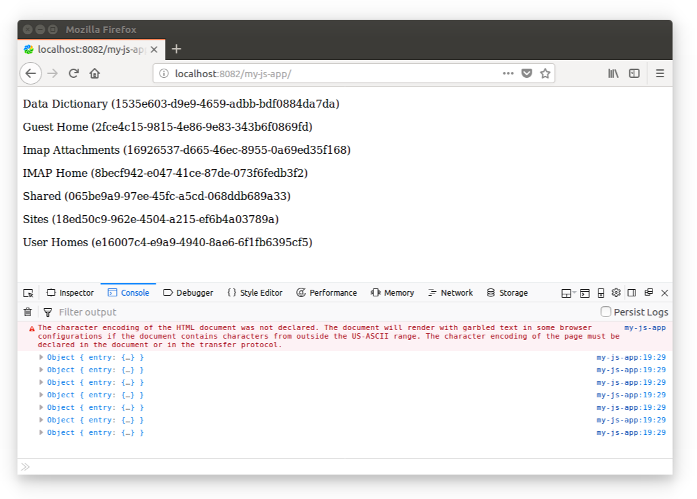

# Working with Nodes using the JS API

In this tutorial you will learn how to use the [`AlfrescoCoreRestApi`](https://github.com/Alfresco/alfresco-js-api/tree/master/src/alfresco-core-rest-api).

We have developed some practical examples to show you how to interact with an instance of Alfresco Content Services without using the REST endpoints directly. With this approach the `AlfrescoCoreRestApi` is used as an abstraction layer, defining one of the core services of the [`alfresco-api-js`](https://github.com/Alfresco/alfresco-js-api) library.

## Preparing the development environment

To focus the description on the `AlfrescoCoreRestApi`, we will develop using the
[Alfresco JavaScript application](./creating-javascript-app-using-alfresco-js-api.md).
If you don't have it already available in your development environment then see the *how-to*
description in the [dedicated tutorial](./creating-javascript-app-using-alfresco-js-api.md).

## About the `AlfrescoCoreRestApi`

Before going further, let's introduce the `AlfrescoCoreRestApi` class. For further details
about its implementation, check the documentation
[here](https://github.com/Alfresco/alfresco-js-api/tree/master/src/alfresco-core-rest-api).
As you can see, the available methods are in one-to-one relation with the REST endpoints and services of Alfresco Content Services. This makes development easy and clean, and gives the developer full access to the Alfresco Content Services REST API. 

Starting with the most basic
[Alfresco JavaScript application](./creating-javascript-app-using-alfresco-js-api.md),
the `AlfrescoCoreRestApi` class can be accessed with the following command:

    this.alfrescoJsApi.core

## Retrieving the children of a node

As a first example of the usage of the `AlfrescoCoreRestApi` class, let's retrieve the children of the root node, identified by the `-root-` alias. As described in the official documentation, the method `getNodeChildren` should be used as described below. Edit the `index.html` file as shown below and
replace the JavaScript source code for the login call:

```js
...
this.alfrescoJsApi.login('admin', 'admin').then(function (data) {

    this.alfrescoJsApi.core.childAssociationsApi.getNodeChildren('-root-', {}).then(

        function (data) {

            var divElement = document.getElementById("result");

            for (var i = 0; i < data.list.entries.length; i++) {

                console.log(data.list.entries[i]);

                var textElement = document.createTextNode(
                    data.list.entries[i].entry.name +
                    " (" +
                    data.list.entries[i].entry.id +
                    ")"
                );
                var paragraphElement = document.createElement("p");
                paragraphElement.appendChild(textElement);
                divElement.appendChild(paragraphElement);
            }
        },
        function (error) { console.error(error); });

    }, function (error) {
        console.error(error);
    });
...
```

Then replace the HTML body as follows:

```html
<body>
    <div id='result'></div>
</body>
```

Once done, save and deploy the source code as described
[here](./creating-javascript-app-using-alfresco-js-api.md),
by executing the following command from the `my-js-app` folder in a terminal:

    docker cp ../my-js-app <CONTAINER_ID>:/usr/local/tomcat/webapps

If you now open the browser at the URL `http://localhost:8082/my-js-app/`, you will see
something similar to the following screenshot:



As an exercise, you can try to implement navigation between the nodes. To do this, change the
source code of the page to accept a `nodeId` parameter and use it as the first parameter of the
`getNodeChildren` method. Then change the dynamic HTML to create a link element (`a` tag) on the
name of the child. The link will point to the same page but with `nodeId` set to the value
`data.list.entries[i].entry.id`.

## Retrieving the node data

Now that you can show the children of a node (and maybe navigate into the repository structure, if you completed the bonus exercise), let's see how to retrieve and show the data related to a node.

To make the example more complete, we split the final result into two parts: the first is about
retrieving (and showing) the data for the current node and the second is about retrieving
(and showing) the data for the child nodes.

In both cases, all is possible thanks to the
[`getNode`](https://github.com/Alfresco/alfresco-js-api/blob/master/src/alfresco-core-rest-api/docs/NodesApi.md#getNode)
method, which gets information for a node identified by a node id.

### Retrieving and showing data about the current node

Starting from the JavaScript application developed in the previous section, let's modify the source code for `function (data)` as follows:

```js
...
function (data) {

    var divElement = document.getElementById('nodeInfo');
    this.alfrescoJsApi.core.nodesApi.getNode(data.list.entries[0].entry.parentId, {}).then(function(nodeData) {

            console.log(nodeData);

            var textElement = document.createTextNode(
                'This node is named "' +
                nodeData.entry.name
                + '" and its children are:'
            );
            var paragraphElement = document.createElement('p');
            paragraphElement.appendChild(textElement);
            divElement.appendChild(paragraphElement);

    },
    function (error) { console.error(error); });

    ...
```

This portion of source code retrieves the node data for the parent of the first node of the results.
Of course, if the node does not have children then this code might throw an exception. As an exercise,
change the source code to manage this situation correctly.

Once retrieved, the name of the current node is displayed in the form:
`This node is named "..." and its children are:...`. To put the text in the right place, change
the HTML body as follows:

```html
<body>
    <div id='nodeInfo'></div>
    <div id='result'></div>
</body>
```

### Retrieving and showing data about the child nodes

Append the following JavaScript source code to the `function (data)`:

```js
...
var divElement = document.getElementById('result');
for (var i = 0; i < data.list.entries.length; i++) {

    this.alfrescoJsApi.core.nodesApi.getNode(data.list.entries[i].entry.id, {}).then(function(nodeData) {

        console.log(nodeData);

        var textElement = document.createTextNode(
            nodeData.entry.name +
            ' - ' + 
            nodeData.entry.aspectNames
        );
        var paragraphElement = document.createElement('p');
        paragraphElement.appendChild(textElement);
        divElement.appendChild(paragraphElement);

    }, function(error) { console.error(error); });

} 
```

As you can see, in this piece of code, information about each node is retrieved and presented in the
form: `<node name> - <list of aspect names>`.

### Showing the results

Save and deploy the source code again by executing the following command from the `my-js-app`
folder in a terminal:

    docker cp ../my-js-app <CONTAINER_ID>:/usr/local/tomcat/webapps

If you now open the browser at the URL `http://localhost:8082/my-js-app/`, you will see something
similar to the following screenshot:


