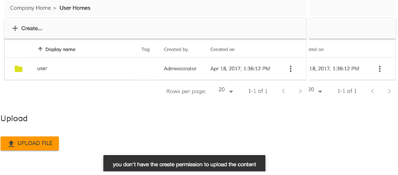

# Upload Button Component

<!-- markdown-toc start - Don't edit this section.  npm run toc to generate it-->

<!-- toc -->

- [Basic Usage](#basic-usage)
  * [Properties](#properties)
  * [Events](#events)
- [Details](#details)
  * [How to show notification message with no permission](#how-to-show-notification-message-with-no-permission)
  * [How to disable the button when the delete permission is missing](#how-to-disable-the-button-when-the-delete-permission-is-missing)

<!-- tocstop -->

<!-- markdown-toc end -->

## Basic Usage

```html
<adf-upload-button 
    [uploadFolders]="true"
    [multipleFiles]="false"
    [acceptedFilesType]="'.jpg,.gif,.png,.svg'"
    [versioning]="false"
    (onSuccess)="customMethod($event)">
</adf-upload-button>
<file-uploading-dialog></file-uploading-dialog>
```

### Properties

| Name | Type | Default | Description |
| --- | --- | --- | --- |
| disabled | boolean | false | Toggle component disabled state if there is no node permission checking |
| **(deprecated)** showNotificationBar | boolean | true | Hide/show notification bar. **Deprecated in 1.6.0: use UploadService events and NotificationService api instead.** |
| uploadFolders | boolean | false | Allow/disallow upload folders (only for Chrome) |
| multipleFiles | boolean | false | Allow/disallow multiple files |
| acceptedFilesType | string | * |  array of allowed file extensions , example: ".jpg,.gif,.png,.svg" |
| **(deprecated)** currentFolderPath | string | '/Sites/swsdp/documentLibrary' | define the path where the files are uploaded. **Deprecated in 1.6.0: use rootFolderId instead.** |
| rootFolderId | string | '-root-' | The ID of the root folder node. |
| versioning | boolean | false | Versioning false is the default uploader behaviour and it renames the file using an integer suffix if there is a name clash. Versioning true to indicate that a major version should be created |
| staticTitle | string | (predefined) | define the text of the upload button |
| **(deprecated)** disableWithNoPermission ***use node permission directive from core instead*** | boolean | false |  If the value is true and the user doesn't have the permission to delete the node the button will be disabled |
| tooltip | string | | Custom tooltip |

### Events

| Name | Description |
| --- | --- |
| onSuccess | Raised when the file is uploaded |

## Details

### How to show notification message with no permission

You can show a notification error when the user doesn't have the right permission to perform the action.
The UploadButtonComponent provides the event permissionEvent that is raised when the delete permission is missing
You can subscribe to this event from your component and use the NotificationService to show a message.

```html
<adf-upload-button
    [rootFolderId]="currentFolderId"
    (permissionEvent)="onUploadPermissionFailed($event)">
</adf-upload-button>
```

```ts
export class MyComponent {

    onUploadPermissionFailed(event: any) {
        this.notificationService.openSnackMessage(
            `you don't have the ${event.permission} permission to ${event.action} the ${event.type} `, 4000
        );
    }

}
```



### How to disable the button when the delete permission is missing

You can easily disable the button when the user doesn't have the permission to perform the action.
The UploadButtonComponent provides the property disableWithNoPermission that can be true. In this way the button should be disabled if the delete permission is missing for the node.

```html
<adf-upload-button
    [rootFolderId]="currentFolderId"
    [disableWithNoPermission]="true">
</adf-upload-button>
```


