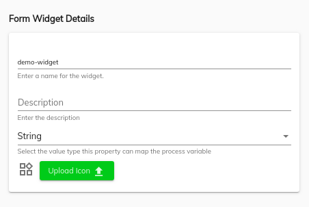
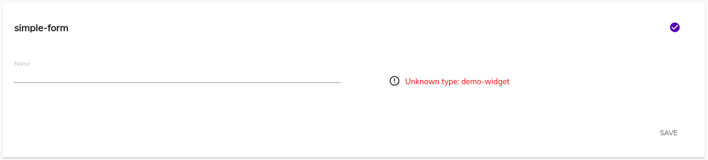
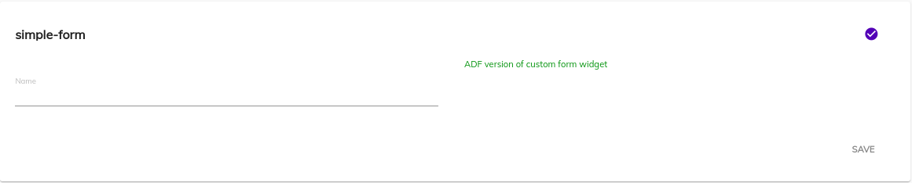

## Form Extensibility for AAE Form Widget
This page describes how you can customize ADF forms to your own specification.

## Contents
There are two ways to customize the form
-   [Replacing custom form widgets with custom components](#replacing-custom-form-widgets-with-custom-components)
    -   [Creating custom stencil](#creating-custom-stencil)
    -   [Creating custom widget](#creating-custom-widget)
-   [Replacing default form widgets with custom components](#replacing-default-form-widgets-with-custom-components)

## Replacing default form widgets with AAE form widgets

This is a short walkthrough on replacing a standard `Text` [widget](../../lib/testing/src/lib/core/pages/form/widgets/widget.ts) with a custom component for all AAE forms
rendered within `<adf-form>` component.

First let's create a simple AAE form with `Text` widgets:


Every custom [widget](../../lib/testing/src/lib/core/pages/form/widgets/widget.ts) must inherit [`WidgetComponent`](../insights/components/widget.component.md) class in order to function properly:

```ts
import { Component } from '@angular/core';
import { WidgetComponent } from '@alfresco/adf-core';

@Component({
    selector: 'custom-editor',
    template: `
        <div style="color: red">Look, I'm a custom editor!</div>
    `
})
export class CustomEditorComponent extends WidgetComponent {}
```

Now you will need to add it to the application module or any custom module that is imported into the application one:

```ts
import { NgModule } from '@angular/core';
import { CustomEditorComponent } from './custom-editor.component';

@NgModule({
    declarations: [ CustomEditorComponent ],
    exports: [ CustomEditorComponent ]
})
export class CustomEditorsModule {}
```

Every custom [widget](../../lib/testing/src/lib/core/pages/form/widgets/widget.ts) should be added into the following collections: `declarations`, `exports`.

If you decided to store custom widgets in a separate dedicated module (and optionally as separate redistributable library)
don't forget to import it into your main application one:

```ts
@NgModule({
    imports: [
        // ...
        CustomEditorsModule
        // ...
    ],
    providers: [],
    bootstrap: [ AppComponent ]
})
export class AppModule {}
```

Now you can import [`FormRenderingService`](../core/services/form-rendering.service.md) in any of your Views and override default mapping similar to the following:

```ts
import { Component } from '@angular/core';
import { CustomEditorComponent } from './custom-editor.component';

@Component({...})
export class MyView {

    constructor(formRenderingService: FormRenderingService) {
        formRenderingService.setComponentTypeResolver('text', () => CustomEditorComponent, true);
    }

}
```

At runtime it should look similar to the following:


## Replacing custom form widgets with custom components

This is a short walkthrough on rendering custom AAE form widgets by means of custom Angular components.

### Creating custom form widget

First let's create a basic form widget and call it `Custom Editor`:



_Note the `type` value as it will become a `field type` value when corresponding form is rendered._

Next put some simple html layout for [`Form`](../../lib/process-services/src/lib/task-list/models/form.model.ts)`runtime template` and [`Form`](../../lib/process-services/src/lib/task-list/models/form.model.ts)`editor template` fields:

```html
<div style="color: blue">Custom form widget</div>
```

Now you are ready to design a test form based on your custom form widget:


### Creating custom widget

Once wired with a new task it should look like the following within AAE Process Experience:




Let's create an Angular component to render missing content:

```ts
import { Component } from '@angular/core';
import { WidgetComponent } from '@alfresco/adf-core';

@Component({
    selector: 'app-demo-widget',
    template: `<div style="color: green">ADF version of custom form widget</div>`
})
export class DemoWidgetComponent extends WidgetComponent {}
```

Put it inside custom module:

```ts
import { NgModule } from '@angular/core';
import { DemoWidgetComponent } from './demo-widget.component';

@NgModule({
    declarations: [ DemoWidgetComponent ],
    exports: [ DemoWidgetComponent ]
})
export class CustomWidgetsModule {}
```

And import into your Application Module

```ts
@NgModule({
    imports: [
        // ...
        CustomWidgetsModule
        // ...
    ],
    providers: [],
    bootstrap: [ AppComponent ]
})
export class AppModule {}
```

Now you can import [`FormRenderingService`](../core/services/form-rendering.service.md) in any of your Views and provide new mapping:

```ts
import { Component } from '@angular/core';
import { DemoWidgetComponent } from './demo-widget.component';

@Component({...})
export class MyView {

    constructor(formRenderingService: FormRenderingService) {
        this.formRenderingService.register({
            'custom-editor': () => DemoWidgetComponent
        });
    }
}
```

At runtime you should now see your custom Angular component rendered in place of the form widgets:


