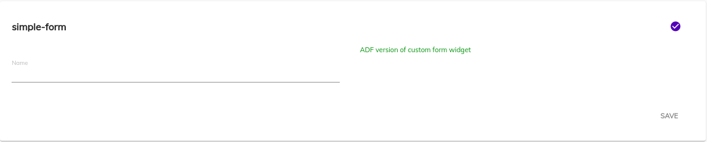

## Form Extensibility for APA Form Widget
This page describes how you can customize ADF forms to your own specification.

## Contents
There are two ways to customize the form
-   [Replace default form widgets with custom components](#replace-default-form-widgets-with-apa-form-widgets)
-   [Replace custom form widget with custom components](#replace-custom-form-widgets-with-custom-components)

## Replace default form widgets with APA form widgets

This is an example of replacing the standard `Text` [widget](../../lib/testing/src/lib/core/pages/form/widgets/widget.ts) with a custom component for all APA forms rendered within the `<adf-form>` component.

1. Create a simple form with some `Text` widgets:

    

    Every custom widget component must inherit the [`WidgetComponent`](../insights/components/widget.component.md) class in order to function properly:

    ```ts
    import { Component } from '@angular/core';
    import { WidgetComponent } from '@alfresco/adf-core';
    @Component({
        selector: 'custom-editor',
        template: `
            <div style="color: red">Look, I'm a APA custom editor!</div>
        `
    })
    export class CustomEditorComponent extends WidgetComponent {}
    ```

2. Add it to the application module or any custom module that is imported into the application one:

    ```ts
    import { NgModule } from '@angular/core';
    import { CustomEditorComponent } from './custom-editor.component';
    @NgModule({
        declarations: [ CustomEditorComponent ],
        exports: [ CustomEditorComponent ]
    })
    export class CustomEditorsModule {}
    ```

3. Every custom widget component should be added into the the collections `declarations` and `exports`. If you decided to store custom widgets in a separate dedicated module (and optionally as a separate re-distributable library) don't forget to import it into the main application:

    ```ts
    @NgModule({
        imports: [
            // ...
            CustomEditorsModule
            // ...
        ],
        providers: [],
        bootstrap: [ AppComponent ]
    })
    export class AppModule {}
    ```

4. Import the [`FormRenderingService`](../core/services/form-rendering.service.md) into any of your Views and override the default mapping, for example:

    ```ts
    import { Component } from '@angular/core';
    import { CustomEditorComponent } from './custom-editor.component';
    @Component({...})
    export class MyView {
        constructor(formRenderingService: FormRenderingService) {
            this.formRenderingService.register({
                'text': () => CustomEditorComponent
            }, true);
        }
    }
    ```

5. At runtime the form should look similar to the following:

    


## Replace custom form widgets with custom components

This is an example of rendering custom form widgets using custom Angular components.

### Create a custom form widget

To begin, create a basic form widget and call it `demo-widget`:


**Note**: The `type` is important as it will become the `field type` when the form is rendered.

You can now design a form that uses your custom form widget:


### Create a custom widget

When displayed in a task, the field will look similar to the following:


To render the missing content:

1. Create an Angular component:

    ```ts
    import { Component } from '@angular/core';
    import { WidgetComponent } from '@alfresco/adf-core';
    @Component({
        selector: 'app-demo-widget',
        template: `<div style="color: green">ADF version of custom form widget</div>`
    })
    export class DemoWidgetComponent extends WidgetComponent {}
    ```

2. Place it inside the custom module:

    ```ts
    import { NgModule } from '@angular/core';
    import { DemoWidgetComponent } from './demo-widget.component';
    @NgModule({
        declarations: [ DemoWidgetComponent ],
        exports: [ DemoWidgetComponent ]
    })
    export class CustomWidgetsModule {}
    ```

3. Import it into your Application Module:

    ```ts
    @NgModule({
        imports: [
            // ...
            CustomWidgetsModule
            // ...
        ],
        providers: [],
        bootstrap: [ AppComponent ]
    })
    export class AppModule {}
    ```

4. Import the [`FormRenderingService`](../core/services/form-rendering.service.md) in any of your Views and provide the new mapping:

    ```ts
    import { Component } from '@angular/core';
    import { DemoWidgetComponent } from './demo-widget.component';
    @Component({...})
    export class MyView {
        constructor(formRenderingService: FormRenderingService) {
            this.formRenderingService.register({
                'custom-editor': () => DemoWidgetComponent
            });
        }
    }
    ```

At runtime you should now see your custom Angular component rendered in place of the original form widgets:



## See Also

-   [Extensibility](./extensibility.md)
-   [Form field model](../core/models/form-field.model.md)
-   [Form rendering service](../core/services/form-rendering.service.md)
-   [Form component](../core/components/form.component.md)
-   [Widget component](../insights/components/widget.component.md)
