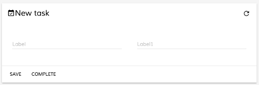
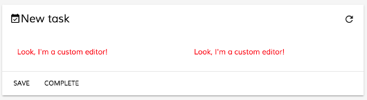
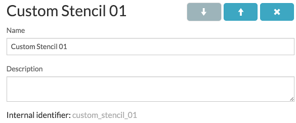
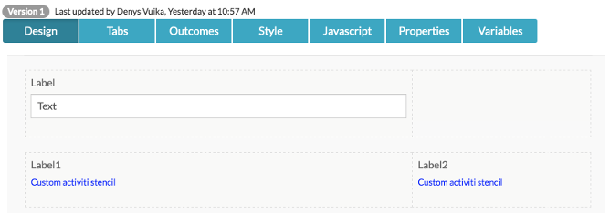
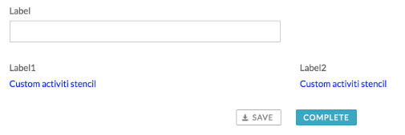
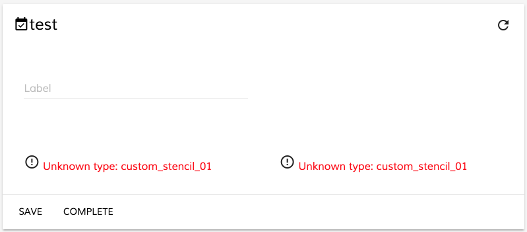
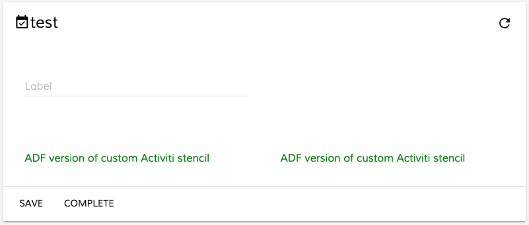

## Form Extensibility for APS Stencil
This page describes how you can customize ADF forms to your own specification.

## Contents
There are two ways to customize the form
-   [Replace default form widgets with custom components](#replacing-default-form-widgets-with-custom-components)
-   [Replace custom stencils with custom components](#replacing-custom-stencils-with-custom-components)

## Replace default form widgets with custom components

This is an example of replacing the standard `Text` [widget](../../lib/testing/src/lib/core/pages/form/widgets/widget.ts) with a custom component for all APS forms rendered within the `<adf-form>` component.

1. Create a simple form with some `Text` widgets:

    

    Every custom [widget](../../lib/testing/src/lib/core/pages/form/widgets/widget.ts) must inherit the [`WidgetComponent`](../insights/components/widget.component.md) class in order to function properly:

    ```ts
    import { Component } from '@angular/core';
    import { WidgetComponent } from '@alfresco/adf-core';

    @Component({
        selector: 'custom-editor',
        template: `
            <div style="color: red">Look, I'm a custom editor!</div>
        `
    })
    export class CustomEditorComponent extends WidgetComponent {}
    ```

2. Add it to the application module or any custom module that is imported into the application one:

    ```ts
    import { NgModule } from '@angular/core';
    import { CustomEditorComponent } from './custom-editor.component';

    @NgModule({
        declarations: [ CustomEditorComponent ],
        exports: [ CustomEditorComponent ]
    })
    export class CustomEditorsModule {}
    ```

3. Every custom [widget](../../lib/testing/src/lib/core/pages/form/widgets/widget.ts) should be added into the  collections: `declarations` and `exports`. If you decided to store custom widgets in a separate dedicated module (and optionally as a separate re-distributable library), don't forget to import it into the main application:

    ```ts
    @NgModule({
        imports: [
            // ...
            CustomEditorsModule
            // ...
        ],
        providers: [],
        bootstrap: [ AppComponent ]
    })
    export class AppModule {}
    ```

4. Import the [`FormRenderingService`](../core/services/form-rendering.service.md) in any of your Views and override the default mapping, for example:

    ```ts
    import { Component } from '@angular/core';
    import { CustomEditorComponent } from './custom-editor.component';

    @Component({...})
    export class MyView {

        constructor(formRenderingService: FormRenderingService) {
            formRenderingService.setComponentTypeResolver('text', () => CustomEditorComponent, true);
        }

    }
    ```

5. At runtime it should look similar to the following:

    

## Replace custom stencils with custom components

This is an example of rendering custom APS stencils using custom Angular components.

### Create a custom stencil

1. Create a basic stencil and call it `Custom Stencil 01`:

    

    **Note**: the `internal identifier` is important as it will become the `field type` when the form is rendered.

2. Create a simple html layout for the [`Form`](../../lib/process-services/src/lib/task-list/models/form.model.ts)`runtime template` and [`Form`](../../lib/process-services/src/lib/task-list/models/form.model.ts)`editor template` fields:

    ```html
    <div style="color: blue">Custom activiti stencil</div>
    ```

3. Create a test form based on your custom stencil:

    

4. Create a task using the test form. It will look similar to the following:

    

### Create a custom widget

1. Load the form created in the previous steps into the ADF `<adf-form>` component:

    

2. Create an Angular component to render the missing content:

    ```ts
    import { Component } from '@angular/core';
    import { WidgetComponent } from '@alfresco/adf-core';

    @Component({
        selector: 'custom-stencil-01',
        template: `<div style="color: green">ADF version of custom Activiti stencil</div>`
    })
    export class CustomStencil01 extends WidgetComponent {}
    ```

3. Place it inside a custom module:

    ```ts
    import { NgModule } from '@angular/core';
    import { CustomStencil01 } from './custom-stencil-01.component';

    @NgModule({
        declarations: [ CustomStencil01 ],
        exports: [ CustomStencil01 ]
    })
    export class CustomEditorsModule {}
    ```

4. Import it into your Application Module:

    ```ts
    @NgModule({
        imports: [
            // ...
            CustomEditorsModule
            // ...
        ],
        providers: [],
        bootstrap: [ AppComponent ]
    })
    export class AppModule {}
    ```

5. Import the [`FormRenderingService`](../core/services/form-rendering.service.md) in any of your Views and provide the new mapping:

    ```ts
    import { Component } from '@angular/core';
    import { CustomStencil01 } from './custom-stencil-01.component';

    @Component({...})
    export class MyView {

        constructor(formRenderingService: FormRenderingService) {
            formRenderingService.setComponentTypeResolver('custom_stencil_01', () => CustomStencil01, true);
        }

    }
    ```

6. At runtime you should now see your custom Angular component rendered in place of the stencils:

    

## See Also

-   [Extensibility](./extensibility.md)
-   [Form field model](../core/models/form-field.model.md)
-   [Form rendering service](../core/services/form-rendering.service.md)
-   [Form component](../core/components/form.component.md)
-   [Widget component](../insights/components/widget.component.md)
