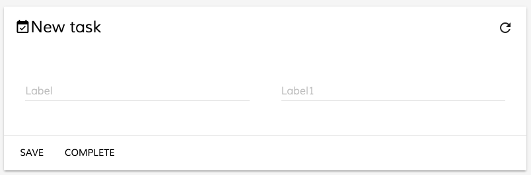
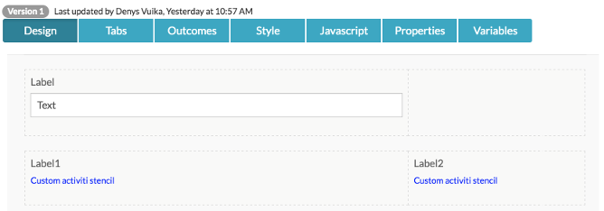
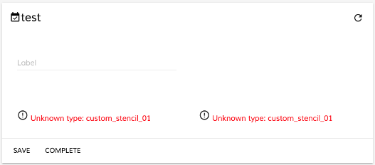
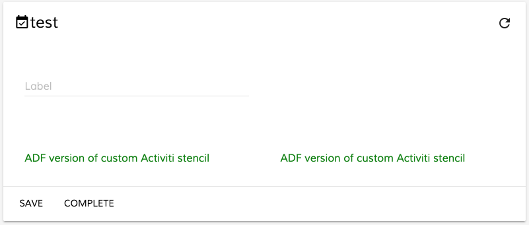

# Form Extensibility and Customization

This page describes how you can customize ADF forms to your own specification.

_Note: it is assumed you are familiar with Alfresco Process Services (powered by Activiti) form definition structure._

-   How components and widgets are rendered on a [`Form`](../../lib/process-services/task-list/models/form.model.ts)
-   Replacing default form widgets with custom components
-   Replacing custom stencils with custom components

## Contents

-   [How components and widgets are rendered on a Form](#how-components-and-widgets-are-rendered-on-a-form)
    -   [Component type resolvers](#component-type-resolvers)
    -   [Default component mappings](#default-component-mappings)
-   [Replacing default form widgets with custom components](#replacing-default-form-widgets-with-custom-components)
-   [Replacing custom stencils with custom components](#replacing-custom-stencils-with-custom-components)
    -   [Creating custom stencil](#creating-custom-stencil)
    -   [Creating custom widget](#creating-custom-widget)
-   [See Also](#see-also)

## How components and widgets are rendered on a Form

All form field editors (aka widgets) on a [`Form`](../../lib/process-services/task-list/models/form.model.ts) are rendered by means of [`FormFieldComponent`](../core/form-field.component.md)
that takes an instance of a [`FormFieldModel`](../core/form-field.model.md):

```html
<form-field [field]="field"></form-field>
```

This component depends on [`FormRenderingService`](../core/form-rendering.service.md) service to map [`FormFieldModel`](../core/form-field.model.md) to UI component
based on field type or metadata information.

### Component type resolvers

[`FormRenderingService`](../core/form-rendering.service.md) maps field types to corresponding instances exposing `ComponentTypeResolver` interface:

```ts
export interface ComponentTypeResolver {
    (field: FormFieldModel): Type<{}>;
}
```

Typically a `ComponentTypeResolver` is a function that takes [`FormFieldModel`](../core/form-field.model.md) and returns corresponding component type.
It can be either a predefined component type or a dynamically evaluated based on field properties and metadata.

#### Static component mapping

You can (re)map fields like in the following:

```ts
let customResolver: ComponentTypeResolver = () => CustomWidgetComponent;
formRenderingService.setComponentTypeResolver('text', customResolver, true);
```

or simply:

```ts
formRenderingService.setComponentTypeResolver('text', () => CustomWidgetComponent, true);
```

#### Dynamic component mapping

Alternatively your resolver may return different component types based on [`FormFieldModel`](../core/form-field.model.md) state and condition:

```ts
let customResolver: ComponentTypeResolver = (field: FormFieldModel): Type<{}> => {
    if (field) {
        let params = field.params;
    }
    return UnknownWidgetComponent;
};
formRenderingService.setComponentTypeResolver('text', customResolver, true);
```

### Default component mappings

| Stencil Name | Field Type | Component Type |
| ------------ | ---------- | -------------- |
| Text | text | [`TextWidgetComponent`](../../lib/core/form/components/widgets/text/text.widget.ts) |
| Number | integer | [`NumberWidgetComponent`](../../lib/core/form/components/widgets/number/number.widget.ts) |
| Multi-line text | multi-line-text | [`MultilineTextWidgetComponentComponent`](../../lib/core/form/components/widgets/multiline-text/multiline-text.widget.ts) |
| Checkbox | boolean | [`CheckboxWidgetComponent`](../../lib/core/form/components/widgets/checkbox/checkbox.widget.ts) |
| Dropdown | dropdown | [`DropdownWidgetComponent`](../../lib/core/form/components/widgets/dropdown/dropdown.widget.ts) |
| Date | date | [`DateWidgetComponent`](../../lib/core/form/components/widgets/date/date.widget.ts) |
| Amount | amount | [`AmountWidgetComponent`](../../lib/core/form/components/widgets/amount/amount.widget.ts) |
| Radio buttons | radio-buttons | [`RadioButtonsWidgetComponent`](../../lib/core/form/components/widgets/radio-buttons/radio-buttons.widget.ts) |
| Hyperlink | hyperlink | [`HyperlinkWidgetComponent`](../../lib/core/form/components/widgets/hyperlink/hyperlink.widget.ts) |
| Display value | readonly | DisplayValueWidgetComponent |
| Display text | readonly-text | [`DisplayTextWidgetComponentComponent`](../../lib/core/form/components/widgets/display-text/display-text.widget.ts) |
| Typeahead | typeahead | [`TypeaheadWidgetComponent`](../../lib/core/form/components/widgets/typeahead/typeahead.widget.ts) |
| People | people | [`PeopleWidgetComponent`](../../lib/core/form/components/widgets/people/people.widget.ts) |
| Group of people | functional-group | [`FunctionalGroupWidgetComponent`](../../lib/core/form/components/widgets/functional-group/functional-group.widget.ts) |
| Dynamic table | dynamic-table | [`DynamicTableWidgetComponent`](../../lib/core/form/components/widgets/dynamic-table/dynamic-table.widget.ts) |
| N/A | container | [`ContainerWidgetComponent`](../../lib/core/form/components/widgets/container/container.widget.ts) (layout component) |
| Header | group | [`ContainerWidgetComponent`](../../lib/core/form/components/widgets/container/container.widget.ts) |
| Attach | upload | AttachWidgetComponent or [`UploadWidgetComponent`](../../lib/core/form/components/widgets/upload/upload.widget.ts) (based on metadata) |
| N/A | N/A | [`UnknownWidgetComponent`](../../lib/core/form/components/widgets/unknown/unknown.widget.ts) |

## Replacing default form widgets with custom components

This is a short walkthrough on replacing a standard `Text` widget with a custom component for all APS forms
rendered within `<adf-form>` component.

First let's create a simple APS form with `Text` widgets:



Every custom widget must inherit [`WidgetComponent`](../insights/widget.component.md) class in order to function properly:

```ts
import { Component } from '@angular/core';
import { WidgetComponent } from '@alfresco/adf-core';

@Component({
    selector: 'custom-editor',
    template: `
        <div style="color: red">Look, I'm a custom editor!</div>
    `
})
export class CustomEditorComponent extends WidgetComponent {}
```

Now you will need to add it to the application module or any custom module that is imported into the application one:

```ts
import { NgModule } from '@angular/core';
import { CustomEditorComponent } from './custom-editor.component';

@NgModule({
    declarations: [ CustomEditorComponent ],
    exports: [ CustomEditorComponent ],
    entryComponents: [ CustomEditorComponent ]
})
export class CustomEditorsModule {}
```

Every custom widget should be added into all three module collections: `declarations`, `exports` and `entryComponents`.

If you decided to store custom widgets in a separate dedicated module (and optionally as separate redistributable library)
don't forget to import it into your main application one:

```ts
@NgModule({
    imports: [
        // ...
        CustomEditorsModule
        // ...
    ],
    providers: [],
    bootstrap: [ AppComponent ]
})
export class AppModule {}
```

Now you can import [`FormRenderingService`](../core/form-rendering.service.md) in any of your Views and override default mapping similar to the following:

```ts
import { Component } from '@angular/core';
import { CustomEditorComponent } from './custom-editor.component';

@Component({...})
export class MyView {

    constructor(formRenderingService: FormRenderingService) {
        formRenderingService.setComponentTypeResolver('text', () => CustomEditorComponent, true);
    }

}
```

At runtime it should look similar to the following:


## Replacing custom stencils with custom components

This is a short walkthrough on rendering custom APS stencils by means of custom Angular components.

### Creating custom stencil

First let's create a basic stencil and call it `Custom Stencil 01`:


_Note the `internal identifier` value as it will become a `field type` value when corresponding form is rendered._

Next put some simple html layout for [`Form`](../../lib/process-services/task-list/models/form.model.ts)`runtime template` and [`Form`](../../lib/process-services/task-list/models/form.model.ts)`editor template` fields:

```html
<div style="color: blue">Custom activiti stencil</div>
```

Now you are ready to design a test form based on your custom stencil:



Once wired with a new task it should look like the following within APS web application:


### Creating custom widget

If you load previously created task into ADF `<adf-form>` component you will see something like the following:



Let's create an Angular component to render missing content:

```ts
import { Component } from '@angular/core';
import { WidgetComponent } from '@alfresco/adf-core';

@Component({
    selector: 'custom-stencil-01',
    template: `<div style="color: green">ADF version of custom Activiti stencil</div>`
})
export class CustomStencil01 extends WidgetComponent {}
```

Put it inside custom module:

```ts
import { NgModule } from '@angular/core';
import { CustomStencil01 } from './custom-stencil-01.component';

@NgModule({
    declarations: [ CustomStencil01 ],
    exports: [ CustomStencil01 ],
    entryComponents: [ CustomStencil01 ]
})
export class CustomEditorsModule {}
```

And import into your Application Module

```ts
@NgModule({
    imports: [
        // ...
        CustomEditorsModule
        // ...
    ],
    providers: [],
    bootstrap: [ AppComponent ]
})
export class AppModule {}
```

Now you can import [`FormRenderingService`](../core/form-rendering.service.md) in any of your Views and provide new mapping:

```ts
import { Component } from '@angular/core';
import { CustomStencil01 } from './custom-stencil-01.component';

@Component({...})
export class MyView {

    constructor(formRenderingService: FormRenderingService) {
        formRenderingService.setComponentTypeResolver('custom_stencil_01', () => CustomStencil01, true);
    }

}
```

At runtime you should now see your custom Angular component rendered in place of the stencils:



## See Also

-   [Form field model](../core/form-field.model.md)
-   [Form rendering service](../core/form-rendering.service.md)
-   [Form component](../core/form.component.md)
-   [Widget component](../insights/widget.component.md)
