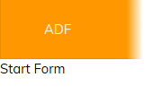
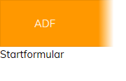

# Internationalization in ADF

Internationalization (abbreviated to i18n) is the process of providing UI messages
and captions in different human languages to make them easier for readers of those
languages to understand.

ADF provides full support for i18n in apps. The process does
require some extra effort in planning and designing the UI but once implemented, it is
fairly straightforward to maintain.

## Contents

-   [I18n concepts](#i18n-concepts)
-   [ADF support for i18n](#adf-support-for-i18n)
-   [Using the translate pipe](#using-the-translate-pipe)
-   [Adding and replacing messages](#adding-and-replacing-messages)
-   [Interpolations](#interpolations)
-   [How the display language is selected](#how-the-display-language-is-selected)
-   [Support for i18n within ADF components](#support-for-i18n-within-adf-components)
-   [See also](#see-also)

## I18n concepts

The main idea behind i18n is to avoid adding natural language text directly into the
HTML. Instead, UI messages are represented by short strings known as 
**keys**. Keys are not displayed directly; they are used to look up the actual text
in a list of predefined messages. A typical key/message pair might look like the
following:

    "CS_URL_ERROR": "Content Services address doesn't match the URL format"

Separate lists are kept for each language supported by the app, so for German, the
same message would be defined as:

    "CS_URL_ERROR": "Content Services-Adresse nicht im richtigen URL-Format"

Note that the key is the same in both cases. As long as the UI only ever refers to
the keys then changing languages is a simple matter of changing the look-up list.

## ADF support for i18n

ADF implements i18n for more than ten languages internally in the display text for
components, so you can try out some simple messages without any configuration. The
keys are defined in a set of files in the `lib/core/i18n` folder in the ADF sources.

The files are named according to standard
[two-letter language codes](https://en.wikipedia.org/wiki/List_of_ISO_639-1_codes),
so `en.json` is the look-up list for English, etc. An excerpt from `en.json` is shown
below:

```json
{
  "FORM": {
    "START_FORM": {
      "TITLE": "Start Form"
    },
    "PREVIEW": {
      "IMAGE_NOT_AVAILABLE": "Preview not available"
    },
    "FIELD": {
      "LOCALSTORAGE" : "Local storage",
      "SOURCE": "Select source from ",
      "UPLOAD": "UPLOAD",
      "REQUIRED": "*Required",
      ...
```

The hierarchical structure is referred to in the UI using the familiar "dot"
notation (so `FORM.START_FORM.TITLE` would be the key for the "Start [Form"](../../lib/process-services/task-list/models/form.model.ts)
string here). This is useful for grouping related messages and providing
singular and plural versions, among other things.

The [Translation service](../core/services/translation.service.md) defines the `get` method to
get the translation of a key in the current language. A simple component might
contain code like this:

```ts
import { Component, OnInit } from '@angular/core';

import { TranslationService } from "@alfresco/adf-core";

@Component({
  selector: 'app-home',
  templateUrl: './home.component.html',
  styleUrls: ['./home.component.css']
})
export class HomeComponent implements OnInit {

  constructor(private trans: TranslationService) { }

  translatedText: string = "";

  ngOnInit() {
    this.trans.get("FORM.START_FORM.TITLE").subscribe(translation => {
      this.translatedText = translation;
    });
  }
}
```

...with very simple corresponding HTML:

<!--  -->

```html
{{translatedText}}
```

<!--  -->

In the browser, this is displayed as:



English is used by default but you can easily change the language with the
`use` method:

```ts
ngOnInit() {
    this.trans.use("de");

    this.trans.get("FORM.START_FORM.TITLE").subscribe(translation => {
      this.translatedText = translation;
    });
  }
```

The user will now see:



Note that an unrecognized key will be returned unchanged as the "translation".
If you see strings like "FORM.START_FORM.TITLE" displayed in your app then you
should check you are using the key correctly.

## Using the translate pipe

Using [`TranslationService`](../core/services/translation.service.md)`.get` is straightforward but it is often more
convenient to add translation keys directly into your page's HTML.
Use the `translate` pipe to convert a key in the page directly to the
corresponding text. For example, the following will display the
"Start [Form"](../../lib/process-services/task-list/models/form.model.ts) text as above but without any code or variables in the
component's `.ts` file:

<!--  -->

    {{ "FORM.START_FORM.TITLE" | translate }}

<!--  -->

## Adding and replacing messages

The built-in translations certainly won't cover everything you will need for
your app but you can easily replace them with your own lists. This enables you
to add new keys and also replace the text of existing keys with your own.

To modify the default translations, you need to create local translation source files
(en.json, fr.json, etc) within your application. The local files have the same basic
hierarchical key:value structure as the built-in translations. You can add new keys to
your local files to extend the default set or override a default translation by redefining
an existing key with new message text. The default translations will be used for any keys
that you don't explicitly override. For example, your local `en.json` might look like the
following:

```json
{
  "title": "my app",
  "LOGIN": {
     "LABEL": {
        "LOGIN": "Custom Sign In"
     }
  }
}
```

The [Translation service](../core/services/translation.service.md) page has full details
of how to add custom translations, including the locations of the required files
and code samples for enabling the new translations in your app.

## Interpolations

Translation messages have support for _interpolation_ (ie, including another
string at a specified position within a message). This is very useful for
messages whose content can change at runtime. For example, in the built-in
`en.json` there is the `CORE.PAGINATION.ITEMS_RANGE` key:

<!--  -->

```json
  ...
"CORE": {
  ...
  "PAGINATION": {
        "ITEMS_RANGE": "Showing {{ range }} of {{ total }}",
        "ITEMS_PER_PAGE": "Items per page",
          ...
      },
    ...
```

<!--  -->

The sections in curly braces are _interpolation variables_ that you supply
at runtime. You can specify them by passing an extra parameter to
[`TranslationService`](../core/services/translation.service.md)`.get`; this is an object whose properties have the same
names as the interpolation variables in the string:

```ts
this.trans.get(
      "CORE.PAGINATION.ITEMS_RANGE",
      {
        range: "1..10",
        total: "122"
      }
    ).subscribe(translation => {
      this.translatedText = translation;
    });
```

You can use interpolations with the `translate` pipe in a similar way:

<!--  -->

    {{ "CORE.PAGINATION.ITEMS_RANGE" | translate: { range: "1..10", total: "122"} }}

<!--  -->

## How the display language is selected

The `locale` preference in the [user preferences](../core/services/user-preferences.service.md)
contains the language code that will be used to display the ADF app. Since the user
preferences can only be saved by the app when it runs, they will not immediately be available when
the app launches for the first time. The app uses the following priorities to determine
the locale language for the first launch:

1.  If the `locale` property is set in `app.config.json` then this will be used.
2.  If there is no `locale` property then the browser's language setting will be used instead.
3.  If neither of the first two options is available then English will be used by default.

The table below illustrates how the selection is made:

| User Preference | `locale` in `app.config.json` | Browser language | Default | Result |
| --------------- | ----------------------------- | ---------------- | ------- | ------ |
| X | X | X | en | en |
| X | X | jp | en | jp |
| X | fr | jp | en | fr |
| it | fr | jp | en | it |

The [translation service](../core/services/translation.service.md) probes the browser culture first, for example `en-GB`.
If the `en-GB.json` file does not exist, the service falls back to the language id: `en`.

Once the locale language is determined, it is saved to the user preferences and this saved value
will be used from that point on, regardless of the `app.config.json` and browser settings.

However, you can change the `locale` user preference from code using the
[User Preferences service](../core/services/user-preferences.service.md) and the updated value
will still override any browser or `app.config.json` settings.
ADF also provides a [Language Menu component](../core/components/language-menu.component.md) that
you can add to a page to let the user set the `locale` preference easily. The
list of available languages is defined in the `app.config.json` file for the app.

The `translate` pipe reacts automatically to a change in the locale language and
immediately updates the display. However, text added via a variable set using
[`TranslationService`](../core/services/translation.service.md)`.get`, as in the example above, will not be
updated directly in this way. Instead, you will need to get a new translation and set the
variable's value again explicitly from the code.

See the [Language Menu component](../core/components/language-menu.component.md) page for further
details and usage examples.

## Support for i18n within ADF components

Some components allow you to use translation keys in places where you would normally
supply your own messages directly. For example, the
[Data Column component](../core/components/data-column.component.md) can accept a key instead of
normal text to specify the column title. Consult the documentation for a
component to see if it has built-in support for i18n.

## See also

-   [Translation service](../core/services/translation.service.md)
-   [Language Menu component](../core/components/language-menu.component.md)
