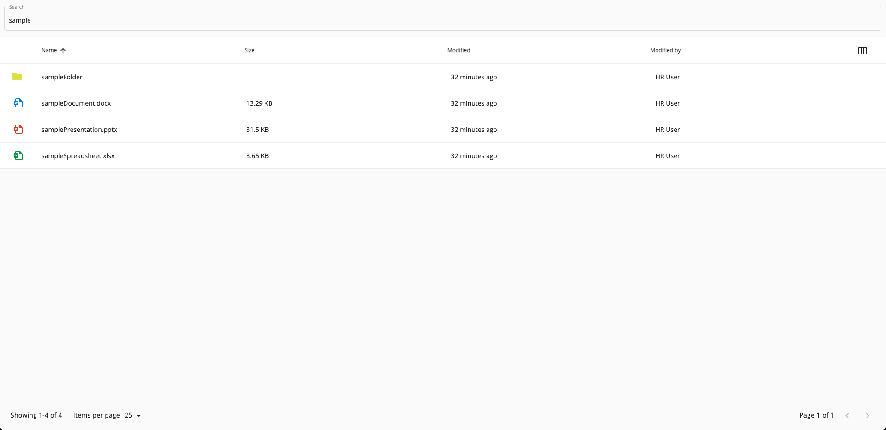
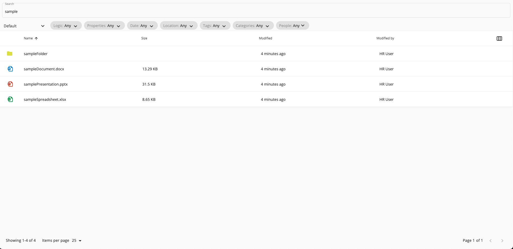

# Search Building

This page covers the basics of creating a search page using components from this repository.

**Note:** Styling is covered only to a minimal necessary extent.

## Contents
- [Basic Implementation](#basic-implementation)
    - [Used Components](#used-components)
    - [Used Services](#used-services)
    - [Template](#template)
    - [Component](#component)
- [Search Configuration](#search-configuration)
    - [Used Components](#used-components-1)
    - [Template](#template-1)
    - [Component](#component-1)

## Basic Implementation

Most basic search requires only three components to be included in the template.

Search is executed on *Enter* key press and the results are shown below.



For details of used properties, methods and events please refer to documentation pages covering the components and services, linked in the tables below and [See Also](#see-also) section.

### Used Components

|Name|Selector|Description|
|----|--------|-----------|
|[Search Input Component](../content-services/components/search-input.component.md)|`<adf-search-input>`|Manages, formats and emits user input on search.|
|[Document List Component](../content-services/components/document-list.component.md)|`<adf-document-list>`|Displays search results.|
|[Pagination Component](../core/components/pagination.component.md)|`<adf-pagination>`|Allows to alternate between search results pages.|

### Used Services

|Name|Description|
|----|-----------|
|[Search Query Builder Service](../content-services/services/search-query-builder.service.md)|Creates, formats and executes search query|

### Template

```html
<adf-search-input
    [fields]="['cm:name', 'cm:title', 'cm:description', 'TEXT', 'TAG']" 
    (changed)="onSearchQueryChanged($event)"
>
</adf-search-input>

<adf-document-list style="overflow-y: auto;"
    #documentList
    [sortingMode]="'client'"
    [node]="$any(data)"
>
</adf-document-list>

<adf-pagination 
    [target]="documentList" 
    (change)="onPaginationChanged($event)"
>
</adf-pagination>
```

### Component

```ts
@Component({
  standalone: true,
  imports: [SearchInputComponent, DocumentListModule, SearchModule, PaginationDirective, PaginationComponent],
  selector: 'your-search',
  templateUrl: './your-search.component.html',
  styleUrls: ['./your-search.component.scss'],
  encapsulation: ViewEncapsulation.None
})
export class YourSearchComponent implements OnInit {
  data: ResultSetPaging;

  constructor(private queryBuilder: SearchQueryBuilderService) {
    queryBuilder.paging = {
      skipCount: 0,
      maxItems: 25
    };
  }

  ngOnInit() {
    this.queryBuilder.resetToDefaults();
    this.queryBuilder.updated.subscribe(() => void this.queryBuilder.execute());
    this.queryBuilder.executed.subscribe((data) => {
      this.queryBuilder.paging.skipCount = 0;
      this.onSearchResultLoaded(data);
    });
  }

  onSearchResultLoaded(resultSetPaging: ResultSetPaging) {
    this.data = resultSetPaging;
  }

  onSearchQueryChanged(string: string) {
    this.queryBuilder.userQuery = decodeURIComponent(string);
    this.queryBuilder.update();
  }

  async onPaginationChanged(pagination: Pagination) {
    this.queryBuilder.paging = {
      maxItems: pagination.maxItems,
      skipCount: pagination.skipCount
    };
    this.queryBuilder.update();
  }
}
```

## Search Configuration

Adding those two components allows for usage of search configurations and switching between them.



### Used Components

|Name|Selector|Description|
|----|--------|-----------|
|[Search Form Component](../content-services/components/search-form.component.md)|`<adf-search-form>`|Allows to switch search configurations.|
|[Search Filter Chips](../content-services/components/search-filter-chips.component.md)|`<adf-search-filter-chips>`|Container that displays customisable search filters from configuration.|

For more information about search configuration please refer to [Search Configuration Guide](./search-configuration-guide.md).

### Template

Place those components below search input for the same layout as shown on the picture above.

```html
...
<div style="diplay: flex;">
    <adf-search-form></adf-search-form> 
    <adf-search-filter-chips></adf-search-filter-chips>
</div>
...
```

### Component

When adding those two components you need to remove one subscription from the `ngOnInit()`. No additional methods and properties are required.

```ts
...
ngOnInit() {
    this.queryBuilder.resetToDefaults();
    this.queryBuilder.executed.subscribe((data) => {
      this.queryBuilder.paging.skipCount = 0;
      this.onSearchResultLoaded(data);
    });
  }
...
```
## See Also

-   [Search Configuration Guide](search-configuration-guide.md)
-   [Search Input Component](../content-services/components/search-input.component.md)
-   [Document List Component](../content-services/components/document-list.component.md)
-   [Pagination Component](../core/components/pagination.component.md)
-   [Search Form Component](../content-services/components/search-form.component.md)
-   [Search Filter Chips](../content-services/components/search-filter-chips.component.md)
-   [Search Query Builder Service](../content-services/services/search-query-builder.service.md)
