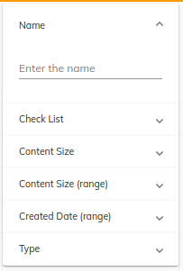
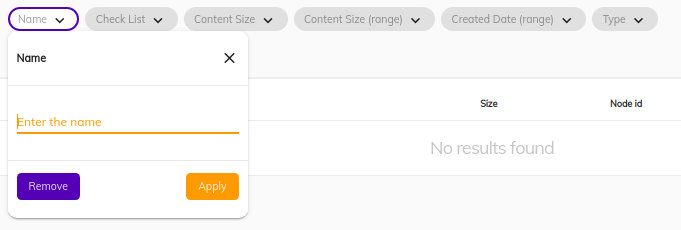
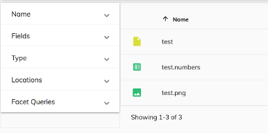
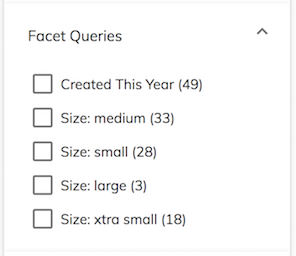

# Search Configuration Guide

This page describes how you can configure the search configuration.

## Contents

-   [Basic usage](#basic-usage)
    - [For Single](#for-single)
    - [For Multiple](#for-multiple)
    - [Supported Layouts](#supported-layouts)
    - [Steps Involved In Search Configuration](#steps-involved-in-search-configuration)
-   [Configuration](#configuration)
-   [Extra fields and filter queries](#extra-fields-and-filter-queries)
-   [Sorting](#sorting)
-   [Categories and widgets](#categories-and-widgets)
-   [Facet Fields](#facet-fields)
-   [Facet Queries](#facet-queries)
-   [Facet Intervals](#facet-intervals)
-   [Highlight](#highlight)
-   [See also](#see-also)

### Basic usage

ADF support single or multiple [search configurations](https://github.com/Alfresco/alfresco-ng2-components/blob/develop/lib/content-services/src/lib/search/models/search-configuration.interface.ts).

### For single:

```json
{
    "search": {
        "name": "Application search",
        "default": true,
        "filteredWithContaints": true,
        "filterQueryies": [
            { "query": "+TYPE:'cm:folder' OR +TYPE:'cm:content'" }
        ],
        "category": []
    }
}
```

This configuration considered for searching in the application.

### For multiple:

```json
{
    "search": [
        {
            "name": "Application default search", 
            "default": true,
            "filteredWithContaints": true,
            "filterQueries": [
                { "query": "+TYPE:'cm:folder' OR +TYPE:'cm:content'" }
            ]
        }, 
        {
            "name": "Application secondary search",
            "default": false,
            "filteredWithContaints": true,
            "filterQueries": [
              { "query": "+TYPE:'cm:folder' OR +TYPE:'cm:content'" }
              { "query": "-TYPE:'st:site' AND -ASPECT:'st:siteContainer' AND -ASPECT:'sys:hidden'" }
            ]
        }
    ]
}
```

You can have arrayed config. At any point in the application only one of this configuration will be used for search.

The one with default considered as default configuration and user should be able to switch to other configuration.

### Supported Layouts
ADF support two kinds of search layouts.

1. [Expansion card based layouts](../content-services/components/search-filter.component.md)


   

2. [Chip based layout](../content-services/components/search-filter-chips.component.md)

   

The layout is generated for the default/selected search configuration.

### Steps involved in search configuration
In the three steps you can specify the search configuration. i.e

    1. Identify the search use case
    2. find/construct search query
    3. Add it in the adf search configuration section


You may find it useful to check out the following resources for background information
before customizing the search UI:

-   [Search API](https://support.hyland.com/r/Alfresco/Alfresco-Content-Services/23.3/Alfresco-Content-Services/Develop/REST-API-Guide/Searching-for-Content)
-   [Alfresco Full Text Search Reference](https://support.hyland.com/r/Alfresco/Alfresco-Search-Services/2.0/Alfresco-Search-Services/Using/Full-text-search-reference)
-   [ACS API Explorer](https://api-explorer.alfresco.com/api-explorer/#!/search/search)

### Configuration

You can configure the component using the `search` entry in the `app.config.json` file.
A typical configuration is shown below:

```json
{
    "search": {
        "name": "Application search",
        "default": true,
        "filterWithContains": true,
        "sorting": {
            "options": [
                { 
                    "key": "name",
                    "label": "Name",
                    "type": "FIELD",
                    "field": "cm:name",
                    "ascending": true 
                },
            ],
            "defaults": [
                {
                    "key": "name",
                    "type": "FIELD",
                    "field": "cm:name",
                    "ascending": true 
                }
            ]
        },
        "filterQueries": [
            { "query": "+TYPE:'cm:folder' OR +TYPE:'cm:content'" },
            { "query": "-cm:creator:System" }
        ],
        "facetQueries": {
            "mincount": 1,
            "label": "My facet queries",
            "pageSize": 4,
            "expanded": true,
            "queries": [
                { "query": "content.mimetype:text/html", "label": "Type: HTML" },
                { "query": "content.size:[0 TO 10240]", "label": "Size: xtra small" },
                { "query": "content.size:[10240 TO 102400]", "label": "Size: small" },
                { "query": "content.size:[102400 TO 1048576]", "label": "Size: medium" },
                { "query": "content.size:[1048576 TO 16777216]", "label": "Size: large"},
                { "query": "content.size:[16777216 TO 134217728]", "label": "Size: xtra large" },
                { "query": "content.size:[134217728 TO MAX]", "label": "Size: XX large" }
            ],
            "settings": {
              "allowUpdateOnChange": false,
              "hideDefaultAction": true
            }
        },
        "facetFields": {
            "expanded": true,
            "fields": [
                { 
                    "field": "content.mimetype",
                    "mincount": 1,
                    "label": "Type",
                    "settings": {
                        "allowUpdateOnChange": false,
                        "hideDefaultAction": true,
                        "facetOrder": 100
                    }
                },
                { 
                    "field": "creator",
                    "mincount": 1,
                    "label": "Creator",
                    "settings": {
                        "allowUpdateOnChange": false,
                        "hideDefaultAction": true,
                        "facetOrder": 200
                    }
                },
            ]
        },
        "categories": [
            {
                "id": "queryName",
                "name": "Name",
                "enabled": true,
                "component": {
                    "selector": "text",
                    "settings": {
                        "allowUpdateOnChange": false,
                        "hideDefaultAction": true,
                        "pattern": "cm:name:'(.*?)'",
                        "field": "cm:name",
                        "placeholder": "Enter the name"
                    }
                }
            }
        ]
    }
}
```

The
[schema.json](https://github.com/Alfresco/alfresco-ng2-components/blob/master/lib/core/app-config/schema.json)
file for the app config has further details about available settings, values and formats for
the configuration options.

### Extra fields and filter queries

You can explicitly define the `include` section for the query from within the application configuration file. This array is a list of extra data fields to be added to the search
results:

```json
{
    "search": {
        ...
        "include": ["path", "allowableOperations"]
        ...
    }
}
```

You can choose to filter facet field results using 'contains' instead of 'starts with', by using the `filterWithContains` boolean (default is `false`):

```json
{
    "search": {
        ...
        "filterWithContains": true
        ...
    }
}
```

You can choose to display a reset button by setting the 'resetButton' value to true.
This 'clean up' button would make it easier for the final user to remove all bucket selections and all search filtering.

```json
{
    "search": {
        ...
        "resetButton": true
        ...
    }
}
```

You can also provide a set of queries that are always executed alongside the user-defined
settings:

```json
{
    "search": {
        ...
        "filterQueries": [
            { "query": "+TYPE:'cm:folder' OR +TYPE:'cm:content'" },
            { "query": "-cm:creator:System" }
        ]
        ...
    }
}
```

Note that the entries of the `filterQueries` array are joined using the `AND` operator.

### Sorting

The Sorting configuration section consists of two blocks:

-   `options`: a list of items that users can select from
-   `defaults`: predefined sorting to use by default

```json
{
    "search": {
        "sorting": {
            "options": [
                { "key": "name", "label": "Name", "type": "FIELD", "field": "cm:name", "ascending": true },
                { "key": "content.sizeInBytes", "label": "Size", "type": "FIELD", "field": "content.size", "ascending": true },
                { "key": "description", "label": "Description", "type": "FIELD", "field": "cm:description", "ascending": true }
            ],
            "defaults": [
                { "key": "name", "type": "FIELD", "field": "cm:name", "ascending": true }
            ]
        }
    }
}
```

The properties of the `options` objects are as follows:

| Name | Type | Description |
| ---- | ---- | ----------- |
| key | string | Unique key to identify the entry. This can also be used to map [`DataColumn`](../../lib/core/src/lib/datatable/data/data-column.model.ts) instances. |
| label | string | Display text, which can also be an [i18n resource key](../user-guide/internationalization.md). |
| type | string | This specifies how to order the results. It can be based on a field, based on the position of the document in the index, or by score/relevance. |
| field | string | The name of the field. |
| ascending | boolean | The sorting order defined as `true` for ascending order and `false` for descending order |

See the information on sorting in the [Search API](../../lib/js-api/src/api/search-rest-api/docs/SearchApi.md) for further details.

### Categories and widgets

The Search Settings component and Query Builder require a `categories` section in the
configuration.

Categories are used to configure the UI widgets that let the user edit the search query
at runtime. Every category is represented by a single Angular component, which can be
either a simple one or a composite one.

```ts
export interface SearchCategory {
    id: string;
    name: string;
    enabled: boolean;
    expanded: boolean;
    component: {
        selector: string;
        settings: SearchWidgetSettings;
    };
    rules?: {
        visible: string;
    };
}
```

The interface above also describes entries in the `search.query.categories` section for the `app.config.json` file.



> **Note:** you must provide at least one category field in order to execute the query,
> so that filters and selected facets are applied.

The Search Filter supports a number of components out of the box, each implementing an ADF [search widget interface](../../lib/content-services/src/lib/search/models/search-widget.interface.ts). The `selector` property specifies which widget is used for a category:

| Widget name | Selector | Description                                                                  |
|----------------------------------------------------------------------------------------------| -------- |------------------------------------------------------------------------------|
| [Check List](../content-services/components/search-check-list.component.md) | `check-list` | Toggles individual query fragments for the search |
| [Date Range](../content-services/components/search-date-range.component.md) | `date-range` | Allows for selecting date range for a field containing dates |
| [Date Time Range](../content-services/components/search-datetime-range.component.md) | `datetime-range` | Allows for selecting date and time rande for a field containing dates |
| [Number Range](../content-services/components/search-number-range.component.md) | `number-range` | Specifies a range of numeric values that a field may contain |
| [Radio List](../content-services/components/search-radio.component.md) | `radio` | Selects one query fragment from a list of options |
| [Search Filter Autocomplete](../content-services/components/search-filter-autocomplete-chips.component.md) | `autocomplete-chips` | Provides an input with autocomplete options representing conditions to form search query | 
| [Search Logical Filter](../content-services/components/search-logical-filter.component.md) | `logical-filter` | Provides 4 inputs representing logical conditions to form search query from |
| [Slider](../content-services/components/search-slider.component.md) | `slider` | Selects a single numeric value in a given range that a field may contain |
| [Text](../content-services/components/search-text.component.md) | `text` | Specifies a text value that a field may contain |

You can also implement your own custom search widgets. See the [Search Widget Interface](../content-services/interfaces/search-widget.interface.md) page for full details of how to do this.

#### Widget settings

Each type of widget has its own settings.
For example Number editors may parse minimum and maximum values, while Text editors can support value formats or length constraints.

You can use `component.settings` to pass any information to a widget using the [`SearchWidgetSettings`](../../lib/content-services/src/lib/search/models/search-widget-settings.interface.ts) interface:

```ts
export interface SearchWidgetSettings {
    field: string;
    /* allow the user to update search in every change */
    allowUpdateOnChange?: boolean;
    /* allow the user hide default search actions. So widget can have custom actions */
    hideDefaultAction?: boolean;
    /* describes the unit of the value i.e byte for better display message */
    unit?: string;
    /* describes query format */
    format?: string;
    /* allow the user to search only within predefined options */
    allowOnlyPredefinedValues?: boolean;
    /* allow the user to predefine autocomplete options */
    autocompleteOptions?: AutocompleteOption[];

    [indexer: string]: any;
}
```

### Facet Fields

```json
{
    "search": {
        "facetFields": {
            "expanded": true,
            "fields": [
                { 
                    "field": "content.mimetype",
                    "mincount": 1,
                    "label": "Type",
                    "settings": {
                        "allowUpdateOnChange": false,
                        "hideDefaultAction": true,
                        "facetOrder": 100
                    }
                },
                { 
                    "field": "creator",
                    "mincount": 1,
                    "label": "Creator",
                    "settings": {
                        "allowUpdateOnChange": false,
                        "hideDefaultAction": true,
                        "facetOrder": 200
                    }
                },
            ]
        }
    }
}
```

Every field declared within the `facetFields` group is presented by a separate collapsible category at runtime.

By default, users see only the top 5 entries.
If there are more than 5 entries, a button to show more items is displayed to let the user move to
the next block of results.

Note: Facet Fields setting can be controlled by passing [settings](../../lib/content-services/src/lib/search/models/facet-field.interface.ts) as part the config.


#### FacetField Properties

| Name | Type | Default | Description |
| ---- | ---- | ------- | ----------- |
| field | string |  | Specifies the facet field. |
| mincount | number | 1 | Specifies the minimum count required for a facet field to be included in the response. The default value is 1. |
| label | string |  | Specifies the label to include in place of the facet field. |
| prefix | string |  | Restricts the possible constraints to only indexed values with a specified prefix. |
| limit | number |  | Maximum number of results |
| pageSize | number | 5 | Display page size |
| offset | number |  | Offset position |
| settings | [FacetFieldSettings](../../lib/content-services/src/lib/search/models/facet-field.interface.ts) | | Settings allowing for controlling fields behavior and order |

#### FacetFieldSetting

| Name | Type | Default | Description |
|------|------|---------|-------------|
|allowUpdateOnChange|`boolean`|*false*|Specifies whether search should be executed automatically after FacetField value changes.|
|hideDefaultAction|`boolean`|*true*|Specifies whether default field actions should be visible.|
|facetOrder|`number`||Specifies the order of facets. Lower numbers are displayed first.|
|bucketSortBy|`string`||Specifies sort criteria of facet queries. Possible values are "LABEL" and "COUNT".|
|bucketSortDirection|`string`||Specifies sort order of facet queries. Possible values are "ASCENDING" and "DESCENDING".|

### Facet Queries

These provide custom categories based on admin-defined facet queries.

```json
{
    "search": {
        "facetQueries": {
            "mincount": 1,
            "label": "My facet queries",
            "pageSize": 4,
            "expanded": true,
            "queries": [
                { "query": "content.mimetype:text/html", "label": "Type: HTML" },
                { "query": "content.size:[0 TO 10240]", "label": "Size: xtra small" },
                { "query": "content.size:[10240 TO 102400]", "label": "Size: small" },
                { "query": "content.size:[102400 TO 1048576]", "label": "Size: medium" },
                { "query": "content.size:[1048576 TO 16777216]", "label": "Size: large"},
                { "query": "content.size:[16777216 TO 134217728]", "label": "Size: xtra large" },
                { "query": "content.size:[134217728 TO MAX]", "label": "Size: XX large" }
            ],
            "settings": {
              "allowUpdateOnChange": false,
              "hideDefaultAction": true
            }
        }
    }
}
```

By default, the queries declared in the `facetQueries` are collected into a single collapsible category.
The `mincount` property allows setting the minimum count required for a facet field to be displayed. By default, only the queries that have 1 or more response entries are displayed at runtime.
The component provides a `Show more` button to display more items if the number of items
exceeds the `pageSize` value.

You can provide a custom `label` (or i18n resource key) for the default resulting collapsible category.
If you need to display more resulting collapsible categories, you can group different facet queries under custom labels by using the `group` property on those facet queries:

```json
{
    "search": {
        "facetQueries": {
            "label": "Facet queries",
            "pageSize": 5,
            "expanded": true,
            "mincount": 0,
            "queries": [
                { "query": "content.mimetype:text/html", "label": "Type: HTML", "group": "Type facet queries" },
                { "query": "content.size:[0 TO 10240]", "label": "Size: xtra small", "group": "Size facet queries"},
                { "query": "content.size:[10240 TO 102400]", "label": "Size: small", "group": "Size facet queries"},
                { "query": "content.size:[102400 TO 1048576]", "label": "Size: medium", "group": "Size facet queries" },
                { "query": "content.size:[1048576 TO 16777216]", "label": "Size: large", "group": "Size facet queries" },
                { "query": "content.size:[16777216 TO 134217728]", "label": "Size: xtra large", "group": "Size facet queries" },
                { "query": "content.size:[134217728 TO MAX]", "label": "Size: XX large", "group": "Size facet queries" }
            ],
            "settings": {
              "allowUpdateOnChange": false,
              "hideDefaultAction": true
            }
        }
    }
}
```

Note: `settings` property used to control UI actions and interaction. i.e

```json
{
    "search": {
        "facetQueries": {
            "label": "Facet queries",
            "pageSize": 5,
            "expanded": true,
            "mincount": 0,
            "queries": [
                { "query": "+created:2018", "label": "Created This Year" },
                { "query": "+modifier:admin", "label": "Admin modifier" }
            ],
            "settings" : {
                "allowUpdateOnChange": false,
                "hideDefaultAction": true,
                "facetOrder": 100,
                "bucketSortBy": "LABEL",
                "bucketSortDirection": "ASCENDING"
            }
        }
    }
}

```

This will result in the following display of the grouped facet queries:


The `pageSize` property allows you to define the number of results to display.
Users will see `Show more` or `Show less` buttons as appropriate for the result set.
The default page size of 5 will be used if you set the value to 0 or omit it entirely.



#### FacetQueriesSettings

| Name | Type | Default | Description |
|------|------|---------|-------------|
|allowUpdateOnChange|`boolean`|*false*|Specifies whether search should be executed automatically after FacetField value changes.|
|hideDefaultAction|`boolean`|*true*|Specifies whether default field actions should be visible.|
|facetOrder|`number`||Specifies the order of facets. Lower numbers are displayed first.|
|bucketSortBy|`string`||Specifies sort criteria of facet queries. Possible values are "LABEL" and "COUNT".|
|bucketSortDirection|`string`||Specifies sort order of facet queries. Possible values are "ASCENDING" and "DESCENDING".|

### Facet Intervals

These provide custom categories based on admin defined ranges inside `intervals`.
You can specify exactly what you want for each interval in the config file and you can
use overlapping ranges if necessary.

#### FacetIntervals Properties

| Name | Type | Description |
| ---- | ---- | ----------- |
| intervals | array | Specifies the fields to [facet](../../lib/content-services/src/lib/search/models/facet-field.interface.ts) by interval. |
| expanded | boolean | Toggles expanded state of the facet intervals. |

Note: Interval fields setting can be controlled by passing [settings](../../lib/content-services/src/lib/search/models/facet-field.interface.ts).
Note: the `sets` parameter from the Search API (which sets the intervals for all fields)
is not yet supported.

```json
{
    "search": {
      "facetIntervals":{
        "expanded": true,
        "intervals":[
          {
            "label":"TheCreated",
            "field":"cm:created",
            "sets":[
              { "label":"lastYear", "start":"2017", "end":"2018", "endInclusive":false },
              { "label":"currentYear", "start":"NOW/YEAR", "end":"NOW/YEAR+1YEAR" },
              { "label":"earlier", "start":"*", "end":"2017", "endInclusive":false }
            ]
          },
          {
            "label":"TheModified",
            "field":"cm:modified",
            "sets":[
              { "label":"2016", "start":"2017", "end":"2018", "endInclusive":false },
              { "label":"currentYear", "start":"NOW/YEAR", "end":"NOW/YEAR+1YEAR" },
              { "label":"earlierThan2017", "start":"*", "end":"2017", "endInclusive":false }
            ]
          }
        ]
      }
  }
}
```

You can specify a value for the `mincount` property inside each `intervals` item to set the minimum count required for a facet interval to be displayed. By default, only the intervals that have 1 or more response entries are displayed at runtime.
Check the [schema.json](https://github.com/Alfresco/alfresco-ng2-components/blob/master/lib/core/app-config/schema.json) file
for further details about the structure and properties of `intervals` that you can set inside the configuration file.

Each defined `intervals` item is collected into its own collapsible category identified uniquely
by its `label`. The code snippet just above will result in the following display of facet intervals:


### Highlight

You can configure highlighting using the `search` entry in the `app.config.json` file.
An example query for search highlighting could look like this:

```json
{
    "search": {
      "highlight": {
        "prefix": "¿",
        "postfix": "?",
        "mergeContiguous": true,
        "fields": [
          {
            "field": "cm:title"
          },
          {
            "field": "description",
            "prefix": "(",
            "postfix": ")"
          }
    
        ]
      }
  }
}
```

The example above changes the highlighting prefix and postfix from the default  to '¿?' for all
fields except the "description" field, which uses '()' instead. The highlight information will
then be added in each node entry response. An example partial response is shown below:

```json
"entry": {
    "createdAt": "2016-10-12T15:24:31.202+0000",
    "isFolder": true,
    "search": {
        "score": 1,
        "highlight": [
        {
            "field": "cm:title",
            "snippets": [
                "Customized (Workflow) Process Definitions"
            ]
        },
        {
            "field": "description",
            "snippets": [
                "Customized (Workflow) Process Definitions"
            ]
        }
        ]
    },
}
```

## See also

-   [Search Building](search-building.md)
-   [Search Query Builder](../content-services/services/search-query-builder.service.md)
-   [Search Filter Component](../content-services/components/search-filter.component.md)
-   [Search Filter Chips Component](../content-services/components/search-filter-chips.component.md)
-   [Search Form Component](../content-services/components/search-form.component.md)
-   [Search Widget interface](../interfaces/search-widget.interface.md)
-   [Search check list component](../content-services/components/search-check-list.component.md)
-   [Search date range tabbed component](../content-services/components/search-date-range-tabbed.component.md)
-   [Search number range component](../content-services/components/search-number-range.component.md)
-   [Search radio component](../content-services/components/search-radio.component.md)
-   [Search slider component](../content-services/components/search-slider.component.md)
-   [Search text component](../content-services/components/search-text.component.md)
-   [Search input component](../components/search-input.component.md)
