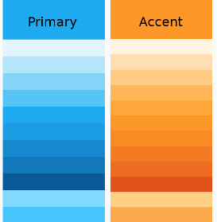

# Theming an ADF app

**Theming** is the process of adding your own color scheme to add style to an existing design.

The [Material Design](https://material.io/guidelines/material-design/introduction.html)
specification doesn't specify a single color scheme. Instead it uses the concept
of color **themes** to allow designers some flexibility in their choice of colors.

A theme is a palette based around two main colors: the **primary** color (used widely
throughout the app) and the **accent** color (used mainly for highlighting and calling
out specific UI elements). Each of these colors is defined in a number of shades. For
example, a blue/orange theme could define shades like the following:



Each shade is related to a particular purpose or set of purposes within the app. So for
example, the shade that works best for text isn't necessarily the same shade you would use
for flat areas of color. Material Design provides a number of
[standard themes](https://material.io/guidelines/style/color.html#color-themes)
with shades that are carefully chosen for each purpose within the UI. The CSS files are
designed so that the names are consistent between themes (so the same "purpose" will always
have the same class name across CSS files). This makes it easy to switch themes simply by
changing a few CSS definitions. Material Design also defines the relationship between
the different shades, so you can calculate your own color values or, more straightforwardly, use
an [online palette design tool](http://mcg.mbitson.com/).

See the [Material Design Style page](https://material.io/guidelines/style/color.html#) for
more information about color concepts.

## Using a pre-built theme

Angular Material comes prepackaged with several pre-built theme css files. These theme files also
include all of the styles for core (styles common to all components), so you only have to include a
single css file for Angular Material in your app.

You can include a theme file directly into your application from
`@alfresco/adf-core/prebuilt-themes`

Available pre-built themes:
* `adf-blue-orange.css`
* `adf-blue-purple.css`
* `adf-cyan-orange.css`
* `adf-cyan-purple.css`
* `adf-green-orange.css`
* `adf-green-purple.css`
* `adf-indigo-pink.css`
* `adf-pink-bluegrey.css`
* `adf-purple-green.css`

If you're using Angular CLI you can include one of the prebuilt themes in your `styles.scss` file:
```css
@import '~@alfresco/adf-core/prebuilt-themes/adf-blue-orange.css';
```
Or you can add it directly in your index.html

```html
<link href="node_modules/ng2-alfresco-core/prebuilt-themes/adf-blue-orange.css" rel="stylesheet">
```

## Defining a custom theme

When you want more customization than a pre-built theme offers, you can create your own theme file. You only need to include the packages you actually use in your application.

```scss
/*
 *  Include only packages that you are using (and core by default)
 */
@import '~@alfresco/adf-content-services/theming';
@import '~@alfresco/adf-process-services/theming';
@import '~@alfresco/adf-insights/theming';
@import '~@alfresco/adf-core/theming';

@import '~@angular/material/theming';

@include mat-core($alfresco-typography);

$primary: mat-palette($alfresco-accent-orange);
$accent:  mat-palette($alfresco-accent-purple);
$warn:    mat-palette($alfresco-warn);
$theme:   mat-light-theme($primary, $accent, $warn);

@include angular-material-theme($theme);

@include adf-content-services-theme($theme);
@include adf-process-services-theme($theme);
@include adf-insights-theme($theme);
@include adf-core-theme($theme);
```

Notes: if you are using the Generator or the demo shell you need only to change the`/src/custom-style.scss` with your set of colors

### Multiple themes

You can create multiple themes for your application:

#### Example of defining multiple themes

```scss
@import '~@alfresco/adf-content-services/theming';
@import '~@alfresco/adf-process-services/theming';
@import '~@alfresco/adf-insights/theming';
@import '~@alfresco/adf-core/theming';
@import '~@angular/material/theming';
...

@include mat-core();

$primary: mat-palette($alfresco-accent-orange);
$accent:  mat-palette($alfresco-accent-purple);
$warn:    mat-palette($alfresco-warn);

$theme:   mat-light-theme($primary, $accent, $warn);
$dark-theme:   mat-dark-theme($primary, $accent, $warn);

@include adf-core-theme($theme);
...like above

.adf-dark-theme {
    @include adf-core-theme($dark-theme);
    ...like above
}
```
Any component with the  `add-dark-theme` class will use the dark theme, while other components will fall back to the default.


## Default reusable class

```css
.adf-hide-small                 // Display none vieweport <960px
.adf-hide-xsmall                // Display none vieweport <600px

.adf-primary-color               // Primary color
.accent-color                // Accent color
.warn-color                  // Warn color
.primary-contrast-text-color // Default contrast color for primary color
.accent-contrast-text-color  // Default contrast color for accent color
.background-color            // Dialog background color
.primary-background-color    // Primary background color
.accent-background-color     // Default background color for accent
```