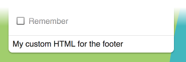

# Transclusion

Several components in ADF make use of **transclusion**, which is the technique
of incorporating user-supplied content in the body of a standard component.

In
most cases, this is used to make small customizations (for example, the various
list components let you supply custom content to show when the list is empty).
However, there are also a few "containers" whose entire content is set by the user
with the container itself being mainly for convenient display and formatting
(for example, the [Info drawer component](../core/info-drawer.component.md)).

You supply the content you want to transclude between the opening and closing tags of
the main component. In a few cases, this content can be completely free-form as with
the body section of the [Login component](../core/login.component.md):

```html
<adf-login ...>
    <div>
        <div>Your extra content</div>
    </div>
</adf-login>
```

More often, though, the main component makes use of one or more sub-components to add
structure to the transclusion. For example, the [Login component](../core/login.component.md)
also has sub-components for the header and footer regions in addition to the free-form
content of the body:

```html
<adf-login ...>
    <login-footer><ng-template>My custom HTML for the footer</ng-template></login-footer>
</adf-login>
```



The doc pages for the components that use transclusion contain full details of all
supported sub-components and their usage. 