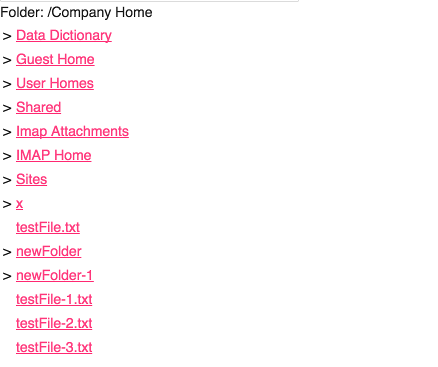

# Alfresco Webscript Get component

Provides access to Webscript features.

## Basic usage

```html
<adf-webscript-get 
    [scriptPath]="string"
    [scriptArgs]="Object"
    [contextRoot]="string"
    [servicePath]="string"
    [showData]="boolean"
    [contentType]="JSON | HTML | DATATABLE | TEXT"
    (success)= "logData($event)">
 </adf-webscript-get>
```

Another example:

**app.component.html**

```html
<adf-webscript-get 
    [scriptPath]="scriptPath"
    [scriptArgs]="scriptArgs"
    [contextRoot]="contextRoot"
    [servicePath]="servicePath" 
    [contentType]="'HTML'">
</adf-webscript-get>
```

**app.component.ts**

```ts
export class AppComponent {
    scriptPath: string = 'sample/folder/Company%20Home';
    contextRoot: string = 'alfresco';
    servicePath: string = 'service';
}
```

### Properties

| Attribute | Type | Default | Description |
| --------- | ---- | ------- | ----------- |
| scriptPath | string |  | (**mandatory**) path to Web Script (as defined by Web Script) |
| scriptArgs | Object |  | arguments to pass to Web Script |
| contextRoot | string |  | path where application is deployed |
| scriptPath | string | alfresco | path to Web Script (as defined by Web Script) |
| contentType | string | service | path where Web Script service is mapped default value |
| contentType | string | TEXT | how to handle the data received from the web script JSON , HTML , DATATABLE or TEXT |
| showData | boolean | true | render the webscript data |

### Events

| Name | Description |
| ---- | ----------- |
| success | You can get the plain data from the webscript through the **success** event parameter and use it as you need in your application |

**contentType** {string}  
**_data_**      {string}  data containing the plain value you get from the webscipt as an output parameter

## Details

### Webscript View HTML example

This sample demonstrates how to implement a Webscript component that renders the HTML contents that come from a webscript
This sample Web Scripts reside in your Alfresco Server. You can access the folder webscript here:

`http://localhost:8080/alfresco/service/sample/folder/Company%20Home`

```html
<adf-webscript-get 
    [scriptPath]="scriptPath"
    [contextRoot]="'alfresco'"
    [servicePath]="'service'";
    [scriptPath]="'Sample/folder/Company%20Home'"
    [contentType]="'HTML'">
</adf-webscript-get>
```

                         

### Webscript View DATATABLE example

This sample demonstrates how to implement a Webscript component that renders the JSON contents that come from a webscript

`http://localhost:8080/alfresco/service/sample/folder/DATATABLE`

```html
<adf-webscript-get 
    [scriptPath]="scriptPath"
    [contextRoot]="'alfresco'"
    [servicePath]="'service'";
    [scriptPath]="'Sample/folder/DATATABLE'"
    [contentType]="'DATATABLE'">
</adf-webscript-get>
```

If you want to show the result from a webscript inside a ng2-alfresco-datatable you have to return from the GET of the webscript the datastructure below:
subdivide in data and schema

```ts
data: [],
schema: []
```

this is an example: 

```ts
data: [
    {id: 1, name: 'Name 1'},
    {id: 2, name: 'Name 2'}
],
schema: [{
    type: 'text',
    key: 'id',
    title: 'Id',
    sortable: true
}, {
    type: 'text',
    key: 'name',
    title: 'Name',
    sortable: true
}]
```

or you can send just the array data and the component will create a schema for you: 

```ts
data: [
    {id: 1, name: 'Name 1'},
    {id: 2, name: 'Name 2'}
]]
```

that will render the following table


### Webscript View JSON example

This sample demonstrates how to implement a Webscript component that renders the JSON contents that come from a webscript
This sample Web Scripts reside in your Alfresco Server. You can access the folder webscript here:

`http://localhost:8080/alfresco/service/sample/folder/JSON%EXAMPLE`

```html
<adf-webscript-get 
    [scriptPath]="scriptPath"
    [contextRoot]="'alfresco'"
    [servicePath]="'service'";
    [scriptPath]="'Sample/folder/JSON_EXAMPLE'"
    [contentType]="'HTML'"
    [showData]="false"
    (success)="logDataExample($event)">
</adf-webscript-get>
```

You can get the plain data from the webscript through the **success** event parameter and use it as you need in your application

```ts
logDataExample(data) {
    console.log('You webscript data are here' + data);
}
```
