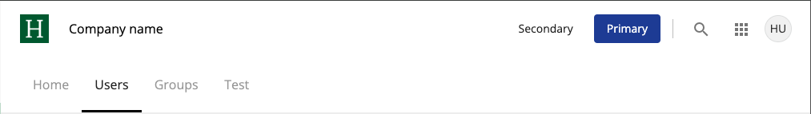

# Header Component

`standalone`, `component`

The Header component is a versatile component used to display a header section in applications. It supports various configurations including minimal and extended variants, customizable logo, title, and navigation items.

## Usage

Displaying a minimal header with a logo and navbar:

```html
<adf-header
    variant="minimal"
    headerHeight="64px"
    color="primary"
    [logoSrc]="src"
    [logoAlt]="alt"
    [logoHeight]="logoHeight"
    [logoWidth]="logoWidth"
    [title]="title"
    [navbarItems]="items"
>
</adf-header>
```

Toolbar actions can be added to the header by placing them inside an element with the `adf-toolbar-actions` attribute.

```html
<adf-header
    variant="minimal"
    [logoSrc]="src"
    [title]="title"
    [navbarItems]="items"
>
    <div adf-toolbar-actions>
        <adf-toolbar-divider></adf-toolbar-divider>
        <adf-button variant="icon" icon="search" (click)="onSearchClick()"></adf-button>
        <adf-avatar [src]="src"></adf-avatar>
    </div>
</adf-header>
```


Displaying an extended header with toolbar actions:

```html
<adf-header variant="extended" [logoSrc]="src" [title]="title" [navbarItems]="items">
    <div adf-toolbar-actions>
        <adf-button variant="flat">Secondary</adf-button>
        <adf-button variant="flat" color="accent">Primary</adf-button>

        <adf-toolbar-divider></adf-toolbar-divider>

        <adf-button variant="icon" icon="search"></adf-button>
        <adf-button variant="icon" [matMenuTriggerFor]="menu" icon="apps"></adf-button>
        <mat-menu #menu="matMenu">
            ...
        </mat-menu>
        
        <adf-avatar
            initials="HU"
            cursor="pointer"
            [matMenuTriggerFor]="userMenu">
        </adf-avatar>
        <mat-menu #userMenu="matMenu">
            ...
        </mat-menu>
    </div>
</adf-header>
```



## API

Import the following standalone components:

```typescript
import { HeaderComponent } from '@alfresco/adf-core';
```

## Properties

| Name           | Type            | Default      | Description                                                |
|----------------|-----------------|--------------|------------------------------------------------------------|
| `variant`      | `HeaderVariant` | `minimal`    | The variant of the header. Can be `minimal` or `extended`. |
| `headerHeight` | `string`        | `100%`       | The height of the header.                                  |
| `logoSrc`      | `string`        |              | The URL of the logo to display.                            |
| `logoAlt`      | `string`        |              | The alt text for the logo.                                 |
| `logoHeight`   | `string`        | `36px`       | The height of the logo.                                    |
| `logoWidth`    | `string`        | `logoHeight` | The width of the logo.                                     |
| `title`        | `string`        |              | The title to display in the header.                        |
| `color`        | `ThemePalette`  |              | The theme color palette for the header.                    |
| `navbarItems`  | `NavbarItem[]`  | `[]`         | Navigation items to display in the header.                 |

## Theming

The following CSS classes are available for theming:

| Name                  | Description                         |
|-----------------------|-------------------------------------|
| `adf-header`          | The host element.                   |
| `adf-toolbar`         | The toolbar element (single row).   |
| `adf-toolbar-title`   | The toolbar title element.          |
| `adf-toolbar-logo`    | The logo element inside the header. |
| `adf-toolbar-actions` | Toolbar actions container.          |

### CSS Variables

| Name                              | Description                                       |
|-----------------------------------|---------------------------------------------------|
| `--adf-header-width`              | The width of the header.                          |
| `--adf-header-height`             | The height of the header.                         |
| `--adf-toolbar-width`             | The width of the toolbar.                         |
| `--adf-toolbar-height`            | The height of the toolbar.                        |
| `--adf-toolbar-title-width`       | The width of the toolbar title.                   |
| `--adf-toolbar-title-font-size`   | The size of the title font.                       |
| `--adf-toolbar-title-font-weight` | The wight of the title font.                      |
| `--adf-toolbar-title-color`       | The color of the title font.                      |
| `--adf-toolbar-title-gap`         | The gap of the toolbar title.                     |
| `--adf-toolbar-title-gap`         | The gap of the toolbar title.                     |
| `--adf-header-logo-height`        | The height of the logo within the header.         |
| `--adf-header-logo-width`         | The width of the logo within the header.          |
| `--adf-toolbar-actions-gap`       | The gap of the toolbar actions within the header. |

## See Also

-   [Navbar component](./navbar/navbar.component.md)
-   [Navbar Item component](./navbar/navbar-item.component.md)
-   [Avatar component](../avatar/avatar.component.md)
-   [Button component](../button/button.component.md)
