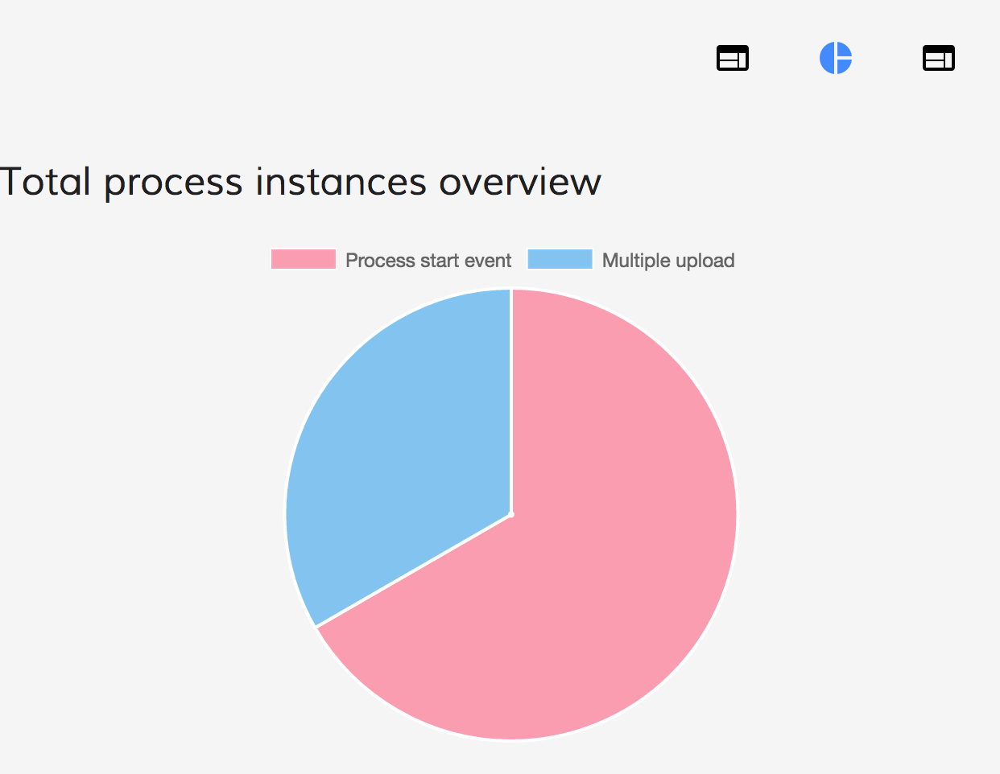

# Activiti Analytics Components

<!-- markdown-toc start - Don't edit this section.  npm run toc to generate it-->

<!-- toc -->

- [Prerequisites](#prerequisites)
- [Install](#install)
- [Activiti Analytics List Component](#activiti-analytics-list-component)
  * [Properties](#properties)
  * [Events](#events)
- [Activiti Analytics Component](#activiti-analytics-component)
  * [Properties](#properties-1)
  * [Events](#events-1)
- [Analytics Generator Component](#analytics-generator-component)
  * [Properties](#properties-2)
  * [Events](#events-2)
- [Build from sources](#build-from-sources)
- [NPM scripts](#npm-scripts)
- [Demo](#demo)
- [License](#license)

<!-- tocstop -->

<!-- markdown-toc end -->

## Prerequisites

Before you start using this development framework, make sure you have installed all required software and done all the
necessary configuration, see this [page](https://github.com/Alfresco/alfresco-ng2-components/blob/master/PREREQUISITES.md).

> If you plan using this component with projects generated by Angular CLI, please refer to the following article: [Using ADF with Angular CLI](https://github.com/Alfresco/alfresco-ng2-components/wiki/Angular-CLI)

## Install

```sh
npm install ng2-activiti-analytics
```

## Activiti Analytics List Component

The component shows the list of all the available reports

```html
<analytics-report-list 
    [layoutType]="'LIST'">
</analytics-report-list>
```

### Properties

| Name | Type | Required | Default | Description |
| --- | --- | --- | --- | --- |
| appId | string | optional | | The application id |
| layoutType | string | required | | Define the layout of the apps. There are two possible values: GRID or LIST. LIST is the default value|
| selectFirst | boolean | optional | false | Change the value to true if you want select the first item in the list as default|

### Events

| Name | Description |
| --- | --- |
| onSuccess | The event is emitted when the report list are loaded |
| onError | The event is emitted when an error occur during the loading |
| reportClick | The event is emitted when the report in the list is selected |

## Activiti Analytics Component

The component shows the charts related to the reportId passed as input

```html
<activiti-analytics 
    [appId]="1001" 
    [reportId]="2006">
</activiti-analytics>
```

### Properties

| Name | Type | Description |
| --- | --- | --- |
| appId | string | The application id |
| reportId | string | The report id |
| hideParameters | boolean | Toggle the analytics parameters |
| debug | boolean | Toggle debug mode, outputs the Form values in the console log if enabled. |

You can also hide chart parameters UI by setting the `hideParameters` to `true`:

```html
<activiti-analytics 
    [appId]="appId" 
    [reportId]="reportId" 
    [hideParameters]="true">
</activiti-analytics>
```



### Events

| Name | Description |
| --- | --- |
| onSuccess | The event is emitted when the report parameters are loaded |
| onError | The event is emitted when an error occur during the loading |
| reportSaved | The event is emitted when a report is saved |
| reportDeleted | The event is emitted when a report is deleted |

## Analytics Generator Component

The component generate and show the charts

```html
<activiti-analytics-generator 
    [reportId]="reportId" 
    [reportParamQuery]="reportParamQuery">
</activiti-analytics>
```

### Properties

| Name | Type | Description |
| --- | --- | -- |
| reportId | string | The report id |
| reportParamQuery | ReportQuery | The object contains all the parameters that the report needs |

### Events

| Name | Description |
| --- | --- |
| onSuccess | Raised when the charts are loaded |
| onError | Raised when an error occur during the loading |

## Build from sources

You can build component from sources with the following commands:

```sh
npm install
npm run build
```

> The `build` task rebuilds all the code, runs tslint, license checks 
> and other quality check tools before performing unit testing.

## NPM scripts

| Command | Description |
| --- | --- |
| npm run build | Build component |
| npm run test | Run unit tests in the console |
| npm run test-browser | Run unit tests in the browser
| npm run coverage | Run unit tests and display code coverage report |

## Demo

Please check the demo folder for a demo project

```sh
cd demo
npm install
npm start
```

## License

[Apache Version 2.0](https://github.com/Alfresco/alfresco-ng2-components/blob/master/LICENSE)
