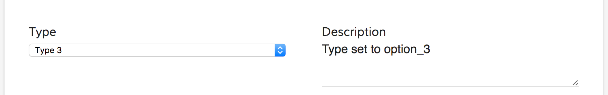

# APS Form Component

<!-- markdown-toc start - Don't edit this section.  npm run toc to generate it-->

<!-- toc -->

- [Library Contents](#library-contents)
  * [Components](#components)
  * [Services](#services)
- [Prerequisites](#prerequisites)
- [Install](#install)
- [Form Component](#form-component)
  * [Properties](#properties)
    + [Form Field Validators](#form-field-validators)
  * [Advanced properties](#advanced-properties)
  * [Events](#events)
  * [Custom empty form template](#custom-empty-form-template)
  * [Controlling outcome execution behaviour](#controlling-outcome-execution-behaviour)
- [Activiti Content Component](#activiti-content-component)
  * [Properties](#properties-1)
  * [Events](#events-1)
- [ADF Form List Component](#adf-form-list-component)
  * [Properties](#properties-2)
- [FormService Service](#formservice-service)
  * [Events](#events-2)
  * [Methods](#methods)
- [Common scenarios](#common-scenarios)
  * [Changing field value based on another field](#changing-field-value-based-on-another-field)
  * [Listen all form Events](#listen-all-form-events)
- [See also](#see-also)
- [Build from sources](#build-from-sources)
- [NPM scripts](#npm-scripts)
- [Demo](#demo)
- [License](#license)

<!-- tocstop -->

<!-- markdown-toc end -->

See it live: [Form Quickstart](https://embed.plnkr.co/YSLXTqb3DtMhVJSqXKkE/)

## Library Contents

### Components

- [ActivitiForm](#activitiform-component)
- ActivitiStartForm

### Services

- [FormService](#formservice)
- ActivitiAlfrescoContentService
- EcmModelService
- FormRenderingService
- NodeService
- WidgetVisibilityService

## Prerequisites

Before you start using this development framework, make sure you have installed all required software and done all the
necessary configuration, see this [page](https://github.com/Alfresco/alfresco-ng2-components/blob/master/PREREQUISITES.md).

> If you plan to use this component with projects generated by Angular CLI, you can read more in [Using ADF with Angular CLI](https://github.com/Alfresco/alfresco-ng2-components/wiki/Angular-CLI)

## Install

```sh
npm install ng2-activiti-form
```

## Form Component

The component shows a Form from Activiti

```html
<adf-form 
    [taskId]="taskId">
</adf-form>
```

**Display form instance by task id:**

```html
<adf-form 
    [taskId]="selectedTask?.id">
</adf-form>
```

For an existing Task both form and values will be fetched and displayed.

**Display form definition by form id:**

```html
<adf-form 
    [formId]="selectedFormDefinition?.id"
    [data]="customData">
</adf-form>
```

Only form definition will be fetched.

**Display form definition by form name:**

```html
<adf-form 
    [formName]="selectedFormDefinition?.name"
    [data]="customData">
</adf-form>
```

**Display form definition by ECM nodeId:**

In this case the metadata of the node are showed in an activiti Form.
If there is no form definied in activiti for the type of the node,
a new form will be automaticaly created in Activiti.

```html
<adf-form 
    [nodeId]="'e280be3a-6584-45a1-8bb5-89bfe070262e'">
</adf-form>
```

**Display form definition by form name, and store the form field as metadata:**

The param nameNode is optional.

```html
<adf-form 
    [formName]="'activitiForms:patientFolder'"
    [saveMetadata]="true"
    [path]="'/Sites/swsdp/documentLibrary'"
    [nameNode]="'test'">
</adf-form>
```

**Display form definition by ECM nodeId:**

In this case the metadata of the node are shown in an activiti Form,
and store the form field as metadata. The param nameNode is optional.

```html
<adf-form 
    [nodeId]="'e280be3a-6584-45a1-8bb5-89bfe070262e'"
    [saveMetadata]="true"
    [path]="'/Sites/swsdp/documentLibrary'"
    [nameNode]="'test'">
</adf-form>
```

### Properties

The recommended set of properties can be found in the following table:

| Name | Type | Default | Description |
| --- | --- | --- | --- |
| taskId | string | | Task id to fetch corresponding form and values. |
| formId | string | | The id of the form definition to load and display with custom values. |
| formName | string | | Name of the form definition to load and display with custom values. |
| data | FormValues | | Custom form values map to be used with the rendered form. |
| showTitle | boolean | true | Toggle rendering of the form title. |
| showCompleteButton | boolean | true | Toggle rendering of the `Complete` outcome button. |
| disableCompleteButton | boolean | false | The `Complete` outcome button is shown but it will be disabled. |
| showSaveButton | boolean | true | Toggle rendering of the `Save` outcome button. |
| readOnly | boolean | false | Toggle readonly state of the form. Enforces all form widgets render readonly if enabled. |
| showRefreshButton | boolean | true | Toggle rendering of the `Refresh` button. |
| showValidationIcon | boolean | true | Toggle rendering of the validation icon next form title. |
| saveMetadata | boolean | false | Store the value of the form as metadata. |
| path | string |  |  Path of the folder where to store the metadata. |
| nameNode | string | true | Name to assign to the new node where the metadata are stored. |
| fieldValidators | FormFieldValidator[] | *see below* | Contains a list of form field validator instances. |

#### Form Field Validators

The Form component provides you with access to all Form Field validators. By default the following instances are created automatically:

- RequiredFieldValidator
- NumberFieldValidator
- MinLengthFieldValidator
- MaxLengthFieldValidator
- MinValueFieldValidator
- MaxValueFieldValidator
- RegExFieldValidator
- DateFieldValidator
- MinDateFieldValidator
- MaxDateFieldValidator

If needed, you can completely redefine the set of validators used by the form.

All changes to `fieldValidators` collection are automatically applied to all the further validation cycles.

### Advanced properties
 
 The following properties are for complex customisation purposes:
 
| Name | Type | Default | Description |
| --- | --- | --- | --- |
| form | FormModel | | Underlying form model instance. |
| showDebugButton | boolean | false | Toggle debug options. |
| debugMode | boolean | false | Toggle debug mode, allows displaying additional data for development and debugging purposes. |

### Events

| Name |  Return Type | Description |
| --- | --- | --- | 
| formLoaded | [FormModel](https://github.com/Alfresco/alfresco-ng2-components/blob/master/ng2-components/ng2-activiti-form/src/components/widgets/core/form.model.ts) | Invoked when form is loaded or reloaded. |
| formSaved | [FormModel](https://github.com/Alfresco/alfresco-ng2-components/blob/master/ng2-components/ng2-activiti-form/src/components/widgets/core/form.model.ts)  | Invoked when form is submitted with `Save` or custom outcomes.  |
| formCompleted | [FormModel](https://github.com/Alfresco/alfresco-ng2-components/blob/master/ng2-components/ng2-activiti-form/src/components/widgets/core/form.model.ts)  | Invoked when form is submitted with `Complete` outcome.  |
| formDataRefreshed | [FormModel](https://github.com/Alfresco/alfresco-ng2-components/blob/master/ng2-components/ng2-activiti-form/src/components/widgets/core/form.model.ts) | Invoked when form values are refreshed due to a data property change  |
| executeOutcome | [FormOutcomeEvent](https://github.com/Alfresco/alfresco-ng2-components/blob/master/ng2-components/ng2-activiti-form/src/components/widgets/core/form-outcome-event.model.ts) | Invoked when any outcome is executed, default behaviour can be prevented via `event.preventDefault()` |
| onError | any | Invoked at any error |

All `form*` events receive an instance of the `FormModel` as event argument for ease of development:

**MyView.component.html**

```html
<adf-form 
    [taskId]="selectedTask?.id"
    (formSaved)="onFormSaved($event)">
</adf-form>
```

**MyView.component.ts**

```ts
onFormSaved(form: FormModel) {
    console.log(form);
}
```

### Custom empty form template

You can add a template that will be show if no form definition has been found

```html
<adf-form .... >

    <div empty-form >
        <h2>Empty form</h2>
    </div>

</adf-form>

```

### Controlling outcome execution behaviour

If absolutely needed it is possible taking full control over form outcome execution by means of `executeOutcome` event. 
This event is fired upon each outcome execution, both system and custom ones.

You can prevent default behaviour by calling `event.preventDefault()`. 
This allows for example having custom form validation scenarios and/or additional validation summary presentation.

Alternatively you may want just running additional code on outcome execution without suppressing default one.

**MyView.component.html**

```html
<adf-form 
    [taskId]="selectedTask?.id"
    executeOutcome="validateForm($event)">
</adf-form>
```

**MyView.component.ts**

```ts
import { FormOutcomeEvent } from 'ng2-activiti-form';

export class MyView {

    validateForm(event: FormOutcomeEvent) {
        let outcome = event.outcome;
        
        // you can also get additional properties of outcomes 
        // if you defined them within outcome definition
        
        if (outcome) {
            let form = outcome.form;
            if (form) {
                // check/update the form here
                event.preventDefault();
            }
        }
    }
    
}
```

There are two additional functions that can be of a great value when controlling outcomes:

- `saveTaskForm()` - saves current form
- `completeTaskForm(outcome?: string)` - save and complete form with a given outcome name

**Please note that if `event.preventDefault()` is not called then default outcome behaviour 
will also be executed after your custom code.**

## Activiti Content Component

The component shows the content preview.

```html
<adf-content 
    [contentId]="'1001'">
</adf-content>
```

### Properties

The recommended set of properties can be found in the following table:

| Name | Type | Default | Description |
| --- | --- | --- | --- |
| contentId | string |  | The content id to show. |

### Events

| Name | Description |
| --- | --- |
| contentClick | Invoked when the content is clicked. |

## ADF Form List Component

The component shows the activiti forms as a list.

```html
<adf-form-list
[forms]="[{ name: 'My Name', lastUpdatedByFullName: 'My User Name', lastUpdated: '2017-06-01'}]">
</adf-form-list>
```

### Properties

The recommended set of properties can be found in the following table:

| Name | Type | Default | Description |
| --- | --- | --- | --- |
| forms | any |  | The array that contains the information to show inside the list. |

## FormService Service

```ts
import { FormService, FormEvent, FormFieldEvent } from 'ng2-activiti-form';

@Component(...)
class MyComponent {

    constructor(formService: FormService) {

        formService.formLoaded.subscribe(
            (e: FormEvent) => {
                console.log(`Form loaded: ${e.form.id}`);
            }
        );

        formService.formFieldValueChanged.subscribe(
            (e: FormFieldEvent) => {
                console.log(`Field value changed. Form: ${e.form.id}, Field: ${e.field.id}, Value: ${e.field.value}`);
            }
        );

    }

}
```

### Events

| Name | Args Type | Description |
| --- | --- | --- |
| formLoaded | FormEvent | Raised when form has been loaded or reloaded |
| formFieldValueChanged | FormFieldEvent | Raised when input values change |
| taskCompleted | FormEvent | Raised when a task is completed successfully |
| taskCompletedError | FormErrorEvent | Raised when a task is completed unsuccessfully  |
| taskSaved | FormEvent | Raised when a task is saved successfully |
| taskSavedError | FormErrorEvent | Raised when a task is saved unsuccessfully |
| executeOutcome | FormOutcomeEvent | Raised when a form outcome is executed |
| formEvents | Event | You can subscribe to this event to listen : ( click, blur, change, focus, focusin, focusout, input, invalid, select) of any elements in the form , see doc below |
| validateForm | ValidateFormEvent | Raised each time a form is validated. You can use it to provide custom validation or prevent default behaviour. |
| validateFormField | ValidateFormFieldEvent | Raised each time a form field is validated. You can use it to provide custom validation or prevent default behaviour.|

### Methods

| Name | Params | Returns | Description |
| --- | --- | --- | --- |
| createFormFromANode | (formName: string) | Observable\<any\> | Create a Form with a fields for each metadata properties |
| createForm | (formName: string) | Observable\<any\> | Create a Form |
| addFieldsToAForm | (formId: string, formModel: FormDefinitionModel) | Observable\<any\> | Add Fileds to A form |
| searchFrom | (name: string) | Observable\<any\> | Search For A Form by name |
| getForms | n/a | Observable\<any\> | Get All the forms |
| getProcessDefinitions | n/a | Observable\<any\> | Get Process Definitions |
| getTasks | n/a | Observable\<any\> | Get All the Tasks |
| getTask | (taskId: string) | Observable\<any\> | Get Task |
| saveTaskForm | (taskId: string, formValues: FormValues) | Observable\<any\> | Save Task Form |
| completeTaskForm | (taskId: string, formValues: FormValues, outcome?: string) | Observable\<any\> | Complete Task Form |
| getTaskForm | (taskId: string) | Observable\<any\> | Get Form related to a taskId |
| getFormDefinitionById | (formId: string) | Observable\<any\> | Get Form Definition |
| getFormDefinitionByName | (name: string) | Observable\<any\> | Returns form definition by a given name. |
| getStartFormInstance | (processId: string) | Observable\<any\> | Get start form instance for a given processId |
| getStartFormDefinition | (processId: string) | Observable\<any\> | Get start form definition for a given process |
| createTemporaryRawRelatedContent | (file: any) | Observable\<any\> | Save File |
| getRestFieldValues | (taskId: string, field: string) | Observable\<any\> |  |
| getRestFieldValuesByProcessId | (processDefinitionId: string, field: string) | Observable\<any\> |  |
| getRestFieldValuesColumnByProcessId | (processDefinitionId: string, field: string, column?: string) | Observable\<any\> |  |
| getRestFieldValuesColumn | (taskId: string, field: string, column?: string) | Observable\<any\> |  |
| getWorkflowGroups\ | (filter: string, groupId?: string) | Observable\<GroupModel[]\> |  |
| getWorkflowUsers\ | (filter: string, groupId?: string) | Observable\<GroupUserModel[]\> |  |

## Common scenarios

### Changing field value based on another field

Create a simple Form with a dropdown widget (id: `type`), and a multiline text (id: `description`).

```ts
formService.formFieldValueChanged.subscribe((e: FormFieldEvent) => {
    if (e.field.id === 'type') {
        const fields: FormFieldModel[] = e.form.getFormFields();
        const description = fields.find(f => f.id === 'description');
        if (description != null) {
            console.log(description);
            description.value = 'Type set to ' + e.field.value;
        }
    }
});
```

You subscribe to the `formFieldValueChanged` event and check whether event is raised for the `type` widget, then you search for a `description` widget and assign its value to some simple text.

The result should be as following:



### Listen all form Events 

If you want to listen all the events fired in the form you can subscribe to this Subject :

```ts
formService.formEvents.subscribe((event: Event) => {
  console.log('Event fired:' + event.type);
  console.log('Event Target:' + event.target);
});
```

## See also

- [Form Stencils with Angular 2](docs/stencils.md)
- [Form Extensibility and Customisation](docs/extensibility.md).

## Build from sources

You can build the component from sources with the following commands:

```sh
npm install
npm run build
```

> The `build` task rebuilds all the code, runs tslint, license checks 
> and other quality check tools before performing unit testing.

## NPM scripts

| Command | Description |
| --- | --- |
| npm run build | Build component |
| npm run test | Run unit tests in the console |
| npm run test-browser | Run unit tests in the browser
| npm run coverage | Run unit tests and display code coverage report |

## Demo

Please check the demo folder for a demo project

```sh
cd demo
npm install
npm start
```

## License

[Apache Version 2.0](https://github.com/Alfresco/alfresco-ng2-components/blob/master/LICENSE)