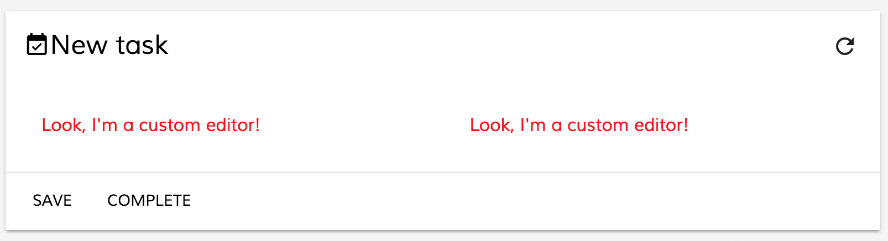
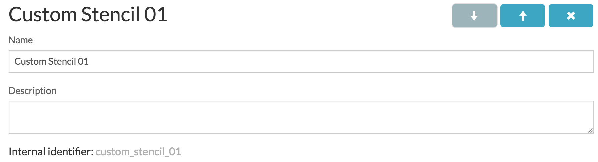
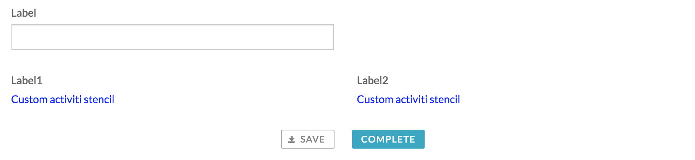
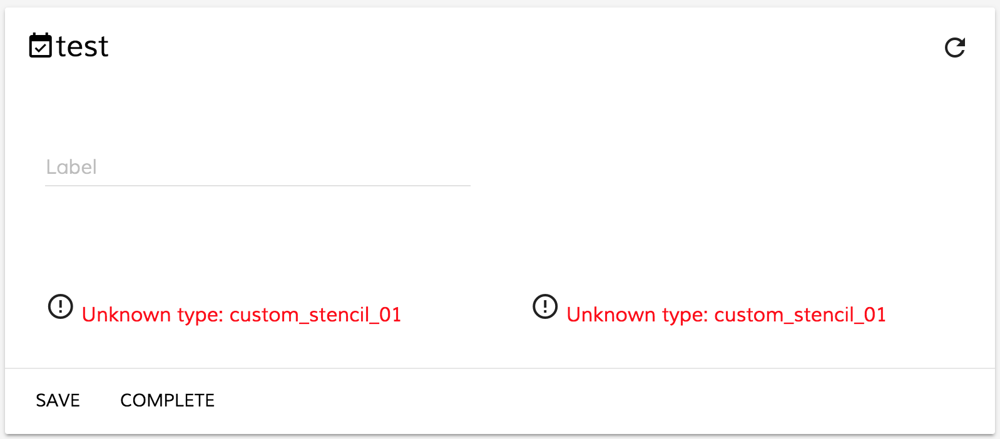

# Form Extensibility and Customisation

_Note: it is assumed you are familiar with Alfresco Activiti form definition structure._

- How components and widgets are rendred on a Form
- Replacing default form widgets with custom components
- Replacing custom stencils with custom components


## How components and widgets are rendred on a Form

<<<<<<< HEAD
All form field editors (aka widgets) on a Form are rendered by means of `FormFieldComponent`
=======
All form field editors (aka widgets) on a Form are rendered by means of `FormFieldComponent` 
>>>>>>> origin/dev-denys--build-scripts
that takes an instance of a `FormFieldModel`:

```html
<form-field [field]="field"></form-field>
```

<<<<<<< HEAD
This component depends on `FormRenderingService` service to map `FormFieldModel` to UI component
=======
This component depends on `FormRenderingService` service to map `FormFieldModel` to UI component 
>>>>>>> origin/dev-denys--build-scripts
based on field type or metadata information.

### Component type resolvers

`FormRenderingService` maps field types to corresponding instances exposing `ComponentTypeResolver` interface:

```ts
export interface ComponentTypeResolver {
    (field: FormFieldModel): Type<{}>;
}
```

Typically a `ComponentTypeResolver` is a function that takes `FormFieldModel` and returns corresponding component type.
It can be either a predefined component type or a dynamically evaluated based on field properties and metadata.

#### Static component mapping

You can (re)map fields like following:

```ts
let customResolver: ComponentTypeResolver = () => CustomWidgetComponent;
formRenderingService.setComponentTypeResolver('text', customResolver, true);
```

or simply:

```ts
formRenderingService.setComponentTypeResolver('text', () => CustomWidgetComponent, true);
```

#### Dynamic component mapping

Alternatively your resolver may return different component types based on `FormFieldModel` state and condition:

```ts
let customResolver: ComponentTypeResolver = (field: FormFieldModel): Type<{}> => {
    if (field) {
        let params = field.params;
    }
    return UnknownWidget;
};
formRenderingService.setComponentTypeResolver('text', customResolver, true);
```

### Default component mappings

Stencil Name | Field Type | Component Type |
| --- | --- | --- |
| Text | text | TextWidget |
| Number | integer | NumberWidget |
| Multi-line text | multi-line-text | MultilineTextWidget |
| Checkbox | boolean | CheckboxWidget |
| Dropdown | dropdown | DropdownWidget |
| Date | date | DateWidget |
| Amount | amount | AmountWidget |
| Radio buttons | radio-buttons | RadioButtonsWidget |
| Hyperlink | hyperlink | HyperlinkWidget |
| Display value | readonly | DisplayValueWidget |
| Display text | readonly-text | DisplayTextWidget |
| Typeahead | typeahead | TypeaheadWidget |
| People | people | PeopleWidget |
| Group of people | functional-group | FunctionalGroupWidget |
<<<<<<< HEAD
| Dynamic table | dynamic-table | DynamicTableWidget |
=======
| Dynamic table | dynamic-table | DynamicTableWidget | 
>>>>>>> origin/dev-denys--build-scripts
| N/A | container | ContainerWidget (layout component) |
| Header | group | ContainerWidget |
| Attach | upload | AttachWidget or UploadWidget (based on metadata) |
| N/A | N/A | UnknownWidget |


## Replacing default form widgets with custom components

This is a short walkthrough on replacing a standard `Text` widget with a custom component for all Alfresco Activiti forms
rendered within `<activiti-form>` component.

First let's create a simple Alfresco Activiti form with `Text` widgets:


Every custom widget must inherit `WidgetComponent` class in order to function properly:

```ts
import { Component } from '@angular/core';
import { WidgetComponent } from 'ng2-activiti-form';

@Component({
    selector: 'custom-editor',
    template: `
        <div style="color: red">Look, I'm a custom editor!</div>
    `
})
export class CustomEditorComponent extends WidgetComponent {}
```

Now you will need adding it to the application module or any custom module that is imported into the application one:

```ts
import { NgModule } from '@angular/core';
import { CustomEditorComponent } from './custom-editor.component';

@NgModule({
    declarations: [ CustomEditorComponent ],
    exports: [ CustomEditorComponent ],
    entryComponents: [ CustomEditorComponent ]
})
export class CustomEditorsModule {}
```

Every custom widget should be added into all three module collections: `declarations`, `exports` and `entryComponents`.

If you decided storing custom widgets in a separate dedicated module (and optionally as separate redistributable library)
don't forget importing it into your main application one:

```ts
@NgModule({
    imports: [
        // ...
        CustomEditorsModule
        // ...
    ],
    providers: [],
    bootstrap: [ AppComponent ]
})
export class AppModule {}
```

Now you can import `FormRenderingService` in any of your Views and override default mapping similar to the following:

```ts
import { Component } from '@angular/core';
import { CustomEditorComponent } from './custom-editor.component';

@Component({...})
export class MyView {

    constructor(formRenderingService: FormRenderingService) {
        formRenderingService.setComponentTypeResolver('text', () => CustomEditorComponent, true);
    }

}
```

At runtime it should look similar to the following:




## Replacing custom stencils with custom components

This is a short walkthrough on rendering custom Alfresco Activiti stencils by means of custom Angular 2 components.

### Creating custom stencil

First let's create a basic stencil and call it `Custom Stencil 01`:



_Note the `internal identifier` value as it will become a `field type` value when corresponding form is rendered._

Next put some simple html layout for `Form runtime template` and `Form editor template` fields:

```html
<div style="color: blue">Custom activiti stencil</div>
```

Now you are ready to design a test form based on your custom stencil:


Once wired with a new task it should look like the following within Alfresco Activiti web application:



### Creating custom widget

If you load previously created task into ADF `<actiiti-form>` component you will see something like the following:



Let's create an Angular 2 component to render missing content:

```ts
import { Component } from '@angular/core';
import { WidgetComponent } from 'ng2-activiti-form';

@Component({
    selector: 'custom-stencil-01',
    template: `<div style="color: green">ADF version of custom Activiti stencil</div>`
})
export class CustomStencil01 extends WidgetComponent {}
```

Put it inside custom module:

```ts
import { NgModule } from '@angular/core';
import { CustomStencil01 } from './custom-stencil-01.component';

@NgModule({
    declarations: [ CustomStencil01 ],
    exports: [ CustomStencil01 ],
    entryComponents: [ CustomStencil01 ]
})
export class CustomEditorsModule {}
```

And import into your Application Module

```ts
@NgModule({
    imports: [
        // ...
        CustomEditorsModule
        // ...
    ],
    providers: [],
    bootstrap: [ AppComponent ]
})
export class AppModule {}
```

Now you can import `FormRenderingService` in any of your Views and provide new mapping:

```ts
import { Component } from '@angular/core';
import { CustomStencil01 } from './custom-stencil-01.component';

@Component({...})
export class MyView {

    constructor(formRenderingService: FormRenderingService) {
        formRenderingService.setComponentTypeResolver('custom_stencil_01', () => CustomStencil01, true);
    }

}
```

At the runtime you should now see your custom Angular 2 component rendered in place of the stencils:

