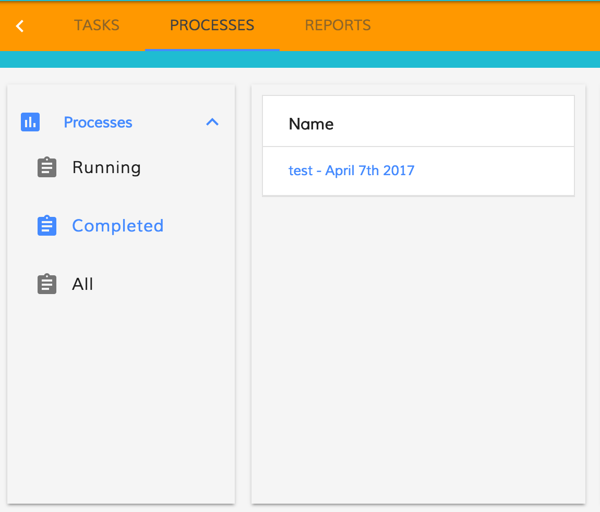
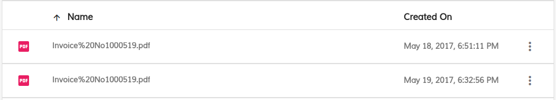

# Activiti Process List Component

Displays lists of process instances both active and completed, using any defined process filter, and renders details for any chosen instance.

## Prerequisites

Before you start using this development framework, make sure you have installed all required software and done all the
necessary configuration [prerequisites](https://github.com/Alfresco/alfresco-ng2-components/blob/master/PREREQUISITES.md).

> If you plan using this component with projects generated by Angular CLI, please refer to the following article: [Using ADF with Angular CLI](https://github.com/Alfresco/alfresco-ng2-components/wiki/Angular-CLI)

## Install

```sh
npm install ng2-activiti-processlist
```

## Activiti Process Instance List

This component renders a list containing all the process instances matched by the parameters specified.

**app.component.html**

```html
<activiti-process-instance-list 
    [appId]="'1'" 
    [state]="'open'">
</activiti-process-instance-list>
```

### Properties

| Name | Description |
| --- | --- |
| appId | The id of the app. |
| processDefinitionKey | The processDefinitionKey of the process. |
| state | Define state of the processes. Possible values are `running`, `completed` and `all` |
| sort | Define sort of the processes. Possible values are `created-desc`, `created-asc`, `ended-desc`, `ended-asc` |
| schemaColumn | List of columns to display in the process instances datatable |

Example:

```json
[
    {type: 'text', key: 'id', title: 'Id', sortable: true},
    {type: 'text', key: 'name', title: 'Name', cssClass: 'full-width name-column', sortable: true},
    {type: 'text', key: 'started', title: 'Started', sortable: true},
    {type: 'text', key: 'startedBy.email', title: 'Started By', sortable: true}
]
```

### Events

- **rowClick**: Emitted when a row in the process list is clicked
- **onSuccess**: Emitted when the list of process instances has been loaded successfully from the server
- **onError**: Emitted when an error is encountered loading the list of process instances from the server

## Process Filters Component

Process filters are a collection of criteria used to filter process instances, which may be customized
by users. This component displays a list of available filters and allows the user to select any given
filter as the active filter.

The most common usage is in driving a process instance list in order to allow the user to choose which
process instances are displayed in the list.

```html
<activiti-process-instance-filters
    appId="1001">
</activiti-process-instance-filters>
```

### Properties

| Name | Type | Description |
| --- | --- | --- | --- |
| filterParam | [FilterParamsModel](#filterparamsmodel) | The params to filter the task filter. If there is no match the default one (first filter of the list) is selected |
| appId | string | Display filters available to the current user for the application with the specified ID. |
| appName | string | Display filters available to the current user for the application with the specified name. |
| hasIcon | boolean | Toggle to show or not the filter's icon. |

If both `appId` and `appName` are specified then `appName` will take precedence and `appId` will be ignored.

### Events

| Name | Description |
| --- | --- |
| onSuccess | Raised when the list of filters hase been successfully loaded from the server |
| onError | Raised when an error occurs |
| filterClick | Raised when the user selects a filter from the list |

### How filter the activiti process filters

 ```html
<activiti-process-instance-filters 
    [filterParam]="{index: 0}">
</activiti-filters>
 ```

You can use inside the filterParam one of the following property.

## FilterParamsModel

```json
{
    "id": "number",
    "name": "string",
    "index": "number"
}
```

| Name | Type | Description |
| --- | --- | --- |
| id | string | The id of the task filter. |
| name | string | The name of the task filter, lowercase is checked. |
| index | number | Zero-based position of the filter in the array. |

### How to create an accordion menu with the processes filter

You can create an accordion menu using the AccordionComponent that wrap the activiti task filter.
The AccordionComponent is exposed by the alfresco-core.

```html
<adf-accordion>
    <adf-accordion-group 
        [heading]="'Processes'" 
        [isSelected]="true" 
        [headingIcon]="'assessment'">
        <activiti-process-instance-filters
            [appId]="appId"
            (filterClick)="onProcessFilterClick($event)"
            (onSuccess)="onSuccessProcessFilterList($event)">
        </activiti-process-instance-filters>
    </adf-accordion-group>
</adf-accordion>
```



## Start Process component

Displays a button which in turn displays a dialog when clicked, allowing the user
to specify some basic details needed to start a new process instance.

```html
<activiti-start-process 
    appId="YOUR_APP_ID" >
</activiti-start-process>
```

### Properties

| Name | Description |
| --- | --- |
| appId |  (required): Limit the list of processes which can be started to those contained in the specified app |
| variables | Variables in input to the process [RestVariable]**](https://github.com/Alfresco/alfresco-js-api/tree/master/src/alfresco-activiti-rest-api/docs/RestVariable.md)|


### Events

| Name | Description |
| --- | --- |
| start | Raised when the process start |
| error | Raised when the start process fail |


## Process Details component

This component displays detailed information on a specified process instance

```html
<activiti-process-instance-details 
    processInstanceId="YOUR_PROCESS_INSTANCE_ID">
</activiti-process-instance-details>
```

### Properties

| Name | Type | Description |
| --- | --- | --- |
| processInstanceId | string | (required): The numeric ID of the process instance to display |

### Events

| Name | Description |
| --- | --- |
| processCancelledEmitter | Raised when the current process is cancelled by the user from within the component |
| taskFormCompletedEmitter | Raised when the form associated with an active task is completed from within the component |
| showProcessDiagram | Raised when the show diagram button is clicked |

## Process Instance Details Header component

This is a sub-component of the process details component, which renders some general information about the selected process.

```html
<activiti-process-instance-header   
    processInstance="localProcessDetails">
</activiti-process-instance-details>
```

### Properties

| Name | Type| Description |
| --- | --- | --- |
| processInstance | string | (**required**): Full details of the process instance to display information about |
| showDiagram | boolean | If the value is true the button show diagram is shown |

### Events

| Name | Description |
| --- | --- |
| showProcessDiagram | Raised when the show diagram button is clicked |

## Process Instance Tasks component

Lists both the active and completed tasks associated with a particular process instance

```html
<activiti-process-instance-tasks 
    processInstanceId="YOUR_PROCESS_INSTANCE_ID" 
    showRefreshButton="true">
</activiti-process-instance-tasks>
```

### Properties

| Name | Type | Description |
| --- | --- | --- |
| processInstanceId | string | (**required**): The ID of the process instance to display tasks for |
| showRefreshButton | boolean | (default: `true`): Whether to show a refresh button next to the list of tasks to allow this to be updated from the server |

### Events

| Name | Description |
| --- | --- |
| taskFormCompletedEmitter | Raised when the form associated with an active task is completed from within the component |

## Process Instance Comments component

Displays comments associated with a particular process instances and allows the user to add new comments

```html
<activiti-process-instance-comments 
    processInstanceId="YOUR_PROCESS_INSTANCE_ID">
</activiti-process-instance-comments>
```

### Properties

| Name | Type | Description |
| --- | --- | --- |
| processInstanceId | string | (**required**): The numeric ID of the process instance to display comments for |

## Process Attachment List component

This component displays attached documents on a specified process instance

```html
<adf-process-attachment-list 
    [processInstanceId]="YOUR_PROCESS_INSTANCE_ID"
    (attachmentClick="YOUR_ATTACHMENT_CLICK_EMITTER_HANDLER">
</adf-process-attachment-list>
```


### Properties

| Name | Type | Description |
| --- | --- | -- |
| processInstanceId | string | (**required**): The ID of the process instance to display |

### Events

| Name | Description |
| --- | --- |
| attachmentClick | Raised when the attachment double clicked or selected view option from context menu by the user from within the component and return a Blob obj of the object clicker|
| success | Raised when the attachment list fetch all the attach and return a list of attachments |
| error | Raised when the attachment list is not able to fetch the attachments for example network error   |

## Create Process Attachment component

This component displays Upload Component(Drag and Click) to upload the attachment to a specified process instance

```html
<activiti-create-process-attachment 
    [processInstanceId]="YOUR_PROCESS_INSTANCE_ID"
    (error)="YOUR_CREATE_ATTACHMENT_ERROR_HANDLER"
    (success)="YOUR_CREATE_ATTACHMENT_SUCCESS_HANDLER">
</activiti-create-process-attachment>
```


### Properties

| Name | Type | Description |
| --- | --- | --- |
| processInstanceId | string | (**required**): The ID of the process instance to display |

### Events

| Name | Description |
| --- | --- |
| error | Raised when the error occured while creating/uploading the attachment by the user from within the component |
| success | Raised when the attachement created/uploaded successfully from within the component |

## Build from sources

You can build component from sources with the following commands:

```sh
npm install
npm run build
```

> The `build` task rebuilds all the code, runs tslint, license checks 
> and other quality check tools before performing unit testing.

## NPM scripts

| Command | Description |
| --- | --- |
| npm run build | Build component |
| npm run test | Run unit tests in the console |
| npm run test-browser | Run unit tests in the browser
| npm run coverage | Run unit tests and display code coverage report |

## Demo

Please check the demo folder for a demo project

```sh
cd demo
npm install
npm start
```

## License

[Apache Version 2.0](https://github.com/Alfresco/alfresco-ng2-components/blob/master/LICENSE)
